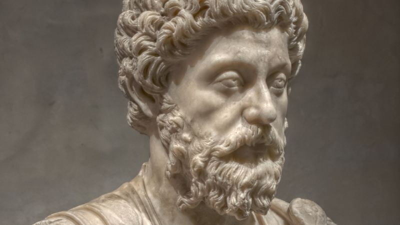

# Why We Love Ourselves but Care More About Other People's Opinions

Photo by [Pierre-Selim](https://www.flickr.com/photos/pierre-selim/6728035233/).

Welcome to **Mid-Week Meditations**, Lifehacker’s weekly dip into the pool of stoic wisdom, and how you can use it to reflect on and improve your life.

For this inaugural post, I’m going to share a quote from my favorite stoic, the Roman Emperor [Marcus Aurelius](https://en.wikipedia.org/wiki/Marcus_Aurelius). It comes from his collection of personal writings that were later published as [*Meditations*](https://en.wikipedia.org/wiki/Meditations):

> “It never ceases to amaze me: we all love ourselves more than other people, but care more about their opinion than our own. If a god appeared to us—or a wise human being, even—and prohibited us from concealing our thoughts or imagining anything without immediately shouting it out, we wouldn’t make it through a single day. That’s how much we value other people’s opinions—instead of our own.” -*Meditations* 12.4

Here’s another translation:

> “I have often wondered how it is that every man loves himself more than all the rest of men, but yet sets less value on his own opinion of himself than on the opinion of others. If then a god or a wise teacher should present himself to a man and bid him to think of nothing and to design nothing which he would not express as soon as he conceived it, he could not endure it even for a single day. So much more respect have we to what our neighbors shall think of us than to what we shall think of ourselves.” -*Meditations* 12.4

### What It Means

As living organisms, our number one priority is our own survival, well-being, and personal preference. Even the most giving and selfless of us will look out for number one first. It’s how we’re wired. Yet, when it comes to matters of opinion, we tend to look to others first, as if we need their guidance. Whether we like it or not, we’re strongly swayed by what others believe, even though our own opinions of ourselves should at least be held in equal regard.

Get called a “loser” enough times and you’ll start to feel like one, even if that’s not what you really think about yourself. If all the people you know say a movie is bad, you’ll try to convince yourself that it must be so, even if you personally found it enjoyable and enriching. “I must be wrong,” you’ll conclude, “I guess I’m not smart enough to tell.” We look out for ourselves instinctively, yet we lack a certain confidence when it comes to standing up for what we really think.

### What to Take From It

Acknowledge that your opinion of yourself and the things you like matter—maybe not to the world at large, but at least to *you*. Stay aware and try to notice when others’ opinions seem to be overpowering your own. And be swayed not by those opinions, but only the facts when they are presented to you well. Be good and kind, but also take pride in your own unique perspective on the world. It’s okay if it’s different; there’s no right and wrong in the realm of opinion. Your voice should be just as valuable as any other in your own mind.

You can [read *Meditations* in its entirety for free here](http://classics.mit.edu/Antoninus/meditations.html).

###### [Marcus Aurelius's Thoughts On Motivating Yourself to Get Out of Bed](http://lifehacker.com/marcus-aureliuss-thoughts-on-motivating-yourself-to-get-1791087399)

We all have mornings where we want nothing more than to stay in our beds, warm and comfortable, all …

[Read more](http://lifehacker.com/marcus-aureliuss-thoughts-on-motivating-yourself-to-get-1791087399)
