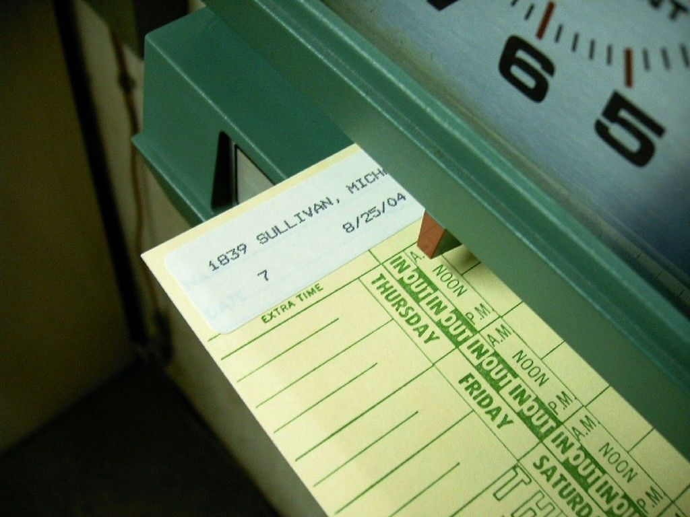

# Como trabalhar mais em menos tempo

Esta é a razão pela qual produtividade e tempo livre devem ser amigos.

Precisamos conversar sobre os motivos que te levaram a se interessar por este texto.

Senta aí e seja sincero comigo: você anda trabalhando demais? Você luta todos os dias com a sua preguiça e sua procrastinação? Anda ansioso ou decepcionado por conta das coisas que têm feito ou deixado de fazer?

Se sua resposta for sim para uma dessas perguntas, o seu problema é um pouco mais grave. Recomendamos a você nosso artigo sobre [como evitar o burnout](http://papodehomem.com.br/evitando-a-armadilha-do-burnout), sobre [como tornar sua preguiça uma aliada](http://papodehomem.com.br/pare-de-se-culpar-use-a-preguica-a-seu-favor) e sobre [como parar de competir pelo cansaço](http://papodehomem.com.br/o-cansaco-nao-e-uma-medalha-para-se-ostentar).

Para seguir adiante precisamos partir de um pressuposto: ninguém deve querer aumentar a produtividade para poder trabalhar mais. Se você deseja aumentar seu desempenho que seja para ter tempo de fazer outras coisas: cuidar dos filhos, fazer exercícios, se divertir, ter tempo pras pessoas que ama.

Se essas coisas não estão claras pra você, sugerimos que você visite esse texto sobre [ter disciplina e não motivação](http://papodehomem.com.br/foda-se-a-motivacao-o-que-voce-precisa-e-disciplina), sobre como usar seu tempo [para começar projetos pessoais paralelos](http://papodehomem.com.br/como-aproveitar-seu-tempo-livre-para-comecar-projetos-paralelos) e este sobre não querer aumentar a produtividade [sem nenhum benefício na sua qualidade de vida](http://papodehomem.com.br/como-aprendi-a-parar-de-procrastinar-e-a-gostar-de-me-soltar).

Vai lá e volta quando puder.

Eu te espero.

Voltou?

Pois bem.

Isto posto, dedicamos a você este artigo do [Tony Stubblebine](https://betterhumans.coach.me/@tonystubblebine), publicado [originalmente em inglês](https://betterhumans.coach.me/how-to-be-productive-without-working-past-noon-1137165c96bc#.bcaju2rky) no seu próprio Medium e traduzido para o português por [Julia Barreto](https://papodehomem.com.br/como-trabalhar-mais-em-menos-tempo?utm_campaign=&utm_content=Como+trabalhar+mais+em+menos+tempo+%E2%80%93+PapodeHomem+%282%29&utm_medium=email&utm_source=EmailMarketing&utm_term=Newsletter18mailto:juliafmbarreto@gmail.com).

Esperamos que assim você consiga render mais no trabalho e possa viver melhor. Todos precisamos cada vez mais disso.

Saudades bater ponto num cartão desses?

### Como ser produtivo sem precisar trabalhar depois do meio dia

Com frequência alguém me pergunta como ser produtivo por oito horas todos os dias.

Essa pergunta é uma tremenda confusão. As pessoas querem ser produtivas? Ou elas odeiam ter tempo livre? Esses são dois problemas diferentes.

A pessoa que perguntou está acostumada a separar oito horas para trabalhar porque está acostumada a ser improdutiva. Ela precisa de oito horas de enrolação para conseguir uma hora de trabalho feito.

Felizmente, acho que posso te ensinar um segredo para ser produtivo E ter tempo livre.

#### **Qual é realmente o seu objetivo com a produtividade?**

Vou usar um exemplo real de um estudante chamado Abe.

Abe queria ajuda para terminar sua dissertação. Então, ele me perguntou:

> *“Como posso escrever oito horas por dia? Vivo me distraindo e procrastinando.”*

Abe é normal. Todos nós já passamos por essa situação em que confundimos quantidade por qualidade.

Então talvez saber disso irá te ajudar atingir seu verdadeiro objetivo na próxima vez que estiver nessa situação: o objetivo de Abe não era trabalhar oito horas por dia. Seu objetivo real era terminar a dissertação.

Uma pergunta importante a se fazer antes de começar é: qual é seu objetivo de verdade?

#### **Algumas pessoas famosas saem do trabalho antes do meio-dia**

Eu fui o treinador de Abe por algumas semanas.

No final do período de treinamento, ele estava escrevendo consistentemente e a procrastinação não era mais uma problema. Seguiu em frente para terminar sua dissertação e conseguir seu ph.D. *(Essa é talvez a primeira vez que escrevemos phd por aqui sem, na verdade, querer escrever pdh).*

Há algo que não contei para o Abe, mas irei contar para você:

Eu nunca, nem por um segundo, tive a intenção de ajudá-lo a ser produtivo por oito horas inteiras.

Pessoas que querem mais tempo normalmente estão sofrendo com um problema de foco. Se você conseguir se focar, não irá precisar de todo esse tempo.

É claro que isso é óbvio. Imagine que você disse que queria estudar efetivamente por oito horas e depois achou uma solução que era tão eficiente quanto, mas só exigia trinta minutos. Você ficaria entusiasmado.

O melhor exemplo vivo é Stephen King.

Stephen King escreve 2 mil palavras por dia. Ele só não alcança esse objetivo nas circunstâncias mais calamitosas (como entrar em coma).

Mas aqui vai o ponto-chave: ele normalmente termina antes das 17h. Às vezes antes das 13h. (Fonte: sua autobiografia, *On Writing*)

Stephen King já escreveu mais de setenta livros e vendeu mais de 350 milhões sem nunca trabalhar depois das 17h.

Seu trabalho é uma forte crítica para outras culturas workaholics. Se você está focado e consistente, não precisa trabalhar tantas horas.

Me envergonho da indústria de startups. Muitos de nós sabem como trabalhar horas extras, mas poucos entendem como trabalhar uma única hora produtiva.

Stephen King está rindo da nossa cara.

#### **Foque primeiro**

Voltando ao aluno que eu estava treinando, comecei com um exercício muito simples.

Pedi para que ele conseguisse um cronômetro e fizesse um relato para mim no dia seguinte.

Seu desafio era cronometrar quantos minutos levava entre sentar na escrivaninha pela primeira vez e escrever a primeira frase.

Isso curou sua procrastinação instantaneamente. Ao invés de tentar ter oito horas perfeitas, ele só precisava escrever uma frase.

Ele relatou que conseguiu a primeira sentença depois de três minutos e a partir disso continuou por mais duas horas.

Durante essas duas horas, escreveu mais do que em qualquer outro dia.

Ele continuou nesse ritmo por meses, escrevendo focado por só duas horas todos os dias até terminar a dissertação.

Ele não disse nenhuma vez que queria evoluir para oito horas de foco. Ele era tão consistente que contou que escreveu por duas horas em seu iPhone.

Não consigo imaginar alguém sofrendo com problemas de foco conseguir escrever por duas horas em seu celular.

Eu uso esse exemplo como material de treinamento para técnicos como uma demonstração de duas coisas: ímpeto e enquadramento.

**1.** Ao focar no impulso, você muda a dinâmica de alguém que está falhando (não consegue focar, nem por oito horas) para alguém que está tendo sucesso.

**2.** A razão de isso ter funcionado para Abe é que seu ímpeto mudou sua estrutura de pensamento sobre escrever. Ele estava pensando em horas gastas ao invés de rendimento. E isso o estava atrapalhando.

Resumindo, a resposta para a questão de como trabalhar eficientemente e efetivamente por dez horas é trabalhar eficientemente e efetivamente por um minuto e partir daí.

Isso pode ser generalizado para qualquer objetivo de produtividade. E se você domina essa lição, você vai terminar seu trabalho o mais cedo possível, frequentemente antes do meio-dia.

O que você faz depois disso depende de você. Mais trabalho? Exercício? Encontra amigos e tem uma vida social?

Se você é prolífico, talvez nunca precise se sentir culpado por estar em casa e jantar com sua família.

---

*publicado em 30 de Outubro de 2016, 00:05*
