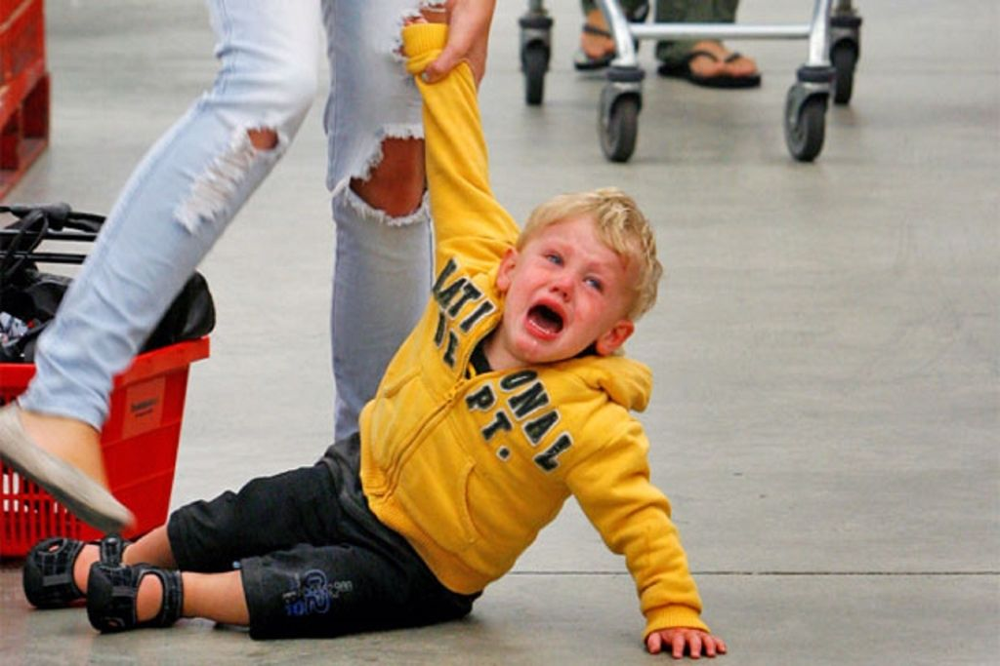
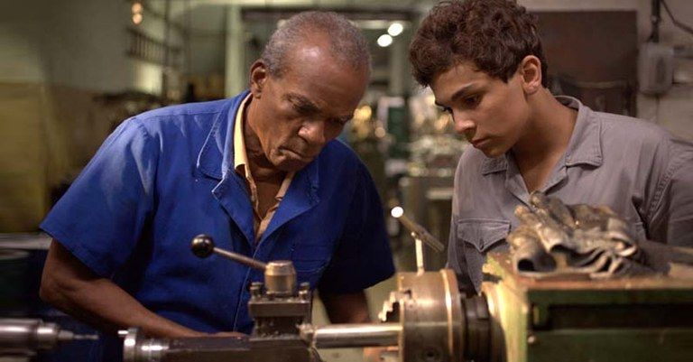
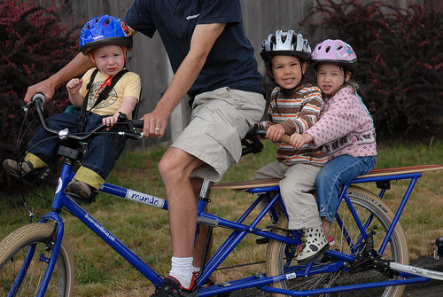
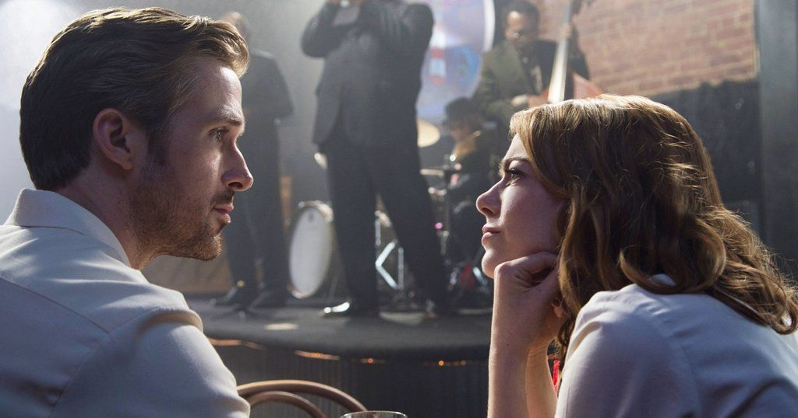

# Porque amadurecer é tão difícil e porque o mundo ainda precisa de adultos

Grande parte dos nossos problemas no mundo se explica pelo fato de nós nos negarmos a crescer

Quando explico o [*The Art of Manliness*](http://www.artofmanliness.com/) para outras pessoas, frequentemente o descrevo como um site sobre como amadurecer bem, focado nos homens. Nossa missão é ajudar os jovens a se tornarem adultos consolidados, e ajudar homens mais velhos a melhorar áreas de suas vidas que ainda sentem que estão devendo.

Mas, apesar do nosso foco, não temos nenhuma ilusão de que crescer é uma tarefa fácil. Na verdade, enquanto amadurecer sempre foi um desafio, nós acreditamos que nunca foi algo tão difícil quanto é agora no nosso mundo moderno. Consequentemente, muitos jovens parecem presos no limbo — não são mais crianças, mas também não são adultos plenos.

Muitos especialistas apontam para a economia para explicar o fenômeno do desenvolvimento interrompido. Certamente a situação do mercado de trabalho, principalmente para os homens, impacta na dificuldade de se tornar independente e estabelecer uma família. 23% dos homens modernos não se casam durante toda sua vida, comparado com 17% das mulheres — uma diferença entre os sexos que vem aumentando desde os anos 1960. Uma das razões dessa disparidade talvez seja o fato de que, enquanto 78% das mulheres que nunca se casaram disseram que um emprego fixo é a coisa mais importante que elas buscam num marido em potencial, o nível de homens empregados caiu mais de 10% desde 1960, e o salário médio por hora para homens entre 24-34 anos caiu 20% (depois do ajuste da inflação). Então mais e mais mulheres estão procurando homens com empregos fixos, mas empregos fixos bem-remunerados estão cada vez mais difíceis de se encontrar. [De maneira mais ampla, um número recorde](http://www.pewsocialtrends.org/2014/09/24/record-share-of-americans-have-never-married/) de homens e mulheres entre 24-34 anos nunca se casou, e mais de um terço desse grupo cita a preocupação com a segurança financeira como razão para não terem se amarrado.

Pode parecer claro de que a economia realmente tem um papel proeminente em atrasar a entrada dos jovens adultos na maturidade, mas esse argumento não consegue explicar o quadro geral. Como iremos discutir logo mais, casamento e emprego dificilmente são os únicos indicadores de maturidade; a vida adulta na verdade engloba uma grande variedade de características pessoais e comportamentos. Uma pessoa pode não estar casada, e até ter dificuldades em achar um emprego, e mesmo assim ser bastante madura. Durante a Grande Depressão, por exemplo, o índice de casamentos também diminuiu, e mesmo assim não se constatou um aumento de adultos imaturos nesse período de dificuldade financeira. Pelo contrário: pessoas mais velhas lastimavam o fato de que os mais novos foram forçados a crescer *muito* rápido. Então a economia estabelece o cenário, mas não determina como a sociedade reage a ele. Deve haver outros fatores culturais, sociológicos e psicológicos que explicam porque reagimos às circunstâncias atuais não nos tornando mais fortes, mas sim fincando os pés diante da possibilidade de crescer.

Apesar de ser tentador imaginar que esses são fatores de origem recente, e apontar o movimento de contracultura dos anos 1960 como uma fonte provável por onde eles se espalharam, as correntes culturais atuais na verdade remetem a vários séculos atrás. As sementes para a dissolução da maturidade foram plantadas há muito tempo, e só agora conseguiram dar frutos.

Hoje vamos explorar os fatores que tornaram crescer algo difícil de fazer em nossa era moderna, e depois defender a ideia de que, apesar da dificuldade, o mundo ainda precisa de adultos.

#### **O que significa ser “adulto”?**

Muitas vezes, nesses tipos de discussão, reivindicações são feitas sobre o desaparecimento da maturidade sem nem definir o que significa maturidade para começo de conversa. Então vamos começar do começo e delinear várias das qualidades que acreditamos caracterizar alguém como “adulto”.

Obviamente é uma questão subjetiva, e uma que ninguém consegue concordar completamente com outro indivíduo. Tanto a infância quanto a vida adulta possuem um componente biológico, mas também envolvem, em grande parte, construções sociais e culturais que mudaram com a época e a cultura. Então, o que estamos tentando nos focar não é na definição de maioridade, mas as características associadas com maturidade, no Ocidente, ao longo dos últimos séculos. É necessário ressaltar que o que estamos buscando hoje não é a *masculinidade*, mas a *maioridade* — os traços de maturidade que se sobrepõem aos sexos.

No topo de qualquer lista de critérios para a maioridade certamente está a [responsabilidade pessoal](http://www.artofmanliness.com/2013/02/18/owning-up-to-mistakes/). Isso significa reconhecer seus erros e [realizar as coisas que prometeu fazer](http://www.artofmanliness.com/2012/08/26/heading-out-on-your-own-day-26-15-maxims-for-being-a-reliable-man/), mesmo quando — especialmente quando — tais tarefas são desagradáveis.

Outra coisa essencial para a maturidade é [aceitar o papel de criador](http://www.artofmanliness.com/2010/04/06/modern-maturity-create-more-consume-less/), ao invés de simplesmente ser um consumidor. Adultos contribuem com o mundo ao seu redor, ao invés de colher passivamente os frutos do trabalhos dos outros. Adultos constroem coisas; crianças (de qualquer idade) usam essas coisas, ou, indo ainda mais longe, simplesmente se tornam “fãs” dessas coisas.

A habilidade de [adiar a gratificação](http://www.artofmanliness.com/2011/03/06/delayed-gratification/) é outro sinal de maturidade. Crianças são, por natureza, condicionadas ao presente, e querem o que querem, quando elas querem. Quando crescemos, precisamos aprender como sacrificar uma recompensa menor naquele momento a fim de conseguir um bem maior no final do caminho. Adultos têm a capacidade de se planejar para o futuro e de estabelecer objetivos a longo prazo.

Relacionando a isso está o autocontrole. Crianças agem por impulso. Adultos decidem como reagir, ao invés de serem escravos das circunstâncias. Eles são mestres de si mesmos.

Crianças fazem birra. Adultos limpam a bagunça.

A capacidade de pensamento crítico também deve ser mencionada. Crianças são facilmente enganadas, tendem a entender mal coisas muito complexas e preferem informações de narrativas simples e preto-no-branco. Adultos são capazes de analisar informações, avaliar a evidência da verdade em alegações, verificar a confiabilidade de fontes, fazer conexões entre ideias e lutar com a complexidade.

Um bom nível de [independência](http://www.artofmanliness.com/2012/08/01/heading-out-on-your-own-day-1-develop-a-self-reliant-mentality/) também é um requisito para a maturidade. Nascemos impotentes, e portanto aprender a se virar sozinho sempre foi um sinal de superação do estado infantil. Ninguém é um robô, é claro, mas ser extremamente dependente dos outros vai contra o tipo de autonomia necessária para a maturidade.

Finalmente, independência torna possível outra qualidade da maioridade — ter dependentes. Essa categoria não inclui somente filhos; qualquer líder — seja no exército, nos negócios, na escola etc — tem pessoas que dependem dele para orientação, direções ou ensinamentos. Ser adulto é ter responsabilidades não só em relação a si mesmo, mas para com os outros também.

Agora que delineamos uma (nada exaustiva) lista de atributos para a vida adulta, vamos nos voltar para o porquê de ser tão difícil cultivar essas qualidades nos dias de hoje.

#### **Porque crescer é tão difícil na Era Moderna**

Provavelmente sempre foi difícil crescer, de uma forma ou de outra. Profundamente ancorado na nossa psiquê provavelmente está um desejo universal de regressar a vida sem preocupações da infância, de retornar — metaforicamente — ao útero, e voltar ao estado que o [antropologista David Gilmore](https://www.amazon.com/gp/product/0300050763/ref=as_li_tl?ie=UTF8&camp=1789&creative=390957&creativeASIN=0300050763&linkCode=as2&tag=stucosuccess-20&linkId=X6BUSDOT6A546OHN) chama de “onipotência infantil”.

Mas escapar do puxão gravitacional da juventude é particularmente difícil nos dias de hoje por uma variedade de motivos. A lista abaixo não é exaustiva; muitos outros fatores, tal como o [declínio da cultura de honra e vergonha](http://www.artofmanliness.com/2012/12/10/manly-honor-vi-the-decline-of-traditional-honor-in-the-west-in-the-20th-century/), também tiveram um papel importante. Ela simplesmente representa um panorama dos elementos que mais se destacam compondo o aparente campo de força ao redor da vida adulta dos dias presentes — as correntes culturais e sociológicas que fizeram amadurecer parecer algo árduo e indesejado.

- **A Veneração da Juventude**

Da Antiguidade até o século 18, as crianças comumente eram vistas como adultos em miniatura, piorados. A crença no pecado original levou muitas culturas cristãs a verem as crianças com suspeita — como pecadores que precisavam de uma disciplina severa para dominarem impulsos tóxicos e se manterem no caminho da integridade moral.

Mesmo em sociedades não cristãs, tal como a Grécia Antiga, acreditava-se que as crianças não tinham a educação adequada e a experiência — [a sabedoria prática](http://www.artofmanliness.com/2011/12/19/practical-wisdom/) — necessária para fazerem escolhas inteligentes. Aristóteles, por exemplo, argumentou que homens na meia-idade tomavam as melhores decisões e faziam os melhores julgamentos, já que os jovens eram muito crédulos e os velhos eram muito cínicos.

Hoje, é claro, temos uma visão bastante contrária e colocamos a juventude num pedestal. Nossa cultura popular é construída em torno dos gostos dos jovens, gastamos milhões para manter a aparência jovem e nossos empreendedores e artistas mais famosos frequentemente ainda estão na casa dos 20 anos (ou são adolescentes). Ao invés de associar sabedoria com idade, acreditamos que as melhores ideias só vêm dos mais jovens.

Essa é uma mentalidade melhor exemplificada pela cultura no Vale do Silício, onde CEOs como Mark Zuckerberg acreditam que “pessoas mais novas simplesmente são mais espertas”, e capitalistas ousados como Vinod Khosla argumentam que “pessoas com mais de quarenta e cinco anos basicamente morrem no que diz respeito a novas ideias”. Paul Graham, guru de start-ups e fundador da Y Combinator, estabelece o limiar máximo para a ingenuidade ainda mais baixo, admitindo que ao ouvir a apresentação de um empresário, “O limite na cabeça dos investidores é 32. Depois dos 32, começam a ficar um pouco céticos”.

Um senhor estagiário só mesmo na ficção.

Ao falar com dúzias de influenciadores do Vale do Silício como parte de sua pesquisa para o fascinante e sóbrio livro “[O Preconceito Etário Brutal da Tecnologia](http://www.newrepublic.com/article/117088/silicons-valleys-brutal-ageism)”, o escritor Noam Scheiber “tem uma firme opinião de que é melhor ser visto como inocente e imaturo do que ter votado nos anos 1980”. Um cirurgião plástico com quem ele falou expôs a preocupação de inúmeros homens que vão a sua clinica atrás de injeções de botox: “Olá, sou um homem de quarenta anos e preciso me apresentar para várias moleques de cara limpa. Não posso parecer que tenho uma esposa, dois filhos e uma hipoteca”. Mesmo que haja uma ampla evidência de que caras de meia-idade têm muito a contribuir, mesmo na sempre acelerada indústria da tecnologia, Scheiber descobriu que há uma preocupação muito comum de como a presença de “adultos” pode afetar negativamente a cultura da empresa: “Pessoas de meia-idade precisam mostrar que não são figuras autoritárias e catedráticas que estão ali para acabar com a diversão e criatividade — pais, em outras palavras”.

Então o que aconteceu para suplantar essa exaltação da sabedoria e da experiência com um ceticismo em relação a qualquer um que talvez não se encaixe num ambiente de trabalho cheio de armas Nerf e mesas de ping-pong? Tudo começou no Iluminismo, mais especificamente com Jean-Jacques Rousseau.

Rousseau rejeitou a ideia do pecado original, e argumentou que ao invés de serem adultos imperfeitos, as crianças eram o mais próximo do nosso ideal humano — isto é, o mais perto do estado da natureza. “Tudo é bom quando deixa as mãos do Autor das coisas, tudo se degenera nas mãos do homem”, Rousseau escreveu. Foram os valores “civilizadores” da cultura, e os preconceitos e a autoridade das instituições sociais criadas pelo homem, que arruinaram as crianças e as tornaram adultos inúteis.

Os Românticos pegaram essa ideia e deram continuidade, não só celebrando a inocência da criança como a mistificando. Crianças, eles achavam, personificavam algum dos melhores aspectos da vida — curiosidade, imaginação, alegria e a capacidade de se admirar. Essa veneração da juventude é vista talvez em nenhum lugar melhor do que no livro *Ode: Insinuação da Imortalidade vinda de Recordações da Infância*, de William Wordsworth. O autor propõe poeticamente que apesar de todos nós nascermos “conduzindo nuvens de glória”, e de que “O Paraíso se recosta em nós na infância!”, com o tempo perdemos tristemente nossas qualidades visionárias: “Em breve tua Alma terá seu fardo mundano, E a tradição cairá sobre você com um peso, Pesada como gelo, e quase tão profunda quanto a vida!”. Para os Românticos, adultos não deveriam só procurar ensinar as crianças, mas aprender com elas.

Essa imagem da juventude como os portadores dos impulsos mais intuitivos, criativos e astutos, e dos adultos como crianças caídas sem a Graça, persistiu pelo século 19, só para ser parcialmente obscurecida no século 20 quando uma depressão econômica e duas Guerras Mundiais se ergueram mais uma vez, e demonstraram a necessidade das características mais sérias e sóbrias da maturidade. O sentimento de que a autoridade adulta estava inapropriada e o cinismo originário de movimentos antiguerra e antidiscriminação dos anos 1960 e 1970 trouxeram essa imagem de volta, encapsulada na máxima “Nunca confie em ninguém com mais de 30 anos”.

Desde então, esse sentimento nunca nos deixou de verdade. O fato de ele ser mais proeminente no Vale do Silício não é surpreendente, já que muito do atual cenário tecnológico começou durante o auge do movimento de contracultura (veja Steve Jobs, período hippie), e uma ênfase nas inovações jovens e revolucionárias permanece como uma parte do DNA da indústria. Mas a crença na juventude como um depósito de autenticidade e inventividade fresca está penetrando na nossa cultura. Aqueles de nós que foram criados no colo dos Baby Boomers (uma geração que naquela época — e agora — desprezava a ideia de crescer) absorveram a mensagem: *Adultos são farsas entediantes. Agarre-se à infância enquanto pode*.

**Portanto, o primeiro obstáculo para crescer é o medo de que assumir uma sensibilidade adulta nos tornará mentes-fechadas, tolos sem originalidade, e mesmo não nos sentindo dessa maneira, outras pessoas nos verão assim.**

- **O caminho para a maioridade mudou de uma rampa de acesso para um penhasco**

Apesar de ser tentador acreditar que o fenômeno dos jovens adultos na casa dos 20 voltarem a morar na casa dos pais é uma tendência aparentemente moderna, esse arranjo na verdade era muito comum entre as famílias da América colonial. Nesse período, os homens com frequência viviam com seus pais até os 25, antes de acabarem de aprender seu ofício ou de herdarem um pedaço de terra de seus pais, se casarem e estabelecerem sua própria casa. Mesmo assim, há uma grande diferença entre aqueles solteirões e os dos dias de hoje: quando um homem colonial estava se aproximando dos vinte e tantos, ele já tinha quase duas décadas de trabalho adulto acumulado.

Você aprendendo alguma coisa com seu pai, lembra?

Do período medieval até o século 19, esperava-se que as crianças começassem a ajudar com as finanças da família por volta dos sete anos de idade. Elas começavam com tarefas simples, como pegar água ou recolher lenha, e iam aprendendo gradualmente tarefas mais árduas como arar e colher, ou cuidar dos animais — uma tarefa que frequentemente significava passar noites sozinho no campo, vigiando o rebanho. As crianças também eram responsáveis por cuidar de seus muitos irmãos e irmãs, e irmãos basicamente criavam uns aos outros. Muitas delas também eram enviadas para longe durante a infância para trabalhar como criado ou aprendiz em terras de outra família, antes de voltar à casa de seus pais novamente, como preparação para se virarem quando alcançassem os vinte e poucos anos.

Mesmo já no século 20, com o surgimento da escola obrigatória (mesmo que errática), as crianças com frequência trabalhavam antes e depois das aulas. Meninos iriam pegar ovos e lenha e caçar comida para o sustento da família pelas manhãs, antes da aula, e então tinham mais tarefas ou trabalhavam durante a tarde. Mesmo em áreas urbanas, eram meninos que distribuíam o jornal para transeuntes pela manhã e pela tarde.

Deste modo, para a maioria das crianças, a transição para responsabilidades adultas começava bem mais cedo, mas acontecia de maneira mais gradual. As primeiras duas décadas de suas vidas construíram uma rampa de acesso para a maioridade, em que elas assumiam progressivamente mais tarefas (cada vez mais pesadas) ao ficarem mais velhas.

Isso contrasta bastante com o que é esperado dos jovens adultos no momento presente. [Como coloca o historiador Steven Mintz](https://www.amazon.com/gp/product/0674019989/ref=as_li_tl?ie=UTF8&camp=1789&creative=390957&creativeASIN=0674019989&linkCode=as2&tag=stucosuccess-20&linkId=GRKTSEXZWNAHBY33), “os jovens de hoje têm menos formas sociais validadas de contribuir para o bem-estar da família ou de participar da vida em comunidade”. Da infância até os anos de faculdade, os jovens adultos talvez tenham muito poucas responsabilidades, seja tarefas familiares ou trabalho remunerado. Então, depois da graduação, ou depois de alguns anos à deriva na casa dos vinte anos, espera-se que mulheres e homens que nunca tiveram um trabalho desafiador, ou um bebê, sejam magicamente capazes de se estabilizar e fazer coisas de adultos. A rampa de acesso para a maioridade se tornou um penhasco íngreme, onde jovens adultos são empurrados e se espera que eles afundem ou nadem.

Muitos afundam.

O que não é surpreendente, dado o que sabemos sobre neurologia. Na adolescência, nossos cérebros são bastante flexíveis e moldáveis, e são facilmente modelados pelas experiências e tarefas que buscamos e realizamos todos os dias. Essas experiências abrem trilhas em nossos cérebros. Com vinte e poucos anos, nossos cérebros começam a “se estabelecer”, e matéria neural “excessiva” é jogada fora; aquela que estamos regularmente fica, enquanto a que não exercitamos é reduzida. Daí em diante, apesar dos nossos cérebros permanecerem “plásticos” e mutáveis, criar novos hábitos é mais difícil. Tudo isso é para dizer [que, se treinarmos nossos cérebros em nossa juventude para sabermos enfrentar tarefas adultas](http://www.artofmanliness.com/2013/02/05/dont-waste-your-20s-train-your-brain-for-lasting-success/) — como planejar, adiar gratificação, aguentar tarefas desafiadoras, trabalhar de maneira disciplinada etc —, realizar essas tarefas com trinta, quarenta ou mais do que isso é muito mais fácil. Se, por outro lado, o cérebro “se acomoda” antes de sequer termos o desafiado, aprender hábitos adultos se torna um empreendimento muito mais difícil.

**Então, a segunda razão do porquê amadurecer ser tão difícil é que, ao invés de sermos gradualmente iniciados no mundo dos adultos, frequentemente assumimos responsabilidades adultas de uma vez.** Sem duas décadas de treinamento, isso pode parecer um choque para o sistema, que te deixa afogando em um mundo para o qual você não foi preparado.

- **A abundância da escolha**

Da Antiguidade até o século 19, os jovens tinham menos escolhas do que fazer com suas vidas — eles quase certamente iriam se casar, ter filhos e trabalhar como fazendeiros ou comerciantes. Mesmo quando meninos, eles tinham uma ideia clara de qual seria o horizonte de sua vida adulta.

À medida que nossa cultura e economia se tornaram cada vez mais variadas no século 20, as opções para o curso da vida de alguém [começaram a parecer quase infinitas](http://www.artofmanliness.com/2013/04/29/good-news-your-life-isnt-limitless/). Estamos constantemente relutantes em escolher um caminho em detrimento do outro, porque escolher uma porta significa fechar muitas outras. Pode parecer mais seguro deixar em aberto todas as opções possíveis, mesmo que esse limbo perpétuo [nos impeça de fazer qualquer progresso verdadeiro em nossas vidas.](http://www.artofmanliness.com/2013/10/12/art-of-manliness-podcast-episode-51-the-defining-decade-with-dr-meg-jay/)

Junto a essa inércia é a impressão, transmitida pelos nossos pais, que somos capazes de sermos bem-sucedidos em qualquer campo de trabalho — que nossos talentos são basicamente infinitos.

No, you can't be anything. Not really

Para entender porque os pais modernos frequentemente fazem isso, temos que olhar para a cultura familiar anterior ao século 20, quando um casal podia ter doze crianças, com apenas metade sobrevivendo até a maioridade. Como o ministro puritano Cotton Mather observou, para os primeiros Americanos, uma criança morta era “uma visão não mais surpreendente do que uma jarra quebrada”. Os pais amavam e cuidavam de suas crianças, mas não tinham o tempo para idolatrar cada uma delas, e se continham para não fazerem investimentos emocionais muito intensos, dada a chance da criança ser levada prematuramente pela morte.

Como tanto o tamanho da família como a mortalidade infantil diminuíram no século 20, o investimento parental nas crianças aumentou. Com apenas duas ou três crianças para criar, os pais poderiam se permitir valorizar seus pequenos e enchê-los de atenção. Como a sociologista Viviana A. Zelizer observou, crianças “se tornaram economicamente ‘inúteis’ mas emocionalmente ‘inestimáveis’”. Esse foco intenso na criança levou os pais a colocar um compreensível, mas inflado, valor nas crianças. Porque os filhos eram o centro de seus universos, eles pareciam infinitamente especiais e talentosos, e foram criados para se verem dessa maneira. Ensinados que eles poderiam ser o que quisessem, quando essas crianças alcançam o limiar da idade adulta, elas podem se sentir paralisadas ao terem que escolher qual área elas deveriam aplicar seus inúmeros talentos.

Tentar fazer algo em determinadas áreas, e falhar, acaba com a ilusão das ilimitadas habilidades, e portanto muitos jovens adultos preferem permanecer distantes e manter suas opções abertas para manter essa autoidentidade de alguém especial e pôr de lado coisas importantes. Tornar-se um adulto envolve lidar com a realização de que você não é um floquinho de neve, que sua criação foi bastante comum e trivial, quase exatamente igual a de milhões de pessoas, que você só serve para alguns tipos de trabalhos, e talvez esse mesmo trabalho não seja glamuroso, mas você terá que trabalhar para viver. Essas percepções podem ser difíceis de contemplar.

**Portanto, a terceira razão de porque crescer é tão difícil é a dificuldade em deixar para trás o sentimento de ser especial, em admitir suas próprias limitações e em escolher um caminho para sua vida, sabendo que ao fazer isso você talvez feche várias portas com outras opções.**

- **Isolamento e a perda da tribo**

Para a maioria dos adultos, o período da vida que lhes traz mais nostalgia é o ensino médio/faculdade. A saudade desse período normalmente é relacionada com o desejo de retornar para um tempo em que eles não eram tão sobrecarregados com responsabilidades da vida. Certamente esse é um dos motivos, mas acredito que a verdadeira razão para sentirmos falta da nossa juventude é subestimada: foi a última época de nossas vidas que vivenciamos a noção de “tribo”.

No ensino médio e na faculdade, a maioria de nós tinha um grupo de grandes amigos que víamos todos os dias. Muitos de nós participam de uma “gangue” de caras, que às vezes se juntavam com um grupinhos de garotas, formando uma tribo mista extremamente divertida.

Então, o pessoal cresceu, encontraram alguém, se casaram e tiveram filhos. Poucos adultos veem seus amigos diariamente; os sortudos se veem semanalmente, e, para a maioria, agendar horários para se verem não é fácil. É por isso que não é de se admirar que fiquemos nostálgicos pelos nossos dias de juventude; eles representam a última vez que nossas vidas tiveram essa disposição primordial.

Em tribos de caçadores, gangues de homens caçavam e batalham juntos. As mulheres criavam seus filhos juntas. Todos viviam e trabalhavam todos os dias junto com dúzias de pessoas. Fardos e alegrias eram compartilhados. Fazer parte da tribo significava ter identidade única.

Hoje, nunca estivemos tão isolados. Muitos nem moram perto de seus familiares, é a família nuclear está cada vez mais isolada na ilha deserta dos subúrbios. Os homens vão trabalhar num cubículo com vários outros funcionários por quem eles talvez não sintam nenhum tipo de afinidade. As mulheres passam o dia dentro de quatro paredes, isoladas de qualquer outro humano, a não ser talvez seu bebê inarticulado. Muitas pessoas, sejam elas homem ou mulher, estão solitárias e infelizes porque não têm uma tribo.

O fardo pesado e indesejável da maioridade é muitas vezes associado erroneamente somente com a carga das responsabilidades de adulto. Mas o problema não é a maioridade em si, e sim como ela está sendo levada. O peso de trabalhar para uma subsistência e educar seu filho, que antes devia ser carregad0 nas costas de vários pessoas, agora é suportado por apenas duas. Esposo e esposa dependem um do outro para todo sua realização emocional e necessidades práticas. A pressão é mais do que um indivíduo, ou uma família nuclear, deveria suportar.

Você tem que carregar eles todos, sozinho.

**Então, a quarta razão do porquê ser difícil crescer é que o fardo da maioridade pesa muito nos ombros quando levado sozinho, e não por uma tribo.**

- **A cultura do consumismo**

Talvez a transição mais difícil ao se tornar pai é ir de ter a maioria de suas experiências criadas para você para ser o criador de experiências para os seus filhos. Especialmente quando eles são pequenos, e não conseguem fazer quase nada sozinhos, você é uma espécie de Deus — encarregado de criar o mundo inteiro onde eles habitam.

Essa mudança nunca foi tão acentuada, não só porque não existe mais uma plataforma de acesso para a maioridade, mas também porque nossa cultura nunca foi tão orientada pelo consumidor. Muito do nosso dia a dia é gasto na atividade central do consumismo: escolhendo. No ensino médio e na faculdades nossos horários já estão em grande parte definidos — devemos simplesmente escolher as aulas e atividades extracurriculares que preferimos. Escolhemos nossas roupas, nossa música, nossos filmes, nossos jogos, nossos veículos, nossa casa e os acessórios e mobília para decorá-la. Escolhemos a igreja que iremos frequentar, e qual tipo de serviço combina melhor com nossas personalidades. Escolhemos quem incluir na nossa lista de amigos do Facebook e quais coisas curtir no nosso feed de notícias.

O que não nos pedem com frequência é criar. Nos servem opções embaladas previamente, e só somos encarregados de selecionar nossas favoritas entre elas. Raramente se espera que criemos as opções nós mesmos, e ainda sim quase todo papel de adulto, não só de pai, requer o ato de criar. Chefes devem criar expectativas para seus funcionários, funcionários criam projetos para seus chefes. Os trabalhadores independentes devem criar seus próprios horários e expectativas para o trabalho. Líderes de escoteiros devem criar experiência para sua tropa (com sorte criando oportunidades para que os jovens criem suas próprias experiências). Voluntários de escolas e instituições de caridade devem criar eventos beneficentes. E por aí vai.

Todo adulto chega no ponto em que a coisa que ele quer fazer/ler/usar não está disponível no menu de opções pré-escolhido, e ele mesmo precisa criá-la. Sem muito experiência em criar, muitos “adultos” não sabem como reagir nessa conjuntura a não ser reclamando e expressando seu desapontamento com instituições, publicações e empresas pré-existentes que não atingiram suas expectativas.

**Então, a quinta razão do porquê crescer ser difícil é que existe um grande buraco entre a experiência de criar que ganhamos quando estamos crescendo e a quantidade de criação exigida de nós quando adultos.**

- **O retrato negativo da maioridade na cultura popular**

Existe um tipo popular de artigo esses dias que se propõe a revelar exatamente como coisas como casamento e filhos *realmente* são. “A cultura pop te enche de mentiras sobre romance e finais de contos de fadas,” esses escritores proclamam, “mas eu vou te falar a verdade nua e crua: Relacionamentos são difíceis, cara, e dão muito trabalho!”. E, nesse momento, mentes devem ser explodidas.

O que eu acho interessante sobre essa conversa supostamente franca sobre coisas como casamento é que apesar de vir embrulhada no manto da sabedoria polêmica, o ideal que ela está tentando ir contra já está morto faz pelo menos uma década. Quando foi a última comédia romântica popular e sem rodeios… *Notting Hill*, em 1999? Claro, o filme favorito de muitas mulheres ainda é *Diário de uma paixão*, mas ele saiu já faz dez anos. Saíram muitos filmes assumidamente românticos desde então, mas os que fizeram sucesso tiveram que abandonar  a sinceridade em vários níveis para criticar o tradicional formato da comédia romântica, e temperar o filme com cenas apimentadas, muito sarcasmo e humor negro, e menos finais completamente fechados.

Será que um final feliz padrão dá certo?

O tema dominante na cultura popular nos dias de hoje não é uma superidealização do casamento ou da família, mas sim um cinismo inflado em relação a essas coisas (em relação a maioria das coisas, na verdade). Os jovens não estão correndo para o casamento com ideias de contos de fadas na cabeça, mas da instituição como um todo, preocupados que se amarrar é uma passagem para o sufocamento e para a infelicidade. E, quando estamos falando de filhos, esqueça. Os blogueiros constantemente reclamam do modo como aqueles estorvos em miniatura irão sugar sua vida, e fóruns são dedicados em te dizer o quão feliz e livre você vai ser “livre de crianças”. A visão popular da paternidade é, na maioria das vezes, algo parecido com esse comercial de camisinhas:

*[Link Youtube](https://www.youtube.com/watch?v=nojWJ6-XmeQ)*

Se a sociedade uma vez teve uma visão rosada do casamento e da família, nossa perspectiva agora correu demais na direção oposta. Sim, ser pai pode ser difícil, mas a única razão para essas pessoas agora o compararem com a Marcha da Morte de Bataan é que elas nunca fizeram nada que se aproximava a isso em nível de dificuldade; nossas vidas são tão relativamente livres de dificuldades e tão orientadas pelo consumo que ser pai é um choque para a aptidão destreinada das pessoas para desafios. E enquanto criar filhos tem seus momentos estressantes, a maior parte do tempo na verdade pode ser bem tranquila. O tipo de episódio visto no comercial acima não é um sinônimo de criação, é da falta dela.

E casamento, bem, eu não sei se é um conto de fadas todos os dias, mas com certeza não é difícil. Talvez não haja um melhor exemplo da fenda entre o retrato de coisas como o casamento na cultura pop e como elas são realmente vividas do que o fato de Seth Rogen, famoso por interpretar homens-crianças em filmes não tão românticos assim, achar seu casamento uma brisa:

> "Em filmes, eles gostam de retratar o casamento como, 'oh, a esposa e o marido estão sempre discutindo e reclamando'. Para mim e minha mulher… a parte mais fácil da minha vida é o meu casamento. Se tudo fosse tão suave e fácil quanto o meu relacionamento com minha esposa, seria muito mais fácil para mim aguentar meu dia."

Apesar de eu ter me focado no casamento e na família nessa seção, o disparidade entre a maneira como a vida adulta é retratada na mídia e como ela realmente pode ser na vida real se aplica também em todos os outros aspectos de ser adulto. **O que nos leva à sexta razão do porquê crescer é tão difícil: sua representação na cultura popular como angustiante e miserável.**

#### **Porque o mundo ainda precisa de adultos**

“Adultos americanos querem ser pais de crianças menos do querem ser crianças eles próprios” – Neil Postman

Ao discutir um assunto como esse, é difícil não cair na rabugice, no estilo “essas crianças de hoje em dia…”. Mas ao expor os pontos acima, eu realmente tentei resistir a essa tentação e apresentar descrições razoavelmente objetivas de alguns dos fatos que tornam amadurecer nos dias de hoje uma tarefa árdua. Acredito que são questões reais, não triviais, e que cada uma é digna de contemplação e de um debate sobre como elas podem ser mitigadas e balanceadas em nossas vidas. Isso também não é um retrato dos desafios que atingem “aqueles outros, menos que jovens adultos daquele lado”. Eu pessoalmente senti esse peso em minha vida quando tentava escapar do puxão gravitacional da adolescência e me propulsionar para a vida adulta. Só foi nos últimos anos que eu me dei conta que não houve nada de especial nessa minha escalada; às vezes me viro para Kate para falar “ei, lembra do ensino médio? Cara, aquilo foi divertido”; e há momentos em que estou colocando meu filho de 4 anos na cama e tenho um forte desejo de ser criança novamente, de ir dormir sem nenhuma preocupação e de ter alguém que cuida de mim desse jeito.

Ser um adulto, apesar de bastante satisfatório, é realmente difícil algumas vezes. Eu, portanto, não tenho muita simpatia por aqueles que falam para os jovens pararem de reclamar de barriga cheia e crescerem de uma vez, como se fosse a coisa mais fácil do mundo, e que jovens adultos que estão com dificuldade são apenas fracotes sem disciplina ou motivação.

Mas, ao mesmo tempo, também não tenho simpatia para aqueles que falam “Bem, se ser crescido é uma construção cultural de qualquer maneira, e se é tão difícil de se realizar, vamos só dispensar a ideia de uma vez. Vamos nos divertir! Fazer o que quisermos! A vida adulta é para otários que compraram a mentira!”

Mas o que esses depreciadores da vida adulta não entendem é que **o mundo das crianças só é possível por causa do mundo dos adultos**.

Por baixo dessas fantasias tem gente real, suando, pra ganhar um trocado e "fazer a mágica acontecer".

Isso é super-importante, então me permita repetir: o mundo das crianças só é possível por causa do mundo dos adultos.

Quando as pessoas falam que não querem aderir à maioridade, o que elas realmente querem dizer é que elas mesmos não querem ser adultas, mas querem viver num mundo onde todas as outras pessoas são. Elas querem políticos competentes e efetivos representando-as; querem jornalistas e médicos espertos e sensatos com uma personalidade ética reconfortante; querem que os professores de seus filhos sejam dedicados e atentos; querem que o atendimento ao consumidor seja amigável e eficiente; querem que os policiais sejam honestos e justos. Elas querem que o mundo seja estável, previsível… para que possam ser erráticos e irresponsáveis. Elas querem ser crianças, mas vivendo em um mundo adulto, onde pessoas responsáveis estão prontas para cuidar de cada uma de suas necessidades,

Desde que os resistentes à vida adulta sejam uma minoria — “rebeldes” na periferia —, o mundo continua a rodar. Mas se pretensos adultos o suficiente aderirem a esse discurso, e não haja mãos firmes o suficiente no volante, o resultado é uma escorregada para uma sociedade distópica — uma verdadeira [Idiocracia](https://en.wikipedia.org/wiki/Idiocracy). Isso não é uma profecia sobre um futuro muito distante, ou um argumento no estilo “faça pelas crianças” (crianças que muitos resistentes à maioridade nem querem ter), mas algo que está acontecendo agora. Ainda há mais adultos do que adultos-crianças, mas os números destes últimos estão aumentando. O Congresso é quase que inteiramente formado por adultos-crianças que não conseguem realizar uma coisa sequer. Programas de notícias parecem auditórios do ensino médio — um bando de palhaços que estão ali buscando o melhor comentário sarcástico ou espertinho e parecer o mais descolado. Há professores que dormem com seus alunos e cujos currículos tem como principal habilidade mostrar vídeos; há policiais que atiram antes e perguntam depois; há médicos que só fazem diagnósticos superficiais e indiferentes e pedem uma série de exames errados. E usar o atendimento ao consumidor em qualquer área significa ser confrontado com uma incompetência causadora de aneurismas em cada etapa.

Em cada esfera da sociedade, alguém tem que lidar com o choro infantil do “Você não é o meu chefe! Você não pode me dizer o que fazer!”, então tudo é feito com o menor esforço possível (se isso). E se esses rebeldes você-não-é-meu-chefe tem alguém trabalhando para *eles*, ou ajudando *eles*, eles esperam ter o melhor serviço, da mais alta qualidade possível. A situação lembra muito a velha história da moça que pede ajuda para assar um pão e é rechaçada por todos até, logo depois, todos virem correndo para comer uma fatia do seu pão que acabou de sair do forno. Na vida real é assim: todo mundo quer comer o pão, mas ninguém quer assá-lo; todo mundo quer pegar da caixinha da sociedade, mas ninguém quer contribuir.

Quanto mais adultos houver na residência, melhor para todos. Mas o argumento para a maioridade não precisa ser um que apelo para o autossacrifício, mas sim um que se apoie no interesse próprio. Permanecer uma criança para sempre só funciona se você é o único fazendo isso e pode depender do mundo dos adultos para tomar conta de você. Mas num mundo só com crianças, em que a civilização se desmorona, você não vai ter nenhuma escolha — você vai ser obrigado a crescer, e a vida adulta nesse cenário será destituída de muitas de suas satisfações, e indulgências ocasionais.

\*\*\*

*‘Mas… a vida adulta ainda me parece indesejável”*

Mesmo que você esteja convencido de que o mundo precise de adultos, você ainda pode ter a vontade de não crescer. Afinal de contas, quem quer se tornar um adulto desinteressante, tedioso, cauteloso e nada divertido?

De todos os impedimentos para crescer na era moderna, vamos adicionar um último: a necessidade infantil pelo pensamento preto no branco, e a inabilidade de acreditar que duas ideias aparentemente contraditórias podem ser agregadas.

Nos é dito que só existem duas opções na vida: de escapar da vida adulta e permanecer um espírito feliz, livre e criativo; ou crescer e se tornar um tolo tedioso, limitado, sério em demasia e apático. E na verdade isso é uma dicotomia falsa, e uma das mais danosas. Na verdade, é super possível se desenvolver em um homem maduro sem perder seu espírito de menino e alegria de viver — criar um legado e relacionamentos enquanto acha tempo para diversão e aventura. Talvez nenhum homem personificou melhor essa possibilidade do que Winston S. Churchill, então mais para frente apresentaremos sua vida como um estudo de caso de como realmente crescer bem.

\*\*\*

*[**Traduções**](https://papodehomem.com.br/colecoes/traducoes) é uma série sob curadoria de Breno França publicada **semanalmente aos domingos** que pretende traduzir para o português artigos interessantes capazes de nos fazer pensar.*

*A dessa semana foi publicada [originalmente em inglês](http://www.artofmanliness.com/2014/10/27/growing-up/) no excelente [The Art of Manliness](http://www.artofmanliness.com/) e traduzido para o português por [Julia Barreto](https://papodehomem.com.br/porque-amadurecer-e-tao-dificil-e-porque-o-mundo-ainda-precisa-de-adultos?utm_campaign=&utm_content=Porque+amadurecer+%C3%A9+t%C3%A3o+dif%C3%ADcil+e+porque+o+mundo+ainda+precisa+de+adultos+%E2%80%93+PapodeHomem+%282%29&utm_medium=email&utm_source=EmailMarketing&utm_term=Newsletter32mailto:juliafmbarreto@gmail.com).*

---

*publicado em 19 de Fevereiro de 2017, 00:05*
