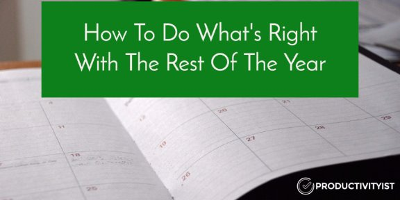

# How To Do What's Right With The Rest Of The Year

*“Sometimes you need to slow down to get back to where you want to be.” – Henry Allen*

This calendar year sure goes by fast, doesn’t it?

It seems as if every year moves faster than the previous one and with it goes our sense of how much we can do in twelve months. I bet if you look back at what you wanted to do over the past year, you’d find that there were some things that never made it to your to-do list after you initially thought of them.

That’s one thing that happens during a year – you plan for what you want to do but it never fully materializes because you don’t push it forward. Other items make it to your to do list but you find yourself moving them further down the list. You do this over and over again until they fall off the list completely.

You can plan for a specific task or action to take place continuously but it never fully materializes because you push backward instead of forward.

So how do you stop that from happening – especially at a critical time of year when you want to finish strong?

As counterintuitive as it may sound, the best thing you can do to help yourself do what’s right with the rest of the year is to **slow down**.

I intentionally use the tail end of the year to slow down. I don’t write much of anything new (including newsletters) and really look at what is left of my plans for the calendar year. Then I take steps to move them forward in the right direction.

When I first started doing this, I discovered was that I didn’t necessarily have the ideal tool to help me in this area. So I reached out to Jesse Phillips at NeuYear and asked if there was something we could make that would scratch that itch.

**And we did.**

[The NOW Year™ Calendar](http://www.neuyear.net/products/now-year) is a wall calendar that allows you to plan your year using themes for each day and month, and its minimal design is both elegant and practical. We released the first ever calendar in 2015 and people raved about it. Fellow “productive people” like Daniel Gold, Brooks Duncan, and Laura McClellan have used them in the past. And this year’s edition is even better as we’ve added a few unique features that appear for the first time on the calendar this year.

1. At the bottom corner of every day there is now a small checkbox that you can use to track a singular habit that you’re working towards sticking to throughout the year. That habit could be something like keeping tabs on whether or not you exercised, practiced meditation, or (as I do) journaled that day. You could also use this checkbox to indicate whether or not you stuck to your Daily Theme that day, which can be useful if you’re trying to build consistency with that aspect of The NOW Year™ Method.
2. Not everyone has the room on the door or wall for the default format size of The NOW Year™ Calendar. This year Jesse and I met while I was in his city at an event and we came up with the idea of offering a printable PDF of the calendar this year. This version of the calendar also allows you to start using it right away instead of waiting for the printed version to ship your way. It’s also more affordably priced because it’s a digital version of the calendar that you need to print off yourself. You can check out the new printable PDF version of the calendar [here](http://www.neuyear.net/products/now-year-pdf).
3. I also decided that I want to have a version of the calendar mirror how I start and end my year. So what I did was ask Jesse to craft a version of the calendar that starts in September and runs through August. This dating of the calendar works especially well for me since I start my year in September and it will work for those who align their year with the school year (for example). Author of The Happiness Project Gretchen Rubin [does this](http://gretchenrubin.com/happiness_project/2015/08/agree-disagree-september-is-the-other-january-time-for-a-new-start/) too. Martin Short has mentioned he done this ever since he was in school in his book [I Must Say](http://amzn.to/2ecZkUK).

Once again, this year’s printed and PDF versions come in both tall and wide formats. Plus you’ll get a PDF that walks you through the process of using the calendar with the approach I created, The NOW Year™ Method.

Planning is essential to success – no matter what time of year it is. The best way to plan effectively is to make sure you slow down, which isn’t as easy thing to do at any time of year.

So as the year comes to a close, take the time to slow down and map out how you want the rest of the year to finish. And if you need something to help you map the months ahead, then [pick up The NOW Year™ Calendar today](http://www.neuyear.net/products/now-year)!
