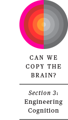

# Human-Level AI Is Right Around the Corner—or Hundreds of Years Away

## Ray Kurzweil, Rodney Brooks, and others weigh in on the future of artificial intelligence

Artificial intelligence is progressing rapidly, and its impact on our daily lives will only increase. Today, there are still many things humans can do that computers can’t. But will it always be that way? Should we worry about a future in which the capabilities of machines rival those of humans across the board? For *IEEE Spectrum*’s June 2017 special issue, we asked a range of technologists and visionaries to weigh in on what the future holds for AI and brainlike computing.

### Robin Hanson

Author of [The Age of Em: Work, Love, and Life When Robots Rule the Earth](http://ageofem.com/)

**When will we have computers as capable as the brain?**

Within a century or so if we manage to achieve brain emulations, two to four centuries if not.

**How will brainlike computers change the world?**

Computers as capable as brains will be cheaper than brains, and so displace brains in almost all job tasks. Since computers can be made fast in factories, the economy could grow much faster, perhaps doubling every month. Humans would have to retire, but they’d own most capital, which would double as fast as the economy. So, collectively, humans get rich very fast.

**Do you have any qualms about a future in which computers have human-level (or greater) intelligence?**

This is an enormous change, as big as that from foraging to farming, or from farming to industry. If you don’t have qualms about a change that big, you really aren’t paying attention.

### Martine Rothblatt

Founder of the [Terasem Movement](http://www.terasemmovementfoundation.com/), which promotes transhumanism

**When will we have computers as capable as the brain?**

In the 21st century.

**How will brainlike computers change the world?**

People will no longer die, because the computerized version of themselves will insist they are still alive even if their flesh body has expired. They will be sad, and they’ll be hoping for regenerated bodies, but they will feel like a backup of their original flesh self.

**Do you have any qualms about a future in which computers have human-level (or greater) intelligence?**

I don’t, because I’m confident the computers will be overwhelmingly friendly since they will be selected for in a Darwinian environment that consists of humanity. There is no market for [a] bad robot, no more than there is for a bad car or plane. Of course, there is the inevitability of a DIY bad human-level computer, but that gives me even more reason to welcome human-level cyberintelligence, because just like it takes a [thief to catch a thief], it will take a human-friendly smart computer to catch an antihuman smart computer.

### Ruchir Puri

Chief architect, [IBM Watson](https://www.ibm.com/watson/)

**When will we have computers as capable as the brain?**

A human brain is fundamentally different than being a champion chess, “Jeopardy!,” or Go player. It is something that entails essential traits like caring, empathy, sharing, ingenuity, and innovation. These human brain traits might prove to be elusive to machines for a long time, not to mention the incredible form factor and energy efficiency with which [the] human brain operates and learns. Although AI’s impact on society will accelerate further…to reach new heights in solving problems which are currently grand challenges for human society, it will be a while before we will be able to holistically answer [that] question.

### Ray Kurzweil

Cofounder and chancellor, [Singularity University](https://su.org/)

**When will we have computers as capable as the brain?**

I believe computers will match and then quickly exceed human capabilities in the areas where humans are still superior today by 2029.

**How will brainlike computers change the world?**

AI is already accelerating our ability to find cures for diseases, improve crop yields and other forms of productivity to reduce poverty, and find solutions to environmental problems. It already represents a brain extender. Who today can do their job or get an education without these extensions to our intelligence?

**Do you have any qualms about a future in which computers have human-level (or greater) intelligence?**

Every technology since fire has had intertwined promise and peril. I believe that our best strategy to keep AI safe and beneficial is to essentially merge with it. We are already on that path. Whether [intelligent] machines are inside or outside [the] body is not a critical issue. But they will ultimately go inside our bodies and brains (because miniaturization is another exponential trend), keeping us healthy (by augmenting our immune system), providing virtual and augmented reality from within the nervous system, and making us smarter.

### Carver Mead

[Professor emeritus](http://www.carvermead.caltech.edu/), California Institute of Technology

**Do you have any qualms about a future in which computers have human-level (or greater) intelligence?**

Every time there’s been progress in technology, people have predicted that it will be the end of society as we know it, and it never has been. The world today is a vastly better world for everyone than the world of 100 years ago. In fact, technology has been the single force that has propagated prosperity across the world. Technology has always been used [for both good and evil], and yet if you look over 100 years, the good has won out over the bad by a large margin.

### Nick Bostrom

Author of [Superintelligence: Paths, Dangers, Strategies](https://www.amazon.com/Superintelligence-Dangers-Strategies-Nick-Bostrom/dp/0199678111/)

**When will we have computers as capable as the brain?**

Hardware-wise, the brain still compares favorably with machines. Estimates vary, but perhaps the cortex performs something like 1016 or 1018 operations per second using 20 watts, which is impressive. Eventually, the limits of computation in machine substrate are of course far beyond those in biological tissue, and it shouldn’t take too long to reach rough equivalence. The advance of algorithms is harder to predict, but the notion that we could have human-level AI within a small number of decades seems credible, though there is great uncertainty on both the lower and upper sides of this estimate.

**What are your biggest qualms about a future in which computers have human-level (or greater) intelligence?**

I think it’s a whole new era that dawns at that point, and it is hard to foretell in much detail what it might contain. But one dimension of concern is that we fail to solve the problem of scalable control: how to engineer advanced artificial intelligence such that it will continue to behave as intended and act as an extension of human will, even as its intelligence is increased to arbitrarily high levels. This is an active area of research at the moment.

### Rodney Brooks

Chairman and CTO, [Rethink Robotics](http://www.rethinkrobotics.com/)

**When will we have computers as capable as the brain?  
 *Rodney Brooks’s revised question: When will we have computers/robots recognizably as intelligent and as conscious as humans?***

Not in our lifetimes, not even in Ray Kurzweil’s lifetime, and despite his fervent wishes, just like the rest of us, he will die within just a few decades. It will be well over 100 years before we see this level in our machines. Maybe many hundred years.

**As intelligent and as conscious as dogs?**

Maybe in 50 to 100 years. But they won’t have noses anywhere near as good as the real thing. They will be olfactorily challenged dogs.

**How will brainlike computers change the world?**

Since we won’t have intelligent computers like humans for well over 100 years, we cannot make any sensible projections about how they will change the world, as we don’t understand what the world will be like at all in 100 years. (For example, imagine reading Turing’s paper on computable numbers in 1936 and trying to pro­ject out how computers would change the world in just 70 or 80 years.) So an equivalent well-grounded question would have to be something simpler, like “How will computers/robots continue to change the world?” Answer: Within 20 years most baby boomers are going to have robotic devices in their homes, helping them maintain their independence as they age in place. This will include Ray Kurzweil, who will still not be immortal.

**Do you have any qualms about a future in which computers have human-level (or greater) intelligence?**

No qualms at all, as the world will have evolved so much in the next 100+ years that we cannot possibly imagine what it will be like, so there is no point in qualming. Qualming in the face of zero facts or understanding is a fun parlor game but generally not useful. And yes, this includes Nick Bostrom.

### Gary Marcus

[Professor of psychology](http://www.psych.nyu.edu/gary/), New York University

**When will we have computers as capable as the brain?**

Computers are already far more capable than brains in many respects (for example, arithmetic and memory), but I think it could still be 20 to 50 years before machines have the ability to read and comprehend and reason about novel situations as fluently as people can.

**How will brainlike computers change the world?**

If machines can read and reason at human levels while being able to compute at superhuman levels, we may see unprecedented progress in science and medicine.

**Do you have any qualms about a future in which computers have human-level (or greater) intelligence?**

Sure, but my biggest worry is about machines having too much power, not about them being too smart. You could, for example, be president of the United States and do a lot of damage, regardless of what your IQ is.

**How far will machine learning take us?**

Current techniques aren’t strong enough to solve hard problems in language and common sense, but eventually we will have more powerful techniques, perhaps fairly different from what we have now, and the sky will be the limit when we do.

### Jürgen Schmidhuber

Scientific director, [Swiss AI Lab IDSIA](http://www.idsia.ch/)

**When will we have computers as capable as the brain?**

Soon. Every five years computing is getting roughly 10 times cheaper. Unlike Moore’s Law, which says that the number of transistors per microchip doubles every 18 months (and which recently broke) this older trend has held since Konrad Zuse built the first working program-controlled computer. His machine could perform roughly one floating-point operation per second. Today, 75 years later, hardware is roughly a million billion times faster per unit price. Soon we’ll have cheap devices with the raw computational power of a human brain; a few decades later, of all 10 billion human brains together, which collectively probably cannot execute more than 1030 meaningful elementary operations per second.

**How will brainlike computers change the world?**

Most current AI research is about using artificial neural networks to build friendly AIs that make their users healthier and happier and more addicted to their smartphones. But we already know how to implement principles of curiosity and creativity in self-motivated AIs pursuing their own goals. This will scale.

What will supersmart AIs do? Space is hostile to humans but friendly to appropriately designed robots, and offers many more resources than the thin film of biosphere around the Earth, which gets less than a billionth of the sun’s light. While some AIs will remain fascinated with life, at least as long as they don’t fully understand it, most will be more interested in the incredible new opportunities for robots and software life out there in space. Through innumerable self-replicating robot factories in the asteroid belt and elsewhere they will transform the rest of the solar system, and then within a few million years the entire galaxy, and within billions of years the rest of the reachable universe, held back only by the light speed limit.

All Photo-Illustrations: Gluekit
