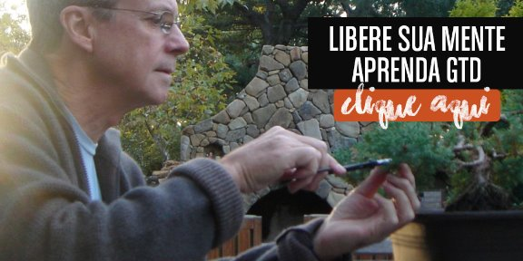

# Não se trata só de “dicas práticas” — Vida Organizada

Eu sei que vivemos em um mundo corrido e com muitos prazos para ontem, e que “ninguém tem tempo” a perder com listas e “outras complicações”. Mas, estudando sobre produtividade nos últimos onze anos (!), eu também aprendi que esse *modus operandi* não te leva a sair desse ciclo. O que aconteceu comigo, pelo menos, foi perceber que eu ficaria doente e poderia até morrer se quisesse seguir esse ritmo para sempre. Eu quis ir um pouco mais devagar – o que não significava ser menos eficiente. Eu só acreditava que nem tudo era pra ontem. Também acreditava que as coisas poderiam ser feitas com um pouco mais de antecedência e planejamento. E foi essa “crença” que me fez tomar a decisão de mudar. E aí eu saí do ciclo.

Porque pasme: o mundo não acaba quando você começa a colocar limites. Gera certas dores? Sim. Quantas vezes não fui zoada – “a Thais anota tudo, cuidado com o que fala hein?”. Ou então: “Você planeja demais – nem tudo tem que sair com a qualidade que você espera”. E, quando a gente está no mercado de trabalho, tentando agradar o chefe, bate uma insegurança tremenda. A gente não sabe se confia no próprio coração ou no que o chefe manda ou nos conselhos dos colegas. A grande verdade é que ninguém sabe o que está falando. A única pessoa que sabe é você mesmo. Porque o que é o ritmo de uma pessoa, pode não ser o da outra. E dificilmente será.

Eu lido com isso diversas vezes quando vou ensinar uma pessoa a se organizar a partir do zero. Ela quer que a coisa aconteça rápido. Quer dicas práticas. Não quer que eu dê mais trabalho. Então existe todo um esforço de conscientização para mostrar que não se trata de batucar teclado nem de riscar coisas da lista, mas de ver se você efetivamente está dedicando tempo às coisas certas. E essa pequena frase engloba um mundo de coisas.

O David Allen (autor do método GTD) participou de uma matéria para a tv holandesa onde ele ensina uma apresentadora a usar GTD desde o início. A matéria é incrível. Se você entender inglês, vai gostar muito (veja abaixo ou clique [aqui](https://www.youtube.com/watch?v=yrZtWHXh4_8), se não estiver visualizando o vídeo):

Quando ele faz o exercício de coleta com a apresentadora, tem um momento que ela diz que está se sentindo um pouco aflita com o processo. E ele responde: “você só está se dando conta do estresse em que você já vive”. Ou seja, não é o ato de agrupar tudo o que está chamando a atenção que deixa o ser humano aflito. Não é ter listas mostrando tudo o que precisa ser feito. É o fato de essas coisas existirem e você, de certa maneira, não dar a devida atenção que todas elas merecem. Então “se organizar” é dar essa atenção. As coisas não deixam de existir se você não fizer isso. Porém, consciente do que existe, você pode ter mais tranquilidade. “Você só pode se sentir bem sobre o que não está fazendo quando você sabe o que não está fazendo”, o David diz.

O vídeo acima é só a edição para o programa, mas você pode ver a versão completa (15 minutos) [aqui](http://gettingthingsdone.com/2015/10/a-look-inside-a-gtd-coaching-session/).

Todo mundo, sem exceção, acha que se organizar dá trabalho. Então o mecanismo de defesa para evitar entrar nesse ciclo “trabalhoso” é pedir: me dê dicas práticas! Só que “dicas” não resolvem o problema. Quer dicas? Oras, existem aos montes. Digite “dicas de organização” ou “dicas de produtividade” no Google e você terá milhares de resultados. Só que “dicas” não adiantam nada se você não tiver um processo inteiramente seu, um empoderamento interno de estabelecer limites para o mundo com base em suas próprias prioridades, se você não tiver um método que te auxilie a ficar relax o tempo todo.

Produtividade não é fazer mais coisas. É investir tempo nas coisas certas. E “coisas certas” variam muito – tanto quanto variamos como seres humanos. Por isso cada um faz suas escolhas. A pergunta é: as suas escolhas são coerentes? Você está construindo o estilo de vida que você quer ter?

Não me leve a mal: tem pessoas que gostam desse ritmo. Em certo teor psicológico, até dependem disso. Mas, se você está cansada(o), pare de pedir/pesquisar por dicas e procure entender que se trata de um estilo de vida onde você só precisa dar o primeiro passo: decidir que não quer mais viver assim. O “como fazer” depende muito de cada um. A minha abordagem, vocês sabem, é o [GTD](http://vidaorganizada.com/gtd).

