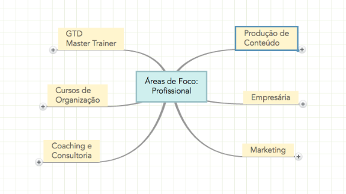
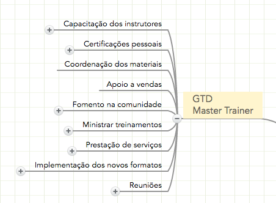
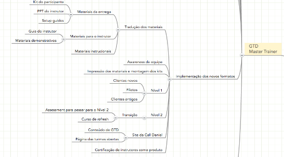
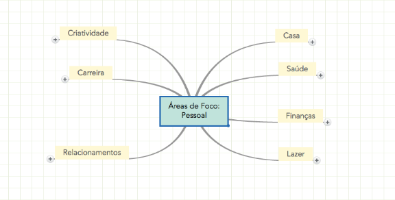
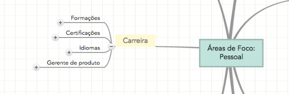
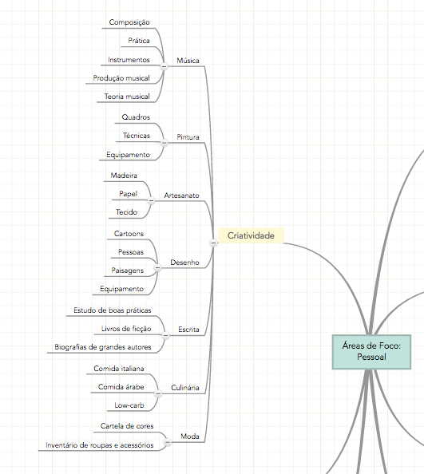

# Reequilibrando áreas de foco — Vida Organizada

Neste post, vou comentar um pouco sobre como tenho feito um trabalho de reequilíbrio das minhas [áreas de foco](http://vidaorganizada.com/o-que-sao-areas-de-foco/). David Allen recomenda revisá-las sempre que sentir necessidade de buscar equilíbrio. Eu tenho sentido desde a mudança de casa e também com algumas mudanças de rumo profissionais. Achei que seria legal compartilhar com vocês (leia o post linkado na primeira frase para entender sobre o que estou falando caso você nunca tenha lido nada sobre áreas de foco).

Essas são as minhas áreas de foco profissional nesse momento. Eu utilizo um programa chamado [Mind Meister](http://www.mindmeister.com/) para fazer (adoro esse programa, embora existam outros que trabalhem mapas mentais também).

Quando eu penso no meu trabalho, existem seis grandes áreas pelas quais eu sou responsável hoje, e são essas áreas acima. Cada uma delas é um mundo de coisas a se tomar conta, então até que foi fácil distinguir exatamente quais são. Uma influencia na outra, claro, mas tê-las descritas me ajuda muito na definição do meu trabalho.

Definir o seu trabalho é uma das coisas que mais fazem diferença em termos de produtividade. **Se você não tiver seu trabalho definido, ficará muito mais fácil dizer sim para tudo e para todos e se sobrecarregar**. Aliás, é fato: toda pessoa sobrecarregada não sabe de verdade qual é o seu trabalho. Provavelmente não tem todo o inventário de coisas que precisa completar e entregar a curto prazo, não tem ideia dos seus compromissos nem das suas responsabilidades. Uma vez que você defina seu trabalho, você consegue analisar cada uma dessas definições e se perguntar: tá tudo certo por aqui? Isso me lembra algo? Quando eu analiso essa área e penso em sua estabilidade, o que eu preciso fazer para alcançá-la?

E essa é uma análise fundamental, porque mudamos o tempo todo. Aprendemos coisas novas, evoluímos (#pokemongo), queremos fazer coisas diferentes. Quando você é promovido ou muda de emprego, por exemplo, fatalmente precisará fazer uma nova análise das suas áreas de foco, pois tem muita coisa para colocar em ordem nos próximos meses.

**Depois de listar as áreas principais, eu acrescento em um segundo nível as minhas grandes responsabilidades dentro de cada uma delas**. Essa “categorização” não é coisa do GTD, mas minha mesmo. Para mim, fica mais claro fazer dessa forma (primeiro nível: grandes áreas, segundo nível: responsabilidades). Já tentei de outras maneiras e posso mudar daqui a algum tempo também, porque tudo isso é muito dinâmico – lida com a maneira como eu me relaciono com o meu mundo.

Quando eu penso, por exemplo, no meu trabalho como master trainer, as responsabilidades são muitas. Mas, se eu não fizesse essa descrição, não saberia dizer quantas.

O que isso aí em cima significa é que eu tenho essas responsabilidades como master trainer. No geral, esse segundo nível basta. No terceiro, coloco apenas detalhes que me ajudam a garantir que eu não deixe nada escapar quando revisar todas as áreas.

“Mas Thais, o que você faz?” – fica até um pouco mais fácil responder essa pergunta quando as áreas estão definidas. 😀

Então, mensalmente, ou sempre que me sinto um pouco sobrecarregada, eu reviso essas áreas porque assim: **o que é minha responsabilidade, eu tenho que dar conta**. O problema é que se eu identificar que tenho mais responsabilidades do que posso abrigar, aí preciso tomar providências. As providências geralmente são delegar ou abandonar. Sempre me pergunto se sou a única pessoa que pode fazer aquilo. Em 80% dos casos, eu posso delegar. Então essa é uma análise muito bacana, que me permite ter mais foco naquilo que eu realmente preciso fazer.

Aí vem a grande jogada da coisa toda: **quando uma área não está em “estado de cruzeiro” (navegando em águas tranquilas), o que eu preciso fazer para que esteja? Posso identificar projetos**, que são coisas que quero concluir em até um ano e que demandam múltiplos passos. Ao identificar projetos, anoto todas essas ideias para depois esclarecer adequadamente e organizar no meu [Todoist](http://todoist.com/). Lá, cada projeto terá pelo menos uma ação definida que poderei trabalhar no dia a dia, e assim vou alcançando o que pretendo em cada um dos projetos e, com os projetos, a tranquilidade e estabilidade nas áreas de foco diversas.

O mesmo vale para as minhas áreas de foco pessoal, que faço em mapa separado. Por quê? Porque uma coisa é o detalhamento das minhas áreas de trabalho e outra são as minhas áreas da vida como indivíduo. Por exemplo, no meu mapa pessoal eu tenho uma área chamada “Carreira”, pois é a evolução da minha trajetória profissional, e não as minhas responsabilidades atuais no trabalho.

Aqui aplico o mesmo raciocínio, mas de forma diferente, com uma camada a mais: em um primeiro nível, listo as áreas macro; em um segundo, as sub-áreas; e, em um terceiro nível, listo as minhas responsabilidades.

Por exemplo, uma área de foco que é muito forte para mim é “Criatividade”. Está ligada até ao meu propósito. Por isso, ela por si só merece ser uma área macro com sub-áreas e responsabilidades.

Você pode ver tudo isso e pensar: quanta coisa! Mas **não construí isso de um dia para o outro. Fui construindo aos poucos**, refletindo a minha vida como um todo. E, a cada análise (geralmente mensal), tiro e adiciono coisas novas, reescrevo para deixar mais a ver com o que sou no momento (e mais dedutivo). É realmente um mapa da minha vida atual e, com esse mapa, eu consigo pensar em todos as diversas facetas dela com o carinho que elas merecem.

Por exemplo, eu posso olhar ali, em “Saúde”, que eu tenho uma sub-área chamada “Acompanhamento médico”, que faz tempo que eu não vou ao dentista. Eu capturo essa informação para processar e organizar na minha lista de coisas a fazer da maneira mais adequada.

“Ah, mas isso é muito controle. Sou uma pessoa livre, criativa, não gosto de limites assim. Parece que você engessa tudo, não vive.” Eu ouço muito isso (o David Allen também). E vou usar a resposta dele para isso: justamente por eu ser uma pessoa livre e criativa também eu faço isso. Porque, se eu não fizer, esses pequenos detalhes chatos, burocráticos e às vezes até enfadonhos da minha vida vão ficar tomando meu tempo e energia que eu deveria estar dedicando às coisas realmente importantes para mim. Por outro lado, ao fazer essa análise, eu garanto que não vou me esquecer de nenhuma dessas coisas importantes. Vou ter sempre a oportunidade de refletir sobre as responsabilidades que eu tenho com relação ao meu filho, à educação dele, à minha saúde, à nossa casa e todas as outras áreas. Não se trata de limitação, mas de expansão.

Claro que, sem dúvida, é apenas uma escolha sobre o modo como viver a vida, que não é obrigatória de maneira alguma.
