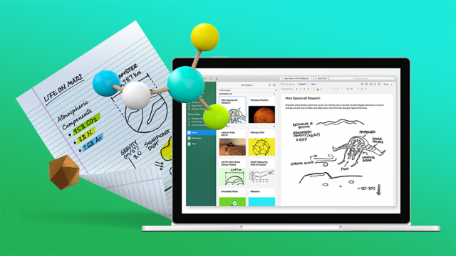

# Take Evernote Back to School With These Student Templates

Posted by Pamela Rosen on 02 Aug 2017

[Comment](https://blog.evernote.com/blog/2017/08/02/evernote-back-to-school-student-templates/?origin=email_sfmc&utm_source=sfmc&utm_medium=email&utm_campaign=EVN-ENG-NLS-88-EN-8888-Newsletter_082317&utm_content=nl+left+article+title#comments)

Have you ever thought of school as something you can predict? No matter what class you take, the work that you do will be ***repeatable.***  Maybe you’ve noticed that school tasks are exactly the same no matter where you go or what class you take. You’ll take notes, you’ll listen to lectures, you’ll write papers, you’ll take exams. You can even predict that a pop quiz will come when you least expect it.

It’s always exciting to start a new school year, so this is the perfect time to look at school work in a new way. If you’re going to be doing the same thing over and over (and you are), why not prepare yourself in advance by using these Evernote templates for students?

***Student offer:*** [***Get 50% off Evernote Premium***](https://evernote.com/students/) »

### Templates for different types of thinkers

There’s no right way to take notes, but if you remember to keep your notes predictable, studying can be simple.

[Cornell notes](https://www.evernote.com/l/ATQ9D3oEjptFt6p-dlCOPWhmq-qHXRgkP7A) allow you to break down course material each day in small, bite-sized chunks. At the top of each Cornell note is a space to write the day’s essential question: what is it that each day’s lecture was meant to answer? Having that question answered at the top of each page helps you understand each lecture at a high level, and probably gives you some clues about what’s going to be on the mid-term and final, too.

Are you more of a free-form thinker? That’s okay. There’s a note-taking template for you, too. Download and use this [Class Notes](https://www.evernote.com/l/ATTwOiIfE_lCcaUcw7vyod2z0XkdxgU3rsI) template, and you can quickly jot down your notes, questions, homework, and to-do list for each class session. Then, [set up a reminder](https://help.evernote.com/hc/en-us/articles/208314338-How-to-use-reminders) in Evernote to help you stay on track. That’s right, you can have your class notes remind you to read them and take action, so you don’t have to remember all those deadlines.

- **Pro tip:** Did a fellow student miss a class and ask you for notes? You’ve got them covered. Share the note in Evernote, and they can open it whether or not they have an Evernote account.

Perhaps your studies take you to an academic or professional conference. In this case, you might choose to use the [Conference Notes](https://www.evernote.com/l/ATQLqwUJvBJKWILkZ6qO-KSokwasHy7vseM) template. These are the same templates that professional Evernote note-takers bring to conferences around the world. Use this template to capture points from each speaker, and follow their presentation slides as you type or write.

- **Pro tip:** Use your phone and [Evernote’s audio recording feature](https://help.evernote.com/hc/en-us/articles/208314418) to capture lectures and attach the recordings to your written notes, so you don’t miss a word.

- **Another pro tip:** Take photos using the [Evernote in-app camera](https://help.evernote.com/hc/en-us/articles/222177927) and get speaker slides, whiteboard notes, and even your handwritten notes from those classes that don’t allow electronics.

### Do more in school

- Use [Web Clipper](https://evernote.com/products/webclipper/) to gather the research material you found online. (Bonus: Web Clipper also automatically saves the complete source URL, which you’ll need for annotated bibliographies.)

- [Import or scan PDF files](https://help.evernote.com/hc/articles/209126487) and save them with your notes.
- [Annotate PDFs](https://help.evernote.com/hc/articles/208431238)—add notes, highlights, and arrows to call your attention to the most important parts.

### Plan to maximize time

School is so much more than taking classes, studying, and exams. Though your planners will all be filled with different activities, count on having a daily to-do list, weekly tasks, and monthly obligations.

Go back to school with Evernote templates for [monthly](https://www.evernote.com/l/ATT1x7XEk3RBqLKe02l6qoe7Oex53muuM9s), [weekly](https://www.evernote.com/l/ATQYZla1IC1LCpYYkwJ9AJX7yLSNI8duHX8), and [daily](https://www.evernote.com/l/ATQWMSILP4pHgasnRBuGxUv-Lg8qBG410mA) planning. »

### **Extracurricular organization templates**

In a club, fraternity or sorority, sports team, or political organization? If you are, then you know the drill. Somebody has to take meeting [notes](https://www.evernote.com/l/ATQOq8bU6ihGNYaPauqTsaQMHUtN2ETarjk), organize [agenda](https://www.evernote.com/shard/s308/sh/3857d189-01e5-4b7f-8263-7b7e34df2ac6/6cf8c3ce9eafe3d4)s, manage [projects](https://www.evernote.com/l/ATRp89l-jtpGGbV6-eVQjlksV2k-_Z_f__8), keep track of [goals](https://www.evernote.com/l/ATTGip9d3gBB9Y8YKU7dB6L8LTlZd1oaxQc) and [budgets](https://www.evernote.com/l/ATQgHaom5YhFEq9qxtOJ9fE-gxLDJiH9rSU), create [marketing plans](https://www.evernote.com/l/ATQb7QgsjcRJwZcgMvYsbaNv2Pv8nUXZRCQ), and [brainstorm ideas](https://www.evernote.com/l/ATSFpRE2IfVCi5vIuKu2vMtCVBpIywRfYxQ). Bring more to these meetings by using and sharing Evernote templates designed for clubs and teams.

### How to use the templates

1. Create a “Templates” notebook in Evernote to contain all your templates.
2. Add any templates you’d want your team to use into the “Templates” notebook.
3. When you want to use a template, copy it from your “Templates” notebook to the notebook you want the note to live in.
4. Put your information in the copy of the template you’ve created—you can edit the template to your heart’s delight.

If you want to share a template with classmates, click Share—>Share Notebook. Add the emails of people you want to share it with (they’ll be able to read it even if they don’t use Evernote).

Love all these templates and want to get them all at once? [Join the notebook](https://www.evernote.com/pub/evernote_examples/studenttemplates2017#st=p) and get them all. Copy them into your Evernote account, and share them with your fellow students all year.  
***Special offer for students: Get premium features like offline access, more upload space, search and annotate PDFs and attachments, and put Evernote on all your devices.*** [***Get Evernote Premium for students 50% off***](https://evernote.com/students/) ***»***
