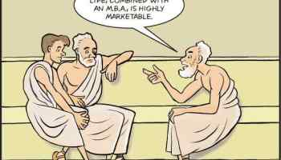

# Amor Fati: Learning To Love And Accept Everything That Happens

One of your greatest assets is your willpower, your decision-making, your discipline.

This is what we’re told. It’s also what we see. Most of us wouldn’t be where we are without hard work or ability to change our circumstances.

And so we come to expect that the world will always respond in kind. That it will do what we want. That things will more or less go our way.

It’s this, I think, that makes a relatively simple and straightforward piece of advice so hard to accept. Especially when we’re young. Especially if we’re ambitious.

Acceptance. It’s just fucking hard.

Not just hard because it means tolerating things we don’t like, but because it feels weak. What am I supposed to do, just let things be?

Yes. Yes, exactly.

The psychologist Albert Ellis called our tendency to object to this: “musturbation.” The faulty and damaging belief that things must be the way we want them, or must be the way we expected.

It’s about as productive as regular masturbation. It feels good for for a few minutes but ultimately accomplishes nothing. The only effect of musturbation is that our day is ruined. The only effect is that vital force is dissipated.

And it prevents something really crucial too: working with what actually is.

“You ought to be preparing yourself…to hear truths, which no inflexibility will be able to withstand,” James Madison once wrote to Thomas Jefferson.

What he means is that stuff is going to happen to us in life. You gotta be ok with it. That which one resists persists, is the old proverb.

People are going to be a certain way, events will occur as they do. Shit happens. Bad shit.

Not only that, but there’s the little stuff too. People are rude. Things are said. The weather is nasty. The news is disappointing.

The solution to all of this is not to fight it with incredible amounts of energy. As [Epictetus](https://dailystoic.com/Epictetus) put it:

> Do not seek to have events happen as you want them but instead want them to happen and your life will go well.

Or, as the lyrics to [one of my favorite songs](https://www.youtube.com/watch?v=CzEDgafXhy0) goes, remind yourself “All is just as well.” All is just as well.

The Stoics called that idea the Art of Acquiescence. Horace wrote *feras non culpes quod vitari non potest* (what can’t be cured must be endured). Lincoln’s favorite saying was “And this too shall pass.” In the [*Book of Five Rings*](https://buy.geni.us/Proxy.ashx?TSID=28407&GR_URL=https%3A%2F%2Fwww.amazon.com%2FBook-Five-Rings-Classic-Strategy%2Fdp%2F0879511532&dtb=1), Musashi says “Accept everything just the way it is.”

“Evolution is necessarily slow since we resent it so,” Florida Maxwell Scott observed at the end of her life. Schopenhauer quotes an analogy from the Roman playwright Terence when he says that “life is a game of dice. Even if you don’t throw the number you like, you still have to play it and play it well.”

This is where acceptance comes in.

You don’t have to like it to work with it—to use it to your advantage. But it starts by seeing it clearly and accepting it unconditionally. *Amor fati*— a love of what happens. Because that’s your only option.

The Stoics had another metaphor for what they [called *the logos*](https://dailystoic.com/glossary/) or the universal guiding force of the universe. We are like a dog tied to a moving cart, they thought. We have two options. We can struggle with the foolish notion of control and dig our hind legs in, challenge every step and get forcibly dragged. Or we can go along for the ride, enjoy it and take our freedoms where they come.

Look, if you were in the car with friends and they seemed to take traffic signals or road construction personally, you’d consider them insane. Yet this is the equivalent of what most of us do. We get angry at the signs. We say: *But I don’t want it to be true. Maybe if I grip the wheel real tight, it will change things. Maybe if I yell or breathe really hard…*

Because why? Because things are supposed to be another way?

C’mon.

As [Cheryl Strayed put it](http://therumpus.net/2010/07/dear-sugar-the-rumpus-advice-column-44-how-you-get-unstuck/):

> You can’t cry it away or eat it away or starve it away or walk it away or punch it away or even therapy it away. It’s just there, and you have to survive it. You have to endure it. You have to live through it and love it and move on and be better for it…

The world around you, it is what it is. The events that happen, they are what they are. The people in your life, they’ll do what they do.

Accept them. Understand them. Empathize with them.

**\*\*\***

*This post [was originally published](https://thoughtcatalog.com/ryan-holiday/2015/07/amor-fati-learning-to-love-and-accept-everything-that-happens/) on Thought Catalog.*

### *Related posts:*

#### [The Undefeated Mind: An Interview with Buddhist and Author Alex Lickerman](https://dailystoic.com/alex-lickerman/ "The Undefeated Mind: An Interview with Buddhist and Author Alex LickermanWe have previously written about the strong parallels between Buddhism and Stoicism but deciding to better our understanding, we reached out to Dr. Alex Lickerman, someone who has deeply studied Buddhism and can bring lessons from the Eastern philosophy that readers of the Daily Stoic can benefit from. Alex is…")

#### [5 Ways to Practice Goodness Today](https://dailystoic.com/5-ways-practice-goodness-today/ "5 Ways to Practice Goodness TodayThis is a guest post by Monil Shah Today, as our societies are growing, it seems like the line between good and bad, moral and immoral, just and unjust, is getting blurrier. We're focusing a lot of our energy in getting that new car, hoping our kids' picture gets a…")

#### [6 Stoic Rituals That Will Make You Happy](https://dailystoic.com/happy-stoic/ "6 Stoic Rituals That Will Make You HappyThis post originally appeared on bakadesuyo.com People have enormous respect for ancient wisdom. They just don’t read it. Funny thing is, we’re more likely to live happier lives when we visit the classics section than the self-help aisle. So how do we get the skinny on what one group of…")

*Get Your Free* DAILY STOIC *Starter Pack*

Email Address

I'd like to receive the free email course.
Includes an introduction to Stoicism, best books to start with, Stoic exercises and much more!
[Powered by ConvertKit](https://convertkit.com/?utm_campaign=poweredby)
