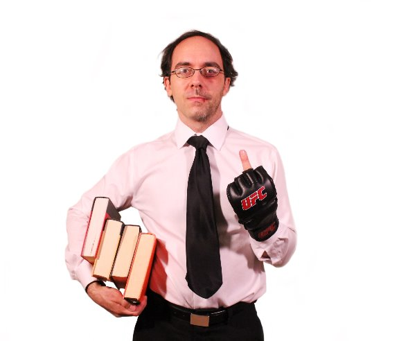

# Philosophy, Fighting, and Martial Arts Mythology: An Interview With Daniele Bolelli

There are certain individuals who can’t be put into a single category. Daniele Bolelli is one of those people. He is a successful author, a university professor, a professional martial artist and a podcast host (and a philosopher and a father and a historian). Perhaps you know him for his cult classic, [*On the Warrior’s Path*](https://buy.geni.us/Proxy.ashx?TSID=28407&GR_URL=https%3A%2F%2Fwww.amazon.com%2FWarriors-Path-Second-Philosophy-Mythology%2Fdp%2F158394219X%3Ftag%3Ddailystoic07-20&dtb=1), a philosophical exploration of the martial arts or because of his podcasts, [The Drunken Taoist](http://thedrunkentaoist.com/) and [History on Fire](http://historyonfirepodcast.com/), nominated as one of iTunes Best of 2015. Maybe you’ve even trained under Daniele who holds a fifth degree black belt in kung fu san soo-a style and fought professionally in mixed martial arts (MMA).

Daniele was generous with his time and our interview covers many subjects. How to face our fears and perform at our best? Why he rejects overspecialization? What is the role of the martial arts and character-building? Why Taoism is the philosophy that influenced him the most and how it can be supremely pragmatic? How do we find what Nietzsche calls ‘the hero hidden in your soul’? This and much more, in our interview below!

**You have a beautiful line that echoes the Stoics in** [**one of your essays**](http://www.danielebolelli.com/2012/07/09/commencement-speech-bolelli-style/)**. It goes “Victory or defeat are largely out of my control, but putting up a good fight… putting up the kind of fight that makes the earth shake and the gods blush… this I can do.” Was this always a deep rooted belief—focusing uniquely on your actions and not the outcome—that you had? Or was this a lesson that you had to relearn over and over?**

I don’t think too many human beings are naturally above caring about victory and defeat. It’s imprinted in us to care about the outcome of our actions. While this may be natural and normal, the problem is that we can never fully control the outcome. Usually, in life there are too many variables at play. So, no matter how mightily we strive or how intense our effort, odds are that at least some of the time we will come up short of our goals. And what makes things even more complicated is that the more attached you are to the outcome, the more tension and fear you will experience at the thought of possibly facing a crushing defeat—which reduces our effectiveness, since part of our energy is trapped in the jaws of fear. Paradoxically enough, the more you focus on giving your all rather than outcome, the less fear will hold you prisoner. And the less fear holds you prisoner, the higher the odds that you will perform at your peak potential and actually get the outcome you desire. I am fascinated with this idea because it offers a concrete tool to better ourselves. I struggle with this all the time because–like most people–I care deeply about outcomes. So, for me this is an ongoing practice.

**As a professor, it looks like you reject the idea of ‘specialization’ and in your classes you teach a diverse range of subjects. Can you tell us more about this approach? Why did you decide to follow this path when academics are known for deeply focusing on only one subject matter? And in general, just looking at all the projects that you are involved in, it seems like you take this way as a guiding principle in life as well?**

On the surface, specialization looks great. Why wouldn’t you want to become the foremost expert in your chosen field? The problem is that usually it requires a heavy price to pay. By forcing you to dedicate yourself 100% to one field and one field only, specialization robs us of a more inclusive perspective. When this happens, specialization loses its connection to the rest of existence. In my perspective, the goal of any field of knowledge should be to elevate the overall quality of our lives–and this can only happen when we integrate the insights from different fields, since Life is greater than any one field. Academics are often a perfect example of the dangers of overspecialization. By diving too deeply in the minutia of a single field and being unable to draw connections to all the aspects that make life great, they lock themselves into an intellectual ghetto. The only people who care about their work are usually the few other specialists in the field. I’m interested in the opposite process—go deep enough within a field in order to bring back the treasures I find to share with non-specialists so that they can use them to brighten their existence. It is not a coincidence that a guy like Dan Carlin (who is not a professional historian) is heads and shoulders above any historian in his ability to communicate the insights of history to the general public.

**I loved your book** [***On the Warrior’s Path: Philosophy, Fighting, and Martial Arts***](https://buy.geni.us/Proxy.ashx?TSID=28407&GR_URL=https%3A%2F%2Fwww.amazon.com%2FWarriors-Path-Second-Philosophy-Mythology%2Fdp%2F158394219X%3Ftag%3Ddailystoic07-20&dtb=1) **and I highly recommend it to our readers. I imagine someone not familiar with the work would be surprised at the intersection of the two subjects. Can you tell us a bit more about the overlap between philosophy and martial arts?**

Martial arts speak a universal language. Everyone understands conflict since we all experience it in one form or another. And physical fighting is the rawest, most primal type of conflict that we can all relate to. Martial arts practice is a great tool for coming to terms with fear and for learning how to deal with conflict. If people practicing martial arts limit their experience to the technical knowledge of physical combat, they miss out on what martial arts can teach them about how to handle conflict in all other aspects of life. Technical knowledge is a great start. It provides the foundation. But learning how to execute the perfect armbar or a beautiful spinning back kick is not nearly as important as learning how to apply the insights gained on the mat and in the ring to the battles we all face in everyday life. A philosophical approach to martial arts does just that—it allows to extend the benefits of martial experience to something greater than only physical combat. Martial arts stop being just ‘martial arts’ and they turn into a way of life. As Miyamoto Musashi put it, “The true science of martial arts means practicing them in such a way that they will be useful at any time, and to teach them in such a way that they will be useful in all things.”

**A theme that comes up throughout the book is that, at the core of it, martial arts training provides us with tools to forge our character. I think people often forget that character-building aspect—whether it is in martial arts or any other type of training. Can you elaborate on that idea for our readers?**

Character-building is the most important task any of us can tackle. People often get overly enamored with the specific detail of their field rather than remembering that ultimately any field is only as good as it helps us become more effective and better as human beings. If martial arts are just about martial arts, then screw them–they are not that important. But if martial arts (or any other field for that matter) offer us the instruments to reforge our character, then it would be foolish to miss this chance. Zen warns us not to get lost looking at the finger pointing at the moon, and focus on the moon itself. The way I see it, the details of any field are the finger, while character-building is the moon.

**In** [***Ego is the Enemy***](https://buy.geni.us/Proxy.ashx?TSID=28407&GR_URL=https%3A%2F%2Fwww.amazon.com%2FEgo-Enemy-Ryan-Holiday%2Fdp%2F1591847818%3Ftag%3Ddailystoic07-20&dtb=1)**, I used an analogy you gave me—sweeping the floor. I think philosophy is a lot like that. You don’t learn it once, or think about it once. You have to do it every day. Is there one exercise or one though you return to most? Anything specifically from the Stoics?**

[Marcus Aurelius](https://www.dailystoic.com/marcus-aurelius/) wrote his *Meditations* in order to remind himself of how he wanted to behave in everyday life. I think this is key—to find some type of daily ritual that puts us in contact with our highest ideals, with what Nietzsche calls ‘the hero hidden in your soul.’ Visualizing the person you want to be, focusing on specific characteristics, and imagining how this person would react in particular circumstances is a useful way to try to embody these ideals into reality. Regardless of what the fans of ‘positive thinking’ say, no amount of visualizing a positive outcome ensures it will happen. But visualizing how we want to face what Life dishes our way is a much more realistic, and useful approach.

**Ok, last one about books. You have** [**quite an extensive list**](http://www.danielebolelli.com/daniele-bolelli-suggested-reading/) **on your website with book suggestions. What have you read recently that you’ve loved and you’d strongly recommend?**

My relationship with reading has changed dramatically over the last couple of years. Ever since I started the History on Fire podcast, I have to put over 200 hours of research into each episode. Considering that I try to release one episode a month, this means that I haven’t had a chance to read a book for pleasure in the last two years. I spend monstrous amounts of time reading impossibly dry history texts so I can dig for the gold nuggets that I can then use to tell a kickass story. The upside is that I am getting to create some pretty epic content. The downside is that I don’t get to read for fun anymore.

**You’ve said that no other philosophy influences your worldview as much as Taoism. Why is that? What draws you to it? I am curious because I’ve heard from a lot of people that they find the** ***Tao Te Ching*** **a mystery (and that’s putting it lightly!)**

The *Tao Te Ching* is as good (or bad) as the translation you get. Some translations are just awful. I get nothing out of them. Others are brilliant. Over time, I received plenty of messages from people who were interested in Taoism, but run into the stumbling block of some bad translations. It’s for this reason that I created a series of [lectures about Taoist philosophy](http://www.danielebolelli.com/downloads/taoist-lectures/)—in order to give people an easier introduction to what I consider an essential subject. The main thing that attracts me to Taoism is that it doesn’t require any kind of faith. It’s a clearcut description of the way the universe works—whether we believe in it or not. When you strip Taoism to its essential elements, one of its key aspects is that understanding its principles gives you the keys to becoming more effective in any aspect of life. In that sense, Taoism can be supremely pragmatic, and quite helpful.

### *Related posts:*

#### [Stoicism and Martial Arts: More Common Than You Think](https://dailystoic.com/stoicism-martial-arts/ "Stoicism and Martial Arts: More Common Than You ThinkThis is a post by Jason Maine, a founder of fullcontactway.com, where he helps his readers with martial arts training. Jason’s personal experience and interest in every aspect of training brought him into a conclusion that there are close links between Stoicism and martial arts. *** Martial arts are built…")

#### [David “DHH” Heinemeier Hansson: The Entrepreneurial and Unstoppable Stoic](https://dailystoic.com/dhh/ "David “DHH” Heinemeier Hansson: The Entrepreneurial and Unstoppable StoicIn our interview with Daniele Bolelli we said how there is a certain class of people who can’t be placed in a single category. Their interests and accomplishments span multiple industries and fields and are often at complete odds with one another. David “DHH” Heinemeier Hansson is one of them.…")

#### [Existentialism & Stoicism: An Interview With Comic Artist Corey Mohler](https://dailystoic.com/existentialism-stoicism-corey-mohler/ "Existentialism & Stoicism: An Interview With Comic Artist Corey MohlerPhilosophy wouldn’t exactly seem like the kind of subject matter that lends itself well to comics, let alone comics will millions of readers. But that’s exactly what Corey Mohler has managed to do over at Existential Comics. Corey, a software developer, sees himself as a philosophy popularizer and has done…")
