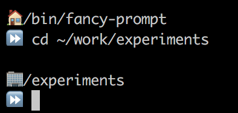
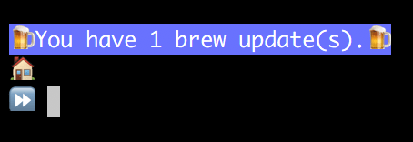
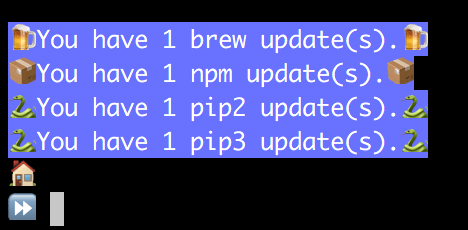

# Emojifying my Bash Prompt (and why you should too)

### 

**Warning: Dumb Stuff ahead**

This post contains some Dumb Stuff. If you take yourself too seriously, you may want to go find something a little less whimsical to read 😁.

**/warning**

Let's face it - development work can sometimes be hard on the psyche. When the unrealistic project deadlines approaching or the mountains of technical debt are looming, sometimes a small little pop of happiness can get you through the day. One of the things that keeps me sane is finding little ways to give myself small bursts of joy throughout the day. That's why, when I got a new laptop a few weeks ago, I decided to play around for a bit and find a fun way to solve some problems. How, do you ask? By emojifying my bash prompt.

# Why, oh why, would you do such a dumb thing?

Well, it all started with two different problems I'd noticed on my old laptop; minor little annoyances that were never worth taking the time to solve when everything else was working. I have a personal rule that, once I get a new laptop, I a few days to tweak and configure it, and then my setup is frozen for at least a few months. This helps me incrementally improve my setup, but prevents me from falling into an endless cycle of tweaking and testing and never getting any actual work done. I've seen developers get so lost in configuring their workstation that they're basically useless for a month, and I never want to be That Guy.

# A Very Fancy 🎩 Prompt

I've always had a thing for customizing my bash prompt; I never like the default. My last few workstations and all of my servers have had basically the same prompt:

```
hostname:/current/directory/here
 ->
```

This is, obviously, nothing special, but customizing my prompt was one of the first things I figured out how to do in Bash, and it still gives me a little burst of joy to remember the feeling of triumph when I finally got it to work how I wanted.

A couple of laptops later, I further improved this prompt to detect when I was in a subdirectory of my home directory, and replace my home path with `~`. Yet another little burst of joy when I see it.

And now, I was setting up a new laptop, and I'd gotten bored with my prompt. First, I thought about adding colors to it, but I quickly got bored with that - it wasn't any more exciting than a plain prompt. Then, while installing some packages using `brew`, I noticed the little beer emoji that pops up when you successfully install something, and I got to thinking - what if I played with Emoji? Lately, whenever I need to come up with a trivial demo or example, I lean towards doing something dumb with emoji, because it makes me laugh to treat something as dumb as emoji seriously (just look at the [output](https://github.com/ThatJoeMoore/byu-fancy-component) of a yeoman generator I created a while back to demonstrate some concepts to my team).

So, how to make my prompt Fancy?

Well, here's how:

[](https://res.cloudinary.com/practicaldev/image/fetch/s--h2UTOx-3--/c_limit,f_auto,fl_progressive,q_auto,w_880/https://thepracticaldev.s3.amazonaws.com/i/ttoe1ciyc0f8yni0e4zu.png)

I really didn't do much - I just replaced my `~` with a 🏠 and my little ASCII arrow with a ⏩. And yet, those little emoji make my day a bit brighter each time I see them.

You'll notice that I added another emoji - on this laptop, I'm keeping all of my work-related code under `~/work`, and so I decided to replace that path with an office building 🏢. Why? Well, why not? I might eventually add more such replacements, but I've already exhausted my self-enforced tweaking time. Perhaps I'll make `~/Documents` be 📝 and `/tmp` ⏳. I can definitely think of a few project directories that could be replaced by 💩. But that's a problem for another laptop.

So, my prompt setup isn't too complicated at this point:

```
fancyprompt() {
  echo

  where=$PWD
  home=$HOME
  work="$home/work"

  where="${where/$work/🏢 }"
  where="${where/$home/🏠 }"

  PS1='$where
⏩  '
}

PROMPT_COMMAND=fancyprompt
```

***But can it get fancier?***

Of course!

# Keeping me up-to-date

Once again, while installing all of my normal `brew` packages, I got to thinking about one of the problems I run into with Homebrew: outdated packages. I'll let so many updates accumulate without ever doing anything about them that, when I do need to update one, I end up with a `brew upgrade` running for half an hour, and I don't like that. So, could I find a fun way to solve this problem? Well, would I be here telling you about it if I hadn't? I don't think so!

The idea I settled on was to enhance my already-fancy prompt my making it tell me when there were brew updates to install:

[](https://res.cloudinary.com/practicaldev/image/fetch/s--4uPd6Rz5--/c_limit,f_auto,fl_progressive,q_auto,w_880/https://thepracticaldev.s3.amazonaws.com/i/y7yy6b9ij3xnijdi88za.png)

My initial implementation looked like this:

```
fancyprompt() {

  brew update
  outdated=`brew outdated --quiet | wc -l | tr -d '[:space:']`

  if [ "$outdated" -gt "0" ]; then
          echo -e "\x1B[104m\x1B[97m🍺 You have $outdated brew update(s).🍺  \x1B[0m"
  fi

  ...the rest of my prompt...
}
```

This worked...slowly. `brew update` is very slow, as it has to do a lot of work, including a fair amount of network IO. So, I moved the `brew update` into a cron job that ran daily:

```
PATH=/bin:/sbin:/usr/bin:/usr/sbin:/usr/local/sbin:/usr/local/bin

@daily brew update
```

(Who uses cron on their workstation? I do, apparently!)

Now, I could remove the `brew update` from my prompt. My prompt was then...less slow. As it turns out, `brew outdated` was pretty slow too, taking about 500ms to execute. Knowing exactly nothing about what's actually happening, I choose to cast the need to fire up a Ruby process to run brew as my red herring. Regardless, 500ms is way. too. slow. It felt like I was dying every time I typed a command and waited for my prompt to come back. So I had to get crazier.

I solved the speed problem by moving the `brew outdated` check to my cron job too, writing the output to a little file in `/tmp`:

```
@daily brew update && brew outdated --quiet | wc -l | tr -d '[:space:'] > /tmp/.brew-outdated
```

Now, I had a file that contained a count of my outdated brew packages. All I had to do was read it in my prompt function, which is very quick!

```
    outdated=0
    if [ -f "/tmp/.brew-outdated" ]; then
      outdated=`cat /tmp/.brew-outdated`
    fi
```

Hooray! Now, I get to happy little beer emoji and a nice message whenever I have brew updates.

***But can we go fancier?***

Never fear, dear reader, we can!

# Update ALL THE PACKAGES

Turns out, I have a bunch more package managers to keep up to date. I do some web dev, so of course, I have a bunch of npm packages, and I have to have pip installed, because a bunch of our deployment tooling is in Python. So, can I extend this to get updates for those?

But of course!

I ended up creating a few extra functions to handle this for me, and wrote a script to check for updates:

```
#!/bin/bash

check_brew() {
  echo checking brew
  brew update
  brew outdated --quiet | wc -l | tr -d '[:space:]' > /tmp/.brew-outdated
}

check_npm() {
  echo checking npm
  npm outdated --global | wc -l | tr -d '[:space:]' > /tmp/.npm-outdated
}

check_pip() {
  echo checking pip2
  pip2 list --outdated --format=legacy | wc -l | tr -d '[:space:]' > /tmp/.pip2-outdated
  echo checking pip3
  pip3 list --outdated --format=legacy | wc -l | tr -d '[:space:]' > /tmp/.pip3-outdated
}

check_brew
check_npm
check_pip
```

Each of these writes to a file named `/tmp/.(toolname)-outdated`. I then have some functions in my bash profile that, given a tool name and an emoji, will check the appropriate file and show a message.

[](https://res.cloudinary.com/practicaldev/image/fetch/s--VRlfITc7--/c_limit,f_auto,fl_progressive,q_auto,w_880/https://thepracticaldev.s3.amazonaws.com/i/zfh25hk24nnorcwfdwqs.png)

```
_count_updates() {
  type=$1
  f=/tmp/.$type-outdated
  upd=0
  if [ -f "$f" ]; then
    upd=`cat $f`
  fi
  echo $upd
}

_has_updates() {
  type=$1

  cnt=`_count_updates $type`
  if [ "$cnt" -gt "0" ]; then
          return 0
  fi
  return 1
}

_update_prompt() {
  type=$1
  icon=$2

  upd=`_count_updates $type`
  if [ "$upd" -gt 0 ]; then
    echo -e "\x1B[104m\x1B[97m$icon You have $upd $1 update(s).$icon \x1B[0m"
  fi
}

# configure my multi-line prompt
fancyprompt() {
  echo

  _update_prompt brew 🍺
  _update_prompt npm 📦
  _update_prompt pip2 🐍
  _update_prompt pip3 🐍

  where=$PWD
  home=$HOME
  work="$home/work"

  where="${where/$work/🏢 }"
  where="${where/$home/🏠 }"

  PS1='$where
⏩  '
}
```

I then decided that remembering the right commands to update everything was a pain, mostly because Pip is weird, so I created a function in my bash profile that knows how to do it for me:

```
update_all() {
  if _has_updates brew; then
          echo "Updating Brew"
          brew upgrade
  fi

  if _has_updates npm; then
          echo "Updating NPM"
          npm update -g
  fi

  if _has_updates pip2; then
          echo "Updating Pip2"
          pip2 list --outdated --format=freeze | cut -d = -f 1 | xargs -n1 pip2 install -U
          echo "Running pip update again, because that's necessary"
          pip2 list --outdated --format=freeze | cut -d = -f 1 | xargs -n1 pip2 install -U
  fi

  if _has_updates pip3; then
          echo "Updating Pip3"
          pip3 list --outdated --format=freeze | cut -d = -f 1 | xargs -n1 pip3 install -U
          echo "Running pip update again, because that's necessary"
          pip3 list --outdated --format=freeze | cut -d = -f 1 | xargs -n1 pip3 install -U
  fi

 echo "Finshed updating"
 ~/bin/fancy-prompt/outdated-packages.sh
}
```

I ended up having to run pip2 and pip3 run their updates twice, because it almost always would end up with more packages that needed updating.

***FANCIER!***

No. I spent about an hour a day for a week tweaking this, and I've exhausted my setup time. In the future, I could enhance this to make it easier to add more package managers, or to swap them out and make it run on Linux. That, however, is a job for my next laptop.

# Next Steps

If you want, you can download my scripts from (Github)[<https://github.com/ThatJoeMoore/fancy-prompt>]. I don't promise any kind of help or support, but I might make future tweaks.

I also suggest that you take a look at [bash-git-prompt](https://github.com/magicmonty/bash-git-prompt). It makes your git repos delightful 😍. I've even developed an emojified theme for it, because of course I did.

# Conclusions, and maybe some Deep Thoughts

I realize that this is a completely ridiculous first post here, but I do actually have a reason for writing such a ridiculous post.

***Do you regret spending so much time on something so trivial?***

Nope. Even after almost a month, seeing these little emoji makes me happy. Perhaps the shine will wear off eventually, but until then, this was totally worth it.

***But WHY!?!***

Because it makes me happy.

So now we get to the deep part of my post.

Being a developer can be stressful. Often, there's a lot riding on us, and it usually doesn't come with much glory or recognition beyond our immediate team members. You hand a client a beautiful program on a silver platter, and they complain that it's not platinum and diamond-encrusted. We work late hours, we lose sleep to keep apps running, we consume far too much pizza (stop trying to make sure that my project team can still be fed with two pizzas!).

We all need to find ways to take care of ourselves, physically, mentally, and emotionally. Some may take their lunch break to exercise. Some may get happiness from having a nice standing desk, or a collection of Lego Star Wars sets, or by having pictures of their kids on their desk. For me, it involves emojifying my bash prompt.

If you just want to be a developer, sure, go ahead, skip the little things. But I think most of us also want to be a Human Being, and that involves more than code. If my experience shows me anything, it's that the best code comes from those who take the time to be a well-rounded person, and who find ways to make themselves happy throughout the day. To mangle a line from Mary Poppins, "A spoonful of sugar helps the developer stay sane."

And that's why, sometimes, I spend too long playing with something ridiculous, like emojifying my prompt. I do more than that to keep myself happy, but these little things can help keep the happy going throughout the occasional long day. Find the dumb things that work for you, and do them.
