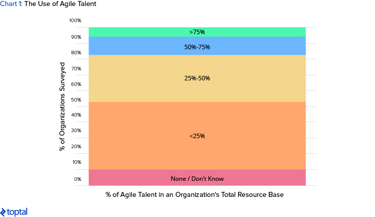

# How Agile Talent Can Transform Your Growth Mindset

Disruptive technology has created a wave of opportunity to innovate. But for leaders on the lookout for new engines of growth, are there more effective strategies? Learn how agile talent - with its history of success - can offer new growth mindsets for enterprises.

*This article was co-written with Michael Kearns, Vice President of Enterprise Strategy at Toptal.*

In the late 1990s, Campbell Soup’s [sought](http://www.reuters.com/article/idUSN0928240820070709) to follow other American consumer companies and enter the market for prepared soups in Russia and China. Round one was a failure. The biggest challenge turned out to be cultural: soup stock making is a source of pride in those countries. Campbell’s needed a new strategy. Instead of MBAs from Wharton and Harvard, Campbell’s executives [turned](http://online.wsj.com/ad/article/rbs_related9_3.html) to cultural anthropologists. Employed by Campbell, they analyzed how Russian and Chinese consumers prepare and eat soup, and the role soup making has within their cultures. While Campbell learned that their ready-to-eat soups weren’t likely to sell well, the anthropologists found that Chinese and Russians appeared more willing to use it as a convenient base for other cooking. As a result, Campbell rolled out “starter soups” designed to help consumers save time while still allowing them to add their own touches.

> In these situations, agile talent provides a unique benefit: the ability to quickly and cost efficiently gain access to the expertise necessary to solve a critical business problem or take advantage of a sudden opportunity.

Russia proved a tough market but their expansion into China was more successful. The cultural anthropologists played a crucial role in opening up this growth mindset, and the part they played fits a profile we call [“agile talent”](https://www.toptal.com/insights/agile-talent/welcome-to-the-talent-economy) - external experts working on a project or temporary basis alongside full-time employees. Traditional labels for these individuals include “freelancers” and “gigsters”, but we introduce the term agile talent because it conveys their expertise and flexibility.

This article looks at ways in which agile talent contributes to successful innovation and turnaround campaigns. It also provides recommendations to organizational leaders who are considering agile talent as an innovation resource.

## WHY AGILE TALENT MATTERS

Campbell’s effort to enter new markets is one of many examples of how agile talent has played a crucial role in efforts to innovate and turn around difficult situations. In a recent Toptal [global survey](https://www.toptal.com/insights/future-of-work/state-of-the-workforce-report), executives listed their top five reasons for increasing the use of agile talent:

The larger message of this assessment is clear: leaders recognize the potential for agile talent to provide their organizations with immediate access to experienced technical experts in a wide range of functional areas. In turn, these experts help deliver new products, services, and ways of working.

### THE ROLE OF AGILE TALENT IN THE WIDER WORKFORCE

On a broader scale, external experts and internal staff can combine to create a new entity, which we call the [“blended workforce”.](https://www.toptal.com/insights/distributed-teams/managing-the-blended-workforce) Agile and permanent employees are increasingly working side by side, or linked remotely, enabling a new way to resource the work of the organization when it is most needed. In these situations, agile talent provides a unique benefit: the ability to quickly and cost efficiently gain access to the expertise necessary to solve a critical business problem or take advantage of a sudden opportunity.

In our global survey, 76% of executives plan to increase their use of agile talent. These executives do not typically see agile talent as replacements for permanent employees; rather, they are viewed as augmenting the skills of the team or organization, and adding a new tier of expertise and experience.

And our survey data confirms the growing strength of this workforce innovation in getting work done. As the chart below points out, organizations range in their use of agile talent – from little or nothing to more than 75% of its total resource base. However, the key takeaway is that 91% of the companies that we surveyed use agile talent.

Longer term, however, Accenture [predicted](https://www.accenture.com/us-en/blogs/blogs-liquid-workforce-for-competitive-advantage) in 2016 that at least one mega-company would have no full-time employees outside of the C-suite within 10 years. Evidence for this prediction is already starting to appear: [Microsoft](https://techcrunch.com/2015/06/13/in-the-future-employees-wont-exist/) has almost two-thirds as many agile talents as full-time employees. So while agile talent currently plays a strong contributory role in supporting enterprise growth, it could soon take the reins as one of the primary drivers. As such, leaders need to understand the value of agile talent and how best to use it.

### CHOOSE THE RIGHT TIME TO USE AGILE TALENT

The Campbell’s Soup case offers a good example of how agile talent provided insight at a crucial time. By using agile talent, the organization was able to obtain and deploy an area of deep functional skill that was crucial to Campbell’s, but only for a very specific situation and a specific point in time. This is a prime reason for the growth of agile talent. It makes sense for organizations to own the areas of expertise on which they consistently and most strategically depend. But it makes little sense for organizations to invest significantly in capabilities that are less frequently relevant – and absolute sense when they are needed.

## THE ADDED VALUE THAT AGILE TALENT BRINGS

Beyond the obvious importance of agile talent as a fundamental innovation in its own right, we see additional areas where it has clearly distinguished itself as a true catalyst for innovation and growth. We’ve highlighted three areas below:

### 1) COPING WITH EARLY-STAGE GROWTH CHALLENGES

Often, early-stage companies lack the reputational pedigree to hire the talent they really want. As a result, initial growth from a market fit product or service can often outdo the organization’s operational capability and ultimately lead to burnout. Agile talent can help. It can be used to ramp up internal operations and provide an outlet to better cope with the high demands associated with early-stage growth. Udacity - an online education platform - provides a good example of this. Its early success created a problem. Udacity had promised real feedback - not from bots - to students on their work but they lacked the internal staff to deliver it. Providing feedback was crucial to its success so they turned to agile talent. Instead of taking on the lengthy process of finding and recruiting permanent staff, they rapidly employed agile talent and immediately trained them on how to provide student support. As a result, Udacity was able to offer just-in-time real feedback to the students. The alternative - telling students to “sit tight and wait” - would have cratered the company.

### 2) FLASH TEAMS

[Described](https://engineering.stanford.edu/news/melissa-valentine-re-inventing-way-we-work) by Stanford engineering professor Melissa Valentine and her colleagues as “skilled professionals who have probably never met before and may work on different continents, but who can turn a napkin sketch into a product within days or weeks”, flash teams are a workforce innovation. If the right management tools, culture, and communications are in place, then experts from all over the world can collaborate on new ideas, rapidly. The very basis of agile talent is the foundational reason why these flash teams can exist, and when used effectively, can bring products and ideas to market faster than ever.

### 3) USE AGILE TALENT AS AN INNOVATION LAB

Doing new things in new ways is the traditional focus of innovation. Old-guard companies like Procter & Gamble and Shell, and newer enterprises like Google, connect agile talent and internal leaders to map the future of their businesses and new market opportunities. Call these innovation labs. By using a mix of expertise and experience, these organizations are reducing the risk of missing opportunities to expand and grow, while also avoiding the cost of hiring all the experts as full-time employees. Sid Pinney, a long time tech observer, and Toptal executive, [highlights](https://www.toptal.com/insights/innovation/building-teams-for-rapid-innovation) this and the important role that agile talent plays in the innovation lab, and how it can serve as a powerful time and cost saving tool for core executives.

## AGILE TALENT ALLOWS INNOVATION TO SUCCEED

We opened this article with a story that demonstrated how anthropologists helped Campbell’s Soup to build a business in China. We’ll close with another example of anthropological agile talent offered by Anthony Banbury, Former Assistant Secretary-General for Field Support of the United Nations, as he [recounted](https://www.nytimes.com/2016/03/20/opinion/sunday/i-love-the-un-but-it-is-failing.html) the challenges facing the UN in dealing with the Ebola epidemic:

> “During the Ebola epidemic, I was desperate to get qualified people on the ground. That’s what I did in Accra when I hired an anthropologist as an independent contractor. She turned out to be worth her weight in gold. Unsafe burial practices were responsible for about half of new Ebola cases in some areas. We had to understand these traditions before we could persuade people to change them.”

This example makes an articulate case for the potential of agile talent as a source and support for innovation - whatever the ultimate purpose may be. Agile talent provides insight into the best practice of their profession and a means of learning from the unique experience of top industry experts. As a partner, these experts are able to provide flexibility, high-speed deployment, and access to skills not available within a client organization. But in addition to providing additional support, agile talent can help organizations stay in touch with the pulse of an industry and its trends, helping to open up new avenues of growth.
