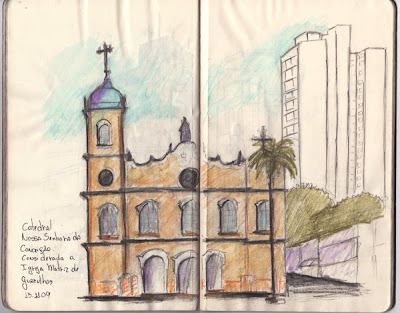

# Um retrato por uma moeda

*Igreja Matriz de Guarulhos- Catedral Nossa Senhora da Conceição, na Praça Teresa Cristina, Gurulhos. Ao lado direito, o etílico "calçadão" que é freqüentado pelos alunos que "cabulam aula na faculdade". (**bons tempos**)*  
  
  
Se o Sketchcrawl é a maratona do desenho, há dois finais de semana eu realizei sozinho uma meia maratona. O domingo amanheceu chovendo. Com os primeiros raios do dia houve também as primeiras trovoadas. Este clima preguiçoso permaneceu assim até por volta das dez horas da manhã quando o tempo mudou radicalmente. Acho que o deus da chuva saiu para passear com a sua família e me deu um pouco de luz.  
  
Foi então quando estive a tarde na Praça Teresa Cristina para fazer alguns desenhos de observação. O centro de Guarulhos é basicamente a rua Dom Pedro que não é muito estensa terminando na porta de uma igreja, a chamada Igreja Matriz. Na outra extremidade é o término da avenida Monteiro Lobato, em um local conhecido como ponto do relógio. Alí existe um ponto de ônibus que é muito cheio durante a semana e bem no centro de uma bifurcação em "te" há uma ilhota com um relógio bem grande, porém muito feio. Hoja a rua Dom Pedro foi transformada em um grande calçadão e que no domigo atarde fica praticamente deserto.  
  
Neste domingo haviam algumas pessoas de passagem, uma mulher mal vestida que se não fosse prostituita não sei o que alí fazia, dois senhores que para mim eram os empresários da garota e um morador de rua. Em certo momento vieram os empresários falar com a garota com um terceiro senhor, aparentemente falava em espanhol. Não sei o que conversaram e sairam de cena. Eu estava ali perto sentado, em frente a loja Riachuelo desenhando a Catedral Nossa senhora da Conceição, a dita Igreja Matriz.  
  
  
É interessante ver a interação que pode haver com os moradores de rua. Estava sentado no calçadão da rua Dom Pedro desenhando, quando se aproximou um senhor que era morador de rua. Ele veio na minha direçao, passou perto e ficou observando o que eu estava ali fazendo com ar curioso. Quando olhei ele desviou a atenção fazendo parecer que estava alí ao acaso. Há vários minutos eu havia percebido o interesse dele e até separei uma moeda caso pedisse ajuda.  
  
Planejei fazer diferente. Se ele me pedisse dinheiro eu diria que não, mas compraria uma pose para um retrato. Penso que arrumar um trabalho seja mais útil que dar esmola. Seria uma troca justa, eu teria um retrato e ele um dinheiro. Na empresa que trabalho eles fazem o mesmo, mas eu que saio com o dinheiro e eles com o fruto do meu trabalho. Infelizmente ele não pediu e quando terminei o desenho o senhor já estava indo ao longe no calçadão. Perdi um retrato mas não a boa intenção.  
  
Depois ainda fui até o Pincanço desenhar a enorme e famosa caixa d'agua e na Timóteo Penteado parei em frente a melhor cantinas da cidade de Guarulhos a Giovanni.  
  
O artista não deve ser egoista guardando riquesas, deve doar a sua maior riquesa. Não deve se fechar ao mundo, deve se expandir com o mundo. Há tantas pessoas simples morando nas ruas mas que podem ter conhecimento riquissimo para o nosso trabalho. A inspiração não tem data e nem marca local para vir. Mas quando vem descobrimos que os seus caminhos são os mais surpreendentes. A arte é um meio que impulsiona o artista a verdadeira igualdade, liberdade e fraternidade, ai me recordo de uma frase e faça então uma rogativa, "Senhor, não sou digno que entreis a minha morada, mais direi uma só palavra e serei salvo"...
