# The engineer’s guide to not making your app look awful

pick a colour, any colour

A problem that a lot of independent app developers face is that they aren’t graphic designers. I work with an innovation team where I have access to great designers. I also teach app development in college and make apps in my spare time, where I mainly only have access to me.

So how do I, and others like me, make apps that don’t look awful? How do I teach my students, as an engineer, how to make beautiful apps?

The answer is that design can be learned, just like coding. I may never be Michaelangelo or Julie Mehretu. But I’ve picked up enough tips along the way to make a passable attempt at not producing terrible looking apps.

Here’s a few things to think about. But bear in mind that design is incredibly subjective. Some may think this is amazing:

[source](https://en.wikipedia.org/wiki/Girl_with_a_Pearl_Earring)

while some will prefer something like this:

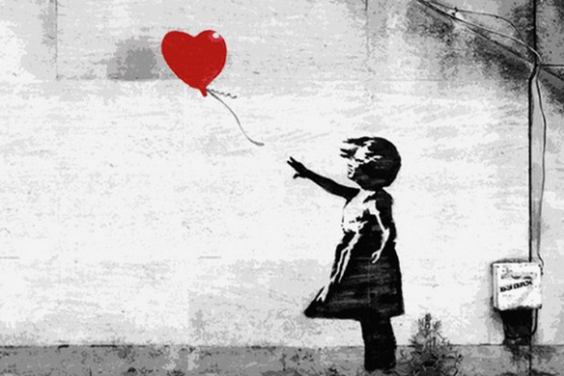

[Source](http://www.upworthy.com/banksy-has-updated-his-famous-the-girl-with-the-balloon-artwork-to-stand-with-syria-5)

Of course, then there’s art like this…

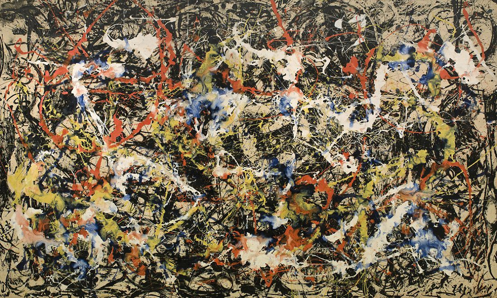

[Source](http://www.jackson-pollock.org/)

Keeping that in mind…

#### **Don’t just use the default shapes Xcode and Android Studio give you.**

Don’t just use the shapes and colors that come out of the box. Here’s what I could do for a recipe app, and it looks bad:

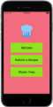

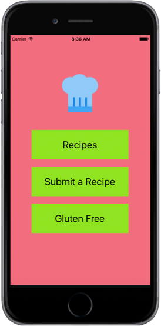

the hat icon from icons8.com is the best bit

This is from one of the Jamie Oliver apps. It looks better:

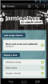

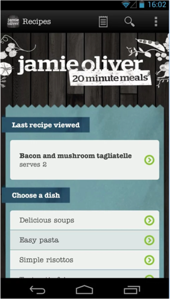

And one more that I can do instead, that’s more… delicious?

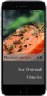

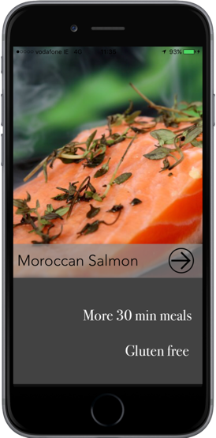

You can almost taste the food, and that’s why the user would be using the app, to find something nice to make for dinner.

As another example, here’s how I could show a list of buttons to select a city:

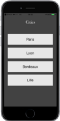

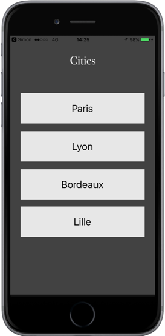

But this is how I actually built a screen like that in my [Simon’s Green Army](https://itunes.apple.com/ie/app/simons-green-army/id1114948826) app:

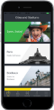

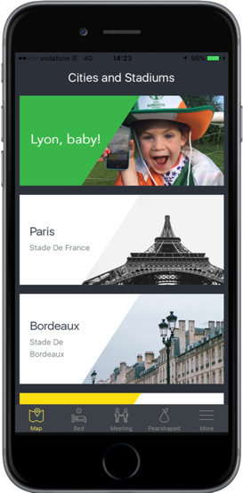

The point is that we can use images to make objects like buttons more appealing and intuitive.

Most of the images I used in these examples came from [Pexels.com](https://www.pexels.com/). You can get free images from there that require no accreditation. This is quite handy if you’re an indy-developer on a budget.

Another screen in that last app is the “When it all goes a little pearshaped” screen. These are basically emergency contact numbers:

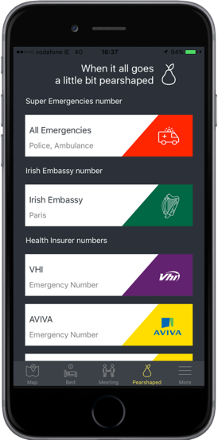

This is a UITableView. It’s a basic component of most apps to show lists of data. I could have just used basic text for the phone details. But a little work to create images makes it look so much better.

#### **Try learn some image editing skills.**

A friend of mine [Dave Maxwell](https://medium.com/u/3ba0687689a4) is in my phone’s contacts as Photoshop Ninja. I’m more like Photoshop Toddler, picking up pieces here and there to help me edit images for use in my apps. Tools like Photoshop and Sketch are fantastic to use if you have budget for the licenses. But they can be confusing for novices. Just as you probably learned to code, or a new language such as [Kotlin](https://kotlinlang.org/), start off small and learn gradually.

When Dave showed me how to cut circles out of images, most of my apps and websites suddenly had lots of circles! Which leads to my next tip:

#### **Ask for help.**

It sounds obvious, but don’t be afraid to ask for design help. My app development publication [appandbiscuits.com](https://appsandbiscuits.com/) is my iOS and Android tutorials to help my students. I recently asked another friend, [Megan Kelly](https://medium.com/u/ce68ee8aabc1), to join the site to post about UX &UI topics, as I know I’m not the expert.

I may ask one of my engineering colleagues advice on how to connect an AWS Lambda function to an RDS database. I’d be as happy asking a graphic designer colleague about the color choices in an app.

Speaking of which …

#### **Use color palette tools.**

There are plenty of sites online that can offer advice on which colors to put with other colors. Look at [https://color.adobe.com](https://color.adobe.com/):

[source](https://color.adobe.com/)

or [Material Palette](https://www.materialpalette.com/):

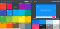

[source](https://www.materialpalette.com/)

A lot of these sites are free and simple to use.

And you should always …

#### **Keep things simple.**

It’s seems a cliché but it’s completely true . keep your designs clear and simple. Regardless of what you think of the main Snapchat app design, the login screen is simple and beautiful:

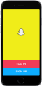

source: Snapchat iOS app screenshot

It leaves no doubt about what the user can do on that screen. And it still manages to look aesthetically pleasing.

Here’s our recipe app again on the detail page for an amazing beef curry:

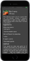

All the info the user needs is there , the ingredients and the method. But it’s too crowded and too hard to read.

Try to think about how the user will be using the app. In this instance they will most likely have it open on the kitchen counter as they prepare the food. They are chopping and slicing, and throwing ingredients into the pan as they peer over at the phone. They may not want to touch it in case they get sauce on the screen.

Make it simpler and clearer:

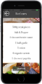

With a separate view for the method, complete with clearly defined steps:

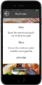

This is not rocket science, and does not require a Masters in Graphic Design. It only requires the awareness that leaving space around content to make sure it’s easily readable is a good design practice.

#### **Use a mixture of icons and text for action buttons.**

Here’s a map screen. The icons on the map show important items of interest like train stations, pubs, fast-food restaurants and more. To filter or to search for these items, I’m using buttons with icons instead of text:

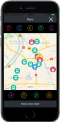

The buttons are pretty much self-explanatory. I’ve also included a TextView at the bottom of the screen to add some extra information when the user hits a button.

The exit button is a simple X icon, not a button saying “exit” or “close” . This is something trivial to implement but adds a nice touch.

I get most of my icons from [icons8.com](https://icons8.com/). They have thousands of different icons which can be used for free if you credit their usage. Finding resources like this is essential to making your apps look nice and they cut down on the work. There’s no way I’m going to be able to create my own vector icons. It’s just not happening!

One final piece of advice:

#### **Look at what others are doing.**

When I build something that I haven’t built before, like an Alexa Skill, I research into how others have built them.

What coding design patterns are best practice? What libraries or open-source sdks are available? What tutorials have been written.

The design side is just the same. There are many online resources where you can search and examine others’ great design work.

It’s not copying or plagiarizing. It’s getting inspiration and improving your understanding of what good design can look like. [Dribbble](https://dribbble.com/) is a popular site where designers post their work for others to see:

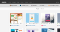

[source](https://dribbble.com/)

I often browse Dribbble, looking to see what the latest trends are, or to help me when I’m designing a new app or feature.

Even if you have no experience in design, you can make your apps look nicer. Spend time considering the design. Consider the colors, the images, the layout and the content. And learn more about design skills and practices.

It will never be wasted time, and you and your users will be happier because of it.
