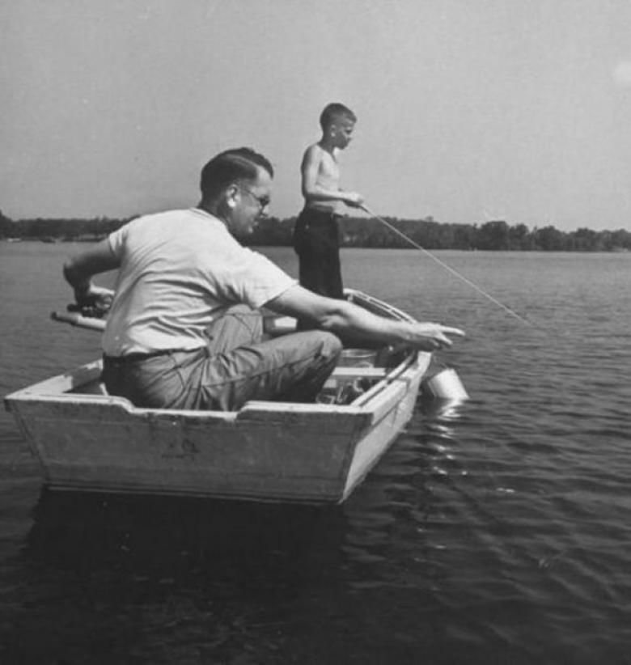
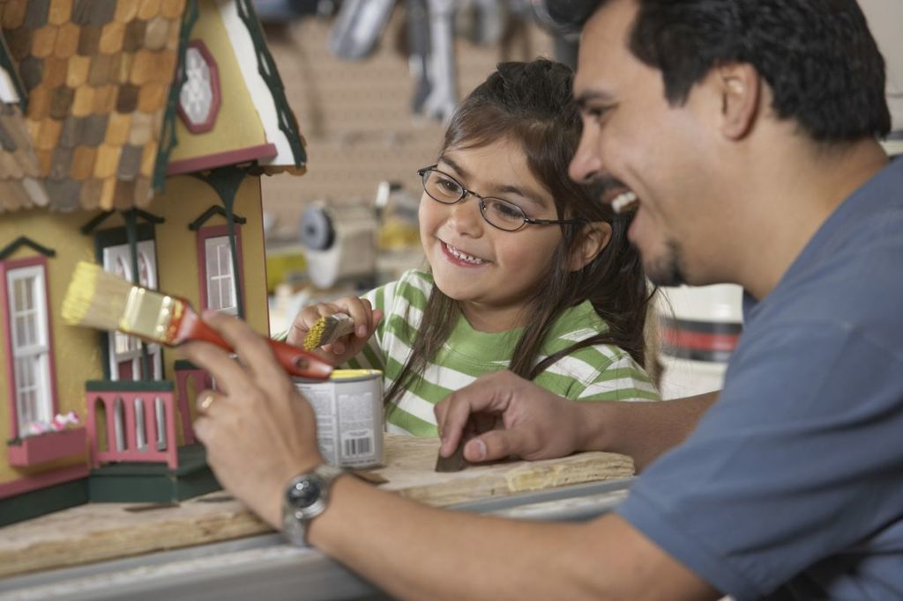

# Da importância de construir algo com seus filhos

Contato, conversas, aprendizados. É muito bonito e bem importante este tipo de experiência, né?

Que bom. [Os pais estão passando mais tempo com seus filhos](http://onlinelibrary.wiley.com/doi/10.1111/jomf.12170/full).

Em média, na década de 1950, um pai padrão passava 16 minutos por dia em atividades relacionadas diretamente com a sua cria. Em 2012, esse número foi para 59 minutos por dia. Boa parte desse tempo adicional está sendo empregado em atividades de cuidado, como dar banho, dar comida ou botar pra dormir.

Mas boa parte também desse tempo é usado para brincar: uma das áreas que os pais sempre souberam aproveitar.

Os pais sempre foram retradados chegando do trabalho e brincando de cavalinho ou de lutinha. Crianças se esgoelando de rir com os seus pais rolando pelo chão fazendo movimentos e sons de monstros e animais dispostos a devorar a barriginha dessa criança são as cenas mais comuns do imaginário do pai.

Embora pareça uma atividade tola e sem grandes atributos psicológicos, a verdade é que o beneficio para uma criança ao brincar desse jeito é enorme. As crianças aprendem comportamentos morais e éticos (não pode bater em tal lugar, ou deve esperar o outro se recuperar... não pode bater com certos objetos, nem ultrapassar certas regras), aprende um pouco de inteligência emocional (a pensar como o outro... onde ele vai me atacar? Qual o seu próximo movimento?), libera fatores neutrotróficos importantes para o desenvolvimento cognitivo, que estimulam a memória, o pensamento lógico e a linguagem da criança. Além de tudo, as brincadeiras promovem a saúde física, a habilidade, a coordenação e a flexibilidade da criança (e do pai), e também trazem mais leveza e alegria ao lar.

E as brincadeiras que não são tão físicas? Que tal um quebra-cabeça ou umas peças de Lego? Um castelo de papelão?

Brincar de lutinha definitivamente pode se muito divertido. Mas criar e construir trazem um benefício incalculável.

Quando o pai senta para construir um modelo de pecinhas junto com sua filha, quando senta para desenhar num caderno com o seu filho, ele está mandando uma série de mensagens muito poderosas. Em primeiro lugar está dizendo: você é importante. Eu sou um adulto, ocupado, com coisas para resolver, mas meu tempo neste instante é seu, é nosso. Vamos nos divertir. Suas coisas importam e me interessam.

A intimidade que cria o fato de duas pessoas estarem sentadas na mesma mesa colaborando num projeto comum é enorme (nem estou falando apenas de pais e filhos). Com a atividade motora e a lógica espacial funcionando a todo vapor, as conversas fluem soltas e livres, como acontecia, por exemplo, quando as mulheres indígenas de tribos como as Cheyennes nos Estados unidos, sentavam para tecer e conversar, apoiando uma a outra com as questões do dia a dia, ou como acontece hoje no Reino Unido, onde uma das atividades bem-sucedidas para a reabilitação de detentos é a elaboração de uma colcha de retalhos, feita a várias mãos entre detentos que não se conhecem, para treinar a socialização com pessoas desconhecidas depois que sair da cadeia.

Nesse sentido, tanto faz o resultado final. A funcionalidade do brinquedo de papelão ou a beleza do projeto são irrelevantes, pois o verdadeiro valor está no caminho e não no fim.

Durante a execução de um projeto, seja a criação de um telefone com corda e copo plástico ou um trem de sucata, a criança aprende e imita não só as habilidades físicas, mas a solução de problemas. Aprende não só as questões lógicas de um trem ou de um avião, mas aprende o valor do planejamento. A criança aprende a se virar com o que tem, a usar de novo aquilo que ainda serve, a ter uma nova visão sobre o que outrora seria jogado no lixo.

Quando construímos um castelo, uma ponte ou um circuito, construímos bem mais do que isso. O papelão vai se desfazer, o giz vai apagar e os bloquinhos de construção uma hora voltam para a gaveta, mas a paciência, a dedicação e o trabalho em conjunto deixaram memórias indeléveis, eternas.

A construção de brinquedos ou de projetos apresenta uma oportunidade ímpar para ensinar muita coisa relevante para um pequeno. Valores gigantes como se permitir errar e tentar de novo, aceitar as falhas e as limitações e até o valor de aprender que uma expectativa muito alta é um precipício para a frustração. Aprende valores de cooperação e companheirismo emprestando a tesoura ou compartilhando a tinta guache. Pratica a criatividade, livre e solta, usando um botão como olho ou um cabide como volante a criança se obriga à releitura dos objetos, das possibilidades.

Aprende que feito é melhor que perfeito.

Um pai sensível a essa experiência pode se permitir participar menos da construção e das ideias e apenas se deixar estar, intervindo pontualmente, sob demanda. Um pai que aproveita esta oportunidade troca um “assim não, filho” por um “tenta aí, pra ver no que dá”. Um pai que estimula e propõe é melhor que um que dirige e dispõe.

A criança está pronta e doidinha pra começar. E você?

A lição também cabe ao pai. Muitos pais afirmam não ter as habilidades... ora. E a criança as têm? Não interessa o resultado, lembra? Para fazer um belo de um projeto, dizia um tal de Thomas Edison, você precisa de uma boa imaginação e uma pilha de lixo. Pegue o que tiver e faça o que puder, do mesmo jeito que você está fazendo com a sua paternidade. Sem grandes expectativas nem futuros mirabolantes, apenas construa, uma coisinha de cada vez.

### Mecenas: [Natura](http://rede.natura.net/espaco/p/presente-natura-papai-e-bebe-exclusivo/u/A-pid79429?utm_source=papo-de-homem&utm_medium=ros&utm_campaign=salve-tribal-ativacao_dia-dos-pais&utm_content=display_1707_ciclo-12_impressoes_papai-e-bebe_compre-agora_avulso_oferecimento_769x350_2nd_audience_papo-de-homem_cross)

*Natura Homem acredita que ser pai é querer cuidar, manter u**ma paternidade lúcida e seguir com uma vida saudável e construtiva, ajudando a criar os filhos e ajudando também os filhos a criar, sem colocar ainda mais pressão sobre os nossos ombros.*

*As nossas verdades, os nossos ritmos, os nossos jeitos de ser e estar no mundo. Seja homem? Seja você. Por inteiro. Natura Homem celebra todas as maneiras de ser homem.*

---

*publicado em 06 de Setembro de 2017, 16:35*
