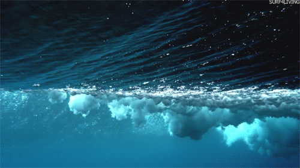

# Os subterfúgios de uma garota triste no bar

O que pode sair de bom numa madrugada melancólica em um balcão de bar?

“Uma última velha canção”, anuncia do palco, antes de tomar mais dose de uísque “para melhorar a voz”, como costuma dizer. Já vi esse show tantas vezes que até decorei as falas.

No bar, há apenas meia dúzia de bêbados espalhados pelo balcão, mas nenhum deles se importa muito com o que está tocando. Aqui, a música é pano de fundo e os copos é que são a atração principal.

E eles bebem como se buscassem uma última gota de esperança no fundo da garrafa; como se o álcool pudesse matar tudo que insiste em não morrer; como se os porres e a ressaca lhes trouxessem algum tipo de salvação. Acontece que não há esperança sobreviva às madrugadas de terça-feira e aos balcões nos bares. Talvez por isso que eu não consiga parar de olhar para essa meia dúzia de rostos na tentativa de decifrar qual foi a batalha perdida que os trouxe até aqui; pensando nos anjos e demônios que, vez por outra, escapam de seus olhos. Basta uma piscada para que tudo mude.

As vozes, o som alto e maldita luz do único holofote que ilumina o palco fazem com que eu comece a me sentir enjoada; sinto que preciso vomitar – dessa vez não é culpa da bebida, talvez seja apenas porque os meus olhos não estão acostumados com a verdadeira miséria. Talvez porque eu também carregue essas coisas em mim.

Chego ao banheiro e jogo uma água na cara. Vejo meu rosto pálido e cheio de olheiras refletido no espelho. Pareço mais triste do que realmente sou. E deixo que saia pela boca tudo o que tem pra sair. O enjôo, no entanto, volta acompanhado por um gosto amargo. Não há mais o que colocar pra fora e o pequeno espaço da cabine é desesperador. Mas eu não quero voltar. Permaneço, então, de cabeça baixa, sentada no assento da privada, esperando que o mundo pare de girar tão rápido.

E, de repente, tudo passa. Estou na praia ouvindo o som das ondas arrebentando na areia. Aquela mesma praia em que já estive tantas outras vezes. Sigo em direção ao mar, que é raso demais para mergulhar. Por isso, vou fundo.

Mais fundo.

Bem mais fundo. As ondas, cada vez maiores, acertam-me impiedosamente – é quase impossível ficar com a cabeça fora d’água, mas eu não posso voltar. Eu não quero voltar.

“Talvez eu morra aqui.”

Anjos e demônios, paraíso e inferno…

“Afogada por essa vontade de ir além do que deveria. Eu vou morrer aqui.”

E mais uma onda me derruba.

*“Eu tô morrendo aqui.”*

Não há como fugir.

Acordo no chão do banheiro. Ainda. No chão. De novo.

Me levanto e jogo mais um pouco de água na cara. “Quanto tempo passei apagada?”.

Encaro a imagem de mim refletida no espelho, os anjos e os demônios, o paraíso e o inferno. Tudo continua exatamente no mesmo lugar.

Do lado de fora, todos seguem na guerra, tendo seus copos como únicos aliados. Seguem em espera e o tempo pode virar a qualquer momento, basta uma piscada para que alguém se sinta humilhado o suficiente para sacar uma faca. Meus olhos continuam desacostumados com a verdadeira miséria e ainda buscam uma dose de esperança, de salvação.

Quando volto pro salão do bar, a velha canção já acabou. Uns três bêbados, espantados com o silêncio, começam a cambalear em direção ao caixa, enquanto as garçons e as garçonetes passam, entediados, recolhendo os restos que sobraram da noite. Antes de as portas baixarem, ainda existe a chance da virada de tempo: uma briga, uma cena exagerada de ciúmes. Gritos e choros. Catarse coletiva. É por isso que todos esperam, mas nada acontece.

Nada acontece.

Eu fico em pé vendo-o caminhar para fora do palco e, por um instante, a luz do único holofote da casa faz com que eu perceba que existe algo terrível nos olhos dele. Algo que eu não havia notado antes. Algo que talvez já não pudesse mais carregar nos meus.

Vou embora antes que ele chegue até mim, imaginando que às 4h30 da manhã ninguém vai notar mais um lugar desocupado dentro do bar.

Já dentro do táxi, o motorista sintoniza numa rádio qualquer: “Sometimes I feel like a motherless child”, na inconfundível voz de Richie Havens.

“A última das velhas canções. No final da noite, é isso que importa.”

---

*publicado em 08 de Setembro de 2017, 00:00*
