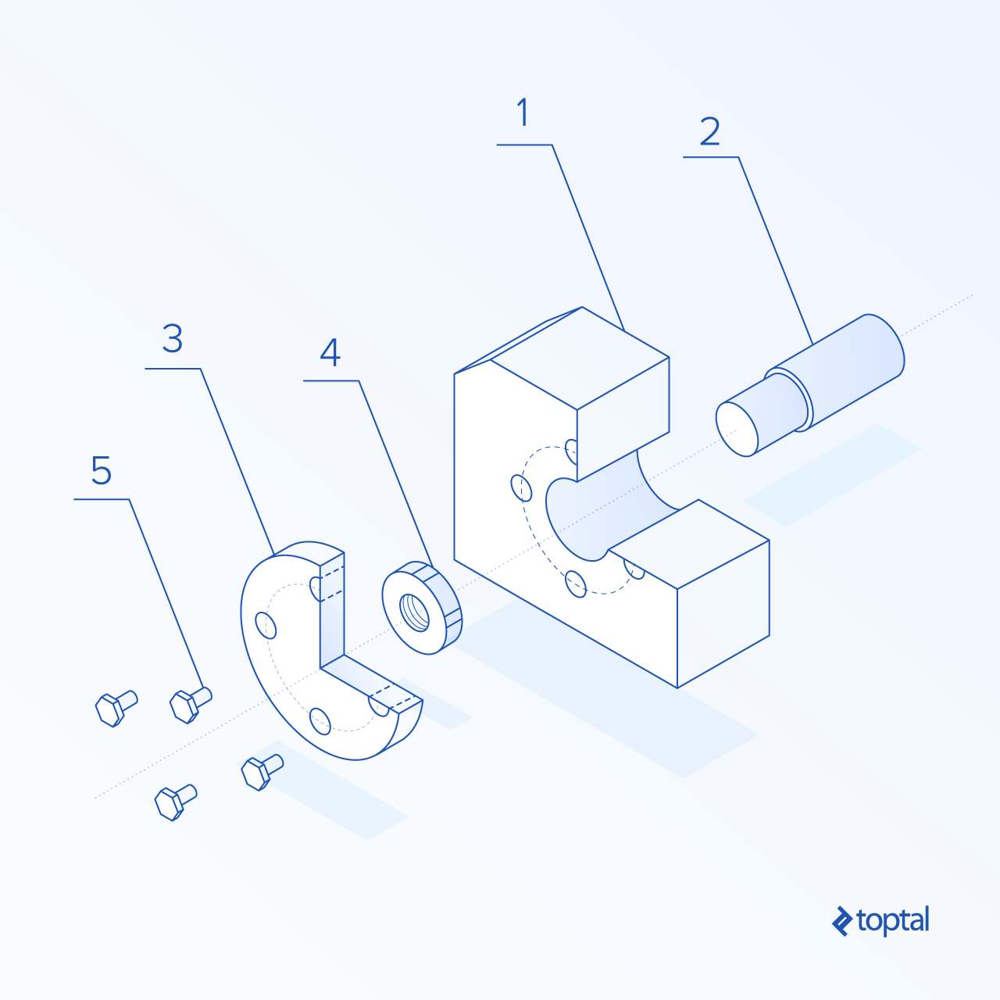
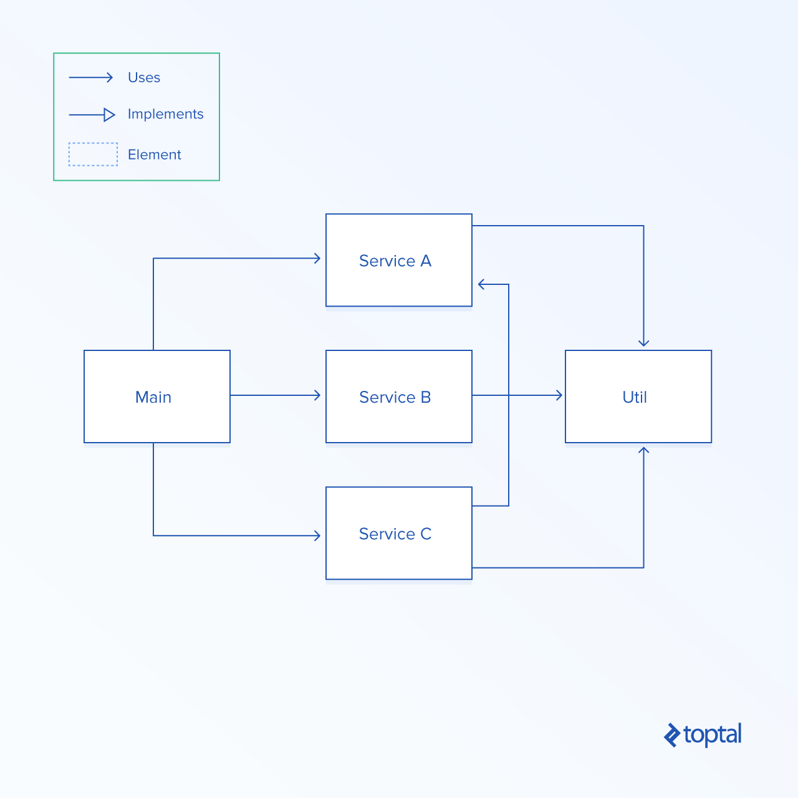
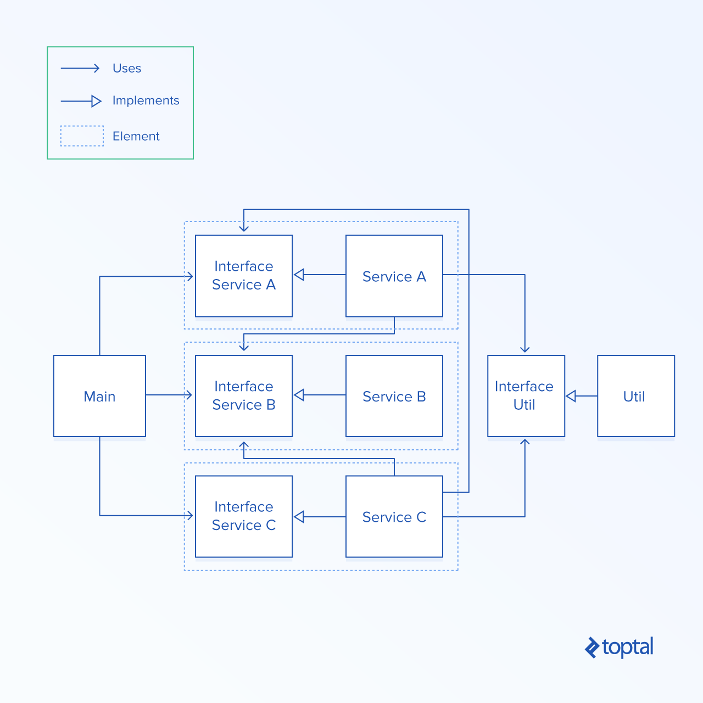
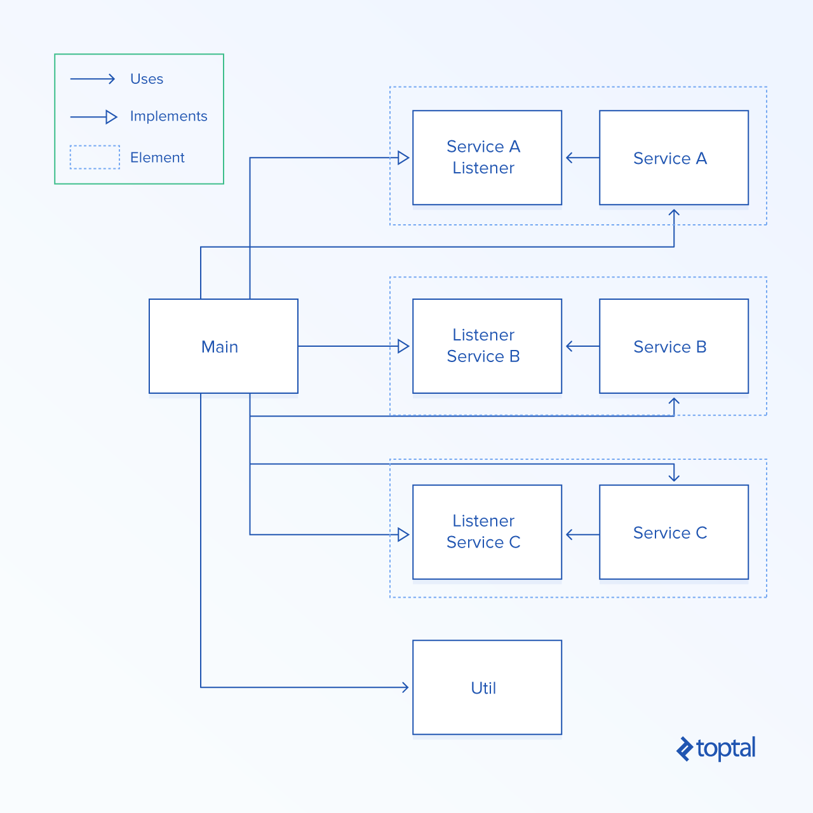
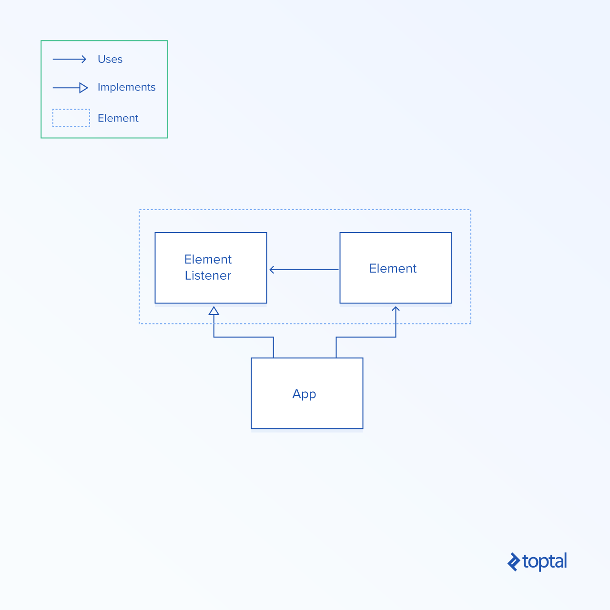
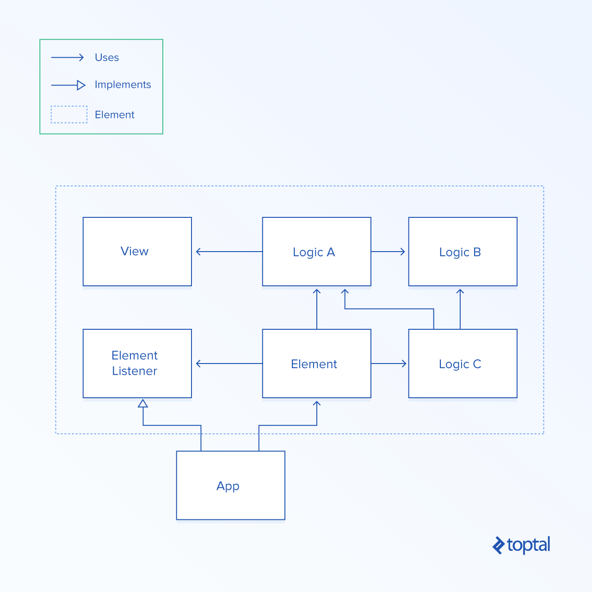

# Creating Truly Modular Code with No Dependencies

[View all articles](https://www.toptal.com/developers/blog)

Developing software is great, but… I think we can all agree it can be a bit of an emotional rollercoaster. At the beginning, everything is great. You add new features one after another in a matters of days if not hours. You’re on a roll!

Fast forward a few months, and your development speed decreases. Is it because you are not working as hard as before? Not really. Let’s fast forward a few more months, and your development speed drops further. Working on this project is not fun anymore and has become a drag.


It gets worse. You start discovering multiple bugs in your application. Often, solving one bug creates two new ones. At this point, you can start singing:

> 99 little bugs in the code.  
> 99 little bugs.  
> Take one down, patch it around,
>
> …127 little bugs in the code.

How do you feel about working on this project now? If you are like me, you probably start losing your motivation. It’s just a pain to develop this application, since every change to existing code can have unpredictable consequences.

This experience is common in the software world and can explain why so many programmers want to throw their source code away and rewrite everything.

## Reasons Why Software Development Slows Down over Time

So what’s the reason for this problem?

The main cause is rising complexity. From my experience the biggest contributor to overall complexity is the fact that, in the vast majority of software projects, everything is connected. Because of the dependencies that each class has, if you change some code in the class that send emails, your users suddenly can’t register. Why is that? Because your registration code depends on the code that sends emails. Now you can’t change anything without introducing bugs. It’s simply not possible to trace all dependencies.

So there you have it; the real cause of our problems is raising complexity coming from all the dependencies that our code has.

## Big Ball of Mud and How to Reduce It

Funny thing is, this issue has been known for years now. It’s a common anti-pattern called the “big ball of mud.” I’ve seen that type of architecture in almost all projects I worked on over the years in multiple different companies.

So what is this anti-pattern exactly? Simply speaking, you get a big ball of mud when each element has a dependency with other elements. Below, you can see a graph of the dependencies from well-known open-source project Apache Hadoop. In order to visualize the big ball of mud (or rather, the big ball of yarn), you draw a circle and place classes from the project evenly on it. Just draw a line between each pair of classes that depend on each other. Now you can see the source of your problems.


Apache Hadoop's "big ball of mud"

## A Solution with Modular Code

So I asked myself a question: Would it be possible to reduce the complexity and still have fun like at the beginning of the project? Truth be told, you can’t eliminate *all* of the complexity. If you want to add new features, you will always have to raise the code complexity. Nevertheless, complexity can be moved and separated.

### How Other Industries Are Solving This Problem

Think about the mechanical industry. When some small mechanical shop is creating machines, they buy a set of standard elements, create a few custom ones, and put them together. They can make those components completely separately and assemble everything at the end, making just a few tweaks. How is this possible? They know how each element will fit together by set industry standards like bolts sizes, and up-front decisions like the size of mounting holes and the distance between them.



Each element in the assembly above can be provided by a separate company that has no knowledge whatsoever about the final product or its other pieces. As long as each modular element is manufactured according to specifications, you will be able to create the final device as planned.

Can we replicate that in the software industry?

Sure we can! By using interfaces and inversion of control principle; the best part is the fact that this approach can be used in any object-oriented language: Java, C#, Swift, TypeScript, JavaScript, PHP—the list goes on and on. You don’t need any fancy framework to apply this method. You just need to stick to a few simple rules and stay disciplined.

## Inversion of Control Is Your Friend

When I first heard about inversion of control, I immediately realized that I had found a solution. It’s a concept of taking existing dependencies and inverting them by using interfaces. Interfaces are simple declarations of methods. They don’t provide any concrete implementation. As a result, they can be used as an agreement between two elements on how to connect them. They can be used as a modular connectors, if you will. As long as one element provides the interface and another element provides the implementation for it, they can work together without knowing anything about each other. It’s brilliant.

Let’s see on a simple example how can we decouple our system to create modular code. The diagrams below have been implemented as simple Java applications. You can find them on this [GitHub repository](https://github.com/konrad-g/architectures).

### Problem

Let’s assume that we have a very simple application consisting only of a `Main` class, three services, and a single `Util` class. Those elements depend on each other in multiple ways. Below, you can see an implementation using the “big ball of mud” approach. Classes simply call each other. They are tightly coupled, and you can’t simply take out one element without touching others. Applications created using this style allow you to initially grow rapidly. I believe this style is appropriate for proof-of-concept projects since you can play around with things easily. Nevertheless, it’s not appropriate for production-ready solutions because even maintenance can be dangerous and any single change can create unpredictable bugs. The diagram below shows this big ball of mud architecture.



### Why Dependency Injection Got It All Wrong

In a search for a better approach, we can use a technique called dependency injection. This method assumes that all components should be used through interfaces. I’ve read claims that it decouples elements, but does it really, though? No. Have a look at the diagram below.



The only difference between the current situation and a big ball of mud is the fact that now, instead of calling classes directly, we call them through their interfaces. It slightly improves separating elements from each other. If, for example, you would like to reuse `Service A` in a different project, you could do that by taking out `Service A` itself, along with `Interface A`, as well as `Interface B` and `Interface Util`. As you can see, `Service A` still depends on other elements. As a result, we still get problems with changing code in one place and messing up behavior in another. It still creates the issue that if you modify `Service B` and `Interface B`, you will need to change all elements that depend on it. This approach doesn’t solve anything; in my opinion, it just adds a layer of interface on top of elements. You should never inject any dependencies, but instead you should get rid of them once and for all. Hurray for independence!

### The Solution for Modular Code

The approach I believe solves all the main headaches of dependencies does it by not using dependencies at all. You create a component and its listener. A listener is a simple interface. Whenever you need to call a method from outside the current element, you simply add a method to the listener and call it instead. The element is only allowed to use files, call methods within its package, and use classes provided by main framework or other used libraries. Below, you can see a diagram of the application modified to use element architecture.



Please note that, in this architecture, only the `Main` class has multiple dependencies. It wires all elements together and encapsulates the application’s business logic.

Services, on the other hand, are completely independent elements. Now, you can take out each service out of this application and reuse them somewhere else. They don’t depend on anything else. But wait, it gets better: You don’t need to modify those services ever again, as long as you don’t change their behavior. As long as those services do what they supposed to do, they can be left untouched until the end of time. They can be created by a professional [software engineer](https://www.toptal.com/software), or a first time coder compromised of the worst spaghetti code anyone ever cooked with `goto` statements mixed in. It doesn’t matter, because their logic is encapsulated. As horrible as it might be, it will never spill out to other classes. That also gives you the power to split work in a project between multiple developers, where each developer can work on their own component independently without the need to interrupt another or even knowing about the existence of other developers.

Finally, you can start writing independant code one more time, just like at the beginning of your last project.

Like what you're reading?

Get the latest updates first.

No spam. Just great engineering posts.

Like what you're reading?

Get the latest updates first.

Thank you for subscribing!

Check your inbox to confirm subscription. You'll start receiving posts after you confirm.

- 0shares

## Element Pattern

Let’s define the structural element pattern so that we will be able to create it in a repeatable manner.

The simplest version of the element consists of two things: A main element class and a listener. If you want to use an element, then you need to implement the listener and make calls to the main class. Here is a diagram of the simplest configuration:



Obviously, you will need to add more complexity into the element eventually but you can do so easily. Just make sure that none of your logic classes depend on other files in the project. They can only use the main framework, imported libraries, and other files in this element. When it comes to asset files like images, views, sounds, etc., they also should be encapsulated within elements so that in the future they will be easy to reuse. You can simply copy the entire folder to another project and there it is!

Below, you can see an example graph showing a more advanced element. Notice that it consists of a view that it’s using and it doesn’t depend on any other application files. If you want to know a simple method of checking dependencies, just look at the import section. Are there any files from outside the current element? If so, then you need to remove those dependencies by either moving them into the element or by adding an appropriate call to the listener.



Let’s also have a look at a simple “Hello World” example created in Java.

```
public class Main {

  interface ElementListener {
    void printOutput(String message);
  }

  static class Element {

    private ElementListener listener;

    public Element(ElementListener listener) {
      this.listener = listener;
    }

    public void sayHello() {
      String message = "Hello World of Elements!";
      this.listener.printOutput(message);
    }
  }

  static class App {

    public App() {
    }

    public void start() {

      // Build listener
      ElementListener elementListener = message -> System.out.println(message);

      // Assemble element
      Element element = new Element(elementListener);
      element.sayHello();
    }
  }

  public static void main(String[] args) {
    App app = new App();
    app.start();
  }
}
```

Initially, we define `ElementListener` to specify the method that prints output. The element itself is defined below. On calling `sayHello` on the element, it simply prints a message using `ElementListener`. Notice that the element is completely independent from the implementation of `printOutput` method. It can be printed into the console, a physical printer, or a fancy UI. The element doesn’t depend on that implementation. Because of this abstraction, this element can be reused in different applications easily.

Now have a look at the main `App` class. It implements the listener and assembles the element together with concrete implementation. Now we can start using it.

[You can also run this example in JavaScript here](https://codepen.io/konrad-g/pen/JyBQYE)

## Element Architecture

Let’s have a look at using the element pattern in a large-scale applications. It’s one thing to show it in a small project—it’s another to apply it to the real world.

The structure of a full-stack web application that I like to use looks as follows:

```
src
├── client
│   ├── app
│   └── elements
│   
└── server
    ├── app
    └── elements
```

In a source code folder, we initially split the client and server files. It’s a reasonable thing to do, since they run in two different environments: the browser and the back-end server.

Then we split the code in each layer into folders called app and elements. Elements consists of folders with independent components, while the app folder wires all the elements together and stores all the business logic.

That way, elements can be reused between different projects, while all application-specific complexity is encapsulated in a single folder and quite often reduced to simple calls to elements.

## Hands-on Example

Believing that practice always trump theory, let’s have a look at a real-life example created in Node.js and TypeScript.

[Real Life Example](https://github.com/konrad-g/ten)

It’s a very simple web application that can be used as a starting point for more advanced solutions. It does follow the element architecture as well as it uses an extensively structural element pattern.

From highlights, you can see that the main page has been distinguished as an element. This page includes its own view. So when, for instance, you want to reuse it, you can simply copy the whole folder and drop it into a different project. Just wire everything together and you are set.

It’s a basic example that demonstrates that you can start introducing elements in your own application today. You can start distinguishing independent components and separate their logic. It doesn’t matter how messy the code that you are currently working on is.

## Develop Faster, Reuse More Often!

I hope that, with this new set of tools, you will be able to more easily develop code that is more maintainable. Before you jump into using the element pattern in practice, let’s quickly recap all the main points:

- A lot of problems in software happen because of dependencies between multiple components.
- By making a change in one place, you can introduce unpredictable behavior somewhere else.

Three common architectural approaches are:

- The big ball of mud. It’s great for rapid development, but not so great for stable production purposes.
- Dependency injection. It’s a half-baked solution that you should avoid.
- Element architecture. This solution allows you to create independent components and reuse them in other projects. It’s maintainable and brilliant for stable production releases.

The basic element pattern consists of a main class that has all the major methods as well as a listener that is a simple interface that allows for communication with the external world.

In order to achieve full-stack element architecture, first you separate your front-end from the back-end code. Then you create a folder in each for an app and elements. The elements folder consists of all independent elements, while the app folder wires everything together.

Now you can go and start creating and sharing your own elements. In the long run, it will help you create easily maintainable products. Good luck and let me know what you created!

Also, if you find yourself prematurely optimizing your code, read [*How to Avoid the Curse of Premature Optimization*](https://www.toptal.com/freelance/curse-premature-optimization) by fellow Toptaler Kevin Bloch.

## Understanding the Basics

### What makes unplanned code difficult to maintain and prone to bugs?

Code can be hard to maintain due to dependencies between multiple components. As a result, making changes in one place can introduce unpredictable behaviour somewhere else.

### What is modular architecture?

Modular architecture means dividing an application into independent elements. We recognize all inter-project dependencies as the cause of hard to find and fix problems. Total independence makes those components extremely easy to test, maintain, share, and reuse in the future.

### What are different types of code architectures developers employ?

Common architectural approaches are: 1) The big ball of mud: Great for rapid development, but not so appropriate for stable production purposes. 2) Dependency injection: A half-baked solution that you should avoid. 3) Element architecture: It’s maintainable and brilliant for stable production releases.

## About the author

[

View full profile »](https://www.toptal.com/resume/konrad-gadzinowski)

[Hire the Author](https://www.toptal.com/companies/apply?interested_in=developers&skill=software)

[Konrad Gadzinowski, Poland](https://www.toptal.com/resume/konrad-gadzinowski)

Konrad is a highly skilled software developer who has delivered numerous web and mobile applications. He has created software for multiple small and larger companies, helping them to generate combined revenue of millions of dollars. He's a great team player and a proactive self-starter. He has the skills of a full-stack JavaScript developer, which enables him to see the whole picture and deliver projects faster and with higher quality. [[click to continue...]](https://www.toptal.com/resume/konrad-gadzinowski)

[Hiring? Meet the Top 10 Freelance Software Developers for Hire in September 2017](https://www.toptal.com/software)
