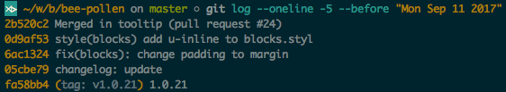
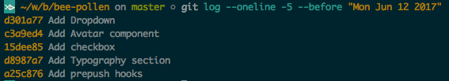

# Guia do Commit Amigão

```
- Ow, o que este commit "whatever" faz?
- Sei lá, abre o código aí.
- Assim não, fera...
```

Já passou por isso? Uma tremenda mancada, não? Pega uma cadeira e vamos conversar sobre como escrever aquela mensagem de *Commit Amigável*.

A premissa é simples: Sem padrão, o `git log` vira *aquela* feira da fruta.

Vamos melhorar isso levando em consideração os seguintes pontos:

- A navegação simplificada pelo histórico de commits
- Manter um padrão entre os desenvolvedores
- Passar o contexto da mudança
- Ajudar na mantenabilidade do projeto em longo prazo
- Facilitar a geração de `changelog`

## Como alcançar este `log` que jorra leite e mel?

O time há de concordar com uma convenção que siga os seguintes aspectos:

**Estilo**: sintaxe, gramática, capitalização, pontuação. Elabore essas coisas, remova o jogo de adivinhação e faça tudo o mais simples possível.

**Conteúdo**: que tipo de informação deveria conter no corpo da mensagem de commit? ou se não deveria conter

**Metadata**: como devemos rastrear as referencias das issues, por IDs, pull request ou o que deve ser utilizado como referencia?

Pois depois de tudo que foi dito acima você gostaria de ver um log assim:

[](https://camo.githubusercontent.com/d89ab36024388d0755fc62e4046d6193c12ec4ef/68747470733a2f2f63646e2e7261776769742e636f6d2f426565746563682d676c6f62616c2f6265652d7374796c6973682f6d61737465722f636f6d6d6974732f676f6f642d636f6d6d69742d6c6f672e706e67)

ao invés de algo similar a isto

[](https://camo.githubusercontent.com/1e24fc24f9c1dafdafd161249b74aac1f3905d1b/68747470733a2f2f63646e2e7261776769742e636f6d2f426565746563682d676c6f62616c2f6265652d7374796c6973682f6d61737465722f636f6d6d6974732f6261642d636f6d6d69742d6c6f672e706e67)

## Anatomia do Commit Amigão

Já existem convenções bem estabelecidas. No nosso caso, usamos o petardo maravilhoso do *Karma Commit Messages*.

*Formato Bonitão*

```
<tipo>(escopo): assunto

<corpo>

<rodapé>
```

### Assunto

- Máximo de 50 caracteres
- Tipo de escopo devem estar em letras minúsculas
- Assunto deve estar no *imperativo*

Exemplo:

`feat(bregumelo): adiciona endpoint /whatever/`.

Os valores permitidos para o `tipo` são:

- feat *(nova funcionalidade)*
- style *(formatação geral no código. Não confundir com CSS)*
- refactor *(refatoração de código de produção)*
- test *(adicionar/refatorar testes)*
- fix *(adivinha qual é esse)*
- docs *(e esse também)*
- chore *(atualização de tarefas ou código que não está relacionado a produção)*

### Corpo

- Deve conter o `o que` e o `por que` ao invês de conter o `como` foi feito
- Máximo de 80 caracteres

Se é necessário contextualizar o commit, explicar o porquê das mudanças, fique a vonts!

Exemplo:

```
refactor(bregumelo): modifica a chamada do model

A chamada anterior sofreu alterações de contrato, logo, foi necessário
refatorá-la.
```

### Rodapé

Basicamente, um indicador de metadados. Aqui você referencia quais issues estão relacionadas, qual issue este commit encerra e etc.

```
refactor(bregumelo): modifica a chamada do model

A chamada anterior sofreu alterações de contrato, logo, foi necessário
refatorá-la.

Closes #123
```

## Links

- [Karma Commit Messages](http://karma-runner.github.io/1.0/dev/git-commit-msg.html)
