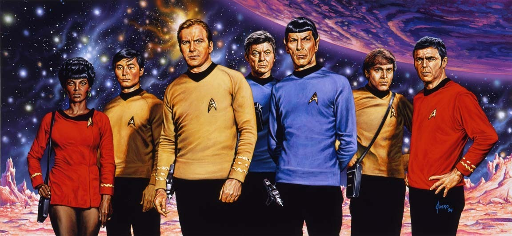
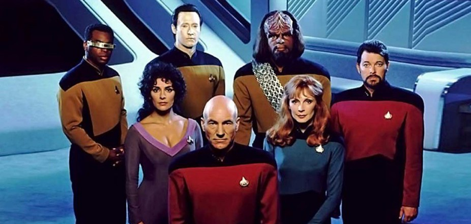
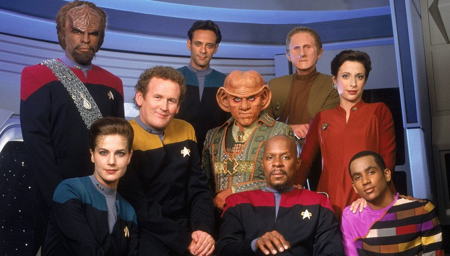
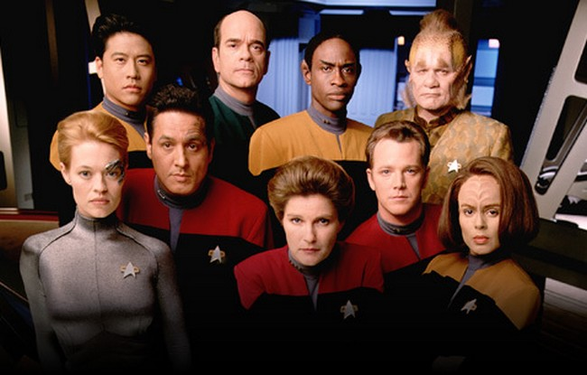
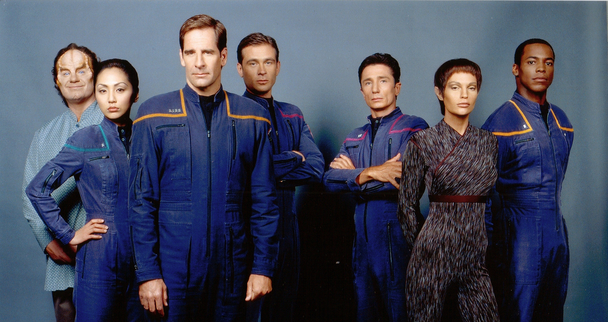
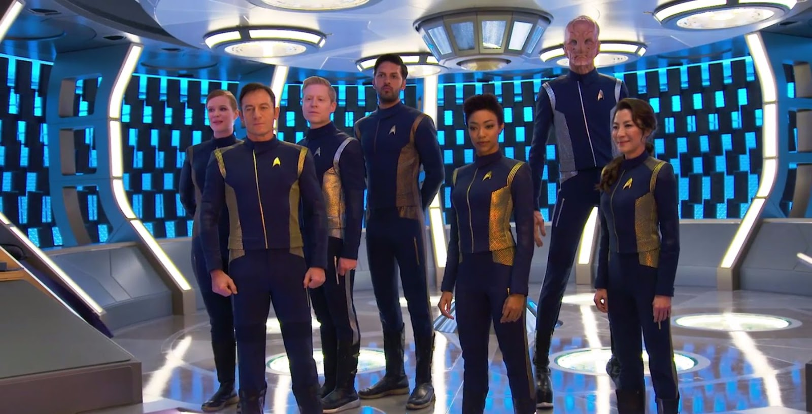

# Star Trek: uma história de liderança, amizade, diversidade e amor pela vida

O universo criado por Gene Roddenberry, que acaba de ganhar mais um capítulo (agora pelo Netflix), é uma ode à diversidade e a tudo que é profundamente humano

Gene Roddenberry, o criador da série original de Star Trek, que foi ao ar entre 1967 e 1969, queria mostrar que a humanidade alcançaria a maturidade e a sabedoria para não apenas tolerar as diferenças, mas apreciá-las e admirá-las. Segundo ele:

> “Se não podemos aprender a realmente gostar dessas pequenas diferenças, entre indivíduos da nossa própria espécie, aqui neste planeta, então não merecemos ir para o espaço conhecer toda a diversidade que é quase certa lá fora.”

A franquia derivada de sua criação, que recentemente completou 50 anos, inclui sete séries de TV (incluindo a nova série produzida pelo Netflix), 13 filmes, além de livros, jogos, quadrinhos e gerações de fãs fiéis e dedicados a um universo vasto e bastante complexo. A diversidade é um dos pontos altos de todas as versões dessa novela espacial, com tripulações sempre formadas por indivíduos de diferentes espécies, raças e gêneros, mas especialmente nas séries para a televisão onde essas questões puderam ser melhor trabalhadas.

### **Star Trek – A série Original (1967 a 1969): Amizade e Diversidade**

Cada uma das séries de TV tem um capitão que impõe um estilo de liderança diferente. Na série original o capitão James Tiberius Kirk (William Shatner) é impulsivo, galante e sarcástico. Seu imediato é também seu ponto de equilíbrio – Spock (Leonard Nimoy), meio humano, meio vulcano, lógico, analítico, controlado. A interação entre esses dois personagens e o médico da nave, Dr. McCoy (DeForest Kelley), dá o tom da série e mostra vários aspectos da amizade masculina.

Além disso, em meio à Guerra Fria, Roddenberry colocou um piloto japonês (Sulu – George Takei) e um co-piloto russo (Chekov – Walter Koenig) na sala de comando da nave USS Enterprise, além de uma mulher negra como chefe de comunicações (Uhura – Nichelle Nichols). Ela e o capitão Kirk foram os protagonistas do primeiro beijo interracial da TV norte americana. A diversidade é condição essencial para a construção do universo de Star Trek.

Episódios como **Amok Time** (2ª Temporada, episódio 01), que mostra o descontrole de Spock tomado pelo desejo de acasalamento dos vulcanos, ou **Mirror, Mirror** (2ª Temporada, episódio 10), que mostra o Universo Espelho, onde a Federação do Planetas Unidos é um Império e os personagens são versões sombrias do universo principal, estabeleceram os parâmetros para toda a franquia.

### **Star Trek – A Nova Geração (1987 a 1994): Reflexão Existencial**

****

O capitão Jean-Luc Picard (Patrick Stewart) é o grande líder dessa série que se passa um século depois do final da série animada. Mestre da diplomacia e da tática militar, ele é um modelo moderno de capitão da Frota Estelar. Fugindo completamente do perfil “bucaneiro espacial” de Kirk, a erudição de Picard leva a série a explorar temas sobre a condição humana, ética, valor da vida, paternidade e legado. Patrick Stewart empresta sua formação shakespeariana ao personagem e eleva o gênero sci-fi na televisão.

Episódios como **Tapestry** (6ª Temporada, episódio 15), onde Picard confronta sua própria juventude, podendo então mudar os rumos do seu passado, ou **The Inner Light** (5ª Temporada, episódio 25) no qual ele vive uma vida inteira em 25 minutos, são exemplos da reflexão existencial que marca a série.

Uma menção especial ao personagem Data (Brent Spiner), que discute os limites da inteligência artificial e o que consideramos vida consciente, em especial nos episódios **The Measure of a Man** (2ª temporada, episódio 09), e **The Offspring** (3ª temporada, episódio 16). Imperdível!

### **Star Trek – Deep Space Nine (1993 a 1999): Choque entre culturas**

****

Uma estação espacial controlada pela Federação dos Planetas Unidos serve de posto diplomático para a resolução de conflitos entre raças inimigas e de entreposto comercial entre quadrantes distantes do universo. Essa missão complexa cai nas mãos relutantes do capitão Benjamin Sisko (Avery Brooks), acompanhado por seu filho Jake (Cirroc Lofton) e o trauma da recente morte de sua esposa. Essa mistura de ONU e zona portuária dá um tom político muito forte para a série, mostrando o choque de culturas e de valores, falando abertamente sobre temas tabus como sexualidade e religião.

Episódios como **Let He Who is Without Sin...** (5ª temporada, episódio 07), que fala abertamente sobre sexo, prazer, monogamia e moral, e **The Visitor** (4ª temporada, episódio 03), uma das histórias mais emocionantes de toda a franquia onde Jake abandonando todos os seus sonhos para trazer seu pai de volta, são exemplos do foco da série na convivência e no choque entre culturas.

### **Star Trek – Voyager (1995 a 2001): Laços Afetivos**

****

Depois de um confronto com os rebeldes (chamados Maquis) e a nave Voyager se perder em um quadrante do universo desconhecido pela Federação, a capitã Kathryn Janeway (Kate Mulgrew) tem que reconfigurar a missão original, para trabalhar em parceria com os rebeldes e acomodar a tripulação à nova realidade. Os estimados 70 anos que a nave levaria para retornar a Terra, são uma sentença de morte em vida para os tripulantes, que passam a criar novos laços familiares entre si.

Episódios como **Lineage** (7ª temporada, episódio 11), que mostram os traumas e inseguranças de uma futura mãe que precisa se reconciliar com sua herança genética, e **Timeless** (5ª temporada, episódio 06), onde os dois únicos sobreviventes da Voyager arriscam as próprias vidas para mandar uma mensagem ao passado e salvar a nave, mostram o tema da família e da força dos laços que forjamos por escolha.

### **Star Trek – Enterprise (2001 a 2005): Legado**

****

Aproveitando o sucesso das três séries anteriores (que se passam todas no mesmo período de tempo), os produtores resolveram fazer uma série sobre o início da participação humana na Frota Estelar (antes da série Original). O capitão Jonathan Archer (Scott Bakula) transita entre o olhar inocente da exploração espacial e o moralmente questionável da guerra interplanetária. A tripulação da Enterprise constrói a aliança que dá origem à Federação consolidando o sonho de Gene Roddenberry.

Apesar da [baixa audiência e do cancelamento](https://quadrinheiros.com/2017/06/22/star-trek-enterprise-o-que-se-salva-do-maior-fracasso-da-franquia/), episódios como **In a Mirror, Darkly** (4ª temporada, episódios 18 e 19), que mostra os personagens no Universo Espelho, mais vis e cruéis do que nunca, e **Shuttlepod One** (1ª temporada, episódio 15), que mostra o desenvolvimento da amizade dos únicos dois tripulantes de uma nave auxiliar diante da certeza de suas mortes, são tudo que se espera de uma série sci-fi.

A metáfora da convivência amistosa entre a raça humana e raças e culturas alienígenas, tão cara ao criador da série, é um elogio à diversidade humana. A habilidade social que nos faz estabelecer laços afetivos, amizades e vínculos familiares, mesmo diante do choque de culturas e valores, é a nossa maior qualidade. Star Trek é um exercício ficcional de reflexão sobre a condição humana e sobre qual o legado que nós humanos queremos deixar para as próximas gerações.

### **Star Trek – Discovery: ?**

Discovery (nova série da franquia que já estreou no Netflix), se passa entre o início da participação humana na Frota Estelar (Enterprise) e os filmes novos do reboot da franquia no cinema (nas mãos de J. J. Abrams). Diferente do ritmo e do formato (de episódios soltos) das séries anteriores, esse novo capítulo na saga da Federação segue a fórmula das séries de hoje, com temporadas desenhadas como um mega filme, e ação vertiginosa desde os primeiros minutos. Que o peso do legado de Gene Roddenberry ajude a série a encontrar seu equilíbrio até que a gente possa discutir: o que Star Treck vem nos ensinar dessa vez?

Vida longa e próspera!

\*\*\*

*Esse texto faz parte da parceria editorial entre o **PapodeHomem** e **Os Quadrinheiros**. São dois textos originais por mês, publicados sempre às sextas-feiras para você se introduzir na linguagem do maravilhoso universo das histórias em quadrinhos e suas derivações.*

*Se você curtiu e quer mais é só [conferir o site](http://quadrinheiros.com/) e o [canal no Youtube](http://www.youtube.com/user/osQuadrinheiros), além do mais recente lançamento deles: o livro"[Quadrinhos através da história. As eras dos super-heróis](http://www.criativostore.com.br/quadrinhos-atraves-da-historias-as-eras-dos-super-herois.html)"lançado este mês em parceria com editora Criativa e o Observatório de História em Quadrinho da ECA-USP.*

*Nós já recebemos o nosso e vale muito a pena.*

---

*publicado em 29 de Setembro de 2017, 00:10*
