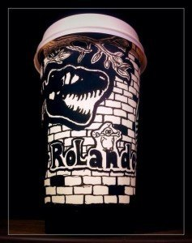
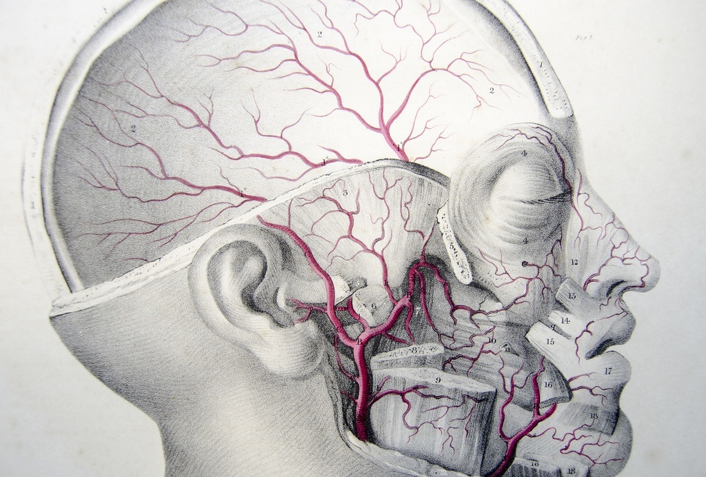
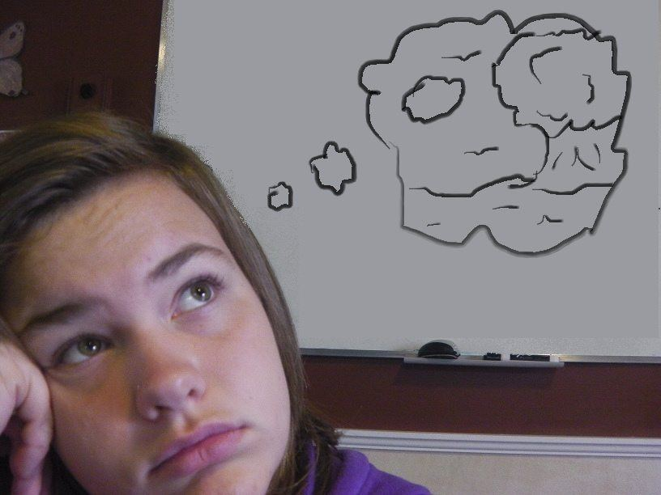
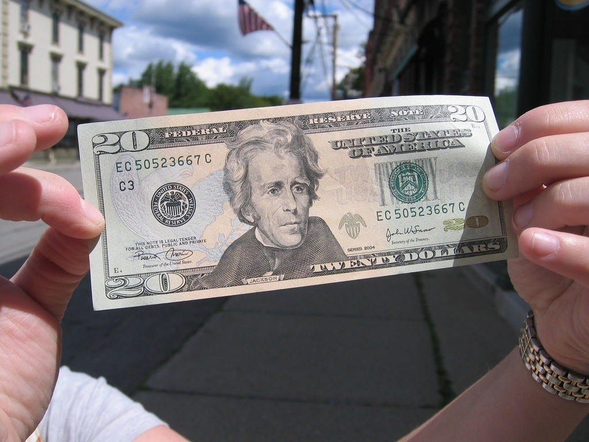

# Quitting Art? 5 Good Reasons Why You Might Want To Hang In There, From Professional Artists

May 05, 2014By [Mitch at PencilKings](https://www.pencilkings.com/author/pencilkingsnew/)

[anexo ausente]

*[anexo ausente]*

*Have you ever thought about quitting art? Sometimes, it doesn’t seem to matter how supportive your friends and family are, or how many likes you’ve received on social media. Once self-doubt has cast its shadow, all you can do is look back through your sketchbook and wonder whether it was all worth it.*

If this sounds familiar, it’s because many artists struggle with similar feelings from time to time. Knowing which way to turn can be difficult, so here are 5 good reasons to think twice before packing away your pencils for good and quitting art.

## 1. I’ll Never Make Any Money From Art, So What’s The Point?

Ever had this thought? Us too. In fact, you wouldn’t believe how many times we’ve told ourselves that choosing to be an artist was a dumb career choice! Why didn’t we pay more attention at school to those ‘worthier’ subjects such as science or math? Why couldn’t we have been more like the other kids and chosen a subject that was actually going to lead directly to a career?

Here’s the reason: No matter how often you consider changing paths, there’s a small voice speaking to you – we like to call it our ‘artist’s conscience.’ It’s the voice that says: ‘Sure, you can go and get a regular job if you like, but what about your art? Isn’t this what you were born to do, really?’

We read an interesting story recently about a guy called [Gabriel Nkweti Lafitte](http://metro.co.uk/2014/05/08/starbucks-employee-gives-away-creative-cup-art-to-lucky-customers-4721372/). As a barista in a well-known coffee chain in London, he’s used to providing great service while serving up skinny lattes and cappuccinos to thousands of customers in need of a little caffeine power.

Nothing unusual here, except this 41-year-old has a hidden talent which he likes to share with customers. Not only does he write their names on the paper cups, he designs unique pieces of artwork for certain customers. After taking them home to work on (some of these intricate designs can take up to 40 hours to complete), Gabriel hands the finished cups over to his delighted fans next time they call in.The result? Gabriel’s awesome work is now an online sensation, having been picked up by everyone from local newspapers to the [Huffington Post](http://www.huffingtonpost.co.uk/). He gets fresh requests for personalized coffee cups every day, with hopeful customers handing him their names on pieces of paper. His creative cup art is currently on display in the Starbuck’s branch opposite the [British Museum](http://www.britishmuseum.org/) in central London where he works, and he’s hoping to get his work transferred onto ceramic coffee cups soon.

What’s the moral of the story here? It’s that Gabriel has listened to his artistic conscience and decided to pursue his love of creativity. Far from being a struggling artist trying to make ends meet by working in a coffee shop, he’s decided to use the situation to his best advantage – combining a job he loves doing with the artistic talent he was born with.

As a man who loves adventure (he left his native Cameroon for France in 1982 before deciding to move to the UK in 2011), Gabriel doesn’t seem too hung up on whether he’ll make it as an artist or not. He clearly loves what he does and the public are giving him love back in droves. It’s safe to say he won’t be quitting art anytime soon.

## 2. It’s No Good…I Think All My Work Sucks

Sometimes, finding creative inspiration can be tough enough on its own, so it’s even worse when you don’t like the results of what you’ve come up with! Sound familiar? You’re in good company, because every single artist struggles with self-doubt on a regular basis. In fact, self-doubt is often one of the main reasons people decide to quit making art.

What’s the secret? There’s nothing more frustrating than trying to draw or paint something when you haven’t really figured out how to do it. As artists, we often get into the mindset of thinking that just because we can draw one thing, we’ll instantly be able to draw anything else.

That’s when it’s time to go back to basics. If you’ve been struggling with anatomy and feel you just can’t draw people properly, step back from your sketchbook and ask yourself how much you *really* know about the subject you’re attempting to depict.

Try not to put too much pressure on yourself. We often find ourselves planning huge projects that leave us feeling ready to throw the towel in when things don’t go to plan. What’s the answer? Study things a little bit at a time. Practice drawing faces, noses, ears, eyes etc until you’ve memorized the basic structure and don’t even have to think about it anymore.

Take a look at the awesome work of [Charles Bargue](http://en.wikipedia.org/wiki/Charles_Bargue). His books on drawing anatomy may date back to the 19th century, but everything in there is as valid today as it’s always been. You might also want to take a look at our numerous tutorials on the subject, from artists such as [Laurie B](https://www.pencilkings.com/drawing-hands-and-feet/), [Sycra Yasin](https://www.pencilkings.com/face-drawing-proportions/) and [Brian Wong](https://www.pencilkings.com/sketching-on-location/). Watching these will teach you how to start small, and then develop your sketches into more advanced projects once you’re ready.

In the next few weeks, we’ll be giving you lots of blogs on this very subject, which we’ll follow up with new lessons to show you everything you need to know about anatomy. So, if you’re thinking about quitting art, you may just want to hang in there!

*Pic courtesy of [Nikki Lynn](https://www.flickr.com/photos/mypublicjournal/)*

## 3. To Tell You The Truth, I Think I’m Just Bored Of Making Art

Go on, admit it. You’d love to say you’re enjoying the journey of becoming an artist and learning lots of new stuff every day, but the truth is, you’re actually finding it one big yawn. Guess what? It’s ok to feel like this. We know this feeling all too well ourselves. It’s our old friend distraction at work, telling us there are millions of more exciting things we could be doing.

How do you send distraction packing? It’s time to get sneaky. Change your way of working, change the mediums you use, change your subject matter if you need to. Go to your local art store and buy some materials you’ve never tried before. Mixing things up can give you a whole new outlook on things. Who knows, you might even discover your chosen way of working isn’t the best one for you!

That’s the thing with art: you’ve got to enjoy what you’re doing, otherwise people can tell your heart’s not in it. When you create something, you’re making a subconscious connection with all kinds of emotions and responses to things. If you’re not making that connection and getting something from the experience, it’s time for a rethink.

## 4. No-one Seems Interested In My Work Anyway

As people, we like nothing more than a bit of attention – why do you think social media is so huge? Like it or not, each of us is on some kind of ego trip – we wouldn’t be human otherwise! However, as artists, we can probably be a little more sensitive than most and get dejected when we’re not receiving the attention we believe we deserve. You probably know the scenario – you’ve spent hours finishing a painting, but only one Facebook Like? Only a handful of Re-pins? What’s the point?

Here’s a hard fact to take on board. Nobody is sitting around waiting for a great piece of art to inspire them. Everyone is just too busy just going about their daily lives for that. That’s why you’ve got to keep banging on that door until somebody listens. It may take weeks, months, years or even a lifetime, but you need to keep promoting your work and yourself.

If you’re struggling to get more followers on social media, there’s a simple solution and the clue is in the name – it’s a social thing! Therefore, be sure to respond to people when they get in touch, promote the work of fellow artists and try and keep people updated as often as possible. You don’t even have to show them finished pieces all the time – lots of successful artists on social media like to show their fans works in progress or talk about their ideas.

It’s also worth considering the best time to post updates. We often liken this to trying to promote a product in a shopping center or street. When’s the best time to be there? When nobody’s around or when the streets are teeming with people? There are lots of free tools out there to help you with this. Some of our favorites include [Hootsuite](https://hootsuite.com/), [Likealyzer](http://likealyzer.com/) and [Facebook’s](https://www.facebook.com/PencilKings) built-in analytics.

Try and be patient. It can sometimes take time to develop an online presence, but you should start to make progress eventually. Why not also try promoting your work locally and joining an art group? Talk to people who work in your nearest café or library and tell them about your art – you’ll be surprised at how supportive people can be – especially in the creative community!

## 5. Making Art Is Too Expensive

Here’s another classic reason why people think about quitting art. And, if you’ve ever looked on the shelves of your local art store and gasped at the price of some materials, it’s easy to see why. However, just remember there is always a cheaper alternative. Having the best materials in the world isn’t going to make you a better artist – only practice can do that.

If you need inspiration, why not take a look at the work of street artists? These dudes haven’t let having no cash get in the way of their creativity, often resorting to using anything that will make a mark. So that large canvas is too expensive to buy? Why not take a leaf out of [Charming Baker’s](http://charmingbakerstudio.com/) book? He left school at 16 and did various manual jobs before going back to college.

After this, he spent years working as a commercial artist before developing his own work. He doesn’t worry about which materials he uses – he’ll just use broken pieces of wood or metal instead. Oh, and he’s also one of the UK’s hottest creative talents right now.
