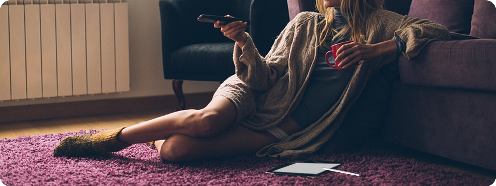
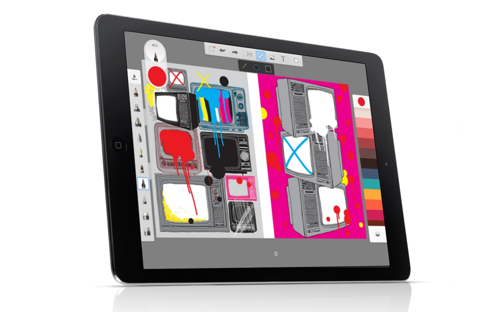
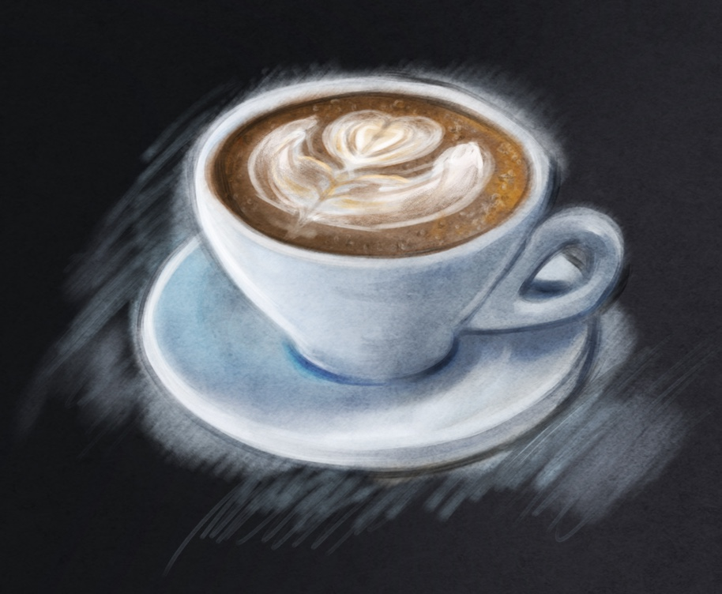

# When You're Blocked Creatively, Quantity Might Be Your Best Friend

Your head is filled to the brim with ideas for your next masterpiece. All you have to do is set them to paper (or digital file). And then you sit down, pen in hand, and… nothing. It’s like all those amazing ideas just vanished into thin air.

We’ve all heard of writer’s block, but what a lot of artists don’t realize is that it’s not just writers who suffer from this. Anyone who’s creative can experience a block from time to time. So what causes it and, more importantly, what can you *do* about it?

> A ceramics teacher split his class into two groups: one that would be graded entirely based on the quantity of work they produced, while the other group was graded entirely on quality. At the end of the term, all the best work was produced by the *quantity* group.

### **Potential Causes**

For me, there are generally two causes of creative block: stress or fear of failure. If I’m stressed out, the creative juices don’t flow like they do when I’m well rested and relaxed. Other times, I feel like whatever I produce needs to be “perfect” and let fear of failure stop me from even starting. Finding ways to destress, at least temporarily, is an important step to getting over a block. And that’s a very personal thing—so you’ll have to do whatever works for you.

Fear of failure, or perfectionism, can be a bit harder to get over. But let’s look at an excerpt from [*Art & Fear: Observations On the Perils (and Rewards) of Artmaking*](http://kk.org/cooltools/art-fear/) by David Bayles and Ted Orland. In this book, Bayles and Orland talk about a ceramics teacher who split his class into two groups: one that would be graded entirely based on the quantity of work they produced (50 pounds is an “A”, 40 pounds a “B”, and so on), while the other group was graded entirely on quality (they only had to produce one “perfect” pot to get an “A”).

At the end of the term, all the best work was produced by the quantity group. While the quality group obsessed over theory and how one might go about making the *best* pot, the quality group was busy churning out pots and learning from their mistakes.

The point of all this is that even creating something that’s “bad” will help you grow and improve. You’ll learn from your mistakes and sooner or later you’ll be creating way better work.

Other common causes of creative block include:

- **Fatigue:** If you’re overtired, you’ll have a hard time thinking clearly and producing any kind of work. Consider taking a nap or coming back to the project on a day when you’re well-rested.
- **Illness, medications, or other health-related reasons:** If you’re ill or injured, you’re way less likely to be creatively productive. That’s not a bad thing; you should rest and recover. If you’ve started a new medication or other healthcare routine recently and are suddenly finding yourself blocked, it can be worth talking to your doctor for solutions.
- **Environmental causes:** Maybe it’s too loud/quiet/hot/cold/busy/etc. Wherever you’re trying to work. A change of venue or environment can do wonders.
- **Lack of inspiration:** Sometimes you want to create, but you just can’t find anything to inspire you to actually do so.

There are other reasons, for sure. And sometimes you can’t pinpoint the reason for your creative block. You just know that when you sit down and face the blank page, nothing comes out.

### **Solutions for Creative Block**

Whether you know why you’re blocked or not, there are things you can do to help get that creativity flowing again. Here are a few things to try:

#### Get rid of distractions

Turn off the TV, send the kids to a friend’s house, ask your significant other to leave you alone for a few hours… if there are distractions around, do what you need to do to get rid of them. Alternatively, you can remove yourself from the distractions if your work will allow it.

#### Take a nap

A [20-minute nap](http://www.huffingtonpost.com/2014/08/11/best-nap-napping-tips_n_5648651.html) can be an excellent way to reboot your brain and get back in the groove if you’re tired. Studies have shown that a 10-20 minute nap is optimal for most people, as it prevents your body from going into a deep sleep cycle (and therefore feeling groggy if you get woken up in the middle of it).

Instead of watching TV when you’re blocked creatively, draw TV instead. A hundred times, if necessary.

#### Get some caffeine

A cup of coffee or tea, or another caffeinated beverage, can help boost your cognitive functioning and get you motivated again.

#### Drink some coffee and *then* take a nap

This one sounds a little weird, but if you [drink something caffeinated and then take a 10-20 minute nap](https://sleepjunkies.com/tips/the-caffeine-nap/), the effects of both will be compounded and you’ll feel better than if you’d done either one alone.

#### Force yourself

Sometimes you just have to force yourself to start. For a writer, this can mean freewriting for 15 minutes, with the point being to just keep writing without stopping. But other artists can do the same type of thing. Sit down and start drawing. Draw circles on the page, doodle, or do whatever else pops into your head. The point is to trigger that muscle memory every artist has when they’re creating.

Coffee is fine, but drink coffee and then take a power nap. No, really. [Science says so](https://sleepjunkies.com/tips/the-caffeine-nap/).

#### Listen to music

Music can do wonders for creativity. Put on your favorite jam and just let it wash over you. Pro tip: setting the same energizing/motivating song on repeat for 30 minutes or so can be a great way to start. Your brain will tune out the specifics after one or two repetitions, but the positive effects of the music itself will remain.

#### Create your own routine

A routine that you go through before you create can be a great way to signal your brain that it’s time to get to work. Kind of like brushing your teeth, setting your alarm, and crawling into bed signals your brain that it’s time to sleep. Figure out if there are a certain set of steps you can do before you start creating that will help put your brain in the right mindset. That could be making a cup of tea, putting on certain music, taking a quick walk, or any other set of actions that you prefer.

#### Take a walk

Speaking of… taking a walk can be a great way to get back in the groove. It’s a change of scenery, and assuming that you just walk and don’t spend your time trying to catch up on Facebook on your phone, it can be a great way to clear your head. Tons of creatives incorporate walking into their daily routine (plus, it’s good for you since sitting or remaining stationary for long periods of time can do a number on your body).

#### Take a break

This is one of my favorites, actually. If you’re finding you have a hard time creating, then don’t allow yourself to create for awhile. I’ve done this with writer’s block in the past. I tell myself that I’m not allowed to work on anything for at least a week. Usually, within about three days, I’m chomping at the bit to get back to whatever project had me stalled with a renewed energy and all sorts of new ideas. Note that this is different than waiting to feel “inspired” or otherwise avoiding actually creating.

Creative block can seem like the end of everything when you’re stuck in the middle of it. But like most things, this too shall pass. And following the advice above can help it pass faster and more easily. The main thing to remember is that it happens to virtually every creative person out there at one time or another, and the vast majority get over it!
