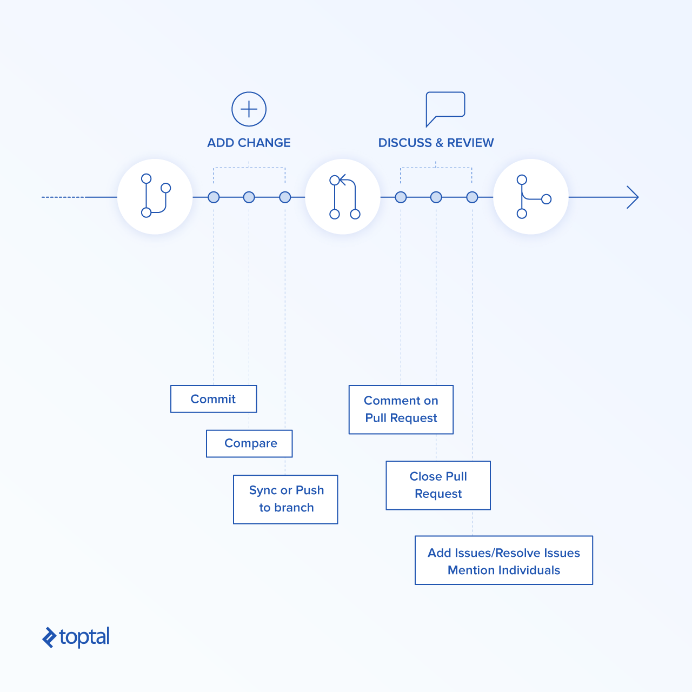
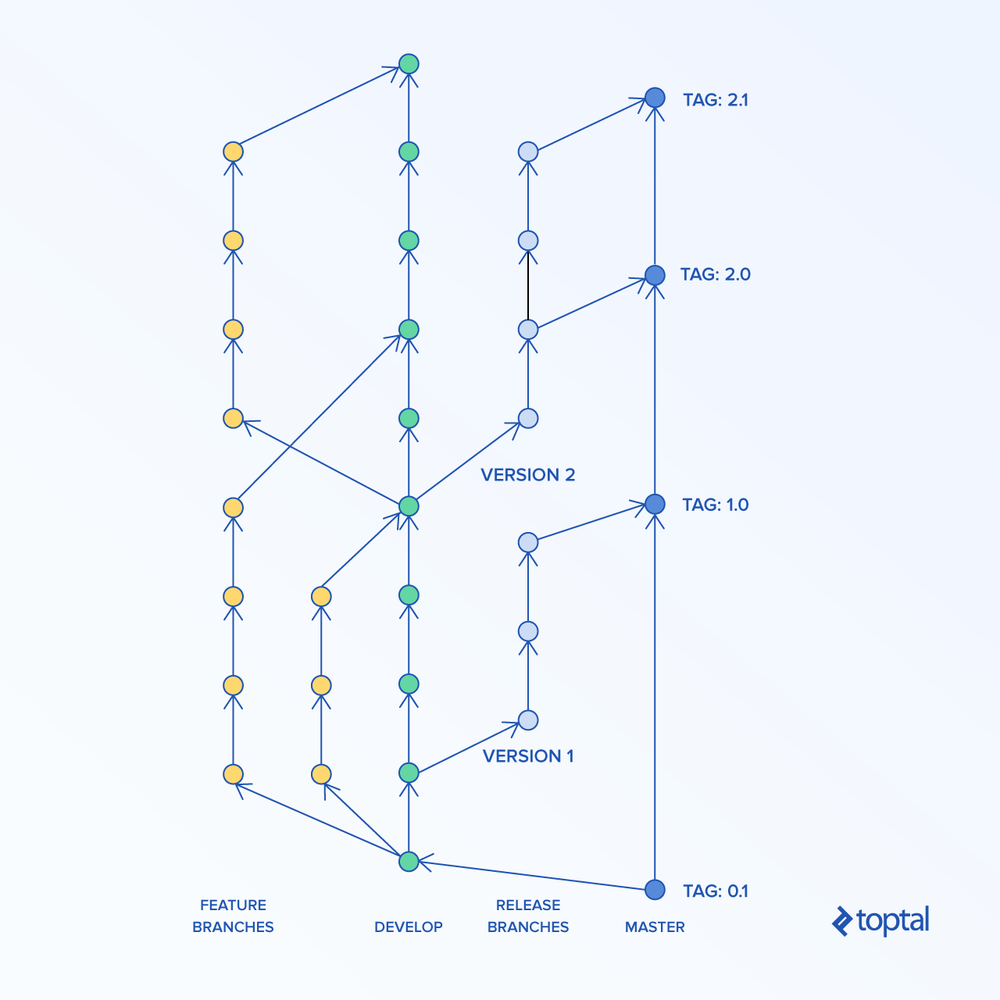

# Trunk-based Development vs. Git Flow

[View all articles](https://www.toptal.com/developers/blog)

In order to develop quality software, we need to be able to track all changes and reverse them if necessary. Version control systems fill that role by tracking project history and helping to merge changes made by multiple people. They greatly speed up work and give us the ability to find bugs more easily.

Moreover, working in distributed teams is possible mainly thanks to these tools. They enable several people to work on different parts of a project at the same time and later join their results into a single product. Let’s take a closer look at version control systems and explain how trunk-based development and Git flow came to being.

## How Version Control Systems Changed the World

Before version control systems were created, people relied on manually backing up previous versions of projects. They were copying modified files by hand in order to incorporate the work of multiple developers on the same project.

It cost a lot of time, hard drive space, and money.

When we [look at the history](https://rc.sydney.edu.au/git-user-guide/history.html), we can broadly distinguish three generations of version control software.

Let’s take a look at them:

| Generation | Operations | Concurrency | Networking | Examples |
| --- | --- | --- | --- | --- |
| **First** | On a single file only | Locks | Centralized | RCS |
| **Second** | On multiple files | Merge before commit | Centralized | Subversion, CVS |
| **Third** | On multiple files | Commit before merge | Distributed | Git, Mercurial |

We notice that as version control systems mature, there is a tendency to increase the ability to work on projects in parallel.

One of the most groundbreaking changes was a shift from locking files to merging changes instead. It enabled programmers to work more efficiently.

Another considerable improvement was the introduction of distributed systems. [Git was one of the first](https://git-scm.com/book/en/v2/Getting-Started-A-Short-History-of-Git) tools to incorporate this philosophy. It literally enabled the open-source world to flourish. Git allows developers to copy the whole repository, in an operation called forking, and introduce the desired changes without needing to worry about merge conflicts.

Later, they can start a pull request in order to merge their changes into the original project. If the initial developer is not interested in incorporating those changes from other repositories, then they can turn them into separate projects on their own. It’s all possible thanks to the fact that there is no concept of central storage.

## Development Styles

Nowadays, the most popular version control system is definitely Git, with a market share of about 70 percent in 2016.

Git was popularized with the rise of Linux and the open-source scene in general. [GitHub](https://github.com/), currently the most popular online storage for public projects, was also a considerable contributor to its prevalence. We owe the introduction of easy to manage pull requests to Git.

Put simply, pull requests are requests created by a software developer to combine changes they created with the main project. It includes a process of reviewing those changes. Reviewers can insert comments on every bit they think could be improved, or see as unnecessary.

After receiving feedback, the creator can respond to it, creating a discussion, or simply follow it and change their code accordingly.

Git is merely a tool. You can use it in many different ways. Currently, two most popular development styles you can encounter are [Git flow](https://github.com/nvie/gitflow) and [trunk-based development](https://trunkbaseddevelopment.com/). Quite often, people are familiar with one of those styles and they might neglect the other one.

Let’s take a closer look at *both of them* and learn how and when we should use them.

## Git Flow

In the Git flow development model, you have one main development branch with strict access to it. It’s often called the `develop` branch.

Developers create feature branches from this main branch and work on them. Once they are done, they create pull requests. In pull requests, other developers comment on changes and may have discussions, often quite lengthy ones.

It takes some time to agree on a final version of changes. Once it’s agreed upon, the pull request is accepted and merged to the main branch. Once it’s decided that the main branch has reached enough maturity to be released, a separate branch is created to prepare the final version. The application from this branch is tested and bug fixes are applied up to the moment that it’s ready to be published to final users. Once that is done, we merge the final product to the `master` branch and tag it with the release version. In the meantime, new features can be developed on the `develop` branch.

Below, you can see Git flow diagram, depicting a general workflow:

One of the advantages of Git flow is strict control. Only authorized developers can approve changes after looking at them closely. It ensures code quality and helps eliminate bugs early.

However, you need to remember that it can also be a huge disadvantage. It creates a funnel slowing down software development. If speed is your primary concern, then it might be a serious problem. Features developed separately can create long-living branches that might be hard to combine with the main project.

What’s more, pull requests focus code review solely on new code. Instead of looking at code as a whole and working to improve it as such, they check only newly introduced changes. In some cases, they might lead to [premature optimization](https://www.toptal.com/full-stack/code-optimization) since it’s always possible to implement something to perform faster.

Moreover, pull requests might lead to extensive micromanagement, where the lead developer literally manages every single line of code. If you have experienced developers you can trust, they can handle it, but you might be wasting their time and skills. It can also severely de-motivate developers.

In larger organizations, office politics during pull requests are another concern. It is conceivable that people who approve pull requests might use their position to purposefully block certain developers from making any changes to the code base. They could do this due to a lack of confidence, while some may abuse their position to settle personal scores.

## Git Flow Pros and Cons

As you can see, doing pull requests might not always be the best choice. They should be used where appropriate only.

### When Does Git Flow Work Best?

- **When you run an open-source project.**  
  This style comes from the open-source world and it works best there. Since everyone can contribute, you want to have very strict access to all the changes. You want to be able to check every single line of code, because frankly you can’t trust people contributing. Usually, those are not commercial projects, so development speed is not a concern.
- **When you have a lot of junior developers.**  
  If you work mostly with junior developers, then you want to have a way to check their work closely. You can give them multiple hints on how to do things more efficiently and help them improve their skills faster. People who accept pull requests have strict control over recurring changes so they can prevent deteriorating code quality.
- **When you have an established product.**  
  This style also seems to play well when you already have a successful product. In such cases, the focus is usually on application performance and load capabilities. That kind of optimization requires very precise changes. Usually, time is not a constraint, so this style works well here. What’s more, large enterprises are a great fit for this style. They need to control every change closely, since they don’t want to break their multi-million dollar investment.

### When Can Git Flow Cause Problems?

- **When you are just starting up.**  
  If you are just starting up, then Git flow is not for you. Chances are you want to create a minimal viable product quickly. Doing pull requests creates a huge bottleneck that slows the whole team down dramatically. You simply can’t afford it. The problem with Git flow is the fact that pull requests can take a lot of time. It’s just not possible to provide rapid development that way.
- **When you need to iterate quickly.**  
  Once you reach the first version of your product, you will most likely need to pivot it few times to meet your customers’ need. Again, multiple branches and pull requests reduce development speed dramatically and are not advised in such cases.
- **When you work mostly with senior developers.**  
  If your team consists mainly of senior developers who have worked with one another for a longer period of time, then you don’t really need the aforementioned pull request micromanagement. You trust your developers and know that they are professionals. Let them do their job and don’t slow them down with all the Git flow bureaucracy.

## Trunk-based Development Workflow

In the trunk-based development model, all developers work on a single branch with open access to it. Often it’s simply the `master` branch. They commit code to it and run it. It’s super simple.

In some cases, they create short-lived feature branches. Once code on their branch compiles and passess all tests, they merge it straight to `master`. It ensures that development is truly continuous and prevents developers from creating merge conflicts that are difficult to resolve.

Let’s have a look at trunk-based development workflow.

The only way to review code in such an approach is to do full source code review. Usually, lengthy discussions are limited. No one has strict control over what is being modified in the source code base—that is why it’s important to have enforceable code style in place. Developers that work in such style should be experienced so that you know they won’t lower source code quality.

This style of work can be great when you work with a team of [seasoned software developers](https://www.toptal.com/freelance). It enables them to introduce new improvements quickly and without unnecessary bureaucracy. It also shows them that you trust them, since they can introduce code straight into the `master` branch. Developers in this workflow are very autonomous—they are delivering directly and are checked on final results in the working product. There is definitely much less micromanagement and possibility for office politics in this method.

If, on the other hand, you do not have a seasoned team or you don’t trust them for some reason, you shouldn’t go with this method—you should choose Git flow instead. It will save you unnecessary worries.

## Pros and Cons of Trunk-based Development

Let’s take a closer look at both sides of the cost—the very best and very worst scenarios.

### When Does Trunk-based Development Work Best?

- **When you are just starting up.**  
  If you are working on your minimum viable product, then this style is perfect for you. It offers maximum development speed with minimum formality. Since there are no pull requests, developers can deliver new functionality at the speed of light. Just be sure to hire experienced programmers.
- **When you need to iterate quickly.**  
  Once you reached the first version of your product and you noticed that your customers want something different, then don’t think twice and use this style to pivot into a new direction. You are still in the exploration phase and you need to be able to change your product as fast as possible.
- **When you work mostly with senior developers.**  
  If your team consists mainly of senior developers, then you should trust them and let them do their job. This workflow gives them the autonomy that they need and enables them to wield their mastery of their profession. Just give them purpose (tasks to accomplish) and watch how your product grows.

### When Can Trunk-based Development Cause Problems?

- **When you run an open-source project.**  
  If you are running an open-source project, then Git flow is the better option. You need very strict control over changes and you can’t trust contributors. After all, anyone can contribute. Including online trolls.
- **When you have a lot of junior developers.**  
  If you hire mostly junior developers, then it’s a better idea to tightly control what they are doing. Strict pull requests will help them to to improve their skills and will find potential bugs more quickly.
- **When you have established product or manage large teams.**  
  If you already have a prosperous product or manage large teams at a huge enterprise, then Git flow might be a better idea. You want to have strict control over what is happening with a well-established product worth millions of dollars. Probably, application performance and load capabilities are the most important things. That kind of optimization requires very precise changes.

## Use the Right Tool for the Right Job

As I said before, Git is just a tool. Like every other tool, it needs to be used appropriately.

Git flow manages all changes through pull requests. It provides strict access control to all changes. It’s great for open-source projects, large enterprises, companies with established products, or a team of inexperienced junior developers. You can safely check what is being introduced into the source code. On the other hand, it might lead to extensive micromanagement, disputes involving office politics, and significantly slower development.

Trunk-based development gives programmers full autonomy and expresses more faith in them and their judgement. Access to source code is free, so you really need to be able to trust your team. It provides excellent software development speed and reduces processes. These factors make it perfect when creating new products or pivoting an existing application in an all-new direction. It works wonders if you work mostly with experienced developers.

Still, if you work with junior programmers or people you don’t fully trust, Git flow is a much better alternative.

Equipped with this knowledge, I hope you will be able to choose the workflow that perfectly matches your project.

## Understanding the Basics

### What is a trunk in software?

In the world of software development, "trunk" means main development branch under a version control system. It’s the base of a project, where all improvements are being merged together.

### What is code branching and merging?

Branches are created from the base project, in order to develop a new feature, fix a bug, or simply do some refactoring. They prevent software developers from disturbing each other and enable them to work in parallel. Once a change is finished and tested, the branch is merged back to the trunk.

### What is a branch in version control?

A branch in a version control system is a duplicate of the base project. It’s created so that changes can happen in parallel across other branches. It essentially solves the problem of working on the same files at the same time.

### What is a feature branch?

The feature branch has a clear and highly-focused purpose—to add specific functionality to a project. It shouldn’t contain any other changes that fix bugs, introduce other features, or are part of a refactoring.

### What is a version control system?

Version control systems trace changes occurring in files in a project. They can be recalled or reviewed later. It’s extremely useful for bringing back previous versions as well. This allows developers to find bugs with less effort, as they can see and track all the changes as they occurred.

## About the author

[

View full profile »](https://www.toptal.com/resume/konrad-gadzinowski)

[Hire the Author](https://www.toptal.com/companies/apply?interested_in=developers&skill=software)

[Konrad Gadzinowski, Poland](https://www.toptal.com/resume/konrad-gadzinowski)

Konrad is a highly skilled software developer who has delivered numerous web and mobile applications. He has created software for multiple small and larger companies, helping them to generate combined revenue of millions of dollars. He's a great team player and a proactive self-starter. He has the skills of a full-stack JavaScript developer, which enables him to see the whole picture and deliver projects faster and with higher quality. [[click to continue...]](https://www.toptal.com/resume/konrad-gadzinowski)

[Hiring? Meet the Top 10 Freelance Software Developers for Hire in October 2017](https://www.toptal.com/software)
