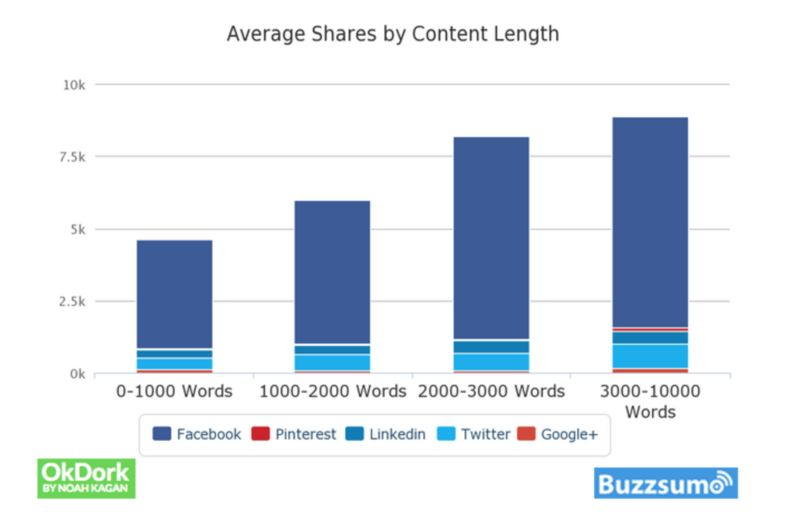

# What to Blog About - an All-purpose Decision Map [Infographic]

All bloggers will be familiar with the challenge of coming up with fresh topic ideas. According to a survey, [60% of B2B marketers](http://contentmarketinginstitute.com/2015/09/b2b-content-marketing-research/) say producing engaging content is their number one content marketing challenge.

The value of a blog is underlined by the fact businesses who use one generate [67% more leads](http://www.techclient.com/blogging-statistics/) than those who do not. There is no doubt you should be blogging.

How do you overcome the challenge of coming up with topic ideas? The team at [Postach.io](https://postach.io/) have put together an all-purpose decision map. The infographic below will take you through the key methods you should follow to come up with fresh, engaging content:

The infographic should give you a roadmap to blog post ideas. Let’s go over the points in a little more detail.

## 1) Choose Something You Are Passionate About

Blogs (or anything work-related) are easier when you are passionate about them. It has been proven by a major study, suggesting people are [12% more productive](https://www2.warwick.ac.uk/newsandevents/pressreleases/new_study_shows/) when they are happy.

In choosing the topic for your blog, consider whether you will enjoy writing about it for the long term. It will be easier to create engaging and exciting content where the passion shines through.

The added bonus in taking this approach is that you are more likely to know what you are talking about. You’ll be able to follow all the latest developments or ideas to keep your blog fresh. This is particularly important as Google’s algorithms are getting ever smarter at filtering out poor quality content.

## 2) Engage With Your Audience

Communicating with your audience is a key aspect to a successful blog. Being responsive to the desires of your readers will enable you to give them the content they want and foster goodwill. Here’s some tips on how to do it:

- Join conversations online -Each niche or industry has an online community. Joining those groups, social media channels, and forums will help you understand some common pain points or issues. You can then share your thoughts and offer a solution through your blog.
- Organize a vote -Take the opportunity to ask your readers to choose the next topic.[Exile Lifestyle](http://exilelifestyle.com/)blogger Colin Wright follows this format by asking his followers to choose his[next destination](http://exilelifestyle.com/about/).
- Email marketing -Working in a similar way to an on-site vote, asking your subscribers is a great way to increase engagement.
- Blog comments -The comment section on your blog can be a rich source of ideas. You can address frequent questions and comments with a new post.

## 3) Research

Carrying out research will take your knowledge and skills to the next level. Even an industry expert will never stop learning. You should look at the following methods:

- Competitor analysis -See what your successful competitors are blogging about. The important thing here is not to simply copy and paste but instead identify where you can add value.
- Trends -See what’s trending within your niche on social media. If there’s one or two you feel confident writing on, then go for it. Make sure you share it on your social media platforms afterwards.
- Ultimate guides -With long-form posts proving to have the[highest engagement rates](https://okdork.com/why-content-goes-viral-what-analyzing-100-millions-articles-taught-us/), it can be worth investing time into an ultimate guide. The key is to fill it with strong, authoritative content. The graph from OkDork below, neatly illustrates the value of long-form content.

  

  (Source:[OkDork.com](https://okdork.com/))

## 4) Repurpose Old Content

From time to time, you should dive into your archive of old blog posts and see what you can do with them. Focus on the ones that have performed strongly. Here’s how:

- Simple updates -For example, if you have written a post on “Top Blogs in 2016," you could create a 2017 version.
- Review -At the beginning of the year, did you make some bold predictions about your industry? Even if they have proved way off track, it’s a great idea to look back. No one gets every prediction right and it will be entertaining for your readers.
- Extend your coverage -Say you have written a post on “10 Restaurants for Italian Food," follow it up with another type of cuisine.

## 5) Alternative Methods

Ideas can come from a variety of sources. It’s about being open minded and being willing to embrace other perspectives:

- Your team -Collaborate with your team for new blog post topics. They will have different perspectives on the same industry or niche.
- Books -If you have books, whether it’s on the shelf or in your Kindle, then they will be full of topics you may not have thought of.
- Topic generator -If you’re really stuck for ideas, then a Hubspot has an excellent[topic generator tool](https://www.hubspot.com/blog-topic-generator). Simply type in three terms, and the generator will churn out 5 titles for you to use.
- Google search suggestions -To see what people are searching for within your niche, use Google’s search suggestions. The top searches automatically drop down as you type the term:

## Conclusion

There is no getting away from it. Blogging can prove lucrative for both individuals and businesses. A well-organized, fresh, and engaging blog filled with high-quality content can generate a healthy income.

The first thing is to find your niche that fits your interests and knowledge. This could apply to both individual and business blogs. Having a passion for the topics you are writing about will get you through the challenges all bloggers face.

One such challenge is continually creating fresh, engaging, and relevant content.

The all-purpose decision map is designed to help you reach your blogging goals and identify strong topics. The key is to take a holistic approach and understand that all the components work together. For example, you need to carry out research to find your audience before you can engage with them and share your expertise.

While you need to remain focused on the topic, you can keep an open mind about where your ideas come from. There are many avenues to explore - not least the people around you. Whether they are part of your team or industry influencers, they can offer different perspectives on a similar subject.

Even something as simple as a Google search suggestion can trigger a new blog post. After all, they tend to be what people are actively searching for.

Place an emphasis on quality over quantity. Simply churning out average daily posts no longer works. Google’s algorithms are designed to pick out high-quality content, and bloggers are starting to realize this. A recent survey found they are taking [more time to write](https://www.smartinsights.com/digital-marketing-strategy/blogs-delivering-results/?ref=zest.is) blog posts.

At the end of the day, this is what matters the most. Creating high-quality, relevant, and engaging content. And it’s a lot easier when you are passionate about your blog.

Use the all-purpose decision map to inspire you today!

If you're looking for a simple way to set up your own blog and are familiar with Evernote, [Postach.io](https://postach.io/site) is free and extremely simple to use - you can get started right away. [Publish your first post](https://postach.io/site) today!
