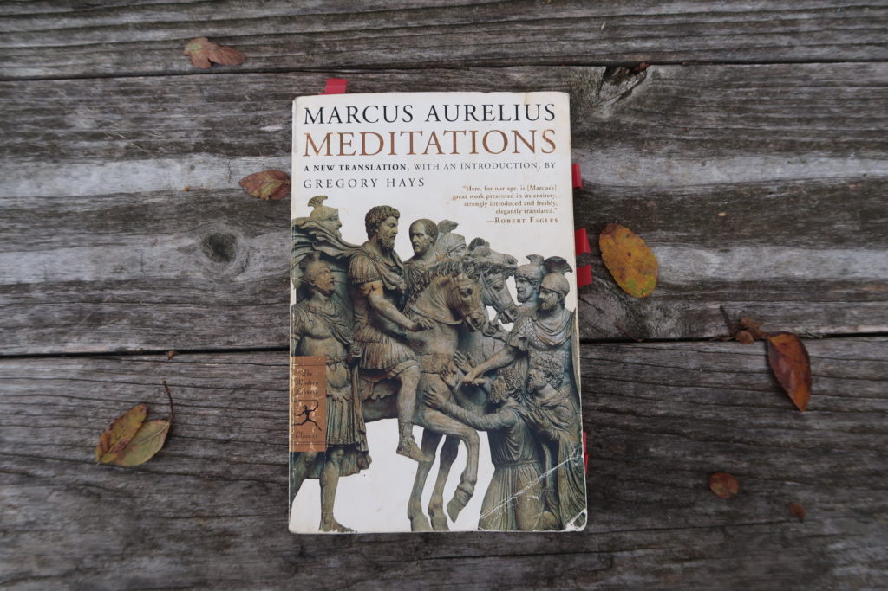
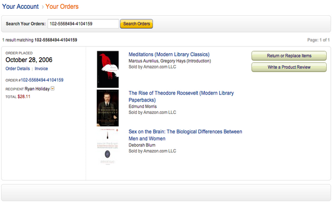
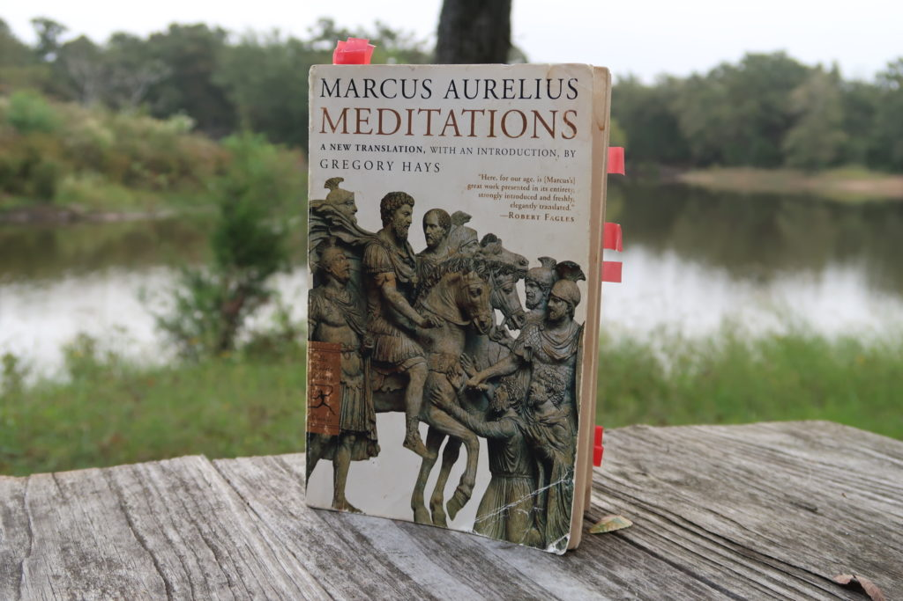
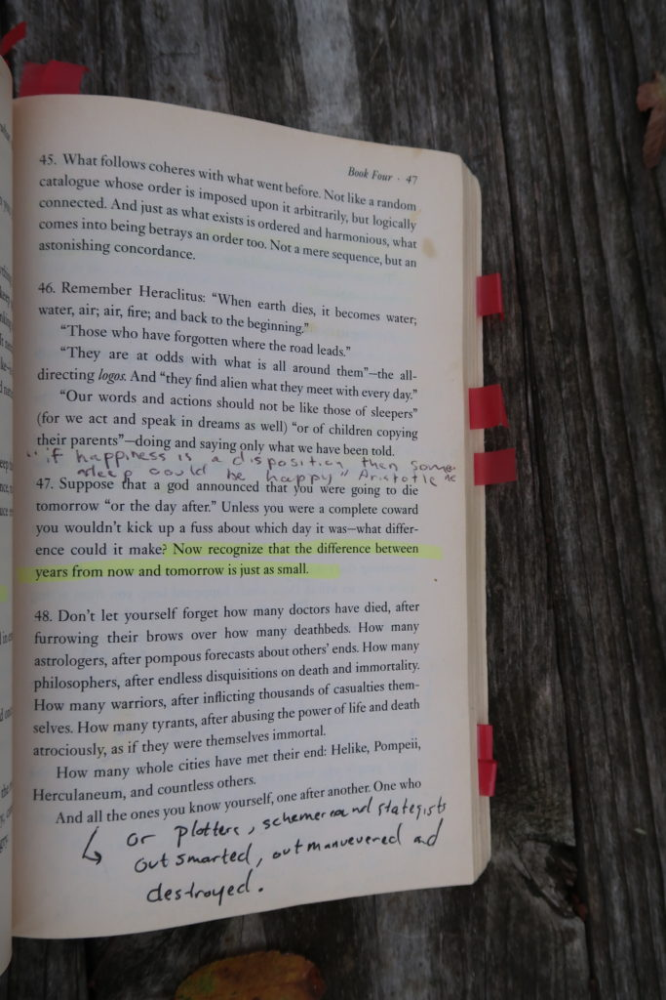
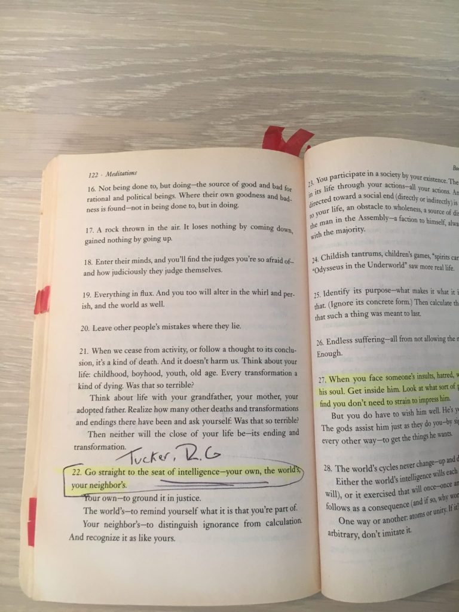
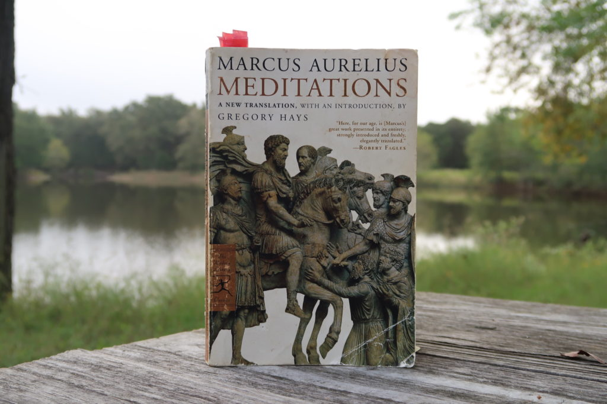
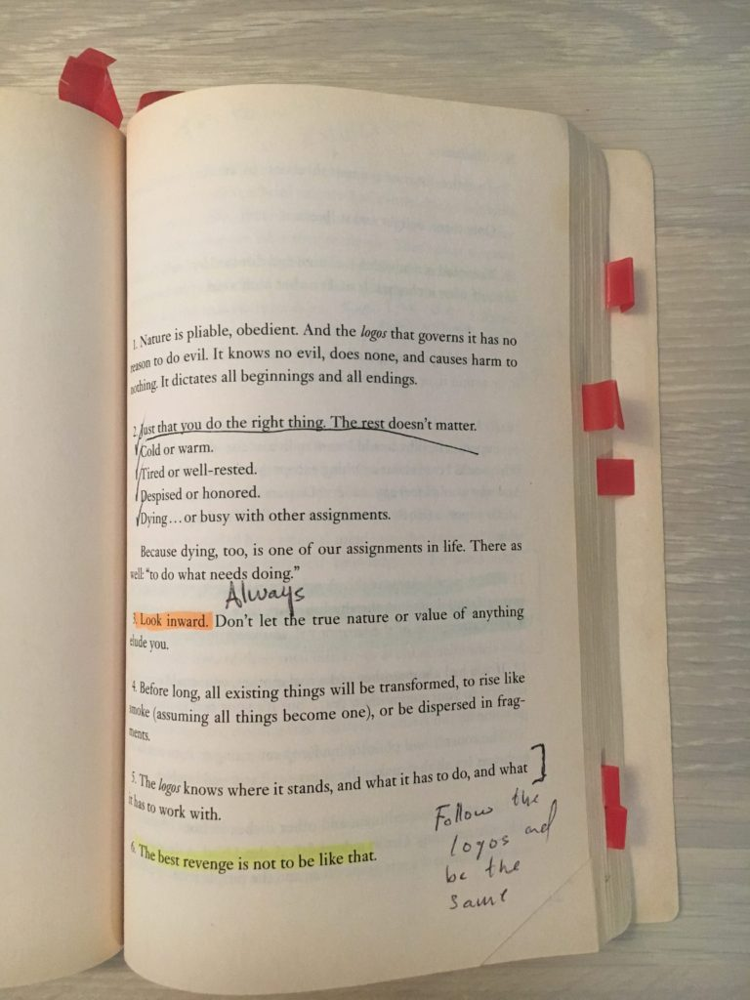

# 100 Things I Learned in 10 Years and 100 Reads of Marcus Aurelius’s Meditations

*This post [was originally published](https://ryanholiday.net/100-things-learned-10-years-100-reads-marcus-aureliuss-meditations/) on RyanHoliday.net.*

Almost exactly ten years ago, I bought [the *Meditations* of Marcus Aurelius](http://geni.us/Au3KBAu) on Amazon. Amazon Prime didn’t exist then and to qualify for free shipping, I had to purchase a few other books at the same time. Two or three days later they all arrived.

It’s a medium sized paperback, mostly white with a golden spine. On the cover Marcus is shown in relief, pardoning the barbarians. “Here, for our age, is Marcus’s great work,” says Robert Fagles in his blurb. I was 19 years old. I didn’t know who Marcus Aurelius was (besides the old guy in *Gladiator)* and I certainly didn’t know who Robert Fagles or Gregory Hays, the translator, was. But something drew me to this book almost immediately. I suppose it was luck that brought me to the specific translation I’d chosen ([Modern Library Edition](https://ryanholiday.net/meditations-interview-with-gregory-hays/))—though the Stoics would call it *fated*—but what arrived would change my life.

It would be for me, what Tyler Cowen would call a “a quake book,” shaking everything I thought I knew about the world (however little that actually was). I would also become what Stephen Marche has [referred to as a “centireader,”](https://www.theguardian.com/books/2015/feb/09/centireading-force-reading-book-100-times-great-idea) reading Marcus Aurelius well over 100 times across multiple editions and copies.

In the course of those readings and [my study of stoicism](https://dailystoic.com/what-is-stoicism-a-definition-3-stoic-exercises-to-get-you-started/), a lot has changed. Marcus Aurelius has guided me through breakups [and getting married](https://ryanholiday.net/the-perfect-spouse-is-the-best-life-hack-no-one-told-you-about/), through being relatively young and poor and relatively older and well-off. His wisdom has helped me with getting fired and with quitting, with success and with struggles. I’ve [carried him](http://kk.org/cooltools/whats-in-my-bag-ryan-holiday/) to close to a dozen countries and moved him [to multiple houses](https://ryanholiday.net/my-library/). I’ve turned to him for articles and books and casual dinner conversation. The one pristine white cover is now its own shade of tan, but with every read, every time I’ve touched the book, I’ve gotten something new or been reminded of something timeless and important.

Now with the release of my own translation and compendium, [*The Daily Stoic*](http://geni.us/TheDailyStoic) (and [a daily email newsletter at DailyStoic.com](https://dailystoic.com/new-start-here/)), I wanted to take the time to reflect on what I’ve learned in ten years with one of the greatest and most unique pieces of literature ever created.

-It was the opening passage of Book 5—about our reluctance to get out of bed and get moving in the morning—that struck me most on my first read. As you can see, I wrote “FUCK” with a highlighter and you can see how important that passage was to me at the time [in a 2007 blog post](https://ryanholiday.net/motivation/). Later, I would [print out this passage](https://ryanholiday.net/print-out-good-advice-and-put-it-where-you-work-you-wont-be-able-to-run-away-from-it/) and put it next to my desk and bed. I think it was that as a college student I needed that extra motivation. I was a little lazy and entitled. I needed to seize life and take advantage of it—and Marcus served me well in that regard for a long time.

-Though I will say that today, [I think less](http://thoughtcatalog.com/ryan-holiday/2015/08/human-being-not-human-doing/) about the passage that motivates me to do more and be more active. If I was to put a different one on my desk, I’d choose from Book Ten, “If you seek tranquility, do less.”

-In my first read of*Meditations*, I highlighted the line “It can ruin your life only if it ruins your character.” In a later read I added brackets around that line, just for more emphasis. And I underlined in pen what came after, “Otherwise, it cannot harm you—inside or out.”

-Pages XXVI and XXV of Hays’s introduction is where I was first introduced to the distillation of Stoicism into three distinct disciplines (perception, action, will). It was this order that eventually shaped both [*The Obstacle is the Way*](http://geni.us/R74gB) and [*The Daily Stoic*](https://geni.us/TheDailyStoic)*.*When I get asked to explain the three disciplines, this is usually my short answer: See things for what they are. Do what we can. Endure and bear what we must.

-Hays’s introduction also lists Alexander Pope, Goethe and William Alexander Percy as students and fans of Marcus Aurelius. Reading works by all of these individuals—especially Percy (and his adopted son, Walker Percy)—sent me down a rabbit hole that would be one of the most enjoyable of [my reading life](https://ryanholiday.net/reading-newsletter/). I encourage everyone to read Percy’s [*Lanterns on the Levee*](http://geni.us/vYnfxC).

-In Book Four, Marcus reminds himself to think about all the doctors who “died, after furrowing their brows over how many deathbeds, how many astrologers, after pompous forecasts about other’s ends.” In black pen—somewhat recently it looks like—I added “or plotters, schemers and strategists, outsmarted, outmaneuvered and destroyed.” I suppose that was a dig at myself and other smart people. None of what we do lasts, no matter how clever or brilliant. It’s good to remember that.

-“So we throw out other people’s recognition. What’s left for us to prize?” I answer in blue pen in one read, “To embrace and to resist our nature.” What do I—what did Marcus—mean by that? I think it’s encouraging what is good about us and to fight against what is bad. To encourage the parts of ourselves that are moral, helpful, honest and aware and to fight against what is selfish, petty, shortsighted and wrong. It’s to live by what Warren Buffett calls the “inner scorecard” and [ignore the outer one](https://medium.com/the-mission/heres-why-you-re-the-only-one-who-gets-to-define-what-success-is-157968e0c0fc#.6otgexexd) (other people’s recognition).

-In that same passage, Marcus also writes “If you can’t stop prizing a lot of other things? Then you’ll never be free—free, independent, imperturbable.” I have in my copy a jotted note [from *Fight Club*](https://buy.geni.us/Proxy.ashx?TSID=8942&GR_URL=https%3A%2F%2Fwww.amazon.com%2FFight-Club-Novel-Chuck-Palahniuk%2Fdp%2F0393327345), “Only when you’ve lost everything, you are free to do anything.”

-When I first read *Meditations*, I was in the middle of some ridiculous drama with my college roommates. I won’t bore you with the details, but at the time, I was frustrated, disappointed and miserable about where I was living. I think this was the reason that I latched on the the meditation in Book Six, about how if you were sparring with someone and they hurt you, you wouldn’t yell at them or whine or hold it against them—you’d just make a mental note about it and act accordingly in the future. I can see where I actually wrote the name of my roommates down to explicitly make this connection. “Do not hate them,” I wrote to myself, “remain aloof.”

-I said earlier that all I’d originally known of Marcus Aurelius was that he was the “old guy in *Gladiator*.” Future research taught me that depiction was even more interesting than the movie presented. First off, Maximus (Russell Crowe’s character) was based on a real Roman story—the general Cincinnatus, who saved Rome but wanted simply to return to his farm. Second, Marcus’s son Commodus (Joaquin Phoenix) was real too—and probably even more horrible in real life. He was in fact, killed by a gladiator and he did enjoy torturing and hurting people. It makes you think: How could such a great man have had such an awful son? What does that say about his teachings?

-Marcus writes “Mastery of reading and writing requires a master. Still, more so life.” I wrote “Tucker, R.G” in the margins next to that passage. R.G stands [for Robert Greene](https://dailystoic.com/robert-greene-interview/)—who was and is my master in writing and, more, in life. Tucker refers to Tucker Max, who was a mentor of mine in writing and business. It occurs to me now that I understood this passage only partway—I was focused on the first half, when really the “*more so life”*line is the most important. Understanding this could have saved me a lot of trouble.

-In Book Twelve, as *Meditations* is wrapping up, Marcus writes “It never ceases to amaze me: we all love ourselves more than other people, but care more about their opinion than our own.” This passage struck me early on, I can tell. But it struck me hardest in 2014, when I was re-reading the passage. I know this because I [wrote an article with that line as the title](http://thoughtcatalog.com/ryan-holiday/2014/05/we-love-ourselves-more-than-other-people-but-care-about-their-opinions-more-than-our-own/), as I was dealing with the fact [that my book](http://geni.us/R74gB) had just been snubbed by the *New York Times*Bestseller list and I was dealing with the fallout. It was helpful to ask: Why do I care what these people think again? Why does their opinion matter to me? Understanding the words is not always enough, sometimes we have to really feel them—to have their meaning*forced* upon us. This was one of those events.

-Going back through my copy to write this post, I found a white notecard with some bullet points written on it. At first I couldn’t figure out what these were about. Then I realized they were notes I’d written down before my conversation with Greg Bishop, a reporter for *Sports Illustrated*, when he interviewed me for [a story he was doing on stoicism and the NFL](https://ryanholiday.net/the-best-article-of-my-career/). One bullet is a line [from Arnold Schwarzenegger](https://ryanholiday.net/arnold-schwarzenegger-on-how-the-obstacle-is-the-way/), “always stronger that we think we know.”

-On what I would guess is my third or fourth read, I marked this passage: “You could leave life right now. Let that determine what you do and say and think.” There are not many [reminders of your own mortality](http://thoughtcatalog.com/ryan-holiday/2013/11/a-lesson-from-the-worlds-worst-week/) at 20. This was one of my first.

-There’s no question that for every first time reader of *Meditations*, it’s the opening line of Book Two is [one of the most striking](http://thoughtcatalog.com/ryan-holiday/2015/08/a-controversial-exercise-that-guarantees-youll-have-a-good-day/): “When you wake up in the morning, tell yourself: The people I deal with today will be meddling, ungrateful, arrogant, dishonest, jealous and surly.”

-And then the passage which follows is great—if not a bit contradictory: “Throw away your books; stop letting yourself be distracted.” Did he mean the very book I was reading?

-One of my favorite lines: “To accept without arrogance, to let it go with indifference.” Another translation of the same: “Receive without pride, let go without attachment.”

-In one passage, Marcus justifies his love of art. He points out that tragedies (plays) help remind us of what can happen in life. He also makes an interesting point—“If something gives you pleasure on *that* stage, it shouldn’t cause you anger on this one.” If you can appreciate it in fiction, you can appreciate it in life—and learn from both.

-In Book Five, I learned what philosophy really was. It’s not an “instructor,” as Marcus put it. It’s not the courses I was taking in school. It is medicine. It’s “a soothing ointment, a warm lotion.” It’s designed to [help us deal with the difficulties of life](https://dailystoic.com/stoicism-isnt-pessimistic-its-boldly-optimistic/)—to heal, as Epicurus said, the suffering of man.

-It wasn’t until last week, re-reading Marcus that I noticed the word “stillness” as it appears in Book Six, 7: “To move from one unselfish action to another with God in mind. Only there, delight and stillness.” Stillness was something I had been [thinking about a lot](http://thoughtcatalog.com/ryan-holiday/2015/08/human-being-not-human-doing/)—how to find it, how to get it, why it’s superior to activity. I was looking for it in Eastern texts and here it has been in Stoicism the entire time.

-Book Nine, 6 I found not only a potential epigraph for my book [*The Obstacle is the Way*](http://geni.us/R74gB) (which I noted in blue pen in 2013) but the best possible summation of Stoicism there is:

“Objective judgement, now, at this very moment.

Unselfish action, now, at this very moment.

Willing acceptance—now, at this very moment—of all external events.

That’s all you need.”

-At some point after I read the Hays translation, I picked up another translation of Marcus—probably one by George Long or A. S. L. Farquharson, that was free online. I was immediately struck by how the beautiful, lyrical book I loved had become dense and unreadable. It struck me that if I had cheaped out and tried to get for free what I’d bought instead, my entire life might have turned out differently. [Books are investments](https://ryanholiday.net/marginalia-the-anti-library-and-other-ways-to-master-the-lost-art-of-reading/). Be glad to put in your money.

-Marcus has a wonderful phrase for the approval and cheering of other people. He calls it “the clacking of tongues”—that’s all public appraise is, he says. Anyone that works in the public eye, who puts their work or their life out there for consumption, could use to remember this phrase.

–“Often injustice lies in what you aren’t doing, not only in what you are doing.” Or, as we say more modernly, ‘The only thing required for the triumph of evil is for good men to do nothing…’

-Don’t try to get even with other people, Marcus says at one point. *Just don’t be like that.*

-“The student as a boxer, not a fencer.” Why? Because the fencer has a weapon they must pick up. A boxer’s weapons are a part of him, he and the weapon are one. Same goes for knowledge, philosophy and wisdom.

-Marcus commands himself to winnow his thoughts. He has a great standard. If someone were to ask you right now, “What are you thinking about?” could you give a concise answer? If not, you’re daydreaming and wandering too much.

-“It stares you right in the face,” Marcus writes. “No role is so well suited to philosophy as the one you happen to be in right now.” Was he referring specifically to the role of emperor? Did he mean that any and *every* role is the perfect one for philosophy? I prefer to think it is the latter.

-I’ve been lucky enough that some generous fans have sent me rare old copies of *Meditations*. They’re falling apart, worn with age. It strikes me what a Stoic would have thought if given a book that was then a couple hundred years old. They’d think about the person who owned it and what became of them (dead), they’d think about all the things the person did other than study philosophy (mostly pointless stuff), and they’d also think of the difficult times that the wisdom contained within may have helped them (which is what I think now). And then they’d consider how we are all subject to the rhythm of events and that someone may pick up this book after them and have the same thoughts.

-Going through one copy of the Hays translation a few years ago, I found a receipt. It said January 2007 and it was from a Borders in Riverside, California. I’d bought mine on Amazon, so I knew it wasn’t mine. Then I realized, this was my wife’s copy. She’d bought the book shortly after we’d met, on my recommendation. That she’d read it after I mentioned it in passing, made me think our feelings might be mutual. It was one of the first things we’d connected over. Ten years later [we are still together](https://ryanholiday.net/the-perfect-spouse-is-the-best-life-hack-no-one-told-you-about/).

-In Gregory Hays’s intro he says that “an American president” claims to re-read Marcus Aurelius every year. Some [research turned up](http://www.nytimes.com/1992/12/10/books/books-books-and-more-books-clinton-an-omnivorous-reader.html?pagewanted=all) that Bill Clinton was that president. Was that where I got the idea to keep reading and re-reading the book? To use it as a reminder of all the lessons that success would bring?

-Absolute power corrupts absolutely is what we say. But Marcus had absolute power. To me, his writing and his life are proof that the right principles and the right discipline—if followed rigorously—can help buck this timeless trend.

-Marcus reminded himself: “Don’t await the perfection of Plato’s Republic.” He wasn’t expecting the world to be exactly the way he wanted it to be, but Marcus knew instinctively, as the Catholic philosopher Josef Pieper would later write, that “he alone can do good who knows what things are like and what their situation is.”

-It’s funny to think that his writings may be as special as they are because they were never intended for us to be read. Almost every other piece of literature is a kind of performance—it’s made for the audience. *Meditations* isn’t. In fact, their original title (*Ta eis heauton*) roughly translates as *To Himself.*

-It’s also interesting to think that we have no idea if the meditations were once ordered differently. All we have now are translations of translations—no original writing from his hand survives. It all could have been arranged in an entirely different format originally (Did all the books have titles originally—as the first two do? Are those titles made up? Were they all numbered originally? Or were even the breaks between thoughts added in by a later translator?)

-Who hasn’t used the expressions “I’ll be honest with you” or “With all due respect” or “I’ll be straight with you.” It wasn’t until I read Marcus’s specific condemnation of these phrases that I really thought about what they were saying—*honesty, respect, straightforwardness* *should be the default.* If you have to specifically preface your remarks with it, that’s a sign something is wrong with your normal speech and your normal habits.

-“But if you accept the obstacle and work with what you’re given, an alternative will present itself—another piece of what you’re trying to assemble. Action by action.” There’s no question that we’re going to be stopped from what we’d like to do, or even desperately need to do from time to time. Money will be lost. Plans will be frustrated. Long held dreams will be broken. People (including us) will be hurt. And yet, as bad as these situations are and will be, I think you’ll have to admit, they don’t prevent everything. You can still practice honesty, forgiveness, friendship, patience, humility, good spirit, resilience, creativity, and on and on.

-It must have been many reads in before I came to understand that many of the admonishments—Don’t waste time, Don’t lose your temper, Stop getting caught up in things that don’t matter—must be there because Marcus had recently done the exact opposite. Remember, this was essentially his journal, the meditations are reflections written after a long hard day. They are not abstractions, they are notes on what he can do better next time.

-There is a line in Joseph Brodsky’s essay about the famous equestrian statue of Marcus Aurelius (which I went to Rome a few years ago to see). “If *Meditations* is antiquity,” he says, “then it is we who are the ruins.” What I think he means by that is that when you compare the strength and power and rigorous self-honesty of Marcus’s writings to now, all you can feel is a sense of decay. It feels like we have regressed instead of progressed.

-A great rhetorical exercise from Marcus goes essentially like this: “Is a world without shameless people possible? No. So this person you’ve just met is one of them. Get over it.” It’s a good thing to remember every time you meet someone who frustrates or bothers you.

-One of the benefits of reading a book so many times is that it starts to feel like it’s following you everywhere. It’s like when you get a new car and all of a sudden you start seeing that car everywhere—it’s like you and those drivers are suddenly on the same time. I remember reading [*East of Eden*](http://geni.us/KuWmG5) shortly after *Meditations*, and guess who is quoted everywhere? Then I read John Stuart Mill, and Marcus appeared again. Then on a trip to New York City I was walking up 41 St and there’s a plaque with a quote from Marcus. It’s one of the most amazing feelings, you find the thread of the work everywhere and it’s like you’re both on the same team, with the same message to propagate.

-One of the most practical things I’ve learned from the Stoics is an exercise I’ve [come to call “contemptuous expressions.”](https://ryanholiday.net/contemptuous-expressions/) I love how Marcus would take fancy things and describe them in almost cynical, dismissive language—roasted meat is a dead animal and vintage wine is old, fermented grapes. He even describes the Emperor’s purple cloak as just a piece of fabric dyed with shellfish blood. The aim was to see these things as they really are, to “strip away the legend that encrusts them.” I try to use this exercise every day.

-The short lines are the best:

> “Discard your misperceptions.
>
> Stop being jerked like a puppet.
>
> Limit yourself to the present.”

-Imagine the emperor of Rome, with his captive audience and unlimited power, telling himself not to be a person of “too many words and too many deeds.” How great is that? How inspiring?

-It wasn’t until working with Steve Hanselman on the translations in [*The Daily Stoic*](https://geni.us/TheDailyStoic) that I was made aware of just how malleable translation was. I assumed that Hays was capturing the inherent beauty in Marcus. In some sense he was, but he was also *choosing* to write beautifully—someone could just as easily decide to be blunt and literal. It gave me a new appreciation for the art of translation—and how much room for interpretation there is in all of it.

-If there was one translation I would *love* to read it would be the late Pierre Hadot’s. In his excellent book [*The Inner Citadel*](http://geni.us/3LWqHM4) about Marcus Aurelius and Stoicism, Hadot did original translations for the passages he quotes—but sadly he died without publishing a full translation of Marcus for wider consumption.

-It was in reading Hadot that I first got an explicit explanation of what he calls “turning obstacles upside down.” I’d obviously read the original passage he quotes several times in Hays, but Hadot’s translation was different, it made it clearer. The original title [of my book](https://buy.geni.us/Proxy.ashx?TSID=8942&GR_URL=https%3A%2F%2Fwww.amazon.com%2FObstacle-Way-Timeless-Turning-Triumph%2Fdp%2F1591846358%2F) was “Turning Obstacles Upside Down.” It was only in reading [*The Dictionary of Modern Proverbs*](https://buy.geni.us/Proxy.ashx?TSID=8942&GR_URL=https%3A%2F%2Fwww.amazon.com%2FDictionary-Modern-Proverbs-Charles-Doyle%2Fdp%2F0300136021) that I found the Zen saying, “The obstacle is the path” that I was able to combine it all and come up with the book.

-“Everything lasts for a day, the one who remembers and the remembered.” That means something special coming from a guy whose face you can still see on Roman coins you can buy on Etsy.

-From Marcus I learned [who Heraclitus was](http://thoughtcatalog.com/ryan-holiday/2016/02/15-short-powerful-and-provocative-books-everyone-should-read/) (Marcus quotes him a lot). “No man steps in the same river twice,” is one of the line he quotes. What a beautiful idea. I loved it so much that when I was in college I added a special “Quote of the Week” section to the student newspaper—just so I could use it.

-After I read Marcus, I immediately read Epictetus ([Lebell’s *The Art of Living* translation](http://geni.us/tK6sW7B)), then Seneca’s [*Letters from a Stoic*](http://geni.us/QpThU)*,* then back to [the Penguin translation of Epictetus](http://geni.us/YKyVAf), then Seneca’s [*On The Shortness of Life*](http://geni.us/55uS). It’s been a ten year journey now, and I still feel like I am at the very beginning of it. Or at least, there is so much further left to go.

-How crazy is it that not only does Marcus’s “journal” survive to us, so do [the letters between him and his rhetoric teacher, Cornelius Fronto](http://geni.us/ktze)? The Stoics might say that such an event was “fated” but I’d say we are incredibly lucky that chance did not destroy these documents and deprive humanity of them.

-Marcus talks about *the logos*—essentially the force of the universe—repeatedly. That word seemed familiar to me when I first read it. Then I made the connection, Viktor Frankl, [the psychologist and Holocaust survivor](https://buy.geni.us/Proxy.ashx?TSID=8942&GR_URL=https%3A%2F%2Fwww.amazon.com%2FViktor-E.-Frankl%2Fe%2FB000APVZJU%2F) named his school of psychology *logotherapy.*

-Still, I was a bit confused as to what the *logos* was. Hays—and many writers—have used the analogy of a dog tied to a cart to explain our connection to the logos. The cart (the logos) is moving and we are pulled behind it. We have a little slack to move here and there, but not much.

-I think instinctively at 19 years old, I rejected this idea. Predetermination? No free will? Please. That sounded religious. College kids are often attracted to atheism for precisely the freedom and empowerment it implies. But as I have gotten older, I’ve started to understand how much we are shaped by chance and forces beyond our control. It strikes me, then, that the debate is not whether we are in fact the dog tied to the moving cart but rather, just how long the rope is? How much room to we have to explore and determine our own pace? A lot? A little?

-Marcus’s *Meditations* are filled with self-criticism. It’s important to remember, however, that that’s as far as it goes. There was no self-flagellation, no paying penance, no self-esteem issues from guilt or self-loathing. This self-criticism is *constructive*.

-There is a passage is Marcus where he talks about sitting next to a smelly, rude person. It must have been just a couple months after I first read that that I was on a flight from Long Beach to New York. I was stuck in the middle seat. The person next to me was horrible. They were imposing in my space. They were being obnoxious. I was stewing. Then this hit me: Either I say something or I let it go. All the anger left me. I went back to what I was doing. I probably think of that line [every other time I get on a plane](http://thoughtcatalog.com/ryan-holiday/2016/09/16-rules-that-every-kind-smart-and-compassionate-traveler-follows-when-they-fly/) now.

-As a reminder of the man and the principles in the book, I ended up buying [a marble bust](http://imgur.com/rzB7toZ) of Marcus carved in 1840 that sits on my desk where I can see it daily. It’s probably the most expensive piece of “art” I own—it cost $900. But for the reminders it’s given me and the calming presence it has had, it’s worth every penny. To think that 3 or 4 generations of people may have owned this thing. That someone will own it after I die.

-Years later, one of my readers created and sent me two [3D printed busts](http://observer.com/2014/06/how-3d-printing-is-bringing-an-ancient-art-form-back-to-the-future/#slide10) of both Marcus and Seneca which sit [in my library](https://ryanholiday.net/my-library/). They’re a lot cheaper and they weigh a lot less but they have the same impact.

-I set out to learn everything I could about Marcus Aurelius. At one point, I found [an old academic paper](http://www.jstor.org/stable/2707876) that suggested Marcus’s writing was shaped by an addiction to opium—why else would have written down extended, cerebral reflections about spinning away from the earth and looking at things from far above? The answer is because this is a Stoic exercise that goes back thousands of years (and in fact, has also been observed by astronauts thousands of years later). All the things that people do hallucinogens to explore, you can also do while sober as a judge. It just takes work.

-Explicitly setting standards for himself in Book 10, Marcus extolls himself to be: “Upright. Modest. Straightforward. Sane. Cooperative. Disinterested.” In [a blog post in 2007](https://ryanholiday.net/pithy/), I added the following for myself: Empathetic. Open. Diligent. Ambitious.

-I wrote a piece about Peter Thiel’s long campaign for [revenge against *Gawker*](http://observer.com/2016/05/peter-thiels-reminder-to-the-gawker-generation-actions-have-consequences/) earlier this year. As I was writing it, a line from Marcus came rushing back from the recesses of my memory: “The best way to avenge yourself is to not be like that.”

-In writing [*The Daily Stoic*](http://geni.us/TheDailyStoic), I got to parse the words of Marcus Aurelius (and his translators) in ways I otherwise never would have done. I’ve always liked the line, “How trivial the things we want so passionately are.” In my initial readings, I’d always thought it was beautiful the way he was saying “*passionately are.”*Upon later reflection, I realized Hays/Aurelius were saying “the things are want so passionately, are” which has its own beauty.

-You also come to realize and understand the deeper historical references. For instance, in one passage, Marcus writes “To escape imperialization, that indelible stain.” I know, obviously, what “imperialism” and “imperial” mean but it wasn’t until many reads later that I came to understand he meant to escape the trappings of his office. He was saying: I must avoid being changed and corrupted by my office. Not all of us hold executive power, but we all can use that advice.

-When translating for [*The Daily Stoic*](http://geni.us/TheDailyStoic), our editor asked about a line where Marcus says “enough of this whiny, miserable life. Stop monkeying around!” Would Marcus have ever seen a monkey, she asked? Or is this a modern line? Of course he would have! In fact, his psychopathic son probably killed a bunch of them in the coliseum. Marcus supposedly hated the gladiatorial games but he definitely would have been familiar with a shocking amount of African wildlife.

-Another interesting factoid about Marcus—proof, I think that he lived his philosophy. He was selected for the throne by Hadrian who set in line a succession plan that involved Hadrian adopting the elderly Antoninus Pius who in turn adopted Marcus Aurelius. When Marcus eventually ascended to the throne, what was his first decision? He appointed his step-brother Lucius Verus *co-emperor.*He was given unlimited, executive power and the first thing he did was share it with someone he was not even technically related to? [That’s magnanimity](http://thoughtcatalog.com/ryan-holiday/2014/11/13-quotes-on-being-magnanimous-from-aristotle/).

-His advice on change is amazing. We’re like rocks—we gain nothing by going up and lose nothing by coming back down.

-“Don’t allow yourself to be heard any longer griping about public life, not even with your own ears!” You chose this life, he is telling himself, and that means you don’t get to complain about it.

-I was lucky enough [to interview Gregory Hays](https://ryanholiday.net/meditations-interview-with-gregory-hays/) in 2007. I asked him what his favorite passage was. He quoted: “Keep in mind how fast things pass by and are gone–those that are now and those to come. Existence flows past us like a river: the ‘what’ is in constant flux, the ‘why’ has a thousand variations. Nothing is stable, not even what’s right here. The infinity of past and future gapes before us—a chasm whose depths we cannot see.” I have to admit I missed the brilliance of that one the first time, but it’s stuck with me ever since.

-Did you know [that Ambrose Bierce](https://en.wikipedia.org/wiki/Ambrose_Bierce), the amazing Civil War-era writer and Mark Twain contemporary, was a big fan of the Stoics? Clearly his grandparents were too since his father was named *Marcus Aurelius*Bierce and his uncle, *Lucius Verus* Bierce (Marcus’s step brother and co-emperor).

-When I [interviewed Robert Greene](https://dailystoic.com/robert-greene-interview/) for *The Daily Stoic*’s companion website, I was surprised to hear he also loved the passage about “seeing roasted meat and other dishes in front of you and suddenly realizing: This is a dead fish. A dead bird. A dead pig.” As he explained to me: “I’ve tried to bring that across in my writing. For instance, to deconstruct things like power and seduction and to see the actual elements in play instead of the legends surrounding them.”

-During our interview he actually showed me his own copy of the *Meditations* and could remember the camping trip when he had written all the notes on the pages. On several of them he had marked AF in the marginalia, a shorthand for *amor fati*—a [love of one’s fate](http://thoughtcatalog.com/ryan-holiday/2015/07/amor-fati-learning-to-love-and-accept-everything-that-happens/). As he explained the idea, “Stop wishing for something else to happen, for a different fate. That is to live a false life.”

-The best way to learn and to lead is by example. I think that’s why I liked Marcus’s book so much—he was showing me (us) what is possible. As he put it “Nothing is as encouraging as when virtues are visibly embodied in the people around us, when we’re practically showered with them.”

-In my own education I’ve always followed Marcus’s dictum to “go straight to the seat of intelligence—your own, the world’s, your neighbors.” He also writes that learning to read and write requires a master—and so does the art of life. To me, people like Robert Greene were that master and so were people like Marcus. You have to go straight to the sources of knowledge and absorb what you can from them.

-During one of his most dangerous and threatening adventures, the journey down the “River of Doubt,” Teddy Roosevelt [carried with him a copy](http://www.theodorerooseveltcenter.org/Research/Digital-Library/Record.aspx?libID=o284909)of *Meditations*. I would kill to flip through his copy! Did he sit down at night and read few pages? Are there interesting notes in the margins? What were his favorite passages? A more Stoic question: How many other famous or important men and women have sat down with a copy of Marcus? And where are they now? Gone and mostly forgotten.

-In my [work with bestselling authors](http://brasscheck.net/) and creatives there is one line from Marcus that I am often tempted to quote: “Ambition,” he reminded himself, “means tying your well-being to what other people say or do…Sanity means tying it to your own actions.” Doing good work is what matters. Recognition and rewards—those are just extra. To be too attached to results you don’t control? That’s a recipe for misery.

-Despite his privileges, Marcus Aurelius had a difficult life. The Roman historian Cassius Dio [mused that Marcus](https://en.wikipedia.org/wiki/Emperorship_of_Marcus_Aurelius#Death_and_succession) “did not meet with the good fortune that he deserved, for he was not strong in body and was involved in a multitude of troubles throughout practically his entire reign.” But throughout these struggles he never gave up. It’s an inspiring example for us to think about today if we get tired, frustrated, or have to deal with some crisis.

-From the Stoics, I learned about the concept of the Inner Citadel. It is this fortress, they believed, that protects our soul. Though we might be physically vulnerable, though we might be at the mercy of fate in many ways, our inner domain is impenetrable. As Marcus put it (repeatedly, in fact), “stuff cannot touch the soul.”

-Right after the 2008 presidential elections, I [remember connecting](https://ryanholiday.net/the-obstacle-becomes-the-way/)Obama’s “teachable moment” about the Reverend Wright scandal and how it illustrated Marcus’s principle of turning the obstacle upside down. As Obama put it, turning the negative situation into the perfect platform for his landmark speech about race, he would be “missing an important opportunity for leadership.” It’s something I try to think about in my own life as a boss and as a soon-to-be-father.

-Bill Belichick [tells his players](http://thoughtcatalog.com/ryan-holiday/2016/08/21-life-lessons-learned-from-some-of-the-worlds-greatest-sports-coaches/): “Do your job.” Marcus makes it clear what that job is: “What is your vocation? To be a good person.”

-Marcus is a beautiful writer, capable of finding beauty in strange places. In one passage, he praises the “charm and allure” of nature’s process, the “stalks of ripe grain bending low, the frowning brow of the lion, the foam dripping from the boar’s mouth.” As a writer, I’ve learned a lot from this skill of his. As a person, I’ve learned more. It’s about looking for majesty everywhere and anywhere.

-At one point Marcus tells himself to “Avoid false friendship at all costs.” I think he’s right, but we can take it a step further: What if, instead, we ask about the times that we have been false to *our*friends?

-Marcus constantly points out how the emperors who came before him were barely remembered just a few years later. To him, this was a reminder that no matter how much he conquered, no matter how much he inflicted his will on the world, it would be like building a castle in the sand—soon to be erased by the winds of time. The same is true for us.

-It’s interesting how much of *Meditations* is made up of short quotes and passages from other writers. In a way, it’s really [Marcus’s commonplace book](http://thoughtcatalog.com/ryan-holiday/2013/08/how-and-why-to-keep-a-commonplace-book/) (and he’s inspired me to keep my own). One of my favorites is Marcus quoting a lost line from Euripides: “You shouldn’t give circumstances the power to rouse anger, for they don’t care at all.”

-I’ve talked a little bit about [my tendency to overwork](http://thoughtcatalog.com/ryan-holiday/2015/08/human-being-not-human-doing/) and to compulsively *do.* Marcus has a good reminder: “In your actions, don’t procrastinate. In your conversations, don’t confuse. In your thoughts, don’t wander. In your soul, don’t be passive or aggressive. In your life, don’t be all about business.”

-Marcus was one of the first writers to articulate the notion of cosmopolitanism—saying that he was a citizen of the world, not just of Rome. Which is an interesting and impressive thought…considering his job was as the *first citizen* of Rome.

-Marcus had many responsibilities, as those who hold executive power do. He judged cases, heard appeals, sent troops into battle, appointed administrators, approved budgets. A lot rode on his choices and actions. He wrote this reminder to himself which beautifully illustrates the kind of man he was: “Never shirk the proper dispatch of your duty, no matter if you are freezing or hot, groggy or well-rested, vilified or praised, not even if dying or pressed by other demands.”

-In the first book of *Meditations*, Marcus thanks Rusticus for teaching him “to read carefully and not be satisfied with a rough understanding of the whole, and not to agree too quickly with those who have a lot to say about something.” It’s a reminder for us in this busy media world of liars and bullshit artists. Don’t be satisfied with the superficial impression. Don’t be reactive. *Know.*

-How was Marcus introduced to the Stoics? We’re not quite sure but we do know that he got his copy of Epictetus from Rusticus (and in fact, Rusticus may have provided him his own notes from attending Epictetus’s lectures). A number of [my favorite books](https://ryanholiday.net/reading-list/) came to me from my teachers. In fact, I was introduced to the Stoics by [asking Dr. Drew for a book recommendation](https://ryanholiday.net/how-dr-drew-pinsky-changed-my-life/). Who did he recommend? Epictetus.

-Marcus writes, “Don’t lament this and don’t get agitated.” It calls to mind the motto of another statesman, the British prime minister Benjamin Disraeli: “Never complain, never explain.”

-Long before modern discussions of self-talk, Marcus understood the notion: “Your mind will take the shape of what you frequently hold in thought.”

-At one point, Marcus essentially says to not ever do anything that we would be worried might remain ‘behind closed doors.’ It’s easy to say, but hard to do. Who wouldn’t be embarrassed if their email account was leaked or if a fight with their spouse was made public? We all do things in private that we would never do in front of other people. Which is a good thought/test to evaluate our behavior before we embark on something.

-In Book Six we find one of the strongest encouragements that Marcus gives himself. He says, basically: If someone else has done it—then it is humanly possible. If it’s humanly possible, then of course you can do it too.

-I’ve found over the years that [jealousy is a toxic emotion](http://thoughtcatalog.com/ryan-holiday/2016/05/theres-only-one-way-to-kill-the-jealousy-thats-ruining-your-life/). We want so desperately what others have that we lose the pleasure of the things we already have. Marcus provides a solution: “Don’t set your mind on things you don’t possess…, but count the blessings you actually possess and think how much you would desire them if they weren’t already yours.”

-Repeatedly Marcus warns himself that anger and grief only serve to make bad situations worse. Being pissed off that someone was rude to you isn’t soothing—it’s agitating. Being sad that you’ve lost something doesn’t bring it back, it exaggerates your sense of loss. It’s like the first rule of holes: When you’re in one, stop digging.

-When I was [on the Tim Ferriss podcast](http://fourhourworkweek.com/2016/06/25/useful-lessons-from-workaholics-anonymous-corporate-implosions-and-more/) this summer I learned that he had one of my favorite quotes from Marcus taped to his fridge: “When jarred, unavoidably, by circumstance, revert at once to yourself, and don’t lose the rhythm more than you can help. You’ll have a better grasp of the harmony if you keep going back to it.”

-What is tragic about Marcus, as [one scholar wrote](https://iainbking.com/2016/01/13/marcus-aurelius-and-the-end-of-rome/), is how his “philosophy—which is about self-restraint, duty, and respect for others—was so abjectly abandoned by the imperial line he anointed on his death.” As I said, Marcus’s terrible son, is an important reminder that it doesn’t matter how good you are at your job, if you neglect your duties at home…

-“We are what we repeatedly do,” Aristotle said, “therefore, excellence is not an act but a habit.” The Stoics add to that that we are a product of our thoughts (“Such as are your habitual thoughts, such also will be the character of your mind,” is how Marcus put it).

-Marcus consistently admonishes himself to return to the present moment and focus on what’s in front of him. This idea of being “present” seems very Eastern but of course it’s central to Stoicism too. “Stick with the situation at hand,” he tells himself, “and ask, “Why is this so unbearable? Why can’t I endure it?” You’ll be embarrassed to answer.” Yup.

-In *Meditations* we find one of the most helpful exercises when seeking perspective: “Run down the list of those who felt intense anger at something: the most famous, the most unfortunate, the most hated, the most whatever: Where is all that now? Smoke, dust, legend…or not even a legend.” Eventually, all of us will pass away and slowly be forgotten. We should enjoy this brief time we have on earth—not be enslaved to emotions that make us miserable and dissatisfied.

\*\*\*

I’ll leave you with one final lesson, in fact, it’s the lesson we chose to close [*The Daily Stoic*](http://geni.us/TheDailyStoic) with. Marcus was clearly a big reader, he clearly took copious notes and studied philosophy deeply. Yet he took the unusual step of reminding himself to put all that aside.

“Stop wandering about!” he wrote. “You aren’t likely to read your own notebooks, or ancient histories, or the anthologies you’ve collected to enjoy in your old age. Get busy with life’s purpose, toss aside empty hopes, get active in your own rescue—if you care for yourself at all—and do it while you can.”

At some point, we must stop our reading, put all the advice from Marcus and [the other stoics](https://dailystoic.com/category/profiles/) aside and take action. So that, as Seneca put it, the “words become works.”

That’s what I have tried to do over the last ten years. To alternate between the reading and the doing. I’m not perfect at it. I’m not even as far along as I’d like to be. But I am making progress.

I hope you are too.

### *Related posts:*

#### [The Definitive List of Stoicism in History & Pop Culture](https://dailystoic.com/stoicism-pop-culture/ "The Definitive List of Stoicism in History & Pop CultureAs Stoicism has seen a cultural resurgence we wanted to compile a list of the people who have embraced or admired the philosophy and in the process explain why many of them have embraced it and found within it a tool in the pursuit of self-mastery, perseverance, and wisdom: something…")

#### [An Interview with the Master: Robert Greene on Stoicism](https://dailystoic.com/robert-greene-interview/ "An Interview with the Master: Robert Greene on StoicismExcept for the Stoics themselves, no one has influenced me as a reader and writer more than Robert Greene. Which is why I was nervous but excited to interview Robert about Stoicism and this ancient philosophy has influenced his work over the years. It’s not everyday that one gets the…")

#### [Who Is Marcus Aurelius? Getting To Know The Roman Emperor](https://dailystoic.com/marcus-aurelius/ "Who Is Marcus Aurelius? Getting To Know The Roman EmperorThis is part of our 3-part short series on the three most important Stoic philosophers: Marcus Aurelius, Seneca and Epictetus. Here you will find a short introduction to Marcus, suggested readings, three exercises/lessons from him as well as a selection of quotes. You can also read our introduction to Stoicism…")
