# 28 Books On Stoicism: The (Hopefully) Ultimate Reading List

*This is a guest post by Hristo Vassilev. If you’d like to contribute to The Daily Stoic, [please get in touch](moz-extension://bc0388a1-45bb-49e5-ac46-d4044f270a8a/iframe_stub.htmlmailto:stoicdaily@gmail.com).*

---

The best part about [Stoicism](https://dailystoic.com/what-is-stoicism-a-definition-3-stoic-exercises-to-get-you-started/) is that you can go to [the primary texts](https://dailystoic.com/stoic-reading-list/), read them and feel like they were written yesterday, not 2000 years ago. You can pick up [Seneca](https://www.dailystoic.com/seneca/), [Marcus Aurelius](https://www.dailystoic.com/marcus-aurelius/) or [Epictetus](https://www.dailystoic.com/epictetus/) and find the writing fresh as ever. In them, we find the wisdom to help us overcome adversity, find serenity and live well. They contain timeless truths and wisdom for any era.

But what if you wanted to go deeper? What if you wanted to read commentary and biographies on the practitioners? How did the philosophy develop over the years? What do the critics have to say? How did Stoicism inspire Cognitive-Behavioral Therapy? Or maybe you want to find a fiction book that is inspired by Stoicism? Or just a simple introductory text for beginners? It’s that curiosity that led me to [ask the Stoicism community on reddit](https://www.reddit.com/r/Stoicism/comments/5lnauu/what_are_your_favorite_books_about_stoicism/) earlier this year for suggestions on the best books on Stoicism as well as looking around online for recommendations  (including [helpful lists on Goodreads](https://www.goodreads.com/shelf/show/stoicism) and [from Massimo Pigliucci](https://howtobeastoic.wordpress.com/massimo-on-stoicism/)). I want to thank Massimo as well as everyone from the reddit community who contributed to the discussion.

That research led to the below list—what I would call is (hopefully) the ultimate collection of books on—or inspired by—Stoicism with a short description to give you a taste. And one last thing, I wrote this primarily for myself as a list for books to read this year. I have read most, but not all.

Enjoy!

---

[The Inner Citadel: The Meditations of Marcus Aurelius](https://buy.geni.us/Proxy.ashx?TSID=28407&GR_URL=https%3A%2F%2Fwww.amazon.com%2FInner-Citadel-Meditations-Marcus-Aurelius%2Fdp%2F0674007077%3Ftag%3Ddailystoic07-20&dtb=1) by Pierre Hadot

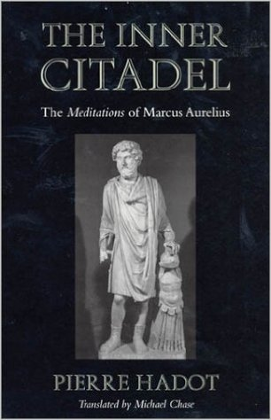

Pierre Hadot, one of the most prominent scholars of ancient philosophy, has written a remarkable guide to both [Marcus Aurelius](https://www.dailystoic.com/marcus-aurelius/) and his Meditations. Despite being academic and a translation from Hadot’s French, this book is readable and offers unparalleled insights into Marcus, his influences and into Stoicism as a philosophy. Read this book!

---

[Philosophy as a Way of Life: Spiritual Exercises from Socrates to Foucault](https://buy.geni.us/Proxy.ashx?TSID=28407&GR_URL=https%3A%2F%2Fwww.amazon.com%2FPhilosophy-Way-Life-Spiritual-Exercises%2Fdp%2F0631180338%3Ftag%3Ddailystoic07-20&dtb=1) by Pierre Hadot

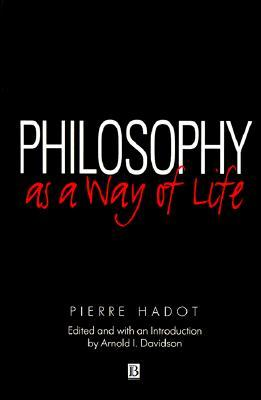

If you end up loving Pierre Hadot’s book on Marcus, [Philosophy as a Way of Life](https://buy.geni.us/Proxy.ashx?TSID=28407&GR_URL=https%3A%2F%2Fwww.amazon.com%2FPhilosophy-Way-Life-Spiritual-Exercises%2Fdp%2F0631180338%3Ftag%3Ddailystoic07-20&dtb=1) is a natural next step. While not focusing uniquely on Stoicism, this book is a key text in understanding how philosophy is more than an academic discipline isolated from real life, but something to guide us and orient us—and most of all—something to be practiced. In this book Pierre Hadot does a fantastic introduction to the concept of ‘spiritual exercises’ and offers examples from multiple philosophers. (After these two, if you like Hadot, I’d also recommend you check out his book [The Present Alone is Our Happiness](https://buy.geni.us/Proxy.ashx?TSID=28407&GR_URL=https%3A%2F%2Fwww.amazon.com%2FPresent-Alone-Our-Happiness-Conversations%2Fdp%2F0804748365%3Ftag%3Ddailystoic07-20&dtb=1). Thanks to Ryan Holiday [for recommending](https://ryanholiday.net/reading-list/) Hadot’s work.)

---

[The Daily Stoic](https://buy.geni.us/Proxy.ashx?TSID=28407&GR_URL=https%3A%2F%2Fwww.amazon.com%2FDaily-Stoic-Meditations-Wisdom-Perseverance%2Fdp%2F0735211736%3Ftag%3Ddailystoic07-20&dtb=1) by Ryan Holiday and Steve Hanselman

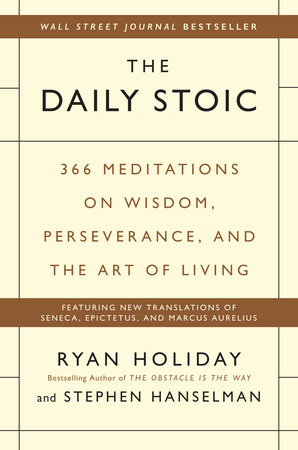

[The Daily Stoic](https://buy.geni.us/Proxy.ashx?TSID=28407&GR_URL=https%3A%2F%2Fwww.amazon.com%2FDaily-Stoic-Meditations-Wisdom-Perseverance%2Fdp%2F0735211736%3Ftag%3Ddailystoic07-20&dtb=1) offers 366 days of Stoic insights and exercises, featuring all-new translations from [Marcus Aurelius](https://www.dailystoic.com/marcus-aurelius/), [Seneca](https://www.dailystoic.com/seneca/), [Epictetus](https://www.dailystoic.com/epictetus/), as well as lesser-known Stoics like [Zeno](https://dailystoic.com/zeno/), Cleanthes, and Musonius Rufus. Each page offers a quote and an accompanying meditation. It is probably the best place to start for someone who has zero familiarity with Stoicism. You can begin by reading [an excerpt from the book](https://dailystoic.com/daily-stoic-excerpt/) that is available on this website.

---

[Courage Under Fire: Testing Epictetus’s Doctrines in a Laboratory of Human Behavior](https://buy.geni.us/Proxy.ashx?TSID=28407&GR_URL=https%3A%2F%2Fwww.amazon.com%2FCourage-Under-Fire-Epictetuss-Laboratory%2Fdp%2F0817936920%3Ftag%3Ddailystoic07-20&dtb=1) by James Stockdale

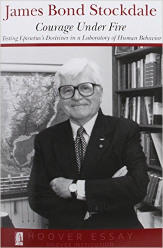

Avid business readers are probably familiar with the ‘Stockdale paradox’ from the bestselling book [Good to Great](https://buy.geni.us/Proxy.ashx?TSID=28407&GR_URL=https%3A%2F%2Fwww.amazon.com%2FGood-Great-Some-Companies-Others%2Fdp%2F0066620996%2F%3Ftag%3Ddailystoic07-20&dtb=1). As its author explained it, the paradox captures Stockdale’s resilient mindset who endured terrible difficulties and adversity as a prisoner of war in Vietnam. [As the author wrote](http://ndoherty.com/stockdale-paradox/), “You must retain faith that you will prevail in the end, regardless of the difficulties. AND at the same time… You must confront the most brutal facts of your current reality, whatever they might be.” The paradox aside, this is a fantastic short book by Stockdale himself that shows how Stoicism can provide the necessary principles and fortitude to survive such an ordeal.

---

[Dying Every Day: Seneca at the Court of Nero](https://buy.geni.us/Proxy.ashx?TSID=28407&GR_URL=https%3A%2F%2Fwww.amazon.com%2FDying-Every-Day-Seneca-Court%2Fdp%2F0307596877%3Ftag%3Ddailystoic07-20&dtb=1) by James Romm

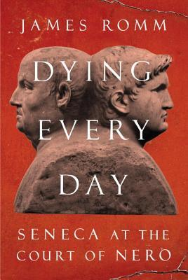

James Romm’s book on Seneca is both a great biography on the man that can help those students of Stoicism who feel conflicted about [Seneca](https://www.dailystoic.com/seneca/)—the complexities of being a wealthy philosopher who was a tutor to one of the worst tyrants in ancient history—to better understand him as well as to dive deeper into the political and social context of the time. It is also a case study of a despot gone mad and the paranoid regime that he gave rise to.

---

[Stoicism and the Art of Happiness](https://buy.geni.us/Proxy.ashx?TSID=28407&GR_URL=https%3A%2F%2Fwww.amazon.com%2FStoicism-Art-Happiness-Teach-Yourself%2Fdp%2F1444187104%3Ftag%3Ddailystoic07-20&dtb=1) by Donald Robertson

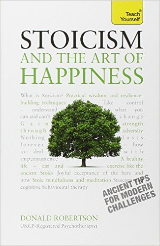

[Donald Robertson](https://dailystoic.com/donald-robertson-interview/)’s book was highly recommended by the Stoic community on reddit. The book has great reviews and as one reader wrote, “In my opinion, Robertson is superior to Hadot, Long, or any other writer on Stoicism because of his Psychotherapy background and his ability to reach the common man.”

---

[Rome’s Last Citizen: The Life and Legacy of Cato, Mortal Enemy of Caesar](https://buy.geni.us/Proxy.ashx?TSID=28407&GR_URL=https%3A%2F%2Fwww.amazon.com%2FRomes-Last-Citizen-Legacy-Mortal%2Fdp%2F0312681232%3Ftag%3Ddailystoic07-20&dtb=1) by Robert Goodman and Jimmy Soni

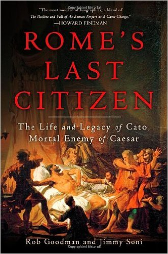

[Cato](https://dailystoic.com/cato/) is probably the closest we have to a perfect Stoic. As one of the authors, [Jimmy Soni](https://dailystoic.com/jimmy-soni-interview/), wrote “The Stoics taught [Cato](https://dailystoic.com/cato/) that there were no shades of gray. There was no more-or-less good, no more-or-less bad. Whether you were a foot underwater or a fathom, you were still drowning. All virtues were one and the same virtue, all vices the same vice.” This is an incredible book that shows what it means to fully live according to one’s principles even if that means dying for them.

---

[A Man in Full](https://buy.geni.us/Proxy.ashx?TSID=28407&GR_URL=https%3A%2F%2Fwww.amazon.com%2FMan-Full-Tom-Wolfe%2Fdp%2F0553381334%3Ftag%3Ddailystoic07-20&dtb=1) by Tom Wolfe

For those looking for a work of fiction that includes the Stoics, this should be your first stop. Tom Wolfe’s famous novel features Epictetus who gets discovered by mistake by Conrad Hensley, a young man who at that point in time has nobody—his wife had given up on him, his car was towed, was out of work and was in jail, where he gets sent by mistake a copy [of Epictetus’s book](https://dailystoic.com/stoic-reading-list/). The book was [heralded as a ‘masterpiece’](http://www.tomwolfe.com/maninfull.html)and back in 1999 the New York Times[wrote on the revival](http://www.nytimes.com/1999/01/02/books/think-tank-the-stoics-have-a-stand-on-everything-even-on-dinner-parties-and-sex.html) of Stoicism due to the book’s influence.

---

[The Philosophy of Cognitive Behavioural Therapy: Stoic Philosophy as Rational and Cognitive Psychotherapy](https://buy.geni.us/Proxy.ashx?TSID=28407&GR_URL=https%3A%2F%2Fwww.amazon.com%2FPhilosophy-Cognitive-Behavioural-Therapy-Psychotherapy%2Fdp%2F1855757567%3Ftag%3Ddailystoic07-20&dtb=1) by Donald Robertson

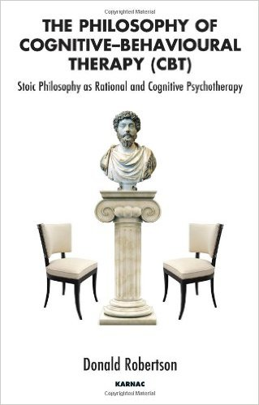

Another book by [Donald Robertson](https://dailystoic.com/donald-robertson-interview/) on the list, this time exploring the fascinating origins of CBT—one of the most effective forms of therapy out there—and how Stoicism plays an important role in its development. To get your started, The Daily Stoic [has interviewed Donald](https://dailystoic.com/donald-robertson-interview/) and he offers a great answer on the origins and parallels between the therapy and the philosophy.

---

[A Guide to the Good Life: The Ancient Art of Stoic Joy](https://buy.geni.us/Proxy.ashx?TSID=28407&GR_URL=https%3A%2F%2Fwww.amazon.com%2FGuide-Good-Life-Ancient-Stoic%2Fdp%2F1522632735%3F%3Ftag%3Ddailystoic07-20&dtb=1) by William Irvine

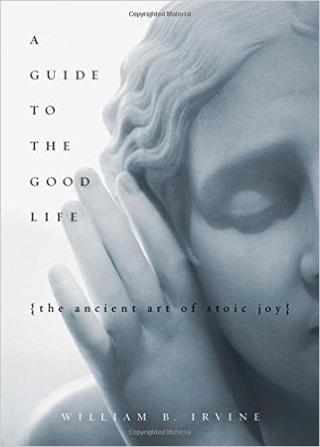

This is probably one of the most famous modern introductory text for beginners. The book is very readable and like other books on the list provides a great introduction to the philosophy for people who are looking to begin their deeper understanding of Stoicism.

---

[The Obstacle is the Way](https://buy.geni.us/Proxy.ashx?TSID=28407&GR_URL=https%3A%2F%2Fwww.amazon.com%2FObstacle-Way-Timeless-Turning-Triumph%2Fdp%2F1591846358%3Ftag%3Ddailystoic07-20&dtb=1) by Ryan Holiday

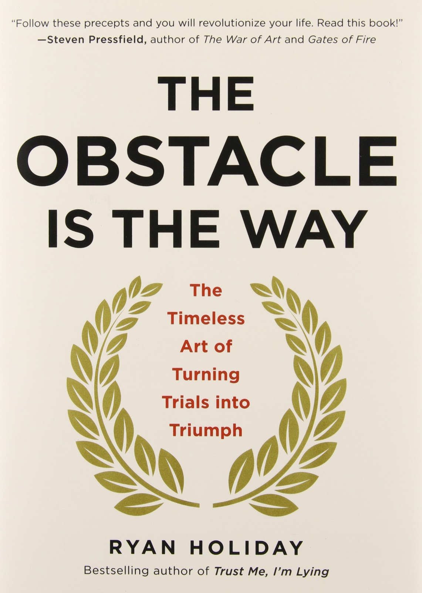

While [Ryan Holiday](http://www.ryanholiday.net/)’s [The Obstacle Is the Way](https://buy.geni.us/Proxy.ashx?TSID=28407&GR_URL=https%3A%2F%2Fwww.amazon.com%2FObstacle-Way-Timeless-Turning-Triumph%2Fdp%2F1591846358%3Ftag%3Ddailystoic07-20&dtb=1) is not a book about Stoicism, it is a book inspired by Stoicism and its key principles for thriving under pressure. Through historical examples of great men and women it teaches us how to overcome adversity and difficulties, turn obstacles upside down and shows us how [to love our fate](https://dailystoic.com/amor-fati/), no matter what it might bring. The book has become a cult classic with coaches and athletes alike and has been featured in prominent outlets [like](https://dailystoic.com/books-on-stoicism/%22http://www.si.com/nfl/2015/12/08/ryan-holiday-nfl-stoicism-book-pete-carroll-bill-belichick) [Sports Illustrated](http://www.si.com/nfl/2015/12/08/ryan-holiday-nfl-stoicism-book-pete-carroll-bill-belichick) and [ESPN](http://www.espn.com/blog/nflnation/post/_/id/223998/authors-influence-has-john-schneider-focused-on-obstacles-ego). You can get a free chapter from the book if you sign up for The Daily Stoic’s [free email course on Stoicism](https://dailystoic.com/new-start-here/).

---

[Ego is the Enemy](https://buy.geni.us/Proxy.ashx?TSID=28407&GR_URL=https%3A%2F%2Fwww.amazon.com%2FEgo-Enemy-Ryan-Holiday%2Fdp%2F1591847818%3Ftag%3Ddailystoic07-20&dtb=1) by Ryan Holiday

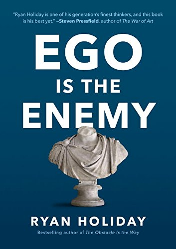

If Ryan’s previous book is about facing external obstacles, this one turns around, challenging us and invites us to look inward and how we are too often our own worst enemy. Similar to  [The Obstacle Is the Way](https://buy.geni.us/Proxy.ashx?TSID=28407&GR_URL=https%3A%2F%2Fwww.amazon.com%2FObstacle-Way-Timeless-Turning-Triumph%2Fdp%2F1591846358%3Ftag%3Ddailystoic07-20&dtb=1) the book draws on examples from philosophy, literature and history helping us curb our ego no matter where we are on our trajectory—aspiring, achieving or failing.

---

[The Consolations of Philosophy](https://buy.geni.us/Proxy.ashx?TSID=28407&GR_URL=https%3A%2F%2Fwww.amazon.com%2FConsolations-Philosophy-Alain-Botton%2Fdp%2F0679779175%3F%3Ftag%3Ddailystoic07-20&dtb=1) by Alain de Botton (part on Seneca)

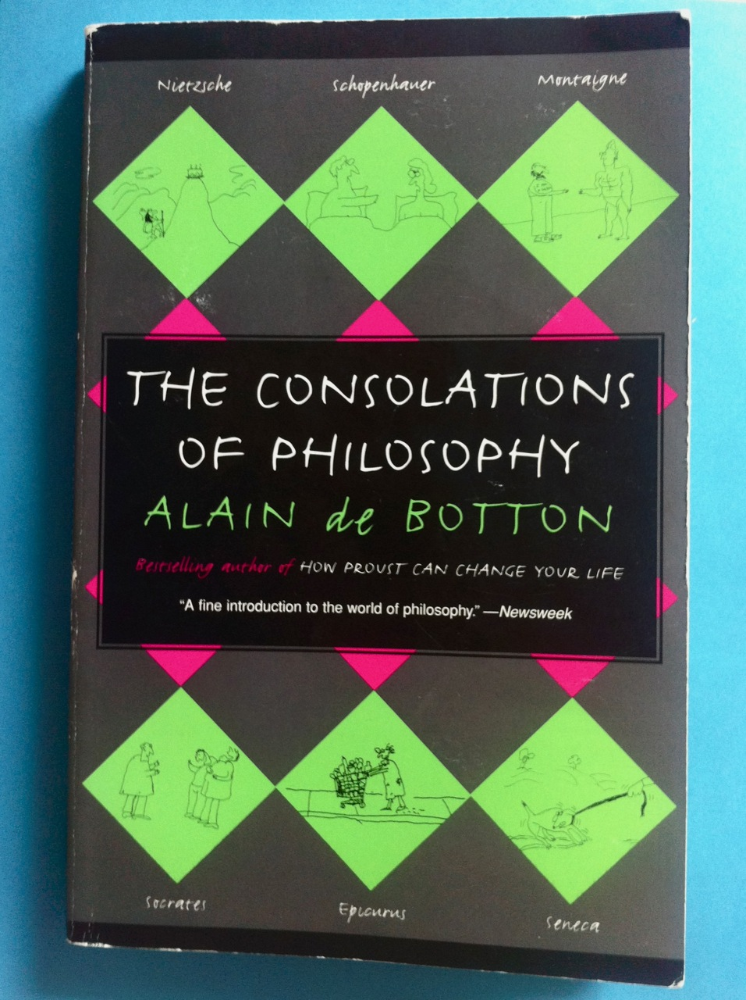

While this book has only one chapter that is directly about Stoicism—the one on Seneca—I highly recommend this book. It offers wise advice from multiple philosophers—from Schopenhauer to Epicurus to Montaigne. If you are looking for a book to supplement your studies on Stoicism with related ideas, this is a great starting point. You can also [watch this video on YouTube](https://www.youtube.com/watch?v=yuDAfU3uj6o) from Alain de Botton and his journey to Rome and what Seneca can teach us about mastering our anger.

---

[Antifragile: Things That Gain from Disorder](https://buy.geni.us/Proxy.ashx?TSID=28407&GR_URL=https%3A%2F%2Fwww.amazon.com%2FAntifragile-Things-That-Disorder-Incerto%2Fdp%2F0812979680%3Ftag%3Ddailystoic07-20&dtb=1) by Nassim Nicholas Taleb

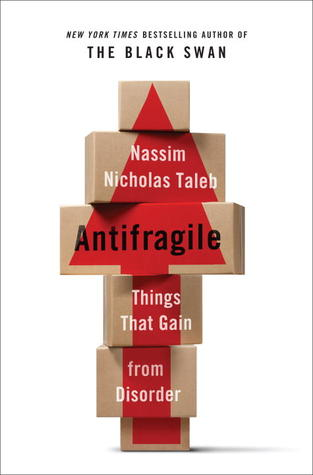

I was first introduced to Stoicism and Seneca in Nassim Taleb’s [The Black Swan](https://buy.geni.us/Proxy.ashx?TSID=28407&GR_URL=https%3A%2F%2Fwww.amazon.com%2FBlack-Swan-Improbable-Robustness-Fragility%2Fdp%2F081297381X%2F%3Ftag%3Ddailystoic07-20&dtb=1). It is one of my favorite books but I’d be more inclined to recommend his Antifragile’s chapter on Seneca which provides one of the best and most succinct explanation of the philosophy and how its principles can help us both in times of prosperity and in moments of difficulty.

---

[Examined Lives: From Socrates to Nietzsche](https://buy.geni.us/Proxy.ashx?TSID=28407&GR_URL=https%3A%2F%2Fwww.amazon.com%2FExamined-Lives-Nietzsche-James-Miller%2Fdp%2F125000232X%3F%3Ftag%3Ddailystoic07-20&dtb=1) by James Miller

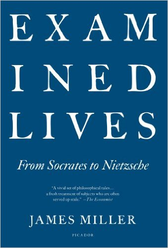

A New York Times Notable Book for 2011, James Miller’s Examined Lives explores the lives of twelve famous philosophers—[Seneca](https://www.dailystoic.com/seneca/) including—looking for wisdom and guidance. Similar to Alain de Botton’s book on the list, the chapter on Seneca alone is worth it but any student of Stoicism can benefit from reading about Diogenes, Socrates, Montaigne and others to find helpful bits that lead us to living a little bit better each day.

---

[Stoic Warriors: The Ancient Philosophy behind the Military Mind](https://buy.geni.us/Proxy.ashx?TSID=28407&GR_URL=https%3A%2F%2Fwww.amazon.com%2FStoic-Warriors-Ancient-Philosophy-Military%2Fdp%2F019531591X%3F%3Ftag%3Ddailystoic07-20&dtb=1) by Nancy Sherman

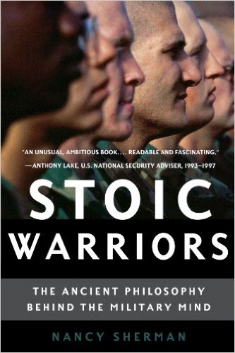

Nancy Sherman, a distinguished University Professor of Philosophy at Georgetown, looks at the history of Stoicism in the military. This book can be heavy at times and if you are looking for a lighter introduction to how Stoicism can help soldiers you can look into Stockdale’s book earlier on the list. For those ready for a serious intellectual challenge, Nancy Sherman’s book is the next step.

---

[Stoicism](https://buy.geni.us/Proxy.ashx?TSID=28407&GR_URL=https%3A%2F%2Fwww.amazon.com%2FStoicism-Ancient-Philosophies-John-Sellars%2Fdp%2F0520249089%2F%3Ftag%3Ddailystoic07-20&dtb=1) by John Sellars

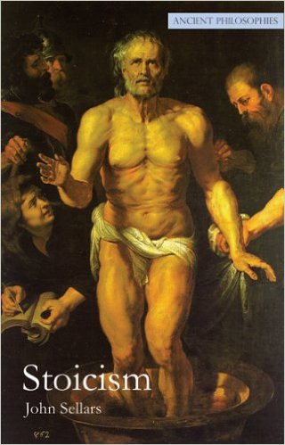

John Sellars is a [Research Fellow in the Department of Philosophy at King’s College London](http://www.kcl.ac.uk/artshums/depts/philosophy/people/staff/associates/research/sellars.aspx) and his research interests are focused on Hellenistic and Roman philosophy, and Renaissance philosophy. His focus has been on Stoicism and its reception. The Philosophers’ Magazine [called this book](http://www.thephilosophersmagazine.com/TPM/article/view/12771) “the best introduction to the subject,” and another prominent [Stoic scholar called it](http://www.johnsellars.org.uk/stoicism.html) “both highly readable and yet based on solid academic study.”

---

[Stoics, Epicureans, and Sceptics: An Introduction to Hellenistic Philosophy](https://buy.geni.us/Proxy.ashx?TSID=28407&GR_URL=https%3A%2F%2Fwww.amazon.com%2FStoics-Epicureans-Sceptics-Introduction-Hellenistic%2Fdp%2F0415110351%3Ftag%3Ddailystoic07-20&dtb=1) by R. W. Sharples

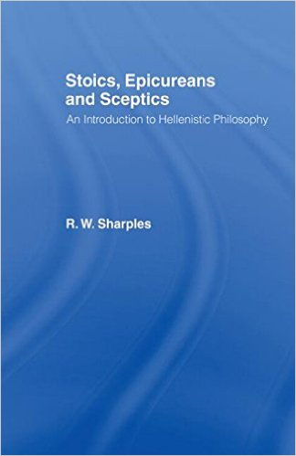

This book focuses not only on the Stoics but also on the Epicureans as well as various sceptical traditions from the death of Alexander the Great in 323 BC to about AD 200. It’s the book of choice who are looking to understand the broader context and the adjacent philosophies.

---

[The Stoics: A Guide for the Perplexed](https://buy.geni.us/Proxy.ashx?TSID=28407&GR_URL=https%3A%2F%2Fwww.amazon.com%2FStoics-Guide-Perplexed-Guides%2Fdp%2F1847060447%3Ftag%3Ddailystoic07-20&dtb=1) by Andrew Holowchak

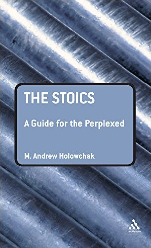

This book was recommended on the reddit thread and serves as an introductory text for those unfamiliar with the philosophy. It has been described as “a clear and lively introduction to Stoicism, with emphasis on ethics.” Its author, M. Andrew Holowchak, is Assistant Professor of Philosophy at Wilkes University.

---

[The Stoics](https://buy.geni.us/Proxy.ashx?TSID=28407&GR_URL=https%3A%2F%2Fwww.amazon.com%2FStoics-F-H-Sandbach%2Fdp%2F0872202534%3Ftag%3Ddailystoic07-20&dtb=1) by F. H. Sandbach

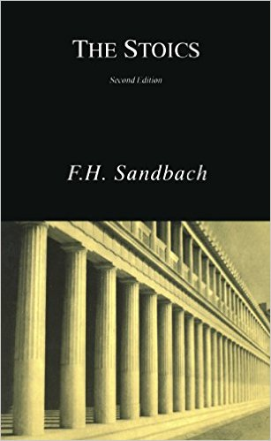

This book was also recommended in the reddit thread and while there is limited information online on the book, its reviews point that it’s a solid work on Stoicism: “Not only one of the best but also the most comprehensive treatment of Stoicism written in this century.” Times Literary Supplement

---

[Stoicism and Emotion](https://buy.geni.us/Proxy.ashx?TSID=28407&GR_URL=https%3A%2F%2Fwww.amazon.com%2FStoicism-Emotion-Margaret-Graver%2Fdp%2F0226305589%3Ftag%3Ddailystoic07-20&dtb=1) by Margaret Graver

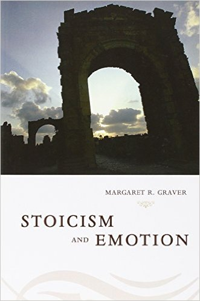

In this book, Margaret Graver argues that the chief demand of Stoic ethics is not that we should suppress or deny our feelings, but that to perfect our rational mind. A must-read book for anyone who wants to better understand the connection between Stoicism and emotions and to help them develop strong arguments against the popular misunderstanding that the core focus of the philosophy is suppressing one’s emotions and feelings.

---

[The Cambridge Companion to the Stoics](https://buy.geni.us/Proxy.ashx?TSID=28407&GR_URL=https%3A%2F%2Fwww.amazon.com%2FCambridge-Companion-Stoics-Companions-Philosophy%2Fdp%2F0521779855%3Ftag%3Ddailystoic07-20&dtb=1) by Brad Inwood

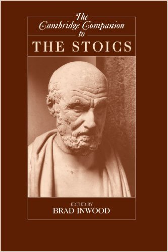

I found this book as one of the top [recommendations from Massimo Pigliucci](https://howtobeastoic.wordpress.com/books/) and I will let his strong endorsement speak for the book: “This unique volume offers an odyssey through the ideas of the Stoics in three particular ways: first, through the historical trajectory of the school itself and its influence; second, through the recovery of the history of Stoic thought; third, through the ongoing confrontation with Stoicism, showing how it refines philosophical traditions, challenges the imagination, and ultimately defines the kind of life one chooses to lead.”

---

[Everything Has Two Handles: The Stoic’s Guide to the Art of Living](https://buy.geni.us/Proxy.ashx?TSID=28407&GR_URL=https%3A%2F%2Fwww.amazon.com%2FEverything-Has-Two-Handles-Stoics%2Fdp%2F0761839518%3Ftag%3Ddailystoic07-20&dtb=1) by Ronald Pies

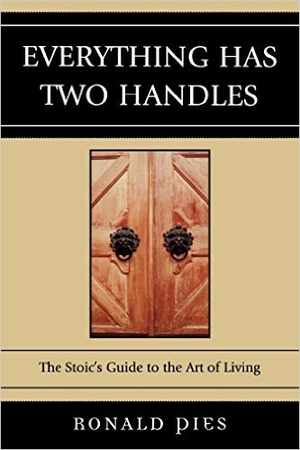

Ronald Pies, M.D. is Professor of Psychiatry and Lecturer on Bioethics and Humanities at S.U.N.Y. and this book not only shows how Stoicism can be path to happiness and tranquility but the author also draws from his own case studies as a therapist.

---

[Philosophy for Life: And Other Dangerous Situations](https://buy.geni.us/Proxy.ashx?TSID=28407&GR_URL=https%3A%2F%2Fwww.amazon.com%2FPhilosophy-Life-Other-Dangerous-Situations%2Fdp%2F1608682293%3Ftag%3Ddailystoic07-20&dtb=1) by Jules Evans

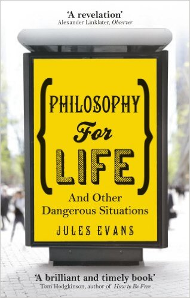

I’ve been meaning to buy this book ever since reading [Jules Evans’s interview](https://dailystoic.com/julian-evans-interview/) for The Daily Stoic. In his interview Jules emphasizes how everyone can benefit from Stoic techniques yet he is critical of the philosophy’s lack of humor, not emphasizing the importance of friendship and he finds the philosophy too much rule-based. As his book explores numerous other schools and philosophers, I’d be curious to find out what has also resonated with Jules and where did he find answers that maybe Stoicism wasn’t able to provide.

---

[A New Stoicism](https://buy.geni.us/Proxy.ashx?TSID=28407&GR_URL=https%3A%2F%2Fwww.amazon.com%2FNew-Stoicism-Lawrence-C-Becker%2Fdp%2F0691009643%3Ftag%3Ddailystoic07-20&dtb=1) by Lawrence C. Becker

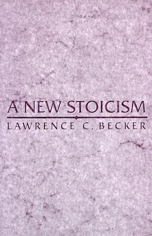

I discovered this book on [Massimo Pigliucci’s list](http://fivebooks.com/interview/massimo-pigliucci-stoicism/) on the best books about Stoicism. It is reserved only for the most serious scholars. As Massimo explains, “It’s quite a difficult book to read in some ways; if you don’t have a certain amount of background in philosophy, you’re probably not going to get as much out of it as you should, although Becker himself is aware of this.” Yet he clarifies that “the main sections of each chapter can be read, can be understood, by somebody with little or no background in philosophy.”

---

[The Greatest Empire: A Life of Seneca](https://buy.geni.us/Proxy.ashx?TSID=28407&GR_URL=https%3A%2F%2Fwww.amazon.com%2FGreatest-Empire-Life-Seneca%2Fdp%2F0199926646%3Ftag%3Ddailystoic07-20&dtb=1) by Emily Wilson

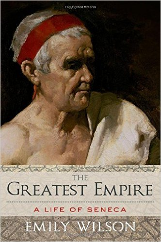

Of all the Stoic philosophers [Seneca](https://www.dailystoic.com/seneca/) is prone to generate the most controversy. As the book description asks: “How can we reconcile the bloody tragedies with the prose works advocating a life of Stoic tranquility? How are we to balance Seneca the man of principle, who counseled a life of calm and simplicity, with Seneca the man of the moment, who amassed a vast personal fortune in the service of an emperor seen by many, at the time and afterwards, as an insane tyrant?” If you are a fan of Seneca and want to study the man, make sure to read this biography [as well as James Romm’s](https://buy.geni.us/Proxy.ashx?TSID=28407&GR_URL=https%3A%2F%2Fwww.amazon.com%2FDying-Every-Day-Seneca-Court%2Fdp%2F0307596877%3Ftag%3Ddailystoic07-20&dtb=1).

---

[How to Be a Stoic: Using Ancient Philosophy to Live a Modern Life](https://buy.geni.us/Proxy.ashx?TSID=28407&GR_URL=https%3A%2F%2Fwww.amazon.com%2FHow-Be-Stoic-Ancient-Philosophy%2Fdp%2F0465097952%3Ftag%3Ddailystoic07-20&dtb=1)by Massimo Pigliucci (forthcoming)

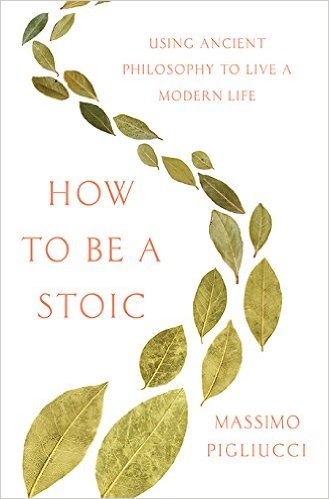

In the Stoic community, Massimo Pigliucci needs no introduction. He is behind the popular [‘How to be a Stoic’ blog](https://howtobeastoic.wordpress.com/) which is “an evolving guide to practical Stoicism for the 21st century.” You also probably remember Massimo’s from [his widely popular article on Stoicism](https://opinionator.blogs.nytimes.com/2015/02/02/how-to-be-a-stoic/) in the New York Times from two years ago. Although his upcoming book is not yet out (May 2017), I’ve already preordered it knowing the high standards of Massimo’s work. His recommendations on his [favorite books on Stoicism](https://howtobeastoic.wordpress.com/books/) have also helped create this list as well.

---

[Marcus Aurelius: A Life](https://buy.geni.us/Proxy.ashx?TSID=28407&GR_URL=https%3A%2F%2Fwww.amazon.com%2FMarcus-Aurelius-Life-Frank-McLynn%2Fdp%2F0306818302%3Ftag%3Ddailystoic07-20&dtb=1) by Frank McLynn

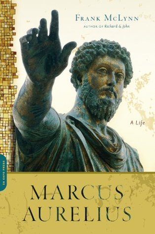

I discovered this book [on Massimo’s list](https://howtobeastoic.wordpress.com/books/) and he describes as “the definitive biography to date of this monumental historical figure.” Before jumping into it or Pierre Hadot’s book, I’d recommend reading the fantastic introduction to Marcus that is in Gregory Hays’s translation of [Meditations](https://dailystoic.com/stoic-reading-list/) as well as [Ryan Holiday’s one hundred lessons from Marcus Aurelius](https://ryanholiday.net/100-things-learned-10-years-100-reads-marcus-aureliuss-meditations/) and [this lecture series on YouTube](https://www.youtube.com/watch?v=nLD09Qa3kMk) which provide fantastic starting points to Marcus.

---

I am nowhere near having read all of these but I will be referring to this list during the year to find my next read. Do you have any recommendations? Did I miss any? Please [fill out this form](https://goo.gl/forms/F6ORqHtU8gRpfUMB2) with your suggestions.

RELATED:

[The Stoic Reading List: 3 Must-Read Books To Get You Started](https://dailystoic.com/stoic-reading-list/)

---

**Explore Our Daily Stoic Store**

### *Related posts:*

[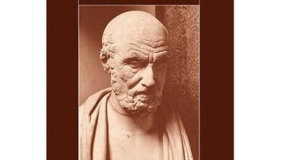](https://dailystoic.com/brad-inwood/ "A Personal Interest Turned Lifelong Career: An Interview With Professor Brad InwoodAs an undergraduate, Professor Brad Inwood read the Stoics only by chance, thanks to an obscure anthology which had snippets from Epictetus. The philosophy resonated with him but it was only once his original Ph.D dissertation on Aristotle “melted down” that he turned his personal fascination with the Stoics into…")

#### [A Personal Interest Turned Lifelong Career: An Interview With Professor Brad Inwood](https://dailystoic.com/brad-inwood/ "A Personal Interest Turned Lifelong Career: An Interview With Professor Brad InwoodAs an undergraduate, Professor Brad Inwood read the Stoics only by chance, thanks to an obscure anthology which had snippets from Epictetus. The philosophy resonated with him but it was only once his original Ph.D dissertation on Aristotle “melted down” that he turned his personal fascination with the Stoics into…")

#### [Five Reasons Why Stoicism Matters Today](https://dailystoic.com/five-reasons-why-stoicism-matters-today/ "Five Reasons Why Stoicism Matters TodayFor all the press that Bill Clinton has gotten for his epic, seemingly-half-improvised convention stem-winder, one of the most revealing lines has barely earned a mention at all. We were surprised to hear Clinton called Barack Obama “a man cool on the outside, but who burns for America on the…")

#### [The Stoic Scholar: Interview With Professor Anthony Long](https://dailystoic.com/anthony-long/ "The Stoic Scholar: Interview With Professor Anthony LongIn 1964, a young PhD student in London was told that Stoicism was the most neglected field in ancient philosophy. Five decades later, that student is one of the most respected and leading philosophers at one of the most important universities in the world, still studying that very topic. His…")
