# gorillaz — a banda que faz da sua rotina uma estratégia de comunicação

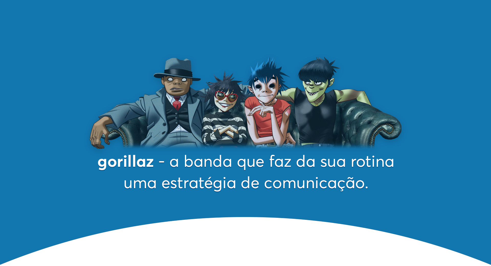

A cada ano, novas mídias, aplicativos, canais e plataformas surgem com o intuito de trazer mais informação e entretenimento para as pessoas. Por conta disso, os antigos meios de comunicação — como TV e Jornal — começaram agora a perder audiência e, em busca de visualizações e conhecimento, as marcas estão correndo atrás de saídas que sejam mais baratas e mais eficazes.

Um grupo musical não foge desse problema. Hoje, a meta — [que antes era aparecer em programas de televisão e vender discos](https://medium.com/contracorrente/a-nova-loja-de-discos-fed95a285bfa)— mudou, e a força das redes sociais fez com que uma nova estratégia de publicidade surgisse: o **Transmídia**. Apesar do nome difícil, você aplica o Transmídia no dia-a-dia mais do que imagina. Por exemplo, no Instagram, por ser uma plataforma só de imagens e vídeos, dificilmente você vai ver pessoas contando seus pensamentos diários. Já no Twitter, por ter foco em texto, dificilmente você vai ver pessoas colocando fotos artísticas, mas sim contando aqueles pensamentos que, no Instagram, estariam fora do padrão.

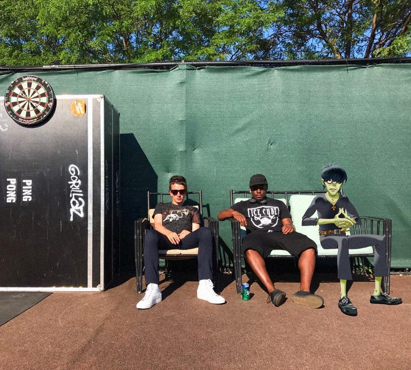

Essa distinção de conteúdo a partir das plataformas em que é inserido é o famoso **Transmídia**, e por mais que não pareça algo complicado, quando feito de modo estratégico, pode vencer qualquer belo comercial de 15 segundos.

**Gorillaz: genial como deveria ser.**Se tem uma banda que faz isso muito bem, essa banda é o Gorillaz. Criada por Damon Albarn, vocalista do Blur, e o ilustrador Jamie Hewlett,, a banda é formada por quatro personagens fictícios — o baixista Murdoc, o vocalista 2-D, a tecladista Noodle e o baterista Russel. Com cinco discos lançados, a banda possui uma história própria que é contada cronologicamente a partir de cada CD.

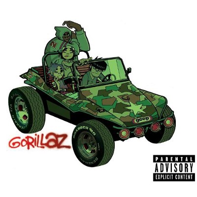

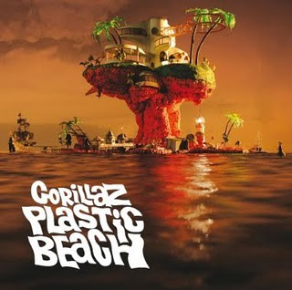

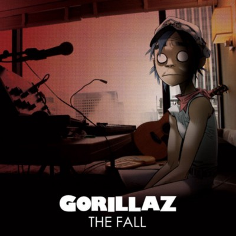

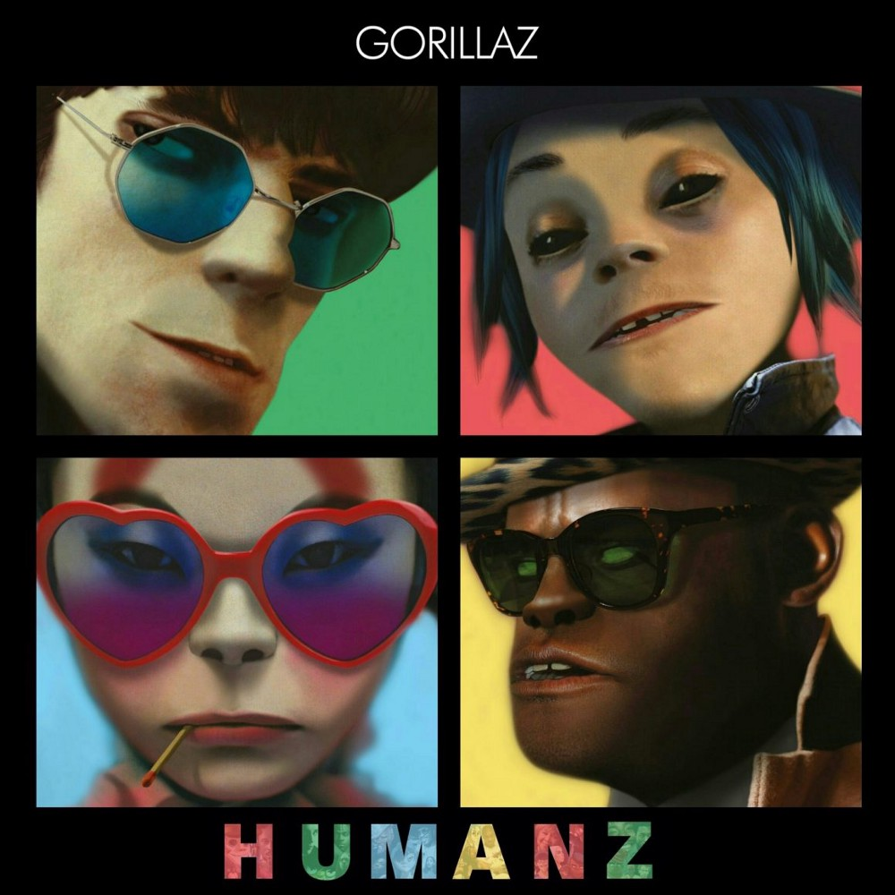

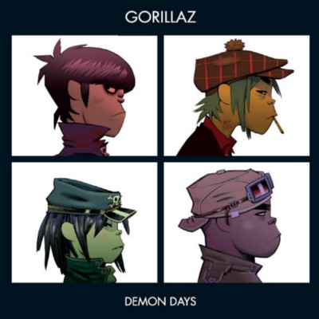

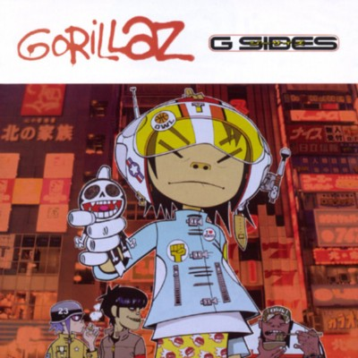

No início da trajetória da banda, como as mídias sociais não eram tão conhecidas como hoje, o grupo começou a contar sua história por meio de uma “autobiografia”. No livro **Rise of The Ogre** (O Nascimento do Ogro), já era possível observar que a banda tem todo um Storytelling envolvido, e que só iria se expandir.

O primeiro momento em que podemos ver o uso do Transmídia em Gorillaz é olhando o Instagram da banda. Desde a utilização de fotos estáticas até vídeos e animações, o grupo continua contando sua história de uma maneira completamente visual, se aproveitando dos 4 personagens que só se tornam reais quando visíveis. As postagens mais recentes servem de impulsionamento do disco lançado este ano, chamado Humanz.

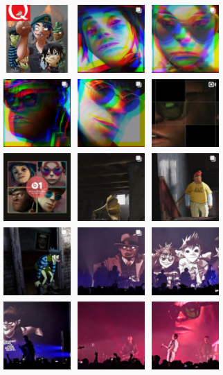

Instagram da banda [@gorillaz](https://www.instagram.com/gorillaz/?hl=pt-br)

No Twitter, pelo foco em texto, a banda aponta toda sua produção em divulgação de shows. Mesmo assim, ela conseguiu fazer com que os fãs se aproximassem ainda mais dela, criando um twitter próprio para o Murdoc Niccals, o baixista fictício da banda, que twitta diariamente como se ele mesmo estivesse conversando com as pessoas. Por mais que seja simples, essa é uma estratégia brilhante para fazer com que o seu público se sinta mais próximo.

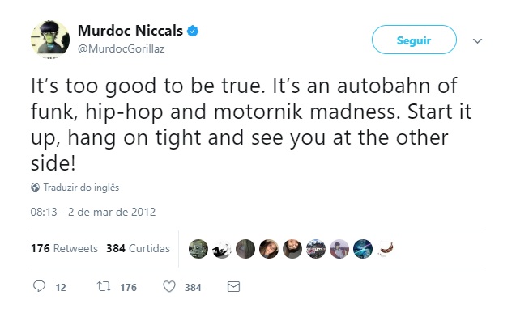

Twitter do baixista [@MurdocNiccals](https://twitter.com/murdocgorillaz)

Além dessas plataformas, a banda também se utiliza de sites próprios com interfaces de games, curtas metragens, videoclipes e produtos de licenciamento. Esse diversificado uso das redes, com focos específicos, fez com que a banda acumulasse mais de 1 milhão de seguidores, e se tornasse um exemplo de como uma banda pode se programar como uma empresa aplicando um belo **Transmídia.**

E aí, tá pronto pra estruturar um bom transmídia pra sua empresa? Ou melhor, para **você mesmo?**

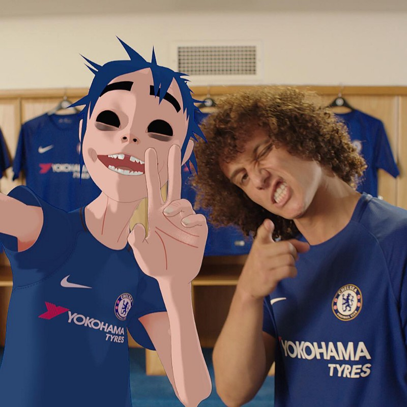
