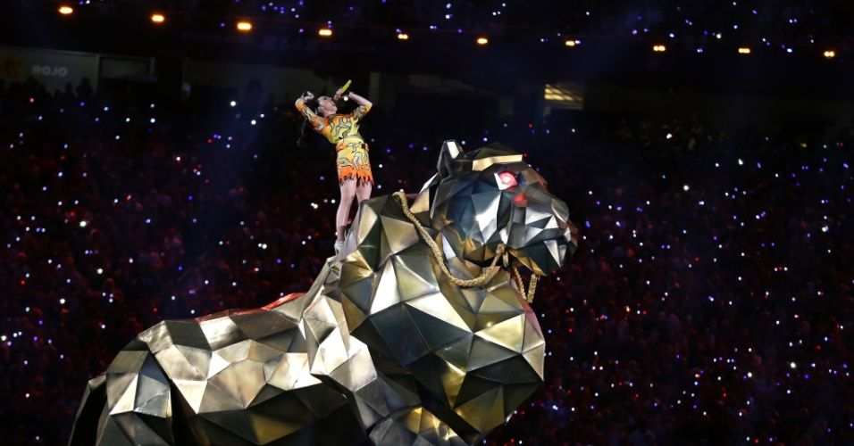
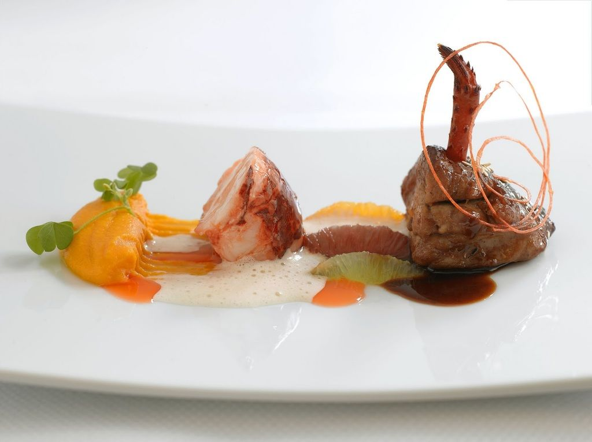
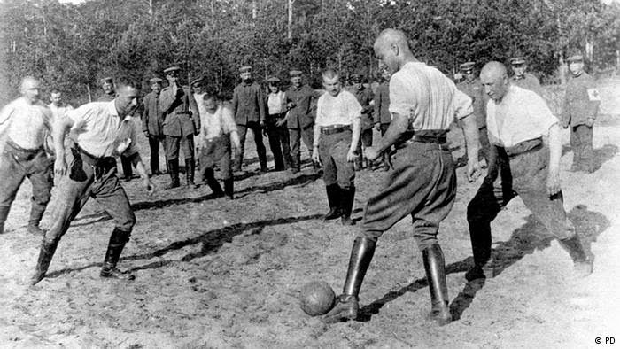
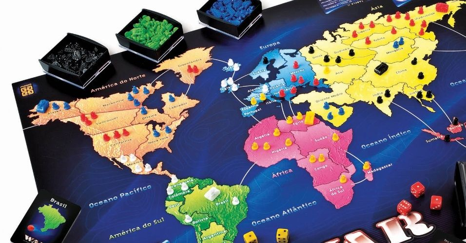

# A arte perdida da diversão barata

Esse texto vai dizer tudo que você precisa ouvir e saber sobre como se divertir gastando muito pouco (ou nada).

Mês passado alguns de nossos amigos nos convidaram para participar de um time numa corrida de revezamento que seguiria ao longo de duas noites e um dia. Cada membro do time precisaria correr várias etapas de um percurso de 320km, que foi estabelecido em vários parques federais com paisagens lindas. A equipe de 10 pessoas seria dividida em duas vans. Enquanto uma carregava a equipe, a outra seguia atrás esperando seu momento de assumir o posto, e assim elas seguiram pulando como sapos até o final.

Para mim o evento parecia ter lados positivos e negativos, e custei a me decidir se me inscrevia ou não. No lado positivo, era uma boa oportunidade de passar algum tempo (intenso, sem sono) com amigos. Os lados negativos é que odeio correr, aparentemente passaria mais tempo dentro de uma van fedida do que em contato com a natureza, e a taxa de inscrição era US$ 100.

Enquanto eu tentava me decidir se iria ou não, um amigo tentou me persuadir a ir, dizendo: “Encare como uma oportunidade de passar tempo na natureza e conversar bastante.” Mas eu só queria responder algo como: “Se a questão é natureza e amizade, então porque não juntamos os US$ 1000 e vamos para um camping?”

Mas não disse nada. Não queria ser grosso, ou acabar com o programa de ninguém.

Na verdade não tenho nada especificamente contra eventos desse tipo, corridas de obstáculos, gincanas, etc. Podem ser muito divertidos, e frequentemente valem o dinheiro empregado. Só que muitas vezes parece que minha (confesso que modesta) vida social gira em torno de convites para eventos bem-estruturados e pagos – e não só coisas fisicamente desafiadoras, mas noites de bingo beneficente, shows, festivais, esportes, jogos etc..

Hoje é muito raro, me parece, que o pessoal convide os amigos para encontros baratos, não muito estruturados e informais. Algo, sabe, mais como: “E aí? Não quer vir aqui em casa e comer uma pizza?”

Sim, parece que perdemos a arte da diversão barata.

### A arte perdida da diversão barata

Eu sei, eu sei. Afirmar que perdemos a arte da diversão barata soa como aquelas afirmações nostálgicas baseadas em meras especulações embasadas em uma amostragem pequena.

Mas da mesma forma que não se leva uma faca para um duelo a tiro, nunca se deve olhar para o passado sem jogar umas estatísticas para comprovar os sentimentos. E, cara, estatísticas eu realmente tenho.

Em primeiro lugar, [de acordo com o Comitê de Estatísticas do Trabalho](http://www.bls.gov/tus/), desde 2003 o tempo que os estadunidenses usaram para participar ou organizar eventos sociais diminuiu 30%. E a queda é ainda maior com relação à geração mais jovem; aqueles com idades entre 15 e 24 anos passaram 40% menos tempo organizando e participando de eventos sociais do que dez anos atrás. Ao mesmo tempo, o número de horas que passamos organizando ou participando eventos ligados a esportes, cultura ou arte se manteve igual.

Ainda assim, mesmo que estejamos organizando ou participando de menos reuniões e festas, e nos mantendo participando e assistindo atividades recreativas no mesmo percentual, nossos gastos com lazer [subiram 30%](http://www.heritage.org/research/reports/2007/08/upwards-leisure-mobility-americans-work-less-and-have-more-leisure-time-than-ever-before#_ftn8) nos últimos 45 anos. Em termos de dólares (ajustados segundo a inflação, e de acordo com a renda), em 1970 o americano médio gastava com diversão US$ 850 por ano, enquanto que hoje cada um de nós gasta US$ 2500. Em outras palavras, embora ocupemos menos de nosso tempo com recreação social/física/cultural, estamos gastando três vezes o que gastávamos quatro décadas e meia atrás.

O que esses dados sugerem é que, enquanto não nos divertimos mais tão frequentemente, quando o fazemos, tendemos a escolher atividades mais caras – coisas como jantares-bingo beneficentes de US$ 40 por prato, corridas de revezamento de US$ 100, jogos da NFL de US$ 85, e festivais de música de US$ 150. Sem mencionar as muitas conferências e acampamentos nascidos na web que viraram encontros presenciais, e que algumas vezes são ligadas a negócios, mas outras vezes são apenas divertimento.

Não importa como se encare os dados, os fatos realmente expõe a nostalgia: a diversão hoje em dia vem na forma de um convite que custa caro.

### A ascensão do entretenimento pago

E o que está por trás dessa tendência de maiores gastos com diversão? Eu sugeriria três possibilidades:

#### Acostumamos-nos com atividades estruturadas e pré-planejadas.

Uma coisa com que acredito minha geração tenha dificuldade é saber começar as coisas sem ajuda.

Ao crescermos como meninos ou meninas nos anos 2000, nossas agendas basicamente estavam estruturadíssimas. Em vez de nos deixarem livres e soltos improvisando jogos de taco no terreno baldio, nos inscreveram em clubes esportivos, e até mesmo nossos encontros para brincar com outras crianças foram agendados com hora marcada por nossas mães com as outras mães. Escolhemos que carreira seguir no ensino médio e nos asseguramos de incluir muitas atividades extracurriculares estruturadas para ajudar em nossa entrada na universidade.

Agora adultos, estamos perdidos e não sabemos nos divertir com nossas próprias atividades, criadas por nós mesmos.

Estamos tão acostumados a apenas aparecer em eventos já organizados e meramente participar deles, que nos falta experiência em planejar e oferecer nossos próprios piqueniques. Isso torna o entretenimento pago bastante interessante. Queremos que nossas experiências se manifestem no apertar de um botão. Fazer compras, arrumar o ambiente, limpar? Trabalho demais.

#### Acostumamos-nos com experiências de alta qualidade.

Uma vez que se começa a pagar mais por diversão sem contratempos, sem dificuldades, fica difícil seguir outro padrão no que diz respeito ao lazer. Qualquer coisa que não seja perfeita começa a parecer meio boboca. Até embaraçosa.

Quando o *The New York Times* publicou um artigo sobre porque os jovens não organizavam mais festas, alguns entrevistados falaram das expectativas exageradas de seus conhecidos. Tendo crescido numa cultura que celebra o gourmet e o artesanal, sentem que não podem convidar seus amigos para jantar a não ser que criem uma refeição magnífica. Não dá para fazer um cozido e oferecer um fardinho de 24 latinhas de cerva light; parece que todos precisamos oferecer tacos de carne de javali com molho de pistache, acompanhados com cerveja de botique.

Infelizmente, uma vez que nos acostumamos com divertimento de alta qualidade, fazer qualquer coisa menos extraordinária parece sem sentido. Talvez por isso o número de americanos que viajaram para o exterior tenha duplicado desde 1970. No que diz respeito à viagem, ou você vai para um lugar exótico ou fica em casa. Explorar a própria cidade ou uma cidade vizinha? Pra que serve isso?

#### Eventos especiais fazem com que seja mais fácil convidar os outros.

E aí está outra coisa com que os 'milênios' quebram a cabeça: socializar fora da internet. Especialmente no que diz respeito a fazer amizades enquanto adulto. Eu mesmo certamente descobri o quanto isso muitas vezes é difícil.

É preciso dar aquele salto de conhecidos da igreja ou do trabalho para um encontro fora dessas instituições. Mas convidar alguém só para passar um tempo ou jantar parece vulnerável ou esquisito. Convidar alguém para uma corrida de revezamento, por outro lado, não apresenta riscos. Eventos especiais criam um motivo claro para se encontrar, e assim eliminam a pressão inerente aos convites sociais. Aí está clara sua popularidade com aqueles que têm dificuldade em socializar, ou em fazer amigos na idade adulta. Isto é, a maioria de nós.

### A defesa da diversão barata

É claro que nossa tendência de hoje em dia (escolher a recreação paga de alta qualidade e não a variedade mais barata e casual) não deixa de ter seus lados positivos. E, novamente, não sou totalmente contra a participação em tais eventos. Desde que com moderação, já que há boas razões para também preencher o tempo livre com diversão barata:

#### Quanto mais barata a diversão, mais diversão se pode usufruir.

Ir a um jogo de baseball da MLB é algo que o orçamento médio só permite ocasionalmente, já a quantidade de jogos de bola improvisados que as pessoas podem jogar é praticamente infinito.

#### A diversão barata pode envolver todos os amigos, independentemente de suas situações financeiras.

Uma das dificuldades com a amizade após a faculdade é que nem todo mundo está na mesma situação financeira. Nem todo mundo consegue pagar ingressos para todos os eventos especiais a que é convidado. Encontros baratos, por outro lado, são viáveis para todos.

#### **A diversão barata nos dá oportunidade de improvisar e criar.**

Certamente é fantástico ir a um evento em que seu único papel é aparecer e se divertir. Mas também vez ou outra [criar uma experiência para os outros](http://www.artofmanliness.com/2010/04/06/modern-maturity-create-more-consume-less/) pode trazer muita satisfação. Quando se está tentando manter as coisas o mais simples possível, também se tem a oportunidade de descobrir como tirar o máximo do mínimo. Em outras palavras, é uma oportunidade de praticar a arte masculina da improvisação.

#### A diversão barata muitas vezes resulta em mais aventuras/memórias.

Mesmo que muitos eventos pagos propagandeiem sua dificuldade, risco, aventura etc., na verdade os organizadores farão o que estiver a seu alcance para tornar tudo o mais previsível e seguro possível, tentando manter uma sensação de ousadia em meio a isso. Eventos assim geralmente são altamente planejados e estruturados. Experiências que você mesmo cria, porém, tem um aspecto real de risco e imprevisibilidade – elementos que criam aventura e memórias verdadeiras!

### Como manter a diversão barata realmente barata

Esse tempo todo temos falado de diversão “barata”, mas é claro, barato é algo relativo; o que é barato para uma pessoa com um salário de cinco dígitos pode parecer caro para alguém que está só conseguindo pagar as contas. Assim, muitas atividades não são caras ou baratas por sua natureza, e podem ser executadas em várias faixas de preço, isto é, você pode convidar amigos para ver um filme e servir escargot, ou apenas pipoca. Da mesma forma, fazer trilha pode ser uma forma de diversão baratíssima, a não ser que você decida investir numa mochila e equipamentos de alta qualidade.

Assim, as atividades possíveis sugeridas na lista abaixo podem ser *potencialmente* baratas, caso exerçamos controle e as planejemos com cautela.

As formas mais certas de fazer isso são (1) **pegar todo o material de que se precisa emprestado**, quando possível, evitando ao máximo comprar qualquer coisa e (2) **fazer uma vaquinha com os participantes**. Se passar o chapéu não é sua praia, confie na lei da reciprocidade. Isto é, você cobre a maioria dos custos quando você é o anfitrião, e quando seus amigos o convidarem, espere o mesmo.

Por exemplo, meus amigos e eu temos um acordo informal de nos convidarmos para jantar uma vez por mês; o anfitrião daquele mês oferece um aperitivo e as bebidas, e os outros dois casais trazem uma sobremesa e um prato de acompanhamento. Assim cada família diminui o custo total de seus encontros. Esse arranjo também elimina o fardo do anfitrião precisar oferecer uma refeição completa sozinho. A vitória da festa americana!

### **Ideias para recuperar a arte da diversão barata**

Precisa de uma ideia para uma diversão barata? Uma palavra para você: salsichão.

Diversão é um termo muito amplo; é possível se divertir sozinho ou em grupo, e isso inclui desde atividades quietas e caseiras como ler ou ouvir música, a atividades na rua, como andar de bicicleta, fazer trilha, até passatempos altamente envolventes, como hobbies e viagens. O foco deste artigo é a diversão em termos sociais, já que os gastos ligados às formas solitárias não parecem ter tido o mesmo tipo de inflação. Também é de forma geral mais fácil pensar em formas de se divertir sozinho do que em grupo.

(Se você precisa de ideias quanto a diversão solitária, verifique [esta lista de formas fáceis de se divertir sozinho](http://www.artofmanliness.com/2015/02/28/17-things-to-do-on-sunday-besides-surfing-the-internet/), bem como [nossa lista de hobbies](http://www.artofmanliness.com/2010/01/06/45-manly-hobbies/).)

Assim ideias que seguem para revivermos a arte da recreação barata se centram em atividades em grupo que são fáceis de executar e podem ser aproveitadas com a família ou com amigos:

- **Piquenique.** Deixe o restaurante para lá, faça sua refeição na natureza. Um sanduíche de presunto e batatinhas fritas parecem desinteressantes comidos em casa, mas fantásticos quando consumidos numa paisagem bucólica.
- **Jogos de tabuleiro.** [Há milhares de razões para se reunir em torno de um jogo de tabuleiro](http://www.artofmanliness.com/2014/12/21/9-reasons-analog-games-are-awesome/), inclusive a diversão da competição entre amigos, enquanto se usufrui uma conversa livre das pressões do dia a dia.

  
- **Bicicleta.** Aposto que você não anda de bicicleta já faz um tempo, muito menos em grupo, como você fazia quando criança. Junte uns amigos e andem pela cidade, explorando novos lugares e vizinhanças.
- **Festa americana.** Aquela festa em que cada convidado traz um prato. Uma forma fácil de jantar com amigos.
- **Explorar cavernas.** [Explore as profundezas escuras da terra](http://www.artofmanliness.com/2010/08/02/a-beginners-guide-to-caving/).
- **Curso de obstáculos DIY.** [Não é muito difícil construir sua própria corrida com obstáculos no quintal](http://www.artofmanliness.com/2015/09/10/the-history-of-obstacle-courses/#ocr). Monte uma e convide os amigos para competir.
- **Noite grátis no museu.** Muitos museus têm um dia por mês em que a entrada é grátis. Aproveite!
- **Grelha.** A formamais fácil de jantar com os amigos, especialmente no verão. Carne, pão com alho, batata assada, melancia. Não é preciso se preocupar com a culinária, na verdade.​

  

  ​
- **Clube de leitura.** Não são apenas para mulheres, e podem fornecer entretenimento cabeça para um grupo misto ou mesmo um grupo de rapazes.
- **Pescaria**. Se você vai ou não pescar algo, não sabemos, mas com certeza você vai descansar com muita conversa e relaxamento em paz.
- **Exploração urbana.** As características naturais não são as únicas coisas que podem ser exploradas; caminhe em prédios abandonados e outros lugares ermos em sua cidade.
- **Tiro.** Se você ou seu amigo tem alguma terra em que é permitido atirar, divirta-se destruindo umas latas. Também é [possível atirar em Parques Nacionais onde isso é permitido.](http://www.fs.usda.gov/wps/portal/fsinternet/%21ut/p/c4/04_SB8K8xLLM9MSSzPy8xBz9CP0os3gjAwhwtDDw9_AI8zPyhQoY6BdkOyoCAGixyPg%21/?ss=110210&navtype=BROWSEBYSUBJECT&cid=stelprdb5163234&navid=110000000000000&pnavid=null&position=Not%20Yet%20Determined.Html&ttype=detail&pname=Arapaho%20&%20Roosevelt%20National%20Forests%20Pawnee%20National%20Grassland-%20Recreation)
- **Olhar estrelas.** Junte um grupo de pessoas e [escolham uma constelação que é visível em sua localidade](https://www.artofmanliness.com/2014/07/16/15-constellations-every-man-should-know/). Então reúnam-se num lugar longe de poluição luminosa, e tente ver quem é o primeiro no grupo a encontrar as constelações.

  
- **Trilha**. As pessoas pagam $100 para andar 20 kilômetros com os amigos; ora, faça isso de graça!
- **Noite de filmes no pátio**. Arranje um projetor (algum amigo tem um?). Disponha um lençol branco e umas cadeiras, faça pipoca, peça a cada um que traga seu doce favorito, e aí está sua noite de cinema no quintal.
- **Salsichão**. Churrasco, só que mais simples, barato e rápido. Fogo, gravetos, cachorros quentes. Simples demais; profundamente satisfatório. Você também pode tempera mais as coisas adicionando [as muitas outras coisas que se pode assar num espeto](http://www.artofmanliness.com/2015/04/28/6-foods-you-can-cook-on-a-stick/).

Na verdade o número de atividades recreativas baratas, e [microaventuras supreendentemente divertidas](http://www.artofmanliness.com/2015/06/22/my-8-week-microadventure-challenge/) está limitado apenas por nossa imaginação.

### **Como fazer as coisas acontecerem**

Alguns séculos atrás as pessoas pensavam que era fantástico se encontrar nas salas de estar uns dos outros para ouvir alguém ler em voz alta, apresentar um monólogo teatral, recitar um poema, brincar de adivinhações, ou cantar ao redor do piano.

Hoje em dia a diversão está muito mais complicada, especialmente na sua variedade social. Achamos que precisamos ter um evento enorme, formal e estruturado para nos reunirmos.

Mas não precisa ser assim. Lembre-se de quando você estava no ensino médio ou na faculdade; os jovens podiam até não fazer tanta festa quanto em tempos anteriores, mas seguiam, por uma questão de necessidade, os mestres da recreação barata.

Eles não precisavam de um grande motivo para se encontrar – uma piscina, um jogo de cartas ou MarioKart eram suficientes. Encontrar uns com os outros ainda é motivo suficiente.

Sim, eu sei que aqueles dias tão livres podem ter acabado para você, e que agora que você cresceu, você está muito ocupado ([embora não tanto quanto pensa](http://www.artofmanliness.com/2015/08/31/shadow-work-and-the-rise-of-middle-class-serfdom/)). Você pode achar que as pessoas não vão responder bem a apenas compartilhar a presença uns dos outros, sem algum evento caro para dar suporte. Mas eu acho que você se surpreenderá. As pessoas anseiam recuperar um pouco daquele tempo casual do ensino médio, em que nos permitíamos apenas ficar na presença uns dos outros.

E veja só, nessa semana eu literalmente enviei mensagens para alguns amigos com esse exato convite: “Quer vir amanhã à noite aqui em casa comer uma pizza e conversar?” E eles responderam com um “sim” entusiasmado.

A pizza saiu barata. A conversa foi ótima.

Longa vida à arte da diversão barata!

*\* \* \**

*Esse texto foi originalmente publicado no site [The Art of Manliness](http://www.artofmanliness.com/2015/10/12/the-lost-art-of-cheap-recreation/).*

---

*publicado em 14 de Novembro de 2015, 18:32*
