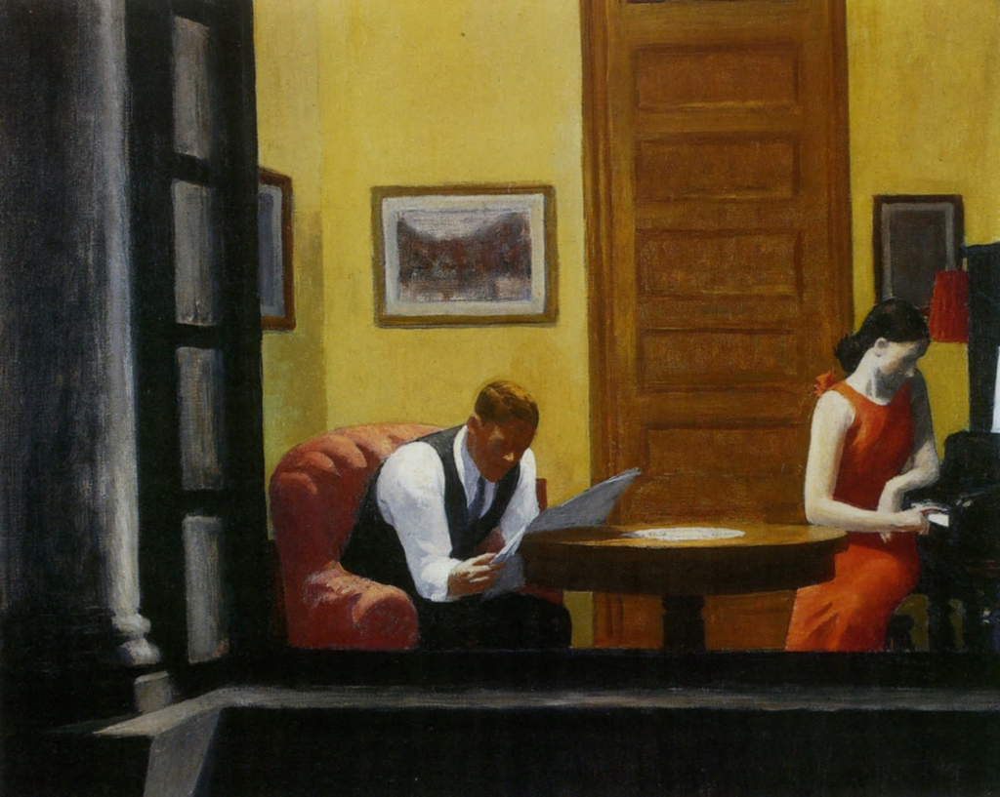
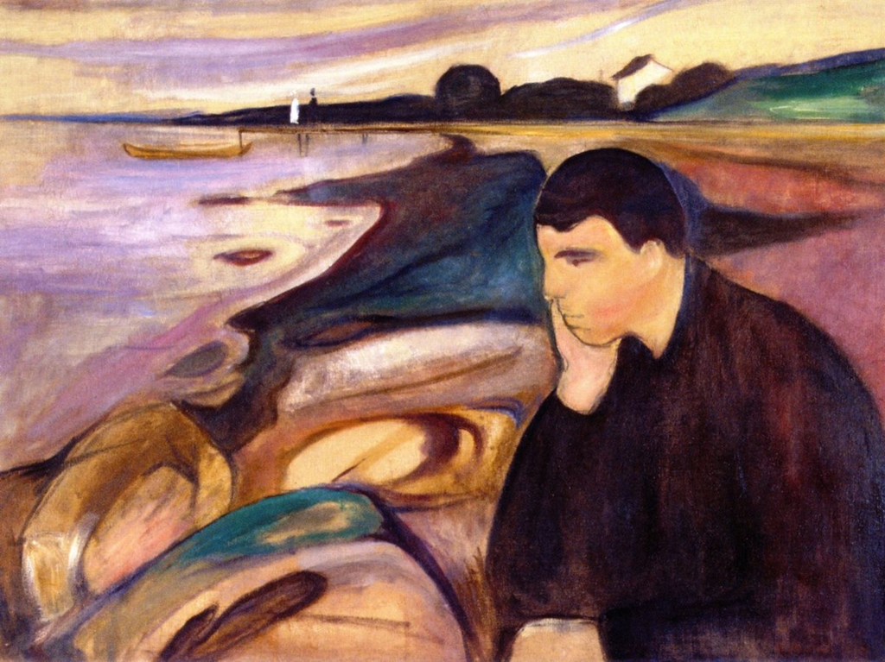
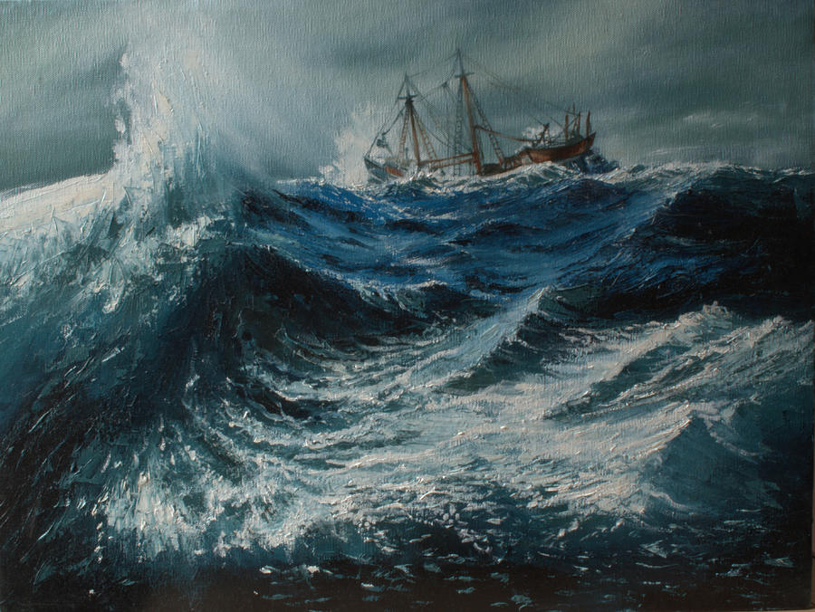

# Como evitar errar o que você já sabe

Você costuma cair de novo nos mesmos erros? Esse artigo é pra você.

Um aspecto frustrante em nosso desenvolvimento é quando percebemos que determinados erros e lições poderiam ter sido evitados, pois já sabíamos a resposta.

Eu já me peguei até mesmo frustrado com todo esse esforço de [crescimento](http://estrategistas.com/) e desenvolvimento pessoal, se no final do dia eu iria errar algo que já sabia mesmo.

O que descobri, depois de um tempo, foi a cuidar dos meus aprendizados pois eles podem envelhecer como vinhos, ficando mais valiosos com o tempo.

Vamos mergulhar nesse tema, pois ele guarda um insight interessante sobre como devemos tratar aquilo que buscamos absorver para crescer.

### O viés do “sempre soube”

*Sala em Nova Iorque, por Edward Hopper*

Antes de tudo, vale ressaltar a existência de um viés cognitivo chamado [viés da retrospectiva](https://en.wikipedia.org/wiki/Hindsight_bias) (traduzido da Wikipedia):

> *"… é a tendência, depois de um evento de um evento ter ocorrido, de enxergá-lo como tendo sido previsível, apesar de existir pouca ou nenhuma base objetiva para prevê-lo."*

O ser humano tem a tendência de se enganar, imaginando que por ter “conectado os pontos” depois do evento ter acontecido, significa que o evento poderia ter sido previsto. Ou que era óbvio, só não tínhamos notado.

Esse é um viés tão profundo que a forma de contorná-lo precisou ser injetada dentro do método científico, de modo que nossos aprendizados sobre a realidade não fossem contaminados com esse problema.

Sem mergulhar demais na filosofia por trás, o método científico consiste em:

- Observar o mundo (as pedras caem…);
- Criar hipóteses sobre como as coisas funcionam (Ex: … porque preferem estar de volta para a mãe Terra);
- Desenhar experimentos cujos resultados ajudem a diferenciar sua hipótese entre várias outras;
- Fazer previsões sobre o resultado do experimento antes de rodá-lo (ex: prevejo que soltar uma pedra na lua vai fazê-la cair em direção à mãe Terra);
- Executar o experimento, estudar os resultados.

Note que os cientistas são obrigados a fazer previsões sobre o que eles esperam que vai acontecer antes de rodar o experimento, para evitar serem vítimas do viés da retrospectiva. Seria fácil dizer “mas eu já sabia disso, porque blá blá”, criando uma história para fazer o resultado encaixar na teoria depois do experimento ter acontecido. O verdadeiro poder do aprendizado sobre como a realidade funciona vem da nossa habilidade de manipular o universo, de ser capaz de prever qual impacto nossas ações irão causar.

Esse é o aviso justo, para evitarmos cair na armadilha de imaginar que poderíamos ter evitado aquela lição.

É bom fazer um double-check se o conhecimento existia na época – estava escrito em algum lugar? Já tinha passado por algo parecido?

### 1. Qual é o preço que você pagou por aquela lição?

*“Gayle no trem F”, por Edward Hopper*

Quanto mais você sofreu para aprender algo, mais profundamente aquela lição fica registrada em seu modelo mental. Uma coisa é estudar contabilidade em um MBA e fazer uma lista de questões para uma prova; outra é quebrar uma empresa porque você errou o fluxo de caixa e teve que declarar falência por não conseguir pagar.

Essa relação de aprendizado e sofrimento é bem intuitiva. Nassim Taleb, em [seu novo livro](https://medium.com/@nntaleb/real-life-is-risk-taking-ac424efd5fcc), leva a um passo adiante – não se trata apenas do sofrimento, mas dos riscos que você correu.

> *"Porque, repetindo, vida é sacrifício e tomada de riscos, e nada que não envolva alguma quantidade moderada [de sacrifício], sob as restrições de satisfazer [a tomada de riscos], é próximo do que podemos chamar de vida. Se você não corre risco de um perigo real, reversível ou potencialmente irreversível, por uma aventura, não é uma aventura."*

Taleb avança a ideia de [ter pele no jogo para tornar as experiências vivas](https://web.facebook.com/nntaleb/posts/10155252698743375?_rdc=1&_rdr) e, por conseguinte, o aprendizado duradouro.

> *"As pessoas têm dois cérebros, um quando há pele em jogo, um quando não há. Pele no jogo pode fazer coisas chatas menos chatas. Quando você tem pele no jogo, coisas maçantes como checar a segurança de uma aeronave porque você pode ser forçado a ser um passageiro nela se tornam menos entediantes."*

Quanto mais real sua experiência, mais persistente são as lições, menos provável será você repetir erros relacionados. Podemos até pensar em uma escala de organização para fontes de aprendizado, em uma escala de persistência das lições:

*Projeto com investimento pessoal > Projeto para terceiros  > Projeto pessoal > Leitura.*

A escala se torna, em termos de investimento:

*Tempo, dinheiro & reputação > Tempo & reputação > Tempo.*

Ler é bom (inclusive, [recomendo sempre](http://estrategistas.com/recomendacoes-de-leitura/)), mas a atividade em si é bem passiva e precisamos investir em meios de tornar o aprendizado mais real.

Por isso, além da leitura, incentivo as pessoas a terem [um método para gerenciar as lições](https://papodehomem.com.br/como-melhor-interpretar-e-absorver-suas-leituras/) que extraem de livros e possam consultar aquela sabedoria quando precisarem.

### 2. Quanta energia você dedicou a integrar aquele aprendizado a seu modelo de mundo?

*Melancolia, por Edvard Much*

Uma metáfora muito útil para entender em modelos de realidade é pensar em *mapas*.

Imagine que existe um *mundo objetivo* e cada pessoa interage com esse mundo através de um *“mapa”* próprio, que reflete o quanto cada um aprendeu sobre como o mundo funciona. Os mapas *variam dependendo de vários fatores* (genéticos, ambientais, culturais) e experiências de vida.

Cada vez que *aprendemos algo novo*, nós *atualizamos* nosso “mapa” e ele fica cada vez mais próximo da realidade, o que nos permite ser mais sucedidos no que almejamos.

Uma causa comum de erros recorrentes é a **falha em propagar o aprendizado pelo seu mapa de realidade**.

Digamos que em todo mundo, casas pintadas de verde pertençam a pessoas canhotas. Ao aprender sobre isso, você faz certo e consegue comprar uma mesa de estudo adequada de presente para seu vizinho (que tem a casa verde). Contudo, quando um parceiro de negócios chega na sua empresa para conversar, você comete a gafe de cumprimentá-lo com a mão errada, embora já soubesse que a casa dele é verde. A informação casa verde canhoto foi propagada numa pequena esfera (seu dia a dia), mas não universalmente.

De modo similar, vejo as pessoas tendo discussões ardentes sobre o futuro das universidades, como educação superior perdeu o valor e que as grandes empresas pararam de demandar por diplomas em muitas áreas.

Porém, quando você senta para conversar sobre [o que elas estão fazendo profissionalmente](http://estrategistas.com/imagine/), ainda se trata de “enviar currículos”, “fazer um MBA” ou estratégias que não indicam que o aprendizado (falha no sistema de certificação profissional do ensino superior) foi propagado da maneira adequada.

Sempre que você tiver algum aprendizado relevante, é importante se questionar sobre o que aquilo significa para sua vida, expandindo a atualização do seu “mapa” e alterando o que for necessário. Esse processo é chamado de propagação de crenças (através de sua rede de conhecimento).

Um exemplo prático: um dos livros mais importantes dos 500+ que já li nos últimos anos talvez seja Antifrágil, do Nassim Taleb. O conceito de antifragilidade e suas aplicações nas mais diversas áreas da vida são fenomenais. Desde então, tenho investigado como aplicar antifragilidade à ética pessoal, nutrição, saúde, investimentos, [decisões profissionais](http://estrategistas.com/mudar-de-carreira/) e outras áreas.

Tenho investido mais energia buscando formas colocar o aprendizado em prática do que buscando mais lições em outros livros, porque já identifiquei a importância dessa ideia e quero tirar o máximo possível.

**É preciso se dedicar a atualizar o mapa de realidade**, caso contrário o conhecimento não vai nos ajudar a agir melhor e, vamos cometer os mesmos erros.

### Um exemplo pessoal: atravessando a tempestade

“Tempestade no mar”, por Shobita Sreekumar

Nas últimas semanas, fui afogado em uma série de desafios familiares que sempre temi atravessar. Foi um verdadeiro inferno – não apenas no sentido objetivo, mas também pessoal, por lidar com questões sensíveis do meu passado.

Gostaria de poder dizer que encarei tudo com a sobriedade e a tranquilidade de um sábio, mas não seria verdade. Por muitos momentos estive aterrorizado, sem saber o que fazer, chorei, torcendo para que tudo aquilo não fosse real e eu pudesse voltar para minha vida normal.

Dois fatores me ajudaram tremendamente (além do suporte incondicional da minha esposa, família e amigos próximos).

Primeiro, o texto [como enfrentar as dificuldades](http://estrategistas.com/como-enfrentar-dificuldades/), que condensa os aprendizados do livro *O Obstáculo é o Caminho*, do Ryan Holiday. Eu me peguei voltando para o texto, repassando seus pontos e reorientando minhas ações o melhor que podia.

Para quem não escreve, parece fazer pouco sentido o escritor voltar a ler um texto e aprender com o que escreveu. Mas, no fundo é isso, estamos sempre reaprendendo e reintegrando as lições que absorvemos e, no momento de crise, ter acesso àquele conteúdo foi essencial.

Segundo, todo o treinamento que tenho tentado incorporar no dia a dia para viver como um estoico. As práticas simples, de separar o que está no meu controle e o que não está, a prática de não perder a cabeça com coisas pequenas, enxergar as coisas como elas são… tudo isso foi essencial para que eu não desmanchasse em uma pilha de nervos durante esse período.

O esforço de tornar os aprendizados reais (pensando sobre, escrevendo textos) e de integrar as lições à minha rotina (treinamentos) foram essenciais para fazer uso daquela sabedoria e errar menos o que eu já sabia. A tempestade ficou mais suportável.

### Comente, curta e compartilhe!

*A conversa não acaba aqui.*

*Este artigo é fruto da generosidade do autor, que dedicou horas de maneira voluntária para produzir esse material.*

*Não esqueça de comentar, curtir e compartilhar o texto. Assim, você ajuda o crescimento do Papo de Homem, faz o autor feliz e fortalece a rede.*

---

*publicado em 07 de Dezembro de 2017, 00:05*
