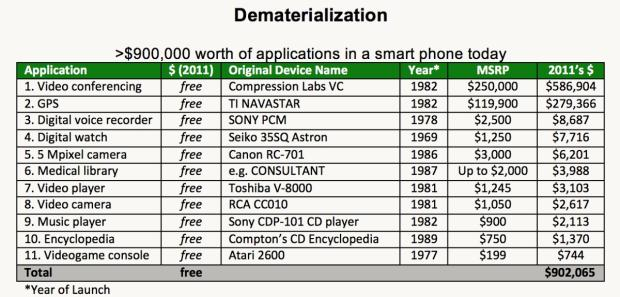
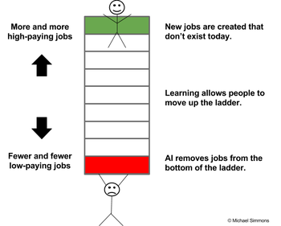

# If you’re not spending 5 hours per week learning, you’re being irresponsible

By [Michael Simmons](https://work.qz.com/author/michael-simmons/)

December 5, 2017

#### Contributor

Reuters/ Jonathan Ernst

Barack Obama read an hour a day while president.

Why did the busiest person in the world, former president Barack Obama, read an hour a day while in office?

Why has the best investor in history, Warren Buffett, invested 80% of his time in reading and thinking throughout his career?

Why has the world’s richest person, Bill Gates, read a book a week during his career?

And why has he taken a yearly two-week reading vacation throughout his entire career?

Why do the world’s smartest and busiest people find one hour a day for deliberate learning (the [5-hour rule](https://medium.com/the-mission/bill-gates-warren-buffett-and-oprah-all-use-the-5-hour-rule-308f528b6363#.ldy4jlwih)), while others make excuses about how busy they are?

What do they see that others don’t?

The answer is simple: Learning is the single best investment of our time that we can make. Or as Benjamin Franklin said, “An investment in knowledge pays the best interest.”

This insight is fundamental to succeeding in our knowledge economy, yet few people realize it. Luckily, once you do understand the value of knowledge, it’s simple to get more of it. Just [dedicate yourself to constant learning](http://bit.ly/2yWn5cS_Medium_Article_6B-1).

## Knowledge is the new money

We spend our lives collecting, spending, lusting after, and worrying about money —in fact, when we say we “don’t have time” to learn something new, it’s usually because we are feverishly devoting our time to earning money, but something is happening right now that’s changing the relationship between money and knowledge.

We are at the beginning of a period of what renowned futurist Peter Diamandis calls [rapid demonetization](http://peterdiamandis.tumblr.com/post/147548445548/demonetized-cost-of-living), in which technology is rendering previously expensive products or services much cheaper —or even free.

This chart from Diamandis’ book [Abundance](https://www.amazon.com/Abundance-Future-Better-Than-Think/dp/1451614217?tag=quartz07-20) shows how we’ve demonetized $900,000 worth of products and services you might have purchased between 1969 and 1989.

(Source: Medium)

This demonetization will accelerate in the future. Automated vehicle fleets will eliminate one of our biggest purchases: a car. Virtual reality will make expensive experiences, such as [going to a concert](http://www.usatoday.com/story/tech/news/2016/09/28/live-nation-wants-you-hit-next-big-concert-vr/91225372/) or [playing golf](https://www.youtube.com/watch?v=Gyv9PcqtRzo), instantly available at much lower cost. While the difference between reality and virtual reality is almost incomparable at the moment, the rate of improvement of VR is exponential.

While education and health care costs have risen, innovation in these fields will likely lead to eventual demonetization as well. Many higher educational institutions, for example, have legacy costs to support multiple layers of hierarchy and to upkeep their campuses. Newer institutions are finding ways to dramatically lower costs by offering their services [exclusively online](https://www.khanacademy.org/), [focusing only on training for in-demand, high-paying skills](https://www.udacity.com/), or [having employers who recruit students](https://www.sv.academy/) subsidize the cost of tuition.

Finally, new devices and technologies, such as CRISPR, the [XPrize Tricorder](http://tricorder.xprize.org/), better diagnostics via artificial intelligence, and reduced cost of genomic sequencing will revolutionize the healthcare system. These technologies and [other ones like them](http://www.diamandis.com/blog/demonetized-cost-of-living) will dramatically lower the average cost of healthcare by focusing on prevention rather than cure and management.

While goods and services are becoming demonetized, knowledge is becoming increasingly valuable.

Perhaps the best example of the rising value of certain forms of knowledge is the self-driving car industry. Sebastian Thrun, founder of Google X and Google’s self-driving car team, gives the example of Uber paying $700 million for Otto, a six-month-old company with 70 employees, and of GM spending $1 billion on their acquisition of Cruise. He concludes that in this industry, [“The going rate for talent these days is $10 million](http://www.recode.net/2016/9/17/12943214/sebastian-thrun-self-driving-talent-pool).”

That’s $10 million per skilled worker, and while that’s the most stunning example, it’s not just true for incredibly rare and lucrative technical skills. People who identify skills needed for [future jobs—e.g., data analyst, product designer, physical therapist](https://www.fastcompany.com/3058422/these-will-be-the-top-jobs-in-2025-and-the-skills-youll-need-to-get-them)—and quickly learn them are poised to win.

Those who work really hard throughout their career but don’t take time out of their schedule to constantly learn will be the new “at-risk” group. They risk remaining stuck on the bottom rung of global competition, and they risk losing their jobs to automation, just as blue-collar workers did between 2000 and 2010 when [robots replaced 85% of manufacturing jobs](https://techcrunch.com/2016/10/09/industrial-robots-will-replace-manufacturing-jobs-and-thats-a-good-thing/).

Why?

(Source: Medium)

People at the bottom of the economic ladder are being squeezed more and compensated less, while those at the top have more opportunities and are paid more than ever before. The irony is that the problem isn’t a lack of jobs. Rather, it’s a lack of people with the right skills and knowledge to fill the jobs.

An Atlanticarticle [captures the paradox](http://www.theatlantic.com/business/archive/2015/09/whos-responsible-for-erasing-americas-shortage-of-skilled-workers/406474/): “Employers across industries and regions have complained for years about a lack of skilled workers, and their complaints are borne out in U.S. employment data. In July [2015], the number of job postings reached its highest level ever, at 5.8 million, and the unemployment rate was comfortably below the post-World War II average. But, at the same time, over 17 million Americans are either unemployed, not working but interested in finding work, or doing part-time work but aspiring to full-time work.”

In short, we can see how at a fundamental level knowledge is gradually becoming its own important and unique form of currency.In other words, knowledge is the new money.Similar to money, knowledge often serves as a medium of exchange and store of value.

But, unlike money, when you use knowledge or give it away, you don’t lose it. Transferring knowledge anywhere in the world is free and instant. [Its value compounds over time faster than money](https://medium.com/@michaeldsimmons/bill-gates-warren-buffett-and-oprah-all-use-the-5-hour-rule-308f528b6363). It can be converted into many things, including things that money can’t buy, such as authentic relationships and high levels of subjective well-being. It helps you accomplish your goals faster and better. It’s fun to acquire. It makes your brain work better. It expands your vocabulary, making you a better communicator. It helps you think bigger and beyond your circumstances. It puts your life in perspective by essentially helping you live many lives in one life through other people’s experiences and wisdom.

Former President Obama perfectly explains why he was so committed to reading during his Presidency in a recent [New York Times interview](https://www.nytimes.com/2017/01/16/books/obamas-secret-to-surviving-the-white-house-years-books.html): “At a time when events move so quickly and so much information is transmitted,” he said, reading gave him the ability to occasionally “slow down and get perspective” and “the ability to get in somebody else’s shoes.” These two things, he added, “have been invaluable to me. Whether they’ve made me a better president I can’t say. But what I can say is that they have allowed me to sort of maintain my balance during the course of eight years, because this is a place that comes at you hard and fast and doesn’t let up.”

## Six essentials skills to master the new knowledge economy

So, how do we learn the right knowledge and have it pay off for us? The six points below serve as a framework to help you begin to answer this question.I also created an [in-depth webinar on Learning How To Learn](http://bit.ly/2yffdpo_Medium_Article_6B-2) that you can watch for free.

1. Identify valuable knowledge at the right time. The value of knowledge isn’t static. It changes as a function of how valuable other people consider it and how rare it is. As new technologies mature and reshape industries, there is often a deficit of people with the needed skills, which creates the potential for high compensation. Because of the high compensation, more people are quickly trained, and the average compensation decreases.
2. Learn and master that knowledge quickly. Opportunity windows are temporary in nature. Individuals must take advantage of them when they see them. This means being able to learn new skills quickly. After reading thousands of books, I’ve found that [understanding and using mental models](http://bit.ly/2xKXNxo_Medium_Article_6) is one of the most universal skills that everyone should learn. It provides a strong foundation of knowledge that applies across every field. So when you jump into a new field, you have preexisting knowledge you can use to learn faster.
3. Communicate the value of your skills to others. People with the same skills can command wildly different salaries and fees based on how well they’re able to communicate and persuade others. This ability convinces others that the skills you have are valuable is a “multiplier skill.” Many people spend years mastering an underlying technical skill and virtually no time mastering this multiplier skill.
4. Convert knowledge into money and results. There are many ways to transform knowledge into value in your life. A few examples include finding and getting a job that pays well, getting a raise, building a successful business, selling your knowledge as a consultant, and building your reputation by becoming a thought leader.
5. Learn how to financially invest in learning to get the highest return.Each of us needs to find the right “portfolio” of books, online courses, and certificate/degree programs to help us achieve our goals within our budget. To get the right portfolio, we need to apply financial terms—such as return on investment, risk management, hurdle rate, hedging, and diversification—to our thinking on knowledge investment.
6. Master the skill of [learning how to learn](http://bit.ly/2gbfx2e_Medium_Article_6B-3). Doing so exponentially increases the value of every hour we devote to learning (our learning rate). Our learning rate determines how quickly our knowledge compounds over time. Consider someone who reads and retains one book a week versus someone who takes 10 days to read a book. Over the course of a year, a 30% difference compounds to one person reading 85 more books.

To shift our focus from being overly obsessed with money to a more savvy and realistic quest for knowledge, we need to stop thinking that we only acquire knowledge from five to 22 years old, and that then we can get a job and mentally coast through the rest of our lives if we work hard. To survive and thrive in this new era, we must constantly learn.

Working hard is the industrial era approach to getting ahead.

Learning hard is the knowledge economy equivalent.  
Just as we have minimum recommended dosages of vitamins, steps per day, and minutes of aerobic exercise for maintaining physical health, we need to be rigorous about the minimum dose of deliberate learning that will maintain our economic health. The long-term effects of intellectual complacency are just as insidious as the long-term effects of not exercising, eating well, or sleeping enough. Not learning at least 5 hours per week (the 5-hour rule) is the smoking of the 21st century and this article is the warning label.

## Don’t be lazy. Don’t make excuses. Just get it done.

Before his daughter was born, successful entrepreneur Ben Clarke focused on deliberate learning every day from 6:45am to 8:30am for five years (2,000+ hours), but when his daughter was born, he decided to replace his learning time with daddy-daughter time. This is the point at which most people would give up on their learning ritual.

Instead of doing that, Ben decided to change his daily work schedule. He shortened the number of hours he worked on his to do list in order to make room for his learning ritual. Keep in mind that Ben oversees 200+ employees at his company, [The Shipyard](https://theshipyard.wpengine.com/), and is always busy. In his words, “By working less and learning more, I might seem to get less done in a day, but I get dramatically more done in my year and in my career.” This wasn’t an easy decision by any means, but it reflects the type of difficult decisions that we all need to start making. Even if you’re just an entry-level employee, there’s no excuse. You can find mini learning periods during your downtimes (commutes, lunch breaks, slow times). Even 15 minutes per day will add up to nearly 100 hours over a year. Time and energy should not be excuses. Rather, they are difficult, but overcomable challenges. By being one of the few people who rises to this challenge, you reap that much more in reward.

We often believe we can’t afford the time it takes, but the opposite is true: None of us can afford not to learn.

Learning is no longer a luxury; it’s a necessity.

## Start your learning ritual today with these three steps

The busiest, most successful people in the world find at least an hour to learn everyday. So can you.

Just three steps are needed to create your own learning ritual:

1. Find the time for reading and learning even if you are really busy and overwhelmed.
2. Stay consistent on using that “found” time without procrastinating or falling prey to distraction.
3. Increase the results you receive from each hour of learning by using proven hacks that help you remember and apply what you learn.

Over the last three years, I’ve researched how top performers find the time, stay consistent, and get more results. There was too much information for one article, so I spent dozens of hours and created a free masterclass to help you master your learning ritual too.

This post originally appeared on [Medium.](https://medium.com/the-mission/the-5-hour-rule-if-youre-not-spending-5-hours-per-week-learning-you-re-being-irresponsible-791c3f18f5e6)

(Source: Medium)

This demonetization will accelerate in the future. Automated vehicle fleets will eliminate one of our biggest purchases: a car. Virtual reality will make expensive experiences, such as [going to a concert](http://www.usatoday.com/story/tech/news/2016/09/28/live-nation-wants-you-hit-next-big-concert-vr/91225372/) or [playing golf](https://www.youtube.com/watch?v=Gyv9PcqtRzo), instantly available at much lower cost. While the difference between reality and virtual reality is almost incomparable at the moment, the rate of improvement of VR is exponential.

While education and health care costs have risen, innovation in these fields will likely lead to eventual demonetization as well. Many higher educational institutions, for example, have legacy costs to support multiple layers of hierarchy and to upkeep their campuses. Newer institutions are finding ways to dramatically lower costs by offering their services [exclusively online](https://www.khanacademy.org/), [focusing only on training for in-demand, high-paying skills](https://www.udacity.com/), or [having employers who recruit students](https://www.sv.academy/) subsidize the cost of tuition.

Finally, new devices and technologies, such as CRISPR, the [XPrize Tricorder](http://tricorder.xprize.org/), better diagnostics via artificial intelligence, and reduced cost of genomic sequencing will revolutionize the healthcare system. These technologies and [other ones like them](http://www.diamandis.com/blog/demonetized-cost-of-living) will dramatically lower the average cost of healthcare by focusing on prevention rather than cure and management.

While goods and services are becoming demonetized, knowledge is becoming increasingly valuable.

Perhaps the best example of the rising value of certain forms of knowledge is the self-driving car industry. Sebastian Thrun, founder of Google X and Google’s self-driving car team, gives the example of Uber paying $700 million for Otto, a six-month-old company with 70 employees, and of GM spending $1 billion on their acquisition of Cruise. He concludes that in this industry, [“The going rate for talent these days is $10 million](http://www.recode.net/2016/9/17/12943214/sebastian-thrun-self-driving-talent-pool).”

That’s $10 million per skilled worker, and while that’s the most stunning example, it’s not just true for incredibly rare and lucrative technical skills. People who identify skills needed for [future jobs—e.g., data analyst, product designer, physical therapist](https://www.fastcompany.com/3058422/these-will-be-the-top-jobs-in-2025-and-the-skills-youll-need-to-get-them)—and quickly learn them are poised to win.

Those who work really hard throughout their career but don’t take time out of their schedule to constantly learn will be the new “at-risk” group. They risk remaining stuck on the bottom rung of global competition, and they risk losing their jobs to automation, just as blue-collar workers did between 2000 and 2010 when [robots replaced 85% of manufacturing jobs](https://techcrunch.com/2016/10/09/industrial-robots-will-replace-manufacturing-jobs-and-thats-a-good-thing/).

Why?

(Source: Medium)

People at the bottom of the economic ladder are being squeezed more and compensated less, while those at the top have more opportunities and are paid more than ever before. The irony is that the problem isn’t a lack of jobs. Rather, it’s a lack of people with the right skills and knowledge to fill the jobs.

An Atlanticarticle [captures the paradox](http://www.theatlantic.com/business/archive/2015/09/whos-responsible-for-erasing-americas-shortage-of-skilled-workers/406474/): “Employers across industries and regions have complained for years about a lack of skilled workers, and their complaints are borne out in U.S. employment data. In July [2015], the number of job postings reached its highest level ever, at 5.8 million, and the unemployment rate was comfortably below the post-World War II average. But, at the same time, over 17 million Americans are either unemployed, not working but interested in finding work, or doing part-time work but aspiring to full-time work.”

In short, we can see how at a fundamental level knowledge is gradually becoming its own important and unique form of currency.In other words, knowledge is the new money.Similar to money, knowledge often serves as a medium of exchange and store of value.

But, unlike money, when you use knowledge or give it away, you don’t lose it. Transferring knowledge anywhere in the world is free and instant. [Its value compounds over time faster than money](https://medium.com/@michaeldsimmons/bill-gates-warren-buffett-and-oprah-all-use-the-5-hour-rule-308f528b6363). It can be converted into many things, including things that money can’t buy, such as authentic relationships and high levels of subjective well-being. It helps you accomplish your goals faster and better. It’s fun to acquire. It makes your brain work better. It expands your vocabulary, making you a better communicator. It helps you think bigger and beyond your circumstances. It puts your life in perspective by essentially helping you live many lives in one life through other people’s experiences and wisdom.

Former President Obama perfectly explains why he was so committed to reading during his Presidency in a recent [New York Times interview](https://www.nytimes.com/2017/01/16/books/obamas-secret-to-surviving-the-white-house-years-books.html): “At a time when events move so quickly and so much information is transmitted,” he said, reading gave him the ability to occasionally “slow down and get perspective” and “the ability to get in somebody else’s shoes.” These two things, he added, “have been invaluable to me. Whether they’ve made me a better president I can’t say. But what I can say is that they have allowed me to sort of maintain my balance during the course of eight years, because this is a place that comes at you hard and fast and doesn’t let up.”

## Six essentials skills to master the new knowledge economy

So, how do we learn the right knowledge and have it pay off for us? The six points below serve as a framework to help you begin to answer this question.I also created an [in-depth webinar on Learning How To Learn](http://bit.ly/2yffdpo_Medium_Article_6B-2) that you can watch for free.

1. Identify valuable knowledge at the right time. The value of knowledge isn’t static. It changes as a function of how valuable other people consider it and how rare it is. As new technologies mature and reshape industries, there is often a deficit of people with the needed skills, which creates the potential for high compensation. Because of the high compensation, more people are quickly trained, and the average compensation decreases.
2. Learn and master that knowledge quickly. Opportunity windows are temporary in nature. Individuals must take advantage of them when they see them. This means being able to learn new skills quickly. After reading thousands of books, I’ve found that [understanding and using mental models](http://bit.ly/2xKXNxo_Medium_Article_6) is one of the most universal skills that everyone should learn. It provides a strong foundation of knowledge that applies across every field. So when you jump into a new field, you have preexisting knowledge you can use to learn faster.
3. Communicate the value of your skills to others. People with the same skills can command wildly different salaries and fees based on how well they’re able to communicate and persuade others. This ability convinces others that the skills you have are valuable is a “multiplier skill.” Many people spend years mastering an underlying technical skill and virtually no time mastering this multiplier skill.
4. Convert knowledge into money and results. There are many ways to transform knowledge into value in your life. A few examples include finding and getting a job that pays well, getting a raise, building a successful business, selling your knowledge as a consultant, and building your reputation by becoming a thought leader.
5. Learn how to financially invest in learning to get the highest return.Each of us needs to find the right “portfolio” of books, online courses, and certificate/degree programs to help us achieve our goals within our budget. To get the right portfolio, we need to apply financial terms—such as return on investment, risk management, hurdle rate, hedging, and diversification—to our thinking on knowledge investment.
6. Master the skill of [learning how to learn](http://bit.ly/2gbfx2e_Medium_Article_6B-3). Doing so exponentially increases the value of every hour we devote to learning (our learning rate). Our learning rate determines how quickly our knowledge compounds over time. Consider someone who reads and retains one book a week versus someone who takes 10 days to read a book. Over the course of a year, a 30% difference compounds to one person reading 85 more books.

To shift our focus from being overly obsessed with money to a more savvy and realistic quest for knowledge, we need to stop thinking that we only acquire knowledge from five to 22 years old, and that then we can get a job and mentally coast through the rest of our lives if we work hard. To survive and thrive in this new era, we must constantly learn.

Working hard is the industrial era approach to getting ahead.

Learning hard is the knowledge economy equivalent.  
Just as we have minimum recommended dosages of vitamins, steps per day, and minutes of aerobic exercise for maintaining physical health, we need to be rigorous about the minimum dose of deliberate learning that will maintain our economic health. The long-term effects of intellectual complacency are just as insidious as the long-term effects of not exercising, eating well, or sleeping enough. Not learning at least 5 hours per week (the 5-hour rule) is the smoking of the 21st century and this article is the warning label.

## Don’t be lazy. Don’t make excuses. Just get it done.

Before his daughter was born, successful entrepreneur Ben Clarke focused on deliberate learning every day from 6:45am to 8:30am for five years (2,000+ hours), but when his daughter was born, he decided to replace his learning time with daddy-daughter time. This is the point at which most people would give up on their learning ritual.

Instead of doing that, Ben decided to change his daily work schedule. He shortened the number of hours he worked on his to do list in order to make room for his learning ritual. Keep in mind that Ben oversees 200+ employees at his company, [The Shipyard](https://theshipyard.wpengine.com/), and is always busy. In his words, “By working less and learning more, I might seem to get less done in a day, but I get dramatically more done in my year and in my career.” This wasn’t an easy decision by any means, but it reflects the type of difficult decisions that we all need to start making. Even if you’re just an entry-level employee, there’s no excuse. You can find mini learning periods during your downtimes (commutes, lunch breaks, slow times). Even 15 minutes per day will add up to nearly 100 hours over a year. Time and energy should not be excuses. Rather, they are difficult, but overcomable challenges. By being one of the few people who rises to this challenge, you reap that much more in reward.

We often believe we can’t afford the time it takes, but the opposite is true: None of us can afford not to learn.

Learning is no longer a luxury; it’s a necessity.

## Start your learning ritual today with these three steps

The busiest, most successful people in the world find at least an hour to learn everyday. So can you.

Just three steps are needed to create your own learning ritual:

1. Find the time for reading and learning even if you are really busy and overwhelmed.
2. Stay consistent on using that “found” time without procrastinating or falling prey to distraction.
3. Increase the results you receive from each hour of learning by using proven hacks that help you remember and apply what you learn.

Over the last three years, I’ve researched how top performers find the time, stay consistent, and get more results. There was too much information for one article, so I spent dozens of hours and created a free masterclass to help you master your learning ritual too.

This post originally appeared on [Medium.](https://medium.com/the-mission/the-5-hour-rule-if-youre-not-spending-5-hours-per-week-learning-you-re-being-irresponsible-791c3f18f5e6)

#### Stay up-to-date with Quartz at Work on Twitter
