# Ultimate Guide - How to Start a Travel Blog

The travel and tourism industry generates annual revenue of around [$7.6 trillion](https://www.wttc.org/-/media/files/reports/economic-impact-research/2017-documents/global-economic-impact-and-issues-2017.pdf), contributing to approximately 10.2% of the world’s gross domestic product (GDP). We all hear stories about how people have funded their travels by sharing their adventures with the blogosphere. But how do you get started?

You need to begin filling up your blog so you can grow it into something worth monetizing. It is too soon for advertising, selling, or marketing. You just want to know how to create a travel blog with no expertise, quickly, and efficiently, with the best chances of future success.

We’re here to help. [Postach.io](https://postach.io/) is the Evernote-powered blogging platform that makes starting a blog and maintaining it fast and simple. What’s more — we optimize all our blog themes using industry standard SEO practices. This means they can be found and indexed by search engines, readers, and potential leads, setting you up to generate significant traffic as you grow your content offering.

If you are thinking about living the travel blogger lifestyle and generating passive income while you explore the world, read on! In this guide, we tell you exactly what you need to do to start a travel blog with [Postach.io](http://postach.io/). Learn how easy it is to start living the life you want to lead.

### Setup

## 1. Visit [Postach.io](http://postach.io/)

Visit the [Postach.io](https://postach.io/) website and click on the Create a Blog button to sign up for an account.

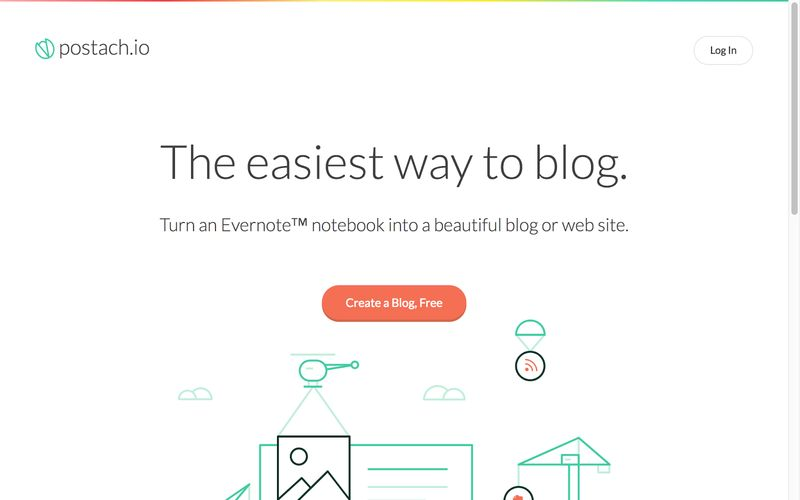

(Source: Author screenshot)

## 2. Enter Your Details

Fill the form with your details. Here at [Postach.io](http://postach.io/) we follow a strict confidentiality policy, so you know your information will always be safe with us.

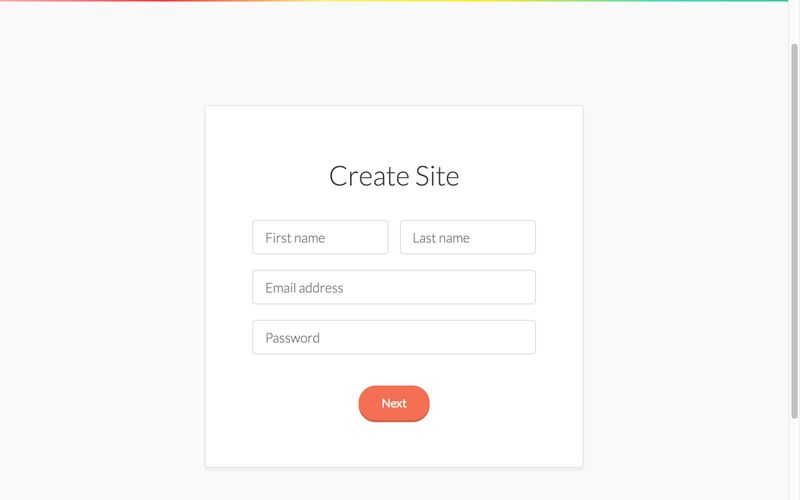

(Source: Author screenshot)

## 3. Get Connected

You will be asked to connect your Evernote notebook to [Postach.io](http://postach.io/). Right-click on Connect Notebook and open it in a new browser tab to get started.

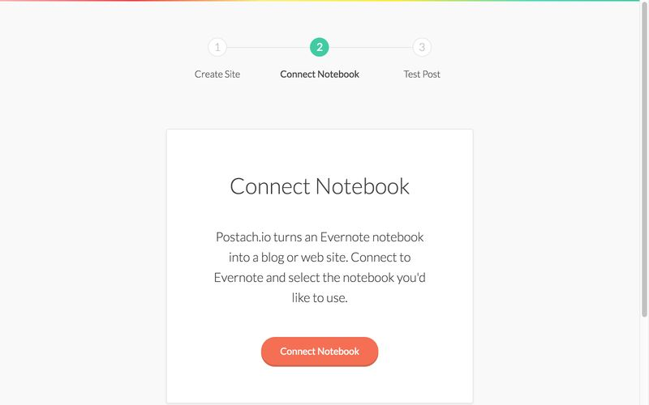

(Source: Author screenshot)

## 4. Sign up for Evernote

If you don’t already have an account, visit the [Evernote](https://evernote.com/) site and sign up for one. If you do already have an account, see step 10.

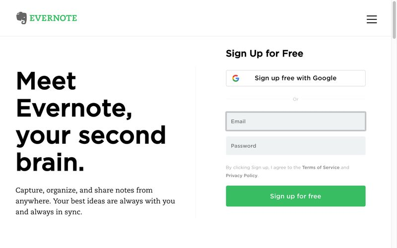

(Source: Author screenshot)

## 5. Set Your Goal

In the What’s your goal window, select your reason for using Evernote. We chose to Be more productive since this is appropriate to many travel bloggers’ motives.

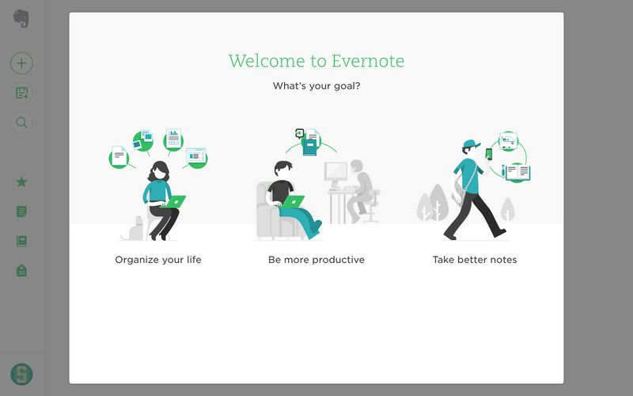

(Source: Author screenshot)

## 6. Download Evernote

You will be asked if you want to download Evernote and the Web Clipper app. Click to download Evernote. Download Web Clipper as well if you use Google Chrome, so you can take screenshots and save articles to your Evernote notebooks.

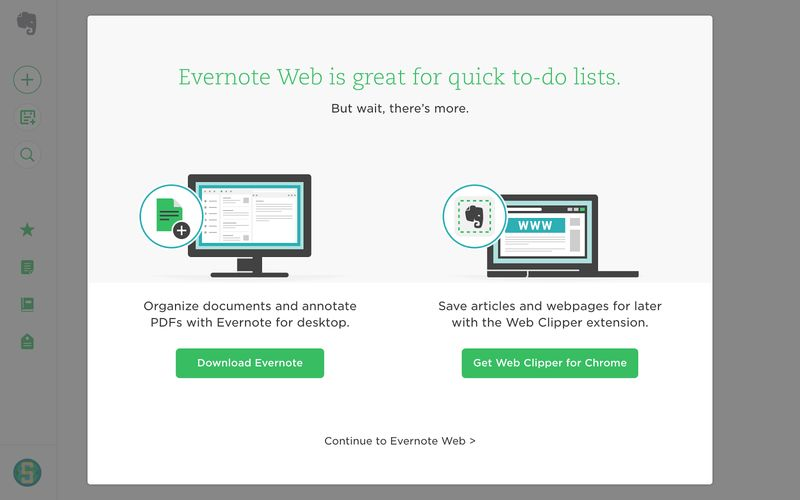

(Source: Author screenshot)

## 7. Install Evernote

Wait for your download to complete, open the installation file, and follow the on-screen instructions to add it to your desktop applications.

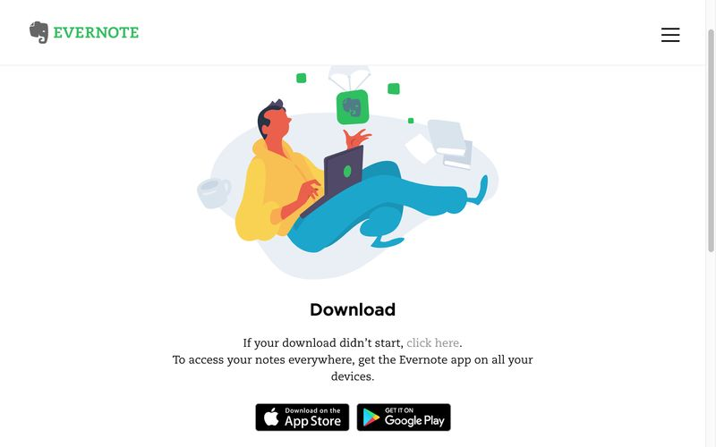

(Source: Author screenshot)

## 8. Open the Evernote App

Find the Evernote app in your applications and click the icon to open it. You should see the following window. Enter your account details to log in to view your digital workspace.

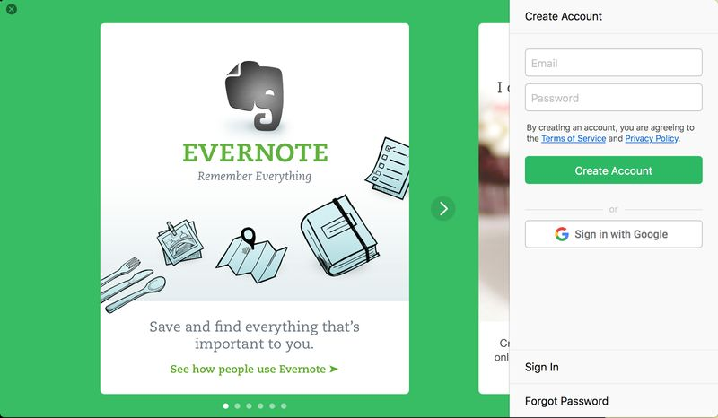

(Source: Author screenshot)

## 9. Familiarise Yourself With the Workspace

Your Evernote workspace is where you will collate your research, draft your blog content, and post to your site. Documents take the form of Notes, organized within folders called Notebooks. Your [Postach.io](http://postach.io/) notebook is where you will draft, post, publish, and store your blog content.

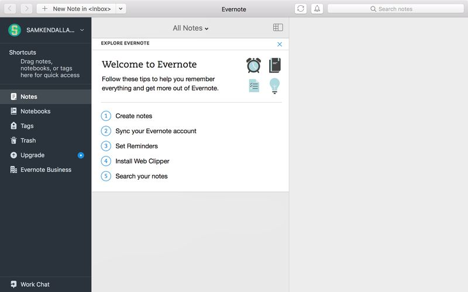

(Source: Author screenshot)

## 10. Connect Evernote to [Postach.io](http://postach.io/)

Return to the [Postach.io](http://postach.io/) site tab in your browser and click Connect Notebook again. This time, log in with your Evernote account details and continue to the next step.

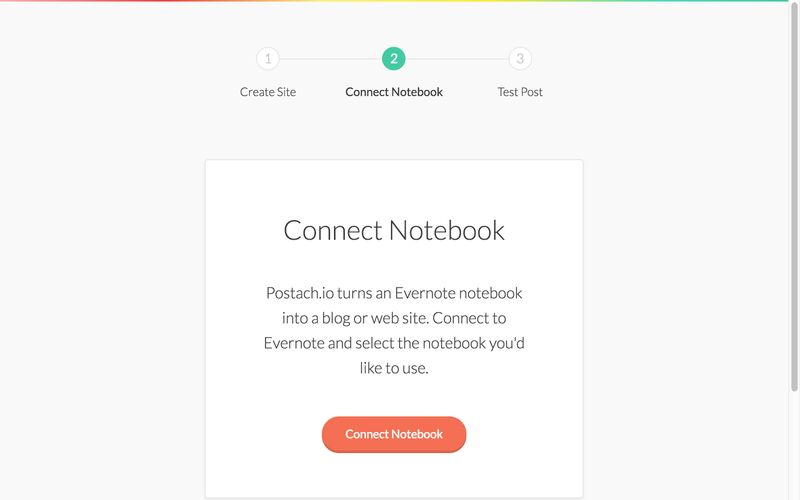

(Source: Author screenshot)

## 11. Authorize Access

Authorize [Postach.io](http://postach.io/) to create a new notebook called [Postach.io](http://postach.io/) and give it permission to access your Evernote account. Click Authorize and you should be directed to a confirmation page on the [Postach.io](http://postach.io/) site.

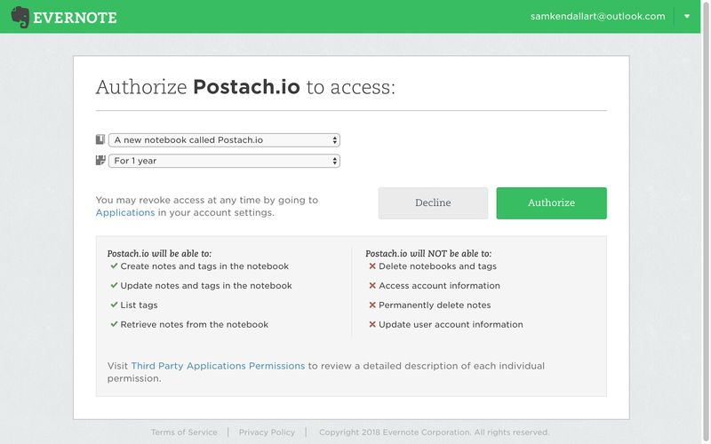

(Source: Author screenshot)

### Publish a Post

To check that [Postach.io](http://postach.io/) and Evernote are linked correctly, you will be asked to create a post in your Evernote notebook and publish to check it syncs with your newly created blog. Follow the instructions below to create your first post.

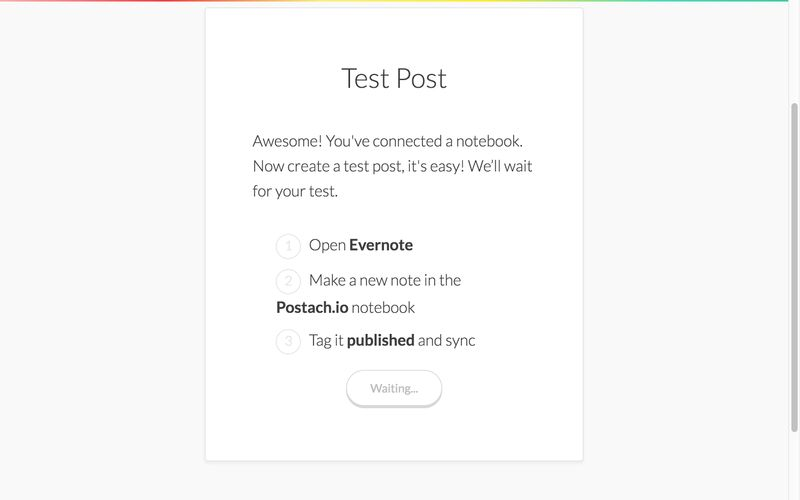

(Source: Author screenshot)

## 1. Open the Evernote Desktop App

Return to the Evernote app on your desktop and click on the Notebooks tab to the left of the main window. Click the [Postach.io](http://postach.io/) Notebook to start working on it.

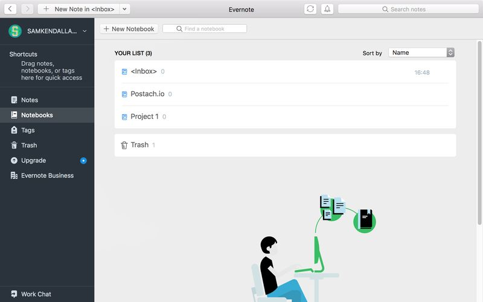

(Source: Author screenshot)

2. Create a New Note

The button to the top-left of the Evernote window should now read + New Note in [Postach.io](http://postach.io/). Click it to add a new note to your [Postach.io](http://postach.io/) notebook.

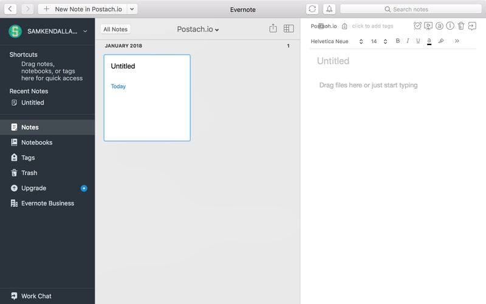

(Source: Author screenshot)

## 3. Come up With a Clickable Title

Enter a title for your new note. The title you use in Evernote will be the title of the blog post on your site, so make sure you use something catchy that people would actually search for on the web. For example, if I am writing a post about Saigon, Vietnam, the title 11 Coolest Places in Saigon will get more traffic from searches than Alex’s Saigon Experience. The first title addresses something actionable that people visiting Saigon want to know, the second is irrelevant to anyone but me.

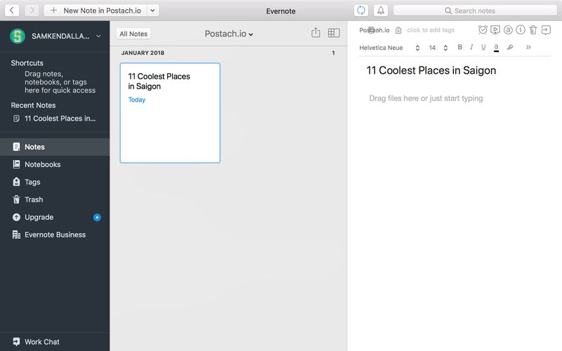

(Source: Author screenshot)

## 4. Draft Your Content

Populate your new note with some digestible content. The content you craft should provide useful information with actionable takeaways. Sure, you can write whatever you like. But it is a good idea to go through your posts after you have drafted your main content to add some bullet points telling your readers exactly how to do what you advocate.

For example, if you write about your experience of doing a “visa run" in Vietnam, create an accompanying set of bullet points taking your readers through the steps they must take to complete a visa run the right way. Your self-reflective blog post then becomes something that is not only enjoyable to read but provides specific and useful information that addresses particular issues, concerns, or interests people have when they travel to the locations you write about.

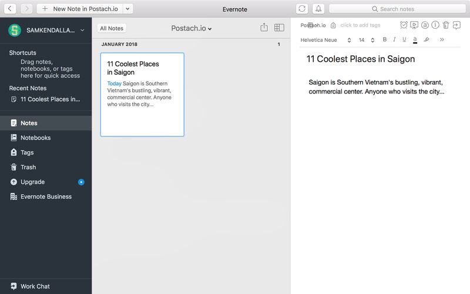

(Source: Author screenshot)

## 5. Add Images

Images break up large chunks of text and help to guide your reader’s eye down the page. It’s easy to add pictures to your blog posts with Evernote. Just click on the paperclip icon on the toolbar to attach a file and select the image you would like to add.

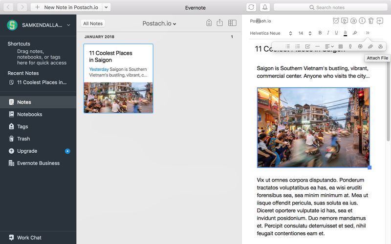

(Source: Author screenshot)

If you want to annotate an image once you have inserted it to Evernote, right click on it and select “Annotate this image…" Use arrows, text, and other tools to add the desired annotations.

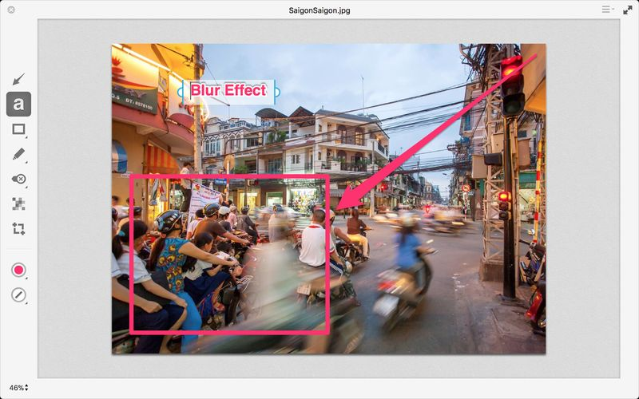

(Source: Author screenshot)

## 6. Tag to Publish

Once you have completed your post in Evernote, you are ready to publish it to your [Postach.io](http://postach.io/) site. Any notes tagged “Published" in your [Postach.io](http://postach.io/) notebook will automatically sync with your blog. Click to enter the text in the tags field at the top of your note and hit enter to save.

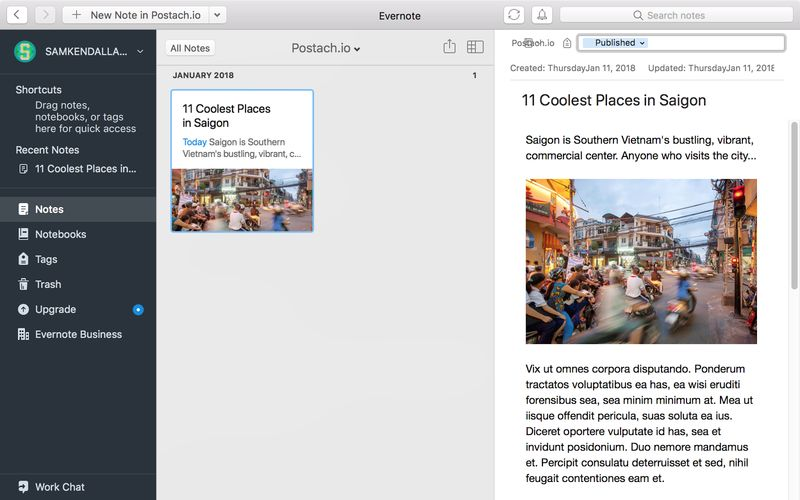

(Source: Author screenshot)

## 7. Sync

Although your Evernote notebook syncs with your [postach.io](http://postach.io/) blog automatically, new posts are often not synced straight away. To upload your post to your blog immediately, manually press the sync button at the top of the note (the icon with the two arrows that form a circle).

(Source: Author screenshot)

Return to the [Postach.io](http://postach.io/) tab in your browser. You should see a confirmation page like the one below. Click Log Me In and enter your account details to access your site and start personalizing its design.

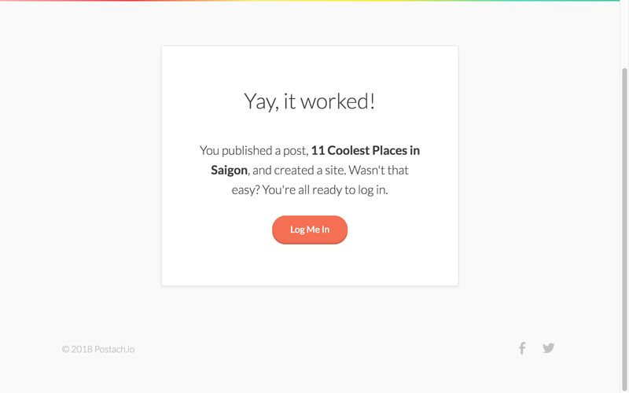

(Source: Author screenshot)

### Design Your Site

When you log into your [Postach.io](http://postach.io/) account, you will see the site dashboard. Click on the magnifying glass icon next to yours to view it in your browser.

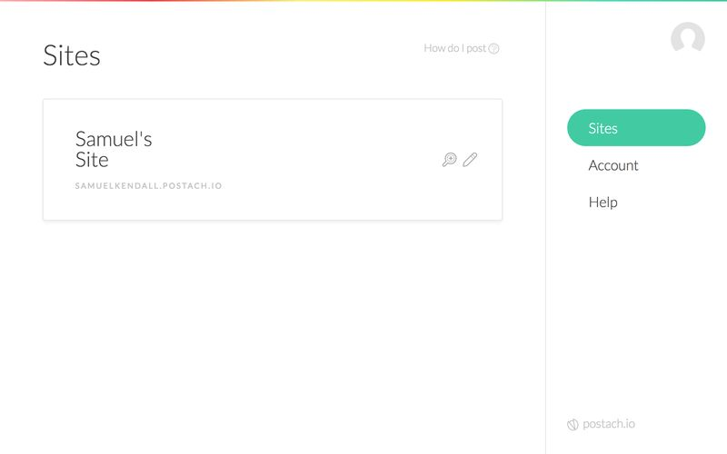

(Source: Author screenshot)

It will look a lot like this…

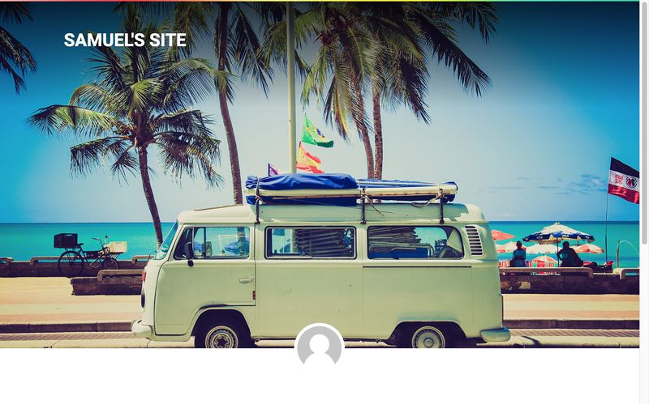

(Source: Author screenshot)

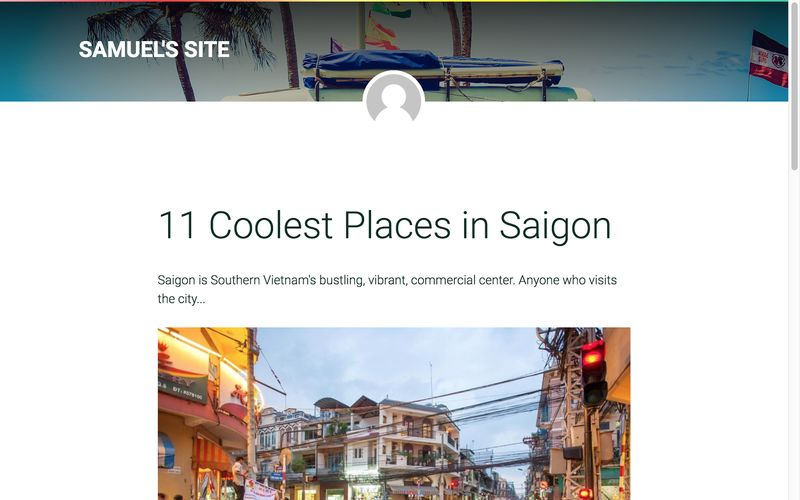

(Source: Author screenshot)

Confirm your first post is being displayed correctly and check out the default design. Looks great right? But if you want your blog make you stand out against the competition you need to adapt it to your purpose (travel blogging) and personalize it to distinguish yourself from your rivals and create a brand identity. Read on to find out how to make your blog beautiful.

## 1. Open the [Postach.io](http://postach.io/) Site Editor

Click on the pencil icon next to your site in the [Postach.io](http://postach.io/) dashboard to start editing your blog.

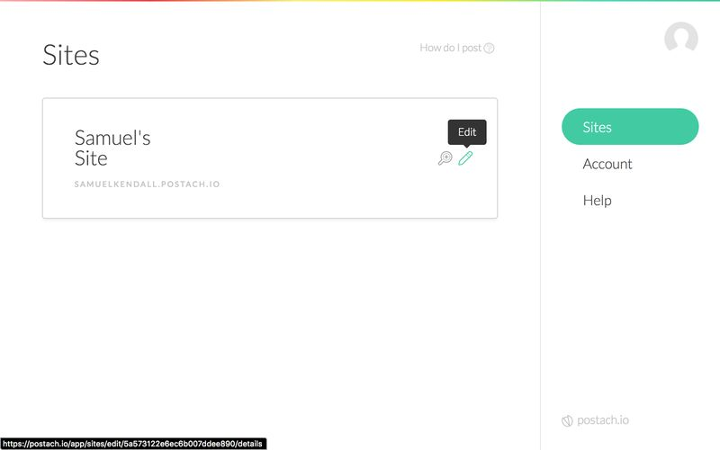

(Source: Author screenshot)

## 2. Name Your Site

A great travel blog needs a catchy, memorable, original name. When naming your site, try to keep your options open. For example, if I am writing about Vietnam, I might be tempted to call my blog AsianTravels. If a year later, I decide I want to begin traveling South America, I will have a hard time shoehorning posts written there into my Asia-specific blog. Here are some examples of site names from successful travel bloggers to give you some inspiration:

[Nomadicmatt.com](http://nomadicmatt.com/)

[Expertvagabond.com](http://expertvagabond.com/)

[Ytravel.com](http://ytravel.com/)

[Adventurouskate.com](http://adventurouskate.com/)

[Youngadventuress.com](http://youngadventuress.com/)

[Neverendingfootsteps.com](http://neverendingfootsteps.com/)

We went for [Flipflopsforever.postach.io](http://flipflopsforever.postach.io/) because it is catchy and vague enough for us to be able to write about almost any hot holiday location. An ambiguous name also means that if you create a custom domain and want to sell it in the future, you will not be limited to a specific market.

- Enter your new blog name in the Subdomain box.

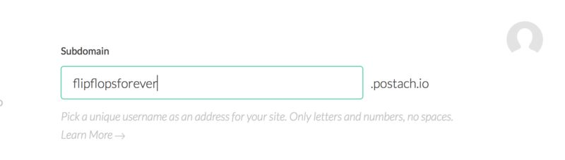

(Source: Author screenshot)

## 3. Get a Custom Domain

Although you can create a blog for free, you will need to create a custom domain if you want to build an online presence and optimize your site for traffic in the future. Your blog will also appear more professional, with a .com or .[co.uk](http://co.uk/) domain suffix rather than .[postach.io](http://postach.io/). Custom domains come in all paid packages. Click on Change plan in the Billing tab to see the paid packages we offer by monthly or annual subscription.

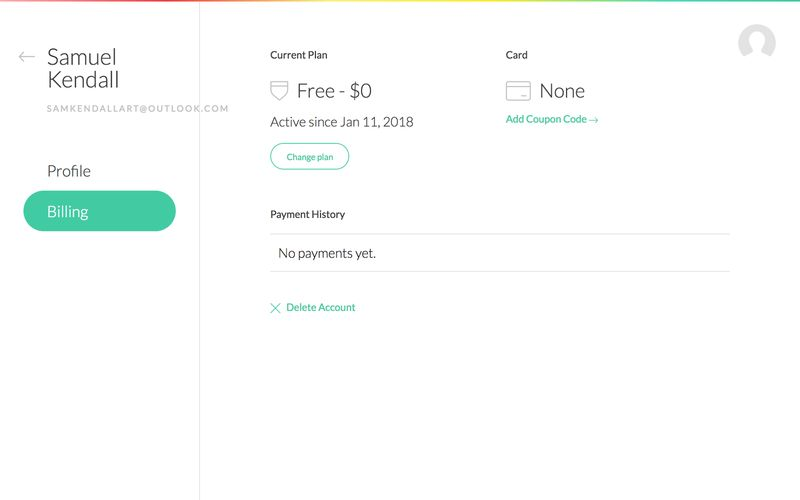

(Source: Author screenshot)

You can see the monthly subscription packages we offer below. With all paid plans you will gain access to premium site designs and priority support from the [Postach.io](http://postach.io/) team. Choose yours.

Follow the on-screen steps to complete your subscription and upgrade your account. Check the box in the Details tab that says “I’d like to use a custom domain" and follow the instructions to lock in your custom domain name with an appropriately professional suffix such as .com.

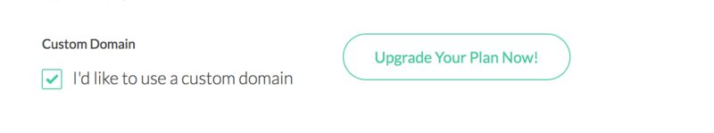

(Source: Author screenshot)

## 4. Introduce Yourself

If you want Google and the people who visit your blog to know who you are and what you write about, you need to write a site description. The more keywords you can use that person might search to find travel blogs such as yours, the better you will rank in web searches for these terms. With [Postach.io](http://postach.io/) you can easily edit your site description in the Details tab:

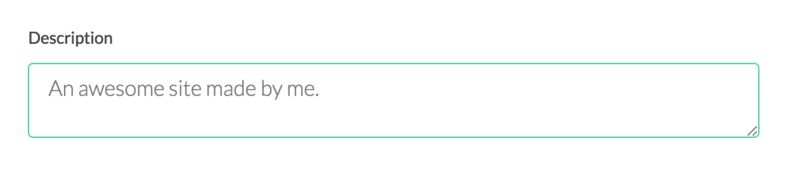

(Source: Author screenshot)

Here are a couple of examples of site descriptions for well-known travel blogs:

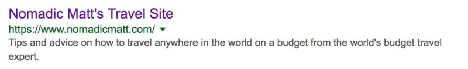

(Source: Author screenshot)

Write a short story about who you are, what topics you cover, and your specific approach to travel blogging. What will people find when they click through from search engines? Tell them.

## 5. Personalize Visual Content

In the Details tab, you will also see options to upload your own logo and cover image so you can personalize the visual aesthetic of your site.

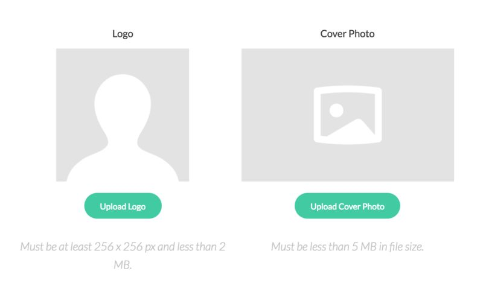

(Source: Author screenshot)

If you want to personalize your blog to you rather than your brand, use a photo of yourself as your logo for that personal touch. If you're going to brand your site to be more anonymous, you can create a free logo [here](https://www.freelogodesign.org/index.html). Follow the on-screen instructions and select an appropriate design. We made a primary logo for our blog in less than a couple of minutes:

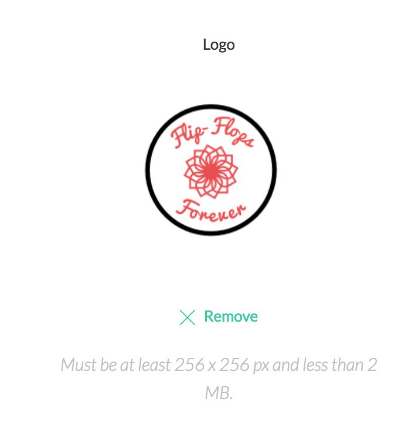

For your cover photo, use a picture you have taken, or use a site where you can download public domain images for free like [Pixabay.com](https://pixabay.com/).

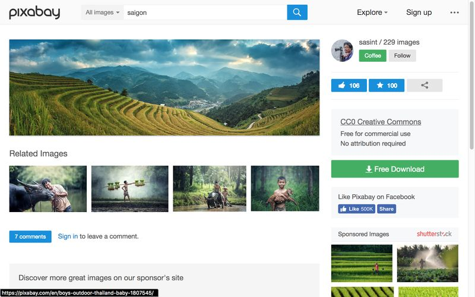

(Source: Author screenshot)

Your images will be displayed as thumbnails when they have finished uploading. Be sure to check your site though to ensure they are displayed correctly.

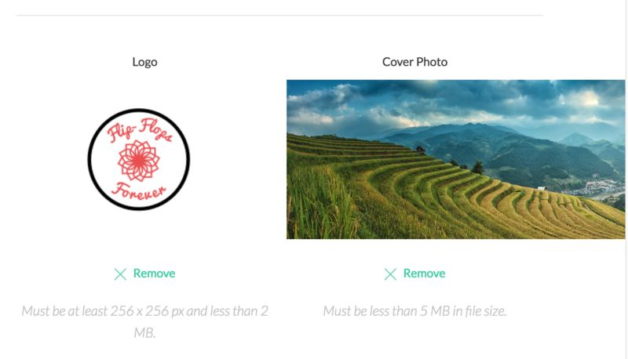

(Source: Author screenshot)

## 5. Pick a Theme

[Postach.io](http://postach.io/) offer a wide selection of free and premium site designs, or themes, which you can apply to your blog. To change from the default theme, go to Edit Theme and browse the thumbnails to see what catches your eye.

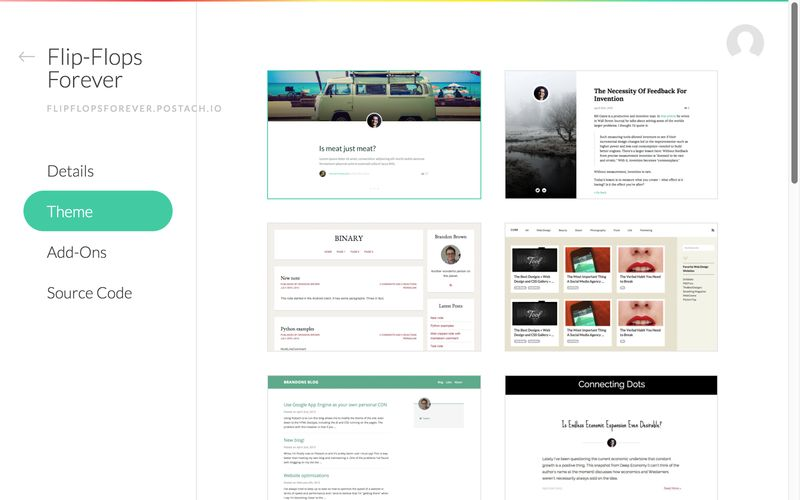

(Source: Author screenshot)

If you like the look of a theme, hover your mouse over it and click to apply.

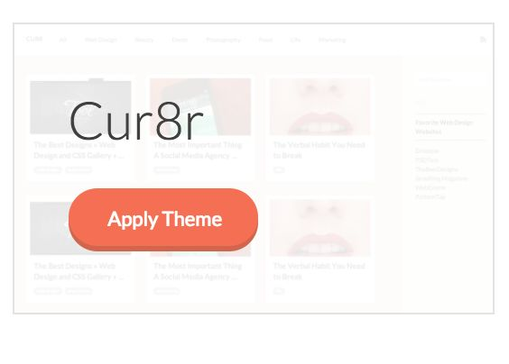

(Source: Author screenshot)

To see how the theme looks on your site, just visit it to see what’s new. If you are not keen on a template, don’t worry. Changing it will not result in the loss any of your data, posts, or images. Just return to the Themes tab to pick something different. We decided to stick with the default template for our blog because we love the wide format and high definition cover photo display.

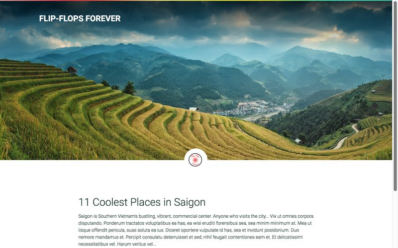

(Source: Author screenshot)

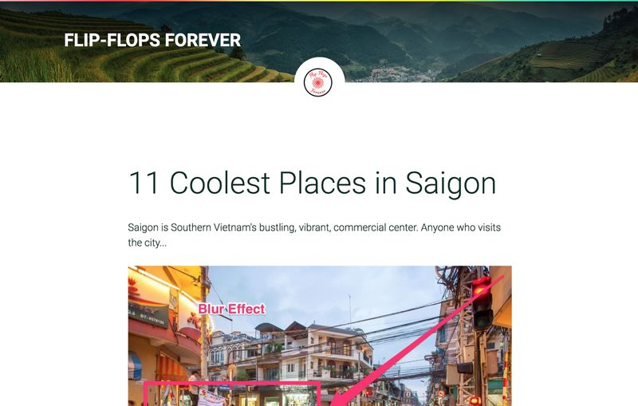

(Source: Author screenshot)

## Going Forward

That’s it! You are now set up with a travel blog to rival the rest. Soon every adventure you take will also be a mission to find the most intriguing and exciting locations and cultures. As you discover the world, keep on populating your site with original, quality content, sharing it with your friends, family, and the world to see.

The future of your blog is bright. The more fantastic content you fill it with, the more you will show up in related keyword searches on Google and other aggregators, and the more unique traffic you will bring in. This is the golden egg for any online business. Once you have a steady pool of visitors passing through your site every day, you can start to explore opportunities for monetizing it through ads, mentions, and other affiliations.

For now, get blogging! There is a whole world out there to see. If you start blogging regularly now, you will become an even better writer for when your posts are getting read by the masses.

If you're looking for a simple way to set up your own blog and are familiar with Evernote, [Postach.io](https://postach.io/site) is free and extremely simple to use - you can get started right away. [Publish your first post](https://postach.io/site) today!
