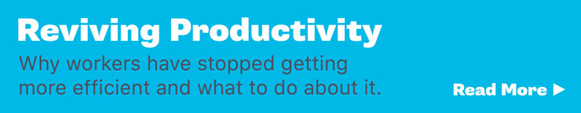

# The Hardest Workers Don't Do the Best Work

by

Jerry Useem

January 2, 2018, 8:00 AM EST

He's not No. 1 in hustle.

At the 2014 World Cup soccer tournament in Brazil, the U.S. midfielder Michael Bradley put up a statistic that wowed folks back home: He [ran further](https://www.si.com/planet-futbol/2014/06/28/michael-bradley-usa-world-cup-jurgen-klinsmann) than anyone else. Through three games, Bradley had covered a total of 23.4 miles, according to a micro-transmitter embedded in his cleat, while his team finished tops among nations in “work rate,” a simple measure of movement per minute otherwise known as running around.

[Commentators at the New York Times](https://goal.blogs.nytimes.com/2010/06/25/how-good-is-michael-bradley-the-stats-say-very-good/), [U.S. News](https://www.usnews.com/news/blogs/data-mine/2014/07/03/covering-ground-at-the-fifa-world-cup-miles-possession-and-miscues), and [NBC Sports](http://soccer.nbcsports.com/2014/06/26/one-world-cup-stat-regarding-michael-bradley-to-blow-some-us-minds/) were duly impressed. Left unmentioned was the fact that the lowest work rate of the tournament by a non-defender was recorded by its most valuable player, Argentine goal machine Lionel Messi.

It seems strange that soccer’s greatest player spends most of his time moving at a golfer’s pace. And also that those hustling Americans couldn’t even qualify for the 2018 World Cup.

But [forthcoming research](https://www.mortenhansen.com/) by the Norwegian-born business scholar Morten Hansen supports the idea that people who do the most work aren’t the ones who do the best work. And it raises this interesting question: Could America’s valorization of hustle be a cause of failure?

Hansen, a management professor at the University of California at Berkeley, has just wrapped up a five-year study of American workers. His main finding, as summarized in a recent interview: “The top performers in this data set do less.”

It’s not that successful people don’t work hard, though they tend not to be the ones pulling the longest hours. It’s that they do fewer things, and seem to have better developed mechanisms for deciding what not to do.

For his research, Hansen signed up 4,964 people (store managers, plant foremen, sales reps and one Las Vegas casino dealer) to record the work habits of their bosses, their subordinates and themselves.

It turned out that some people who did less just accomplished less. But the top performers also did less, and seemed to have a knack for figuring out how to sidestep inessential tasks to obsess on a few important things. Just as Messi’s long periods of inactivity allowed him to focus on explosive runs toward the goal, these corporate paragons were able to bring extraordinary force to bear on a few vital activities because of committees not joined, initiatives not undertaken, podcasts not recorded.

In an office context, the concept of conserving energy is a bit heretical. A busy person is a successful person, we’re repeatedly told, and team players say “Yes, *and*....”

That makes saying “no” a skill in itself.

In his forthcoming book, “Great at Work,” Hansen gives examples of how top performers successfully dodge distracting tasks without antagonizing bosses and colleagues. Hansen cites the case of James, a junior management consultant, who when asked to add an extra sales pitch to his docket, was able to decline without actually saying “no.” He did it by telling his boss that adding the task would result in diminished attention to an all-important merger project. This left the actual decision to the boss, reinforced his position as decision-maker, and had the effect of paring James’s workload without hurting his social capital.

“The question, ‘Are you available?’ is one you should never answer,” Hansen said.

Handling outside pressure is half the trick. The other part involves resisting internal pressure.

To illustrate the point, Hansen’s book relates the story of Susan Bishop, an executive recruiter, who learned to resist the urge to please every client. She started by resolving to decline assignments outside her specialty, media companies, and announced her new practice to her employees. That gave her the courage to turn down an overture from Coca-Cola Co. for a non-media executive-search job, albeit “with knees knocking and palms sweating,” Hansen writes.

Such stories, of course, don’t necessarily prove anything. Hansen acknowledges that he can’t rule out the possibility of reverse causality — the idea that the Lionel Messis of the world can be choosy because they’re star performers, not the other way around.

Most likely, Hansen speculates, is that cause and effect go both ways. Strategically selective workers get ahead. As they build reputations, opportunities multiply. Book deals lead to speaking offers that lead to online teaching opportunities. Selectivity becomes ever more essential to continued success.

“If you’re not careful,” Hansen said, “you can expand your scope until you lose one of the elements that made you successful in the first place.”

Hustle may be a virtue. But it’s hard work to prevent it from becoming a vice.

This column does not necessarily reflect the opinion of the editorial board or Bloomberg LP and its owners.

To contact the author of this story:  
 Jerry Useem at [jvuseem@gmail.com](https://mail.google.com/mail/?view=cm&fs=1&tf=1&to=jvuseem@gmail.com)

To contact the editor responsible for this story:  
 Jonathan Landman at [jlandman4@bloomberg.net](https://mail.google.com/mail/?view=cm&fs=1&tf=1&to=jlandman4@bloomberg.net)
