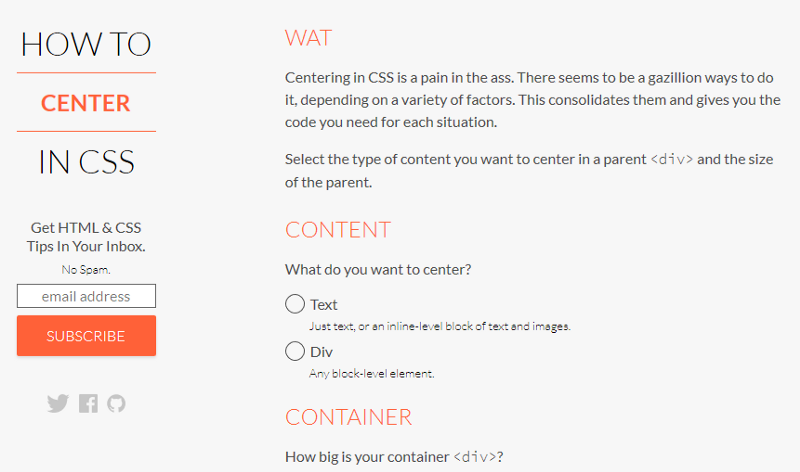

# Alinhamento com CSS — Centralizar é Sempre um Saco

Se tem algo que eu dificilmente consigo fazer sem consultar o [Stack Overflow](https://stackoverflow.com/questions/8865458/how-do-i-vertically-center-text-with-css) é centralizar os elementos do meu projeto usando CSS. Há milhares de jeitos diferentes de se fazer, dependendo de outros milhares de fatores diferentes. É sempre uma dor de cabeça…

Não seria bacana se houvesse uma maneira de você dar as condições dos elementos que você quer centralizar e o código fosse gerado magicamente? Pois bem… essa ferramenta existe e se chama How to Center in CSS.

#### Será o final das nossas dores com CSS?

O site [How to Center in CSS](http://howtocenterincss.com/), desenvolvimento pelo engenheiro de software Oliver Zheng, tem como proposta ajudar os desenvolvedores a centralizar os elementos (verticalmente, horizontalmente, etc) dos seus projetos. A ideia é bem simples: você informa qual o tipo do conteúdo que deseja centralizar (texto ou uma div), suas dimensões (altura e comprimento), qual alinhamento (centro, direita, esquerda) e o que considero o principal, **para qual versão do IE você deseja dar suporte.** Feito isso, basta clicar no botão “Generate Code”.

Página principal do How to center in CSS

O código então é gerado e você pode copiá-lo para dentro do seu projeto. Bem simples, né? Por exemplo, para centralizar (verticalmente e horizontalmente) uma div de dimensão desconhecida, sem suporte ao IE, o código gerado foi esse:

Para fazer o mesmo dando suporte ao IE6, por exemplo, o código gerado é outro:

#### Conclusão

Sem dúvidas há casos em que esta ferramenta não ajudará, mas para a maior parte dos casos ela será uma grande mão na roda. E você? Também tem dificuldades para centralizar elementos? Compartilhe com a gente nos comentários a sua experiência!
