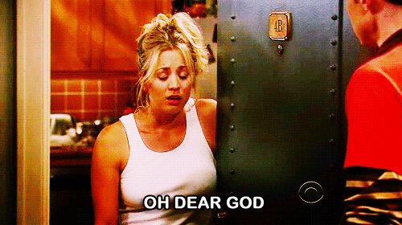
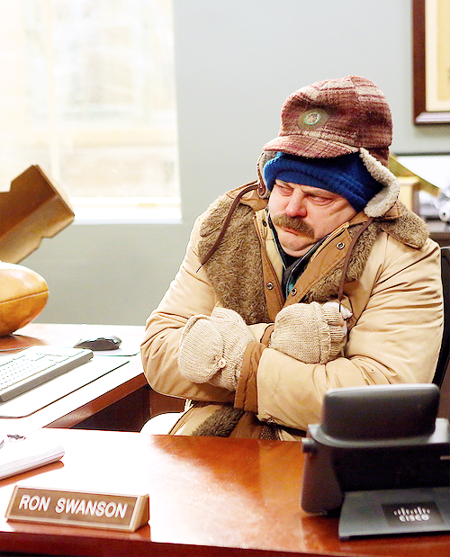
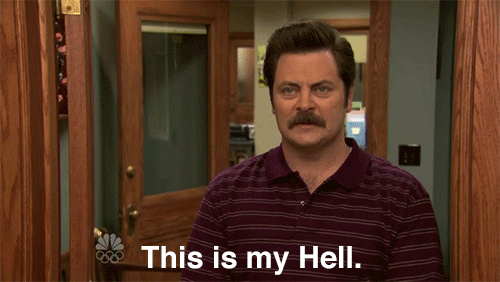

# O hábito de reclamar só piora a sua vida

Tem coisas que você não gosta, mas precisa fazer de qualquer jeito

Tenho feito um experimento pessoal nos últimos dias. Não é nada científico ou metódico, apenas um processo para me ajudar a criar mais consciência sobre como minha mente e meus impulsos funcionam e criei [uma página simples no Facebook para compartilhar minhas impressões](https://www.facebook.com/xexperimentando). Este texto é fruto desse processo de observação.

Meu objetivo é passar 21 dias sem reclamar, policiando meus impulsos, buscando entender melhor de onde surge essa vontade e quais os efeitos (sejam positivos ou negativos) que esse hábito pode gerar.

### A válvula de escape

Quando nos encontramos numa situação desconfortável, nosso impulso natural é buscar algo para criticar, quebrando o gelo e criando um meio comum, onde as pessoas se conectam por um sentimento que ambos podem identificar.

Quando estamos presos no elevador com algum estranho e surge aquele silêncio constrangedor, é comum alguém emitir um sutil comentário. Pode ser sobre como está calor no dia, como o trânsito estava horrível ou como está cada vez mais difícil estacionar perto do centro. Em conversas com amigos e familiares, a reclamação também surge como assunto integrador, seja quando falamos sobre trabalho, futebol ou a presidente da república.

No geral, o impulso parece vir como uma válvula de escape, uma forma de aliviar algo que nos incomoda. Mas o mundo é um lugar hostil, somos expostos diariamente a situações que nos deixa incomodados. Assim, não demora muito para criarmos uma compulsão. Sempre que existir a chance, vamos expressar alguma insatisfação, mesmo que não seja verdadeira.

Utilizamos reclamações como um sistema de fuga.

Pense um pouco, todas as vezes que você disse *“nossa, estou tão cansado”* era verdade ou foi uma reclamação vazia?

### As duas formas de pensar

No livro “[Rápido e Devagar](http://www.saraiva.com.br/rapido-e-devagar-duas-formas-de-pensar-4074748.html)”, Daniel Kahneman explica de forma bem sucinta como nossos sistemas cognitivos funcionam. Quando você ler “2+2” neste texto, tenho certeza que não vai parar para pensar, sei que a resposta surgiu na mente, sem esforço algum. Este é seu Sistema 1, de onde saem nossas informações automatizadas, o conhecimento que temos condicionado ao longo dos anos. Quando eu pergunto quanto é 38x40, no entanto, você vai precisar pensar um pouco até encontrar uma resposta. Este é o Sistema 2, capaz de fazer conexões mais complexas e pensar logicamente, mas é comparativamente mais devagar, exige certo esforço.

Segundo Kahneman, a repetição lógica do Sistema 2 gera a automatização do Sistema 1. Quando repetimos uma informação em nosso sistema lógico, ele tende a se acostumar e transferir essa automatização para o Sistema 1, condicionando o processo.

É assim que funcionamos com estudos, treinos e outras formas de aprendizado. Repetimos toda parte complicada até passarmos a não pensar muito sobre o que estamos fazendo.

Um exemplo simples disso foi quando aprendi a montar cubo mágico. O começo foi bem moroso, estudando o método, pensando bastante em cada uma das etapas e movendo as partes cuidadosamente. Depois de alguns anos, esse conhecimento foi automatizado. Hoje em dia eu não penso mais para solucionar o quebra-cabeça, é uma ação inteiramente instintiva para mim.

Quando alguém me pede para explicar como resolvo determinada etapa, não sei dizer como faço. Preciso repetir o movimento na menor velocidade possível e ir escrevendo a sequência num papel para tentar entender o que eu mesmo estou fazendo. E acabo errando quando preciso executar a tarefa desse jeito.

### Ficamos ancorados na reclamação

Nosso processo inicial de reclamação é Sistema 2. Algo realmente nos afeta, pensamos sobre aquilo e conseguimos tirar algumas conclusões, positivas ou não. O ponto que pude observar durante meu experimento, é que dificilmente paramos de reclamar depois da primeira vez. Repetimos diversas vezes, tanto em dialogo interno quanto para outras pessoas. Fazemos isso sempre que temos oportunidade, condicionando essa reclamação no Sistema 1, quando não pensamos mais sobre a situação e simplesmente reclamamos sobre de forma vazia.

Podemos notar que isso é verdadeiro em vários aspectos, basta observar a frequência que reclamamos de situações que não fazem a mínima diferença e, como disse anteriormente, que muitas vezes nem paramos para pensar se são realmente verdadeiras.

Até o momento, se não fosse o fato de ser desagradável estar próximo de pessoas que reclamam muito, o problema não parece tão sério assim.

No entanto, Kahneman também explica um curioso efeito cognitivo, o que ele chama de *Priming Effect.*

Em um dos experimentos, os pesquisadores pediram para que pessoas ouvissem uma gravação sob o pretexto de testar a qualidade dos headphones. Um grupo deveria escutar acenando positivamente com a cabeça, para cima e para baixo. O outro escutaria o mesmo áudio fazendo um gesto de negação, girando a cabeça de um lado para o outro. A mensagem que ambos os grupos ouviram era uma gravação de rádio. O grupo que ouviu fazendo sinal de “sim” com a cabeça foi mais propenso a aceitar a mensagem transmitida no áudio do que o grupo que fez sinal o de “não”.

Consigo observar o *Priming Effect* atuando claramente quando reclamamos.

Imagine-se frequentando uma academia. Sabemos que não curte treinar, acha o ambiente ruim e as pessoas que estão lá não combinam com o seu universo habitual. Você  passa a reclamar disso com bastante frequência, sempre que te perguntam sobre a academia, seu feedback é acompanhado de alguma reclamação ou observação negativa. Não é difícil que, em bem pouco tempo, sua disposição em frequentar uma academia desapareça, dado que seu gatilho associativo é sempre ruim.

Minha esposa frequentou a academia comigo durante um ano, sem falhas. Depois de um tempo passamos a comentar sobre alguns problemas que observávamos e posturas que achávamos nocivas nesse meio, o que até [gerou um texto sobre o assunto](https://papodehomem.com.br/por-que-a-filosofia-no-pain-no-gain-atrapalha-mais-do-que-ajuda/). Depois de bem pouco tempo ela desistiu completamente de frequentar a academia.

Não é como se ela gostasse antes, mas agora, a reclamação causou efeito muito forte. Sair de casa para treinar conflitava com o sistema automático dela, que instintivamente entendia aquele estímulo como algo incrivelmente ruim.

### Tem coisas que você não gosta, mas precisa fazer de qualquer jeito

Dentro dessa ideia toda, é muito fácil identificar situações onde reclamamos bastante, ao ponto onde ficamos ancorados totalmente nos aspectos negativos, resultando numa enorme dificuldade de inciar qualquer ação.

Quando eu decido começar uma dieta, eu sei que o processo é difícil. Penso que gostaria mesmo era de comer aquele hambúrguer da esquina, reclamo que alface e tomate não tem gosto de nada, que ninguém pode gostar daquilo de verdade. Ao mesmo tempo que me ligo em perfis do instagram que mostram orgias gastronômicas cobertas de bacon, cervejas artesanais e gente cozinhando comida com cara de desejo. É bem fácil, agora, entender que nosso sistema cognitivo exigirá um extremo esforço para nos manter na linha. Minha dieta vai por água abaixo.

Quando eu evito uma reclamação, o pensamento negativo que surgiu vai embora mais rápido, diferentemente de quando eu me expresso verbalmente.

Conversando com alguns amigos da universidade, vi que o sentimento de que existe algo errado nas aulas gera o impulso de contestar a situação. Esse movimento não desaparece quando precisamos finalmente estudar para a matéria, e acaba resultando numa resistência ao estudo. É como se estudar estivesse errado, é como se todo aquele esforço fosse fruto do erro de outra pessoa.

O curioso de não poder reclamar é que me tornei mais propenso a tomar uma atitude quando me deparo com situações ruins. Quando não reclamamos, a emoção negativa não tem vazão, fica uma certa tensão. Resta apenas nos mover para resolver ou ir para bem longe, onde o problema não é capaz de nos alcançar.

Mesmo que o professor seja ruim e o método esteja confuso, preciso estudar para passar. Não tem mágica. Posso odiar ir à academia, mas se eu não for, vou engordar, minha saúde vai piorar e vou sofrer todos os problemas relacionados. Dieta pode ser chato, mas se você não comer direito, sua saúde será comprometida, gostando ou não. Observando como um simples hábito afeta nossa mente e nos deixa menos propensos a agir, podemos entender que reclamar não é - muitas vezes - o melhor caminho. Que podemos identificar algo como ruim, mas mastigar este problema dia após o outro não fará as coisas mudarem.

Nosso país passa por uma crise complicada, nossa economia está indo de mal a pior, nossa vida pessoal é coberta de contratempos e dificuldades. Temos motivos para reclamar de praticamente todos os aspectos possíveis. Só que simplesmente reclamar não vai fazer as contas sumirem, nosso aluguel ainda precisa ser pago, ainda precisamos cuidar da nossa saúde, precisamos ler, estudar e fazer o amanhã acontecer.

Falar sobre todas essas coisas pode nos aliviar, mas aos poucos, esquecemos algo bem importante, que precisamos nos virar em meio ao caos, independente de quais são os contratempos.

---

*publicado em 08 de Fevereiro de 2016, 00:05*
