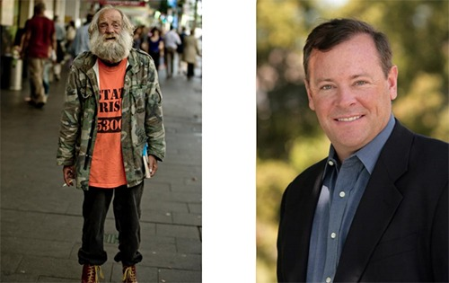
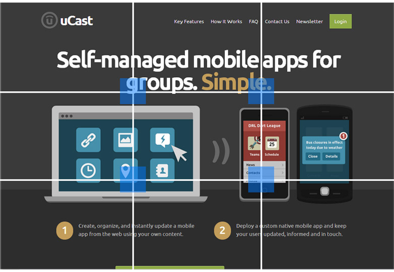

# The 12 Principles Of Effective Blog Design

People judge books by the cover and other people by their looks.

Take a look at these 2 men:

Now answer these questions (you can’t choose “neither”):

- Which one would you rather ask investment advice from?
- Which one would you rather have babysit your children?
- Which one would you rather have cook your dinner?

… and so on. You don’t know anything about these men. Yet, you make assumptions and can even take decisions based on their looks.

What does it have to do with your blog? Everything!

> “As aesthetically orientated humans, we’re psychologically hardwired to trust beautiful people, and the same goes for websites. Our offline behaviour and inclinations translate to our online existence.”

This is a quote by Dr. Brent Coker, [who studied the impact of attractive websites on human behavior](http://www.sciencealert.com.au/news/20111107-22383.html). Websites that are more attractive and include more trimmings create a greater feeling of trustworthiness and professionalism in consumers.

## **Rule #1 – People Judge Your Blog Based On The Design**

If somebody knows you well, they don’t care about your looks that much. If they see you for the first time, looks matter a lot.

The content of your blog is always more important than the design, but you need to woo people with your design first. You draw them in with design, and keep with content.

> “Design is not just what it looks like and feels like. Design is how it works.” — Steve Jobs

Here comes advice how to design a better blog. The following advice will help you design a better blog and this in turn will help you sell more (doesn’t matter whether you’re selling free sign-ups, coaching sessions, products or whatever).

## **Rule #2 – Function Always Before Aesthetics**

[Who is your site for?](https://conversionxl.com/how-to-identify-your-online-target-audience-and-sell-more/ "How to Identify Your Online Target Audience and Sell More") What are they looking for? [76% of people want it to be easy for them to find what they want](https://blog.hubspot.com/blog/tabid/6307/bid/14953/What-Do-76-of-Consumers-Want-From-Your-Website-New-Data.aspx).

What kind of blog layouts are they used to using? Remember, people spend most of their time on OTHER websites, not yours & [prototypical websites are almost always rated as more beautiful](https://conversionxl.com/why-simple-websites-are-scientifically-better/ "Why “Simple” Websites Are Scientifically Better").

Avoid totally new and never-seen-before layouts. [Your car isn’t unique, and your house might not be either](http://sethgodin.typepad.com/seths_blog/2007/10/how-to-create-a.html).

For return visitors search is vital. Make sure your search box is clearly visible (above the fold), [at least 27 characters wide](https://www.nngroup.com/articles/top-ten-guidelines-for-homepage-usability/) and that search can actually find relevant stuff. WordPress’s built-in search sucks, it lists the results by date, not relevance. Use a plugin like [Relevanssi](https://wordpress.org/extend/plugins/relevanssi/) to improve it tremedously.

## **Rule #3 – Simple Is Better**

Use plenty of white space. Don’t fill every possible space with banners, messages or whatever else. The more breathing room there is, the easier it is to consume the information you produce.

Here’s an excellent [post on using white space](http://www.alistapart.com/articles/whitespace).

## **Rule #4 – The Golden Rule of Thirds Makes Your Site More Pleasing**

You should never do a blog post without an image. A visual communicates your ideas much faster than any text.

The best images follow the [rule of thirds](https://en.wikipedia.org/wiki/Rule_of_thirds): an image should be imagined as divided into nine equal parts by two equally-spaced horizontal lines and two equally-spaced vertical lines, and that important compositional elements should be placed along these lines or their intersections.

*Image credit: [Wikimedia Commons](https://commons.wikimedia.org/wiki/File:Tadrart01.JPG)*

See how the image on the right is more interesting? That’s rule of thirds in action.

## **Rule #5 – Clarity & Specificity Always Win**

Content and clarity are important parts of the design.

What is this place? What can I do here? How is it useful? [First time visitors need to get answers to these questions within first seconds.](https://conversionxl.com/value-proposition-examples-how-to-create/ "Useful Value Proposition Examples (and How to Create a Good One)")

Make sure it’s possible to clearly understand what your blog is about and who’s it for – no matter which page the visitors land on. The better you build a connection between your reader and your blog, the higher the chances they will stick around.

People start reading your website from the top left corner. [The fixations go in order from left to right](http://www.gazehawk.com/blog/where-do-users-look-first/). That’s where you want to place the most important information.

## **Rule #6 – If They Can’t Read The Post, They Won’t Stick Around**

The text on your blog should be beautiful and easy to read.

Use large fonts (at least 14px), short lines (see the width of [Tynan’s blog posts](http://www.tynan.com/)) and lots of white space. New paragraph every 3-4 lines. A subheading after every 2-3 paragraphs.

The best blog typography lends a meaningful purpose to the content while triggering emotions in your readers in the process. Besides picking a beautiful web font, make sure that different text elements have a different look and feel (main headings, subheadings, regular text, italic text, quotes, lists and so on).

Here are [10 Examples of Beautiful CSS Typography and how they did it](http://3.7designs.co/blog/2008/06/10-examples-of-beautiful-css-typography-and-how-they-did-it/). Or take a look at [Space](http://getspace.org/), a WordPress theme designed for reading.

You can use [TypeTester](http://www.typetester.org/) to test and compare different fonts, sizes and so on.

## **Rule #7 – Always Invite Repeat Visits**

Over 95% of people won’t buy anything on their first visit. Hence you should not even try to sell anything to your first-time visitors. Instead, try to get them to come back so you can build a relationship and add value before you even make them an offer of any kind.

How can you do that?

- invite them to subscribe to your RSS feed (and state how many people already do = social proof),
- use a lead magnet to attract them to sign up to your email list,
- offer to subscribe to your blog posts over email ([Feedburner](https://feedburner.google.com/) is a good tool for this),
- ask them to follow you on Twitter or become a fan on Facebook.

Make sure you focus on ONE of these options the most (email list is best), but give a choice of up to 3 options.

This is how [aext.net](http://aext.net/) is doing it:

## **Rule #8 – Always Improve Signup Forms**

[Best signup forms](https://conversionxl.com/14-steps-to-building-sign-up-forms-that-convert/ "14 Steps to Building Sign-up Forms That Convert")

- put the form labels above the input box (not next to it),
- give clear reasons to take action,
- have the submit button say what’s coming next,
- ask for as little amount of data as possible – email address is enough in most cases.

The more fields people have to fill, the less people do it. Email personalization by name is not working as well anymore anyway, so might as well not ask for it.

[The One Question](http://www.theonequestion.com/), a site helping people find their life purpose, has 30% of new visitors sign up via this form every day:

Why is it so effective? The form offers the exact thing people search for on Google to come to the site. If you offer people what they want, they are happy to sign up.

## **Rule #9 – Use Text Logos Whenever Possible**

You don’t need to hire a fancy designer and pay top dollar for your logo. [Even huge budgets might not make much difference here](http://www.brandchannel.com/home/post/2010/10/11/Gap-Scraps-New-Logo.aspx).

You can create a beautiful logo by using text. [Pick a beautiful font](http://www.fontsquirrel.com/) and a background color you like – and voilà!

A designer from [Edicy](http://www.edicy.com/) took just 15 minutes to create this logo for an imaginary company:

Image credit: Tajo Oja

## **Rule #10 – Use Stock Photos Selectively**

Stock photos seem like a good idea, but 90% of them are utterly fake and cheesy. Have you googled ‘[women laughing alone with salad](https://www.google.com/#hl=en&sugexp=gsis%2Ci18n%3Dtrue&cp=8&gs_id=s&xhr=t&q=women+laughing+alone+with+salad&qe=d29tZW4gbGE&qesig=K6_1RdDEXZXiBNoJ0deErA&pkc=AFgZ2tnFV1HxzfrzzkBzgtq07lhg4B3iyaAQpYc1q-B_2Z8hnjiOHfVrDxgWc0kNOe8Lu3l0wVHH88HU5SCuPsRZjO1M513EVA&pf=p&sclient=psy-ab&site=&source=hp&pbx=1&oq=women+la&aq=0&aqi=g3g-s1&aql=&gs_sm=&gs_upl=&bav=on.2,or.r_gc.r_pw.r_cp.&fp=1044cc90155403b5&biw=1280&bih=675)‘ recently?

How can you expect to be taken seriously if you feature suits shaking hands and half-naked women measuring each others waists?

[Some people advocate](https://web.archive.org/web/20130527211222/http://www.alanweinkrantz.com/the-case-for-not-using-stock-photos-in-your-w) that given low cost cameras and smart phones, your own photography should be used rather than stock. I agree.

**Can’t decide on the color scheme?**

Let’s say you like the color red, but can’t decide what other colors match your favorite shade of red.

You don’t have to guess or ask your friends. You can use online color matching tools for this:

## **Rule #11 – Redesign Only When Necessary**

You should only change it if there’s a real need behind it. What’s not working for you today? Goal first, redesign second.

Will the new design help you get more clicks to your ads? Increase pageviews or signups?

Ideally your blog is a living, breathing organism that never stops evolving. Constantly A/B test your most important pages and design elements, and measure the improvement.

You can only improve what you measure. [Read our conversion optimization guide](https://conversionxl.com/what-you-have-to-know-about-conversion-optimization/).

## Rule #12 – Break The Rules Once You Understand Them

A great teacher of mine used to always reiterate “freedom through technique.”

What that means is that you’re free to break the rules of the system, only once you *intrinsically* understand what they are & why they exist.

Like the great painters who practice their brush strokes, or the musicians who play nothing but note scales on their instrument, doing exercises in technique is ultimately there so you can break out and find your own style.
