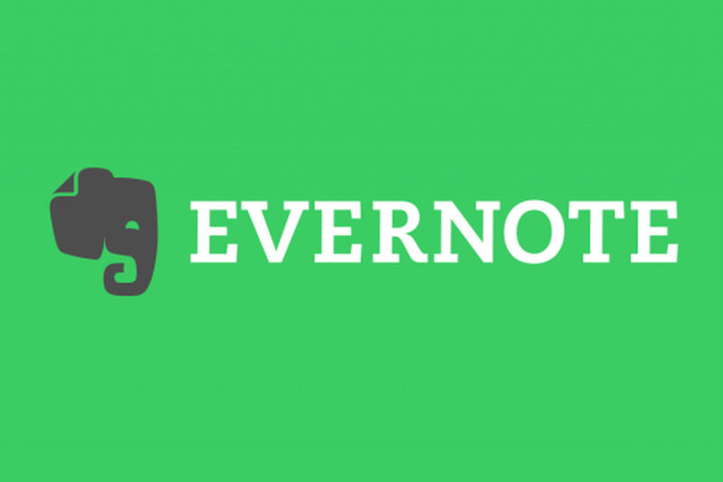
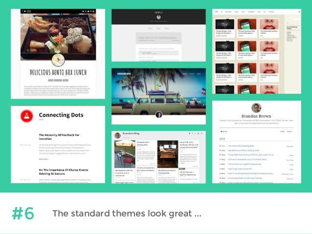

# 7 Tools That Help With Blog Writing - Blogging 101

Being a successful blogger means more than publishing posts. You need to be taking notes, writing down observations, and keeping track of the random ideas that might one day become a great read. It’s no wonder[so many great writers](https://www.artofmanliness.com/2010/09/13/the-pocket-notebooks-of-20-famous-men/)in history kept journals, or brought notepads with them wherever they went. You also need a way to organize and keep track of all this preliminary writing, and a platform that makes it easy to publish your posts.

But in the contemporary digital world, we can’t all be Hemingway with his trusty Moleskine in his pocket at a Parisian cafe. A pen and a piece of paper just aren’t the most useful tools to take an idea and turn it into something more. Today, you’re more likely to be carrying your laptop or your smartphone with you. Naturally, many companies have found ways to update the notepad for the 21st century.

But not all note-taking programs and apps are created equal. Many are basic. They aren’t designed for full-time writers or bloggers, or even those who need to keep track of many projects at once. Many note-taking programs aren’t particularly mobile or don’t work across several platforms.

With limited means to store ideas, or help you organize different topics, most note taking apps or programs just won’t cut it, even for beginner bloggers. Without an app or platform that includes these kinds of features, research and publishing are much more difficult and time-consuming.

However, one note-taking tool that rises above the rest is the cloud-based Evernote. Since its initial release,[Evernote has remained](https://www.lifewire.com/best-note-taking-apps-4136590)one of the most complete and consistent note-taking tools around. But it’s more than just a note-taking app. It also has powerful word processing features, image, audio, and video tools, and features that will improve your workflow and efficiency. It’s as close as you can get to a blogging platform, without it being limited to that specific function.

Because of Evernote’s flexibility and power, we at[Postach.io](https://postach.io/site/register/create)decided that it would be the perfect tool to integrate with our blogging service.

This article gives you a rundown of the most significant features of Evernote, and how bloggers use Evernote as an organizational and publishing tool to increase efficiency and workflow. We will also discuss seven of the most useful ways we at [Postach.io](http://postach.io/) have integrated our blogging system to work seamlessly with the Evernote app.

## Evernote: A Quick Overview

If you aren’t familiar with Evernote, have no fear. We want to make sure you know about its many features and how they make blogging easier. If you want a much more detailed overview of Evernote’s capabilities, we suggest checking out[some of the other articles](https://blog.postach.io/post/evernote-blogging-how-to-do-it-right)on the [Postach.io](http://postach.io/) blog. Here are the basics...

The latest release of Evernote works on all major platforms (iOS, Android, macOS, Windows, and the web). Because Evernote is not tied to a single operating system or environment, it is far more accessible than other note-taking programs, making it perfect for nomadic bloggers who aren’t tied to one environment.

At its core, Evernote is a note-taking app. Users can type or handwrite notes, depending on what device they are on. Users can also turn photos, audio recordings, or videos into notes. All of the materials you collect save straight to the cloud, so they are easy to access from your phone, tablet, laptop, desktop, or other web-enabled device.

Looking beyond the note-taking features, you will find a full suite of features bloggers can take advantage of to improve their workflow and efficiency, to take their notes, ideas, and drafts from the Evernote platform and turn them into eye-catching blog posts using [Postach.io](http://postach.io/).

In addition to its technical features, Evernote is also pleasing to the eye. As opposed to other content management systems (CMS), especially WordPress, this app is clean, minimal, and portable.[According to Mike Johnston](https://www.cmscritic.com/minimalist-blogging-platforms/)of CMS Critic, the sheer number of plugins and add-ons in WordPress have made it less usable in recent years.

This has led to a search for apps that emphasize writing and dispense with the complications. Evernote’s visual presentation is a breath of fresh air designed to help writers focus on their writing without all the distractions.

Now let’s get down to some of the best features of Evernote and [Postach.io](http://postach.io/) that will make your blogging much easier and more effective.

## 1. Work in the Environment that Suits You

We’re all creatures of habit, and when it comes to using digital products, we’re no different. We like what we like. Many blogging services require you to use their platform, which can be a steep learning curve. This learning period can take the wind out of your sails as far as motivation is concerned. While you’re busy trying to find everything related to an idea or post and transfer it over to your CMS, you may lose your creative moment.

Because Evernote is already such a popular app, when we started [Postach.io](http://postach.io/) blogs, we wanted to capitalize on that familiarity. We understood that users would prefer to use something they were already familiar with when creating posts, doing research, and keeping tasks organized. We figured the Evernote environment was already doing that job well enough. All we had to do was figure out a way to turn Evernote into a CMS.

To do that, we designed a way for users to sync their existing Evernote content right to their [Postach.io](http://postach.io/) blogs.

All you have to do is[sign up](https://postach.io/site/register/create)for a [Postach.io](http://postach.io/) account, create a site, and link your Evernote account to your [Postach.io](http://postach.io/) one. Once you’ve done that, you simply create a new notebook in Evernote to automatically feed your content to your blog.

## 2. Storing Content Your Way

Similar to the above, we are also aware that there are a variety of ways to store content. Evernote is a cloud-based app, so many users choose to use the content storage provided by Evernote. Others are comfortable using Dropbox, which has become an industry leader in content storage. Instead of creating our own methods of storing content, we allow users to choose whichever interface they prefer.

The main advantage of using Evernote to host your content is that it is already there ready to push to your blog. Additionally, by using Evernote, you are taking advantage of its native text editor. You won’t have to create new files or folders or direct your blog to those folders. Nor will you have to edit CSS or other style elements in a third-party text editor. However, if you’re more used to using Dropbox to host content,[there are some simple ways](https://webdesign.tutsplus.com/tutorials/create-and-theme-an-evernote-powered-blog-with-postachio--cms-21063)to get [Postach.io](http://postach.io/) synced.

## 3. Connect Evernote and [Postach.io](http://postach.io/) with Ease

Connecting your Evernote notebooks to [Postach.io](http://postach.io/) is one of the easiest things you can do. Just about every review of our service recommends this feature. Once you’ve signed up for a [Postach.io](http://postach.io/) account, you’ll be asked to connect your Evernote account.

It’s as simple as a single click. After connecting, if you look at your Evernote, you will see that a new folder for your blog content has been created. This folder will contain all your future blog posts.

You can also point [Postach.io](http://postach.io/) to whichever other notebooks you want to publish.

## 4. Work Fast, Publish Quickly

Instead of a physical notebook, you’re probably carrying an electronic device with you most of the time. Having a digital notebook at your fingertips means that you’re able to do research, plan posts, collect images, and transfer video and audio clips from your phone whenever the mood strikes. If you have a fantastic idea that you know will become a great post, you can start padding it out on Evernote on your morning commute or while you’re at the gym. Just be sure not to get any sweat on your device.

Because you’re already working within the Evernote platform, any time a post is ready to go live, publishing is as easy as adding a tag to it. Use the “published" tag, and Evernote tells [Postach.io](http://postach.io/) to post the note to your blog. If you want to edit it, you can do that right within Evernote. The same for video or images. Just drag the multimedia you want into the post, and it will automatically sync with [Postach.io](http://postach.io/), updating your blog post.

## 5. Themes and Formatting

Not every blogger is an accomplished graphic designer. That’s why we have a variety of ways for you to customize the appearance of your blog.

### Themes

First, [Postach.io](http://postach.io/) bloggers can choose from[several themes](https://github.com/postachio)that will change the visual presentation of the blog. When you sign in, you can navigate through those themes in the Theme Browser, and if you see one you want to use, great!

However, [Postach.io](http://postach.io/) also makes it easy tocreatea theme if you know how to code (or even if you don’t! - see the tip below). What’s even better is that you don’t have to go through any installation process once you’ve designed your themes. Just copy and paste your code directly into our source editor.

Tip: We now offer custom development for a fee, to users who want unique and original, custom themes without having to deal with the source code!

If you’re someone who prefers to keep your CSS files separated from your blog, you’re covered, too. You just need to host your stylesheet somewhere else. In this case, Dropbox is a perfect place to place your sheet. All you have to do then is link the file to your [Postach.io](http://postach.io/) page. You can read a full set of instructions about how to do this properly[here](https://webdesign.tutsplus.com/tutorials/create-and-theme-an-evernote-powered-blog-with-postachio--cms-21063).

### Formatting

Formatting your blog posts is very important. Without the right look, your potential audience will not stick around to read your posts. You want to keep your posts simple, using a web-friendly font that will render on any device.

### Evernote formatting

When using [Postach.io](http://postach.io/), there are two different ways you can format a blog post. The first is to use the default formatting tools that are part of the Evernote platform. The platform comes with all the standard formatting features like font, font size, text alignment, and other features to make your writing look professional.

### Markdown

The other method of formatting your posts is to use[Markdown](https://daringfireball.net/projects/markdown/). Markdown is a simple formatting language you can use to change the appearance of your text. Markdown uses a plain text formatting syntax, and it is straightforward to learn. The key to Markdown is that it is converted easily to HTML, which means that you don’t have to learn or use HTML tags to change the appearance of your blog.

Using Markdown can be a real time saver, especially when HTML syntax is a great deal more rigid. For example, if you forget to add a closing tag in HTML, your text formatting may be affected. However, Markdown is designed to prevent just such things from happening while still converting your commands into perfectly formatted HTML.

To activate Markdown head to your [Postach.io](http://postach.io/) dashboard and navigate to the “Details" tab. Check the box for “Use Markdown." You can also go to your site’s notebook in Evernote and add the “markdown" tag to the post you wish to format.

There are a few disadvantages to using Markdown to format. For example, Evernote does not yet have cross-platform preview features. When you use Markdown, you will not see the changes until you publish your post.

Another thing to remember is that if you have activated Markdown, the default Evernote settings will not work. You’ll need to choose between the two.[Some users prefer Markdown](https://webdesign.tutsplus.com/tutorials/create-and-theme-an-evernote-powered-blog-with-postachio--cms-21063)because of the greater control you have over the formatting and presentation of your writing. However, if you drag images into a note tagged with “Markdown" [Postach.io](http://postach.io/) will use the Evernote defaults rather than the image syntax associated with Markdown.

We recommend that you try both and see which one works better for you. It’s straightforward to switch back and forth, and thanks to the Evernote tagging features, it’s also easy to use Markdown only when you want to.

## 6. Multimedia

One of Evernote’s best features is its set of multimedia tools. You can drag and drop all kinds of content, such as formatted elements, audio or video clips, and images, right into your notes. You can also embed content from elsewhere on the internet.

### Post Embeds

These days, blog posts often include embedded multimedia. There are several different formats and sources, such as the New York Times, Kickstarter, Reddit, and multimedia services like YouTube, Spotify, and Giphy that offer you the ability to[embed media in your posts](https://help.postach.io/tag/post-embeds).

For example, if you write a music blog and you want to post your weekly hip-hop mix, all you have to do is copy the URL of your Spotify playlist into your post, and it will appear as a slick-looking media file.

### Web Clipper

When you see an interesting idea in an article, find an important fact in a research paper or encounter a tweet that makes you laugh out loud, use Web Clipper to lift that piece writing and place it in a note. You can do the same thing with images as well. This tool is very useful when you want to add images to your blog posts or quote a source.

Web Clipper is available for Google Chrome, and it is one of the most popular features designed for Evernote.[You can download Web Clipper](https://evernote.com/products/webclipper)from the Evernote website.

## 7. Add-ons

Sick and tired of the add-ons that make WordPress so cumbersome? Don’t worry. At [Postach.io](http://postach.io/)[we’ve only integrated the add-ons](https://help.postach.io/tag/add-ons)we think are essential to the success of your blog. Those include easy Google analytics integration, Disqus commenting, social media embedding, and automatic sharing across social media platforms.

### Google Analytics

There is no denying that Google is top of the line when it comes to understanding web traffic and other analytic features of your blog. Integrating Google analytics was a no-brainer for us.

Unlike some CMS services that make it challenging to connect analytics, asking you to modify the code in your theme,[Postach.io makes it as easy](https://help.postach.io/post/adding-google-analytics)as a click and a copy-and-paste. After signing up for Google analytics, copy the code. Then sign in to [Postach.io](http://postach.io/). Click on the pencil icon, under “details" find the Google Analytics field and then paste the code.

### Disqus commenting

Comments are an essential feature of any blog. They allow you to interact with and listen to your audience. Commenting also has the potential to create a community centered around your writing and ideas. Of course, Evernote wasn’t created with commenting in mind. But with [Postach.io](http://postach.io/)[you can integrate](https://help.postach.io/post/disqus-comments)the widely-used commenting system Disqus into your blog.

### Cross-posting via Twitter and Facebook

Bloggers have[very strong opinions](https://linkhumans.com/blog/cross-post-social-media)about cross-posting. Some people think it’s great; others hate it. There are some major pluses of cross-posting. The most important one is that you save yourself a lot of time by having a blog post shared simultaneously across your social media platforms.

If the majority of your content creation comes from your blog, why waste time logging into Facebook and Twitter just to post the same thing when you can apply a tag to your Evernote note instead? Cross-posting keeps you active across platforms, which can lead to increased engagement with you and your content.

The downsides are that you might post something that is not relevant. Though followers on Facebook and Twitter might be interested in you or your ideas, they may not be interested in the same kind of content. Furthermore, if you have followers across multiple platforms who see the same content, they may become bored or feel like you are just spamming followers.

Some writers argue that instead of cross-posting,[you should cross-promote](https://www.semrush.com/blog/cross-posting-on-social-media-should-you-do-it/), which means posting to just one or two platforms. Unlike other CMS platforms, the only two social media add-ons we’ve integrated into the [Postach.io](http://postach.io/) platform are Twitter and Facebook, as these are the most widely used.

Limiting your ability to spam followers while still helping you post relevant information is a key feature of the [Postach.io](http://postach.io/) platform. It’s easy to connect your[Facebook](https://help.postach.io/post/facebook-sharing)and[Twitter](https://help.postach.io/post/twitter-sharing)accounts to your [Postach.io](http://postach.io/) account.

If that isn’t enough, because of the way Evernote is set up, you have even more control over what gets posted on your other platforms. Whenever you want to promote a new post over your other platforms, simply add the “share" tag. If you don’t want to share a post, or you think it won’t be relevant to your audiences on other platforms, just don’t add the tag.

## Conclusion

Evernote started out as a relatively straightforward replacement for a notebook or a pen and piece of scrap paper. But, since its first release it has added many features that make it a powerful tool for its users, whether they were using it to keep track of their college classes and schedules, their work assignments, and meetings, or just for keeping notes about winning recipes. As it expanded, it became clear that Evernote was so much more than just a digital notebook.

At [Postach.io](http://postach.io/), we realized that the best way we could provide high-quality service to our blogging community was to integrate the program they were already using (Evernote) with a simplified CMS. By doing this, we were able to ensure that users weren’t put off by yet another system of rules to learn, features to become acquainted with, and a CMS that got more and more complicated.

Taken together, many of the features of Evernote, and the products we have created at [Postach.io](http://postach.io/) provide bloggers with the ability to quickly and easily turn ideas into posts anyone can read.
