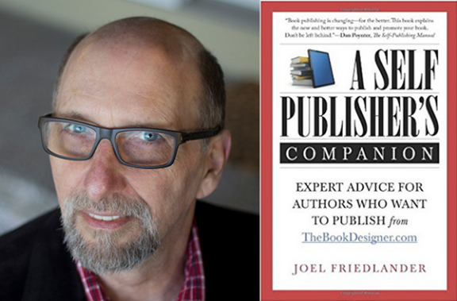

# Three Keys to Blogging Success

### How bloggers can build platforms and engage communities of readers

By Joel Friedlander
|

Feb 23, 2018

It’s important for bloggers to build communities of readers that can serve as a platform for launching books and other initiatives such as workshops, speaking engagements, and related products and services. But is an email list or a bunch of followers enough?

The answer is surprising. Simply having followers or a large email list won’t create engaged readers who will answer calls to action. To create that kind of relationship, bloggers need to project three vital qualities: authority, trust, and likability.

Bloggers will struggle to connect if readers do not see them as authoritative, trustworthy, and likable. But the good news is that bloggers can develop these qualities with a little effort.

Authority

Someone trying to learn a new skill will most often turn to a trusted authority for information, education, and instruction. But how do people know who is a genuine authority and who is a poseur? There are some clear signals that alert readers to authoritative sources.

Contentis most important. Readers can sense bloggers’ levels of experience, the depth of their knowledge, and their understanding of their subjects. Bloggers who can write with real authority about their subjects are most of the way home.

Networking and collaboration also signal authority because they show that bloggers are respected peers of other experts in their fields.

Awards and recognition mean that a blogger’s work has been evaluated by a third party and found to be outstanding. Being a keynote speaker, getting interviewed by media, or being quoted by other people all help to build this kind of authority.

Social proof displays bloggers’ reach or influence within their niches. This is why blogs often display awards or counters. If bloggers have 5,000 likes on Facebook or 50,000 followers on Twitter, the implication is that many other people find value in their work, granting them more authority.

Likability

When we choose someone to follow, or learn from them, likability is a big factor. But how does a blogger project something as hard to define as likability? A focus on readerscan help bloggers demonstrate their commitment to their audience, enforcing the impression that the writer is there to help.

Genuine concern for the struggles of readers will help establish a blogger as a likable source of information, because it’s not something that can be faked. People will know if bloggers are truly trying to help or simply pursuing their own agendas.

Being positiveis crucial because most people prefer a smiling face to a scowling one. Maintaining a positive, helpful tone when communicating with readers, interviewers, and even trolls will go a long way.

Being authentic makes a blogger likable. Writing style, the subjects covered, bios, and photos used on social media all should reflect a blogger’s personality.

Self-deprecating humor will convince readers that a blogger is really a human being with flaws, not just an article-writing machine. One of the best ways to display humanity is to frankly discuss challenges and failures, as well as successes. After all, nobody wins all the time.

Trust

Online, trust is a precious commodity. There’s so much distrust of people, statistics, outrageous claims, and instant celebrities that many folks don’t know what or whom to trust. For bloggers with expertise, a message, and books to sell, establishing trust with readers is crucial.

Consistency will help. Bloggers can create trust by following through on what they say they are going to do. An example of this is having a consistent editorial schedule for a blog.

Keeping congruentwith a blogger persona builds trust. If a writer presents herself as a helpful mom, for instance, it’s probably best to avoid profane rants and confrontations on social media.

Using testimonials from people readers like and trust will transfer some of that trust.

Interaction is the best tool bloggers have to build trust. Allow readers to have their say and respond to as many questions as possible. If people know they can get an authoritative, nonjudgmental answer to their questions, a blogger will make fans for life.

A content focus aimed at achieving goals combined with an authentic and likable persona will bring any blogger engaged and committed readers for years to come.

*Joel Friedlander is a book designer and author; he blogs about book design, marketing, and the future of the book at [The Book Designer](https://www.thebookdesigner.com/).*

A version of this article appeared in the 02/26/2018 issue of *Publishers Weekly* under the headline: Three Keys to Blogging Success
