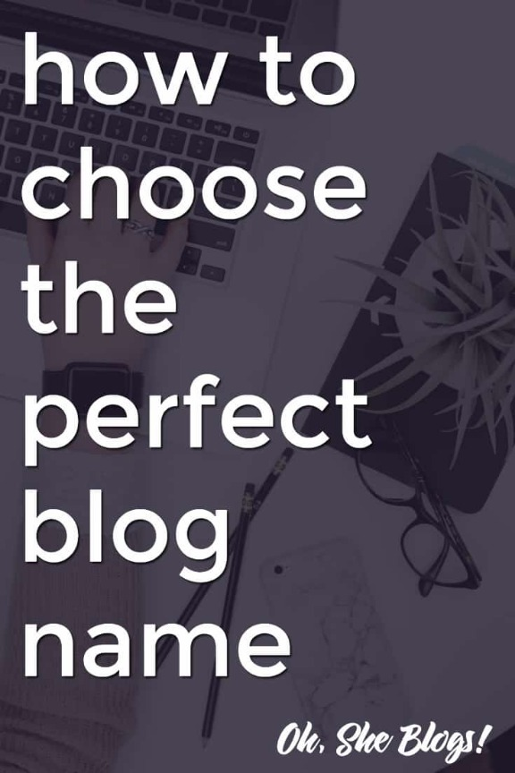

# 7 Tips for Choosing a Blog Name

*Disclosure: This post may contain affiliate links, which means we may receive a commission if you click a link and purchase something that we have recommended. While clicking these links won't cost you any extra money, they will help us keep this site up and running AND keep it ad free! Please check out our [disclosure policy](https://ohsheblogs.com/disclosure-policy/) for more details. Thank you for your support!*

*Looking for blog name ideas? Choosing a blog name can be tough, but below are a few tips that will help you narrow down your options.*

I haven’t taken a poll or anything, but I have to imagine that at least a few bloggers would change their blog names if given the opportunity. I know I did! It took years of thinking about changing my blog’s name before I finally gathered enough courage to take the leap. I originally started my blog on a whim in 2009 and didn’t take much time to think about a good name so I ended up using Fantabulously Frugal for four years. There are two main reasons why I eventually ditched this name:

1. “Fantabulously” is difficult to spell and to say.
2. While I started out posting solely about shopping deals, I eventually wanted to drop the frugal moniker to open up more opportunities for myself.

While I was scared to change my blog’s name, changing to [ShopGirlDaily.com](http://shopgirldaily.com/) was ultimately a great decision. However, if you’re just now starting a blog I would urge you to think long and hard about your blog’s name since that will ultimately be your blog’s identity. The name is likely the first thing anyone will know about your blog and you know what they say about first impressions!

If you are just thinking about starting your blog, here are 7 tips that will guide you in choosing a blog name. Take some time to plan now so you don’t have any blog name regrets later!

# Things to Think About When Choosing a Blog Name

## 1. What do you want to write about?

This one seems pretty easy, right? Just sit down, come up with a topic, and then come up with a perfectly witty name describing that topic.

OK, so that’s easier said than done.

Here’s my recommendation: Before starting your blog REALLY think about the topics that interest you. Are you mostly going to post recipes? Then something cooking related is totally appropriate. Are you going to post your recent shopping finds plus outfit of the day photos? Go with something fashion-related. But if you think you’re going to post recipes + an outfit of the day + television reviews, maybe you’ll want a blog name that is broader and will give your brand room to grow.

## 2. Be Unique

Like anything else, it’s hard to know upfront what’s going to make a unique blog name. Some of my favorite blog names include Dooce, The Pioneer Woman, The Man Repeller, Atlantic Pacific, and Cupcakes and Cashmere. In the blogging world (at the very least), these blogs are now household names and I’d argue they hit the naming jackpot.

While I can tell you what category these bloggers have established themselves in, the nice thing about a unique blog name is that it doesn’t cast any immediate boundaries on your future blog posts. The sky is the limit!

## 3. Check out the available domains

Now here’s the hard part. If you think you are going to want to blog for awhile and you don’t want something like “.blogspot” at the end of your URL, you’re going to want to try to pick a domain name at the beginning of the process. (Even if you want to [start a blog for free](https://ohsheblogs.com/how-to-start-a-blog-for-free/) – which is totally doable – I highly recommend buying your domain name!) Researching which domain names are available is easy, but you’ll likely find that what you want isn’t going to be available so you’re going to have to get creative. I buy all of my domain names from [NameCheap](https://ohsheblogs.com/recommends/namecheap-2/ "NameCheap"), as I’ve found them to be the most affordable.

Honestly, you could save yourself a lot of time by making this your first step in choosing a blog name. There’s nothing worse than coming up with the PERFECT blog name only to find out that the URL you want isn’t available.

## 4. Ask around

If you’re stuck on what to name your blog, consider asking trusted friends and family for suggestions. Tell them that you are in the process of naming your blog and people will probably bombard you with suggestions! If you don’t want to or don’t feel comfortable asking for suggestions then perhaps you could run your front-runners by them for brutally honest opinions, or ask people in blogging-related Facebook groups for their opinions.

## 5. Do your research

If you’re not comfortable asking for suggestions, check out [Google Keyword Tool](https://adwords.google.com/o/Targeting/Explorer?__c=1000000000&__u=1000000000&ideaRequestType=KEYWORD_IDEAS). Type in a few keywords that you’re interested in using and this tool will spit out a bunch of related word combinations. Another one of my favorite things to do when I’m looking for word inspiration is to use [thesaurus.com](http://thesaurus.com/) to check out synonyms for words I love. Inspiration can strike in the strangest places and sometimes all it takes is seeing new words or combinations of words to get the juices flowing!

## 6. Consider your competition

Do you know what type of blog you want to write? If so, what kind of blog names are your competitors and/or other successful bloggers in your niche using? Don’t copy those names, but think about what works – or what doesn’t work – for others. What do you like about what others are doing and what don’t you like?

## 7. Use your name

If you’re not sure of a topic and/or know that you’re going to be the centerpiece of your blog, why not go ahead and use your own name as your blog name? I’ve been seeing this more and more lately, especially for general lifestyle blogs. If your blog is going to be about you and your interests, go for it!

Ultimately, the only thing that really matters when choosing a blog name is that you love it. Changing domains can be an arduous task, so put in the work now to make sure that you come up with a name you’ll love for years to come.

***What other tips do you have for choosing a perfect blog name? Do any of you regret the blog name you currently have?***

### [Lisa Koivu](http://shopgirldaily.com/)

Founder at [Oh, She Blogs!](https://ohsheblogs.com/)

Lisa Koivu is the founder of Oh, She Blogs! A seven year blogging veteran, Lisa can also be found posting shopping deals and steals at [ShopGirlDaily.com](http://shopgirldaily.com/) . In her free time (ha!) she is also a freelance writer who has written for About.com and U.S. News.

Measure

Measure
