# How to Use a Content Scorecard to Publish Better Blog Posts

Want to replicate the success of your best-performing blog content?

Wondering how to review and rate content for quality and value?

In this article, you’ll **learn how to develop and use a content scorecard to ensure the content you publish consistently meets your quality standards**.

How to Use a Content Scorecard to Publish Better Blog Posts by Garrett Moon on Social Media Examiner.

### Why a Content Scorecard?

Although you have myriad options to increase your blog’s quality, creating a content scorecard can help you replicate the success of your best-performing content every time.

A content scorecard is a concept that [Jeff Goins](https://goinswriter.com/) and his team developed as a way to increase the traffic, engagement, and overall effectiveness of their blog. After they put it to work, they saw a [150% increase in daily traffic](https://coschedule.com/blog/content-scorecard-jeff-goins-writer-acm-018/) and more than doubled their average comments per post.

The idea is easy: **outline a set of criteria for every blog post** and **add a point for each criterion your post meets**. The goal is to get a perfect score every time. So if you have four criteria, for example, you’re aiming for a 4.0 GPA. The strength of this framework is in its simplicity: it’s clear, sustainable, and helpful.

### Analyze Your Top-Performing Content to Create a Content Scorecard

To create your content scorecard, you need to **find the common denominators among your best pieces of content**. You can use a tool like Google Analytics or [Kissmetrics](https://www.kissmetrics.com/) to do this. The measurement tool you use depends on what constitutes success for your blog.

For this example, let’s say you’re focused on traffic. **Log into your** [**Google Analytics account**](https://www.google.com/analytics/). In the left sidebar of your dashboard, **navigate to Behavior**, and then **select All Pages**.

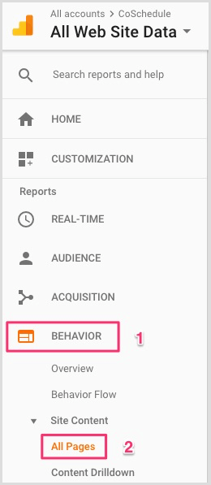

Google Analytics generates a simple [report](https://www.socialmediaexaminer.com/how-to-measure-social-media-using-google-analytics-reports/) that shows your 10 most-visited pages for the last 7 days. In the upper-right corner, **set your date range for about 12 months**.

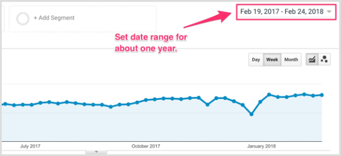

Below the graph, you’ll **see a list that includes your 10 most-viewed posts for that time period**. These are the content pieces that deliver the highest traffic, making them well worth analyzing (if increasing traffic is your goal).

The next bit of work comes in analyzing your top posts. **Read and study each post to find out what made it so successful**. To guide your research, ask yourself these questions about each [blog post](https://www.socialmediaexaminer.com/5-blog-post-ideas-to-bring-variety-to-your-content/):

- **What type of post is it** (how-to, list post, noteworthy news)?
- **Does it include free resources for download** (content upgrades, lead magnets, checklists, worksheets, templates)?
- **What is the word count** (>2,000 words, <1,000 words)?
- **Does it include additional content types** (audio, [video](https://www.socialmediaexaminer.com/how-to-improve-blog-posts-with-youtube-videos/), ebook)?
- **What kind of value does it deliver** to readers that they can’t get anywhere else (comprehensive coverage of the topic, novel insights, unique data analysis)?

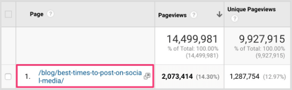

Obviously, you can ask an endless number of questions. The point is to deeply understand the common threads of value woven through your top content over the last year.

When you do this analysis, you’re uncovering the facets to include on your content scorecard. Your scorecard will look different from everyone else’s, and that’s the point. But the very fact that you have a documented standard of excellence will help you consistently replicate your best content.

Let’s look at an example scorecard where each blog post must include seven criteria:

- Topic relevant to your core business
- A [high-quality keyword](https://www.socialmediaexaminer.com/3-tips-to-improve-the-search-ranking-for-your-blog-posts/) for search engine optimization (SEO)
- Well-researched content backed by data
- Actionable and comprehensive coverage of the subject matter
- A content upgrade (lead magnet) to help the audience put the content into action
- A single, compelling call to action (CTA)
- Five to seven [custom graphics](https://www.socialmediaexaminer.com/3-graphic-design-tools-busy-marketers/)

Remember, your own blog’s content scorecard will look different from this one. It may have just three criteria; short and sweet is just fine. If you’re just starting out, that’s what I’d recommend.

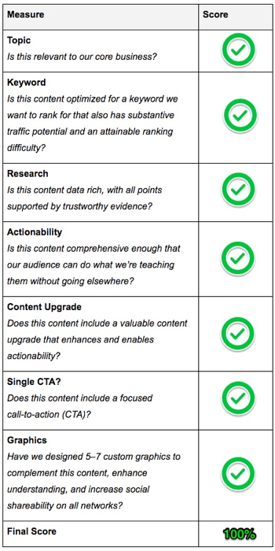

Every piece of content that meets the criteria on the scorecard will be published. Any piece that fails one criterion (or multiple criteria) will be revised until it gets a passing grade. The system is simple but effective. Now let’s take a closer look at each aspect of the example scorecard above.

### #1: Choose a Relevant Topic for Your Business

First on the content scorecard is choosing a topic relevant to your business. The topic matters because you’re trying to increase your blog traffic *and* drive revenue growth. This means you need to **select topics that help both your audience and business**.

For instance, suppose you manage an ecommerce store that sells running apparel. This means your target audience is interested in all things running, right? But they may also be interested in triathlons, cycling, weightlifting, mountain climbing, and any number of fitness-related activities.

Where relevancy comes in is in making sure your content intersects with a topic your audience cares about and an angle that benefits your business. So instead of writing an article like “7 Ways to Prepare for Your Next Marathon,” you might write one titled “7 Ways the Perfect Shoes Are a Hack for Winning Marathons.”

To illustrate, the [Dick’s Sporting Goods article](http://protips.dickssportinggoods.com/sports-and-activities/more-sports/7-steps-choose-right-cross-country-shoes) below details how to choose the best pair of cross country shoes. The sidebar on the right includes a link to the Cross Country Shoes section of their site.

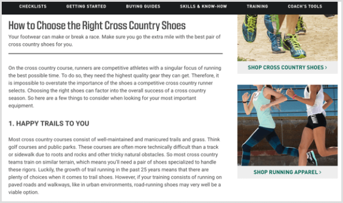

### #2: Find a Keyword With High SEO Potential

Next, you want your audience to be able to find your content when they need it most, even if it’s long after you’ve published it. This is where SEO comes into play.

The right search term helps you make the most of your content creation investment over the long haul. Choose a keyword that will **connect what you want to say to the words your audience uses to describe their challenges**. This helps you create content optimized for search engines, consumption, and application.

These days, an abundance of SEO tools make keyword research a breeze. In this case, let’s look at the trusty [Moz Keyword Explorer tool](https://moz.com/explorer). It approximates the volume of search traffic for any keyword or keyphrase you enter, and offers related suggestions for you to try. As of this writing, you get 20 free queries per month.

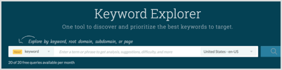

To start, **take a stab at a keyphrase for your blog post** and then **review the search results**.

For the running apparel company, you might search for “best running shoes for marathon.” Looking at the search results, you’ll discover there’s not much search traffic around that phrase.

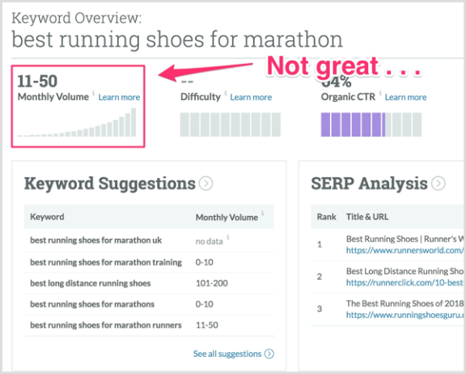

Now **look at the keyword suggestions** and see if you can **uncover a higher-volume phrase**. While there are thousands of related keyword suggestions, a few stand out from the rest. You zero in on “best running shoe brand” and “best shoes for marathon runners.”

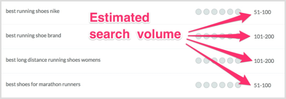

Additionally, “best running shoes for half marathon” is interesting and has potential for long-term traffic. Even better, it’s a great candidate for a second post!

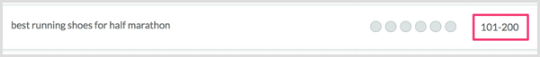

With just a little bit of elbow grease, you have a solid SEO foundation to work from. Your keyword-driven content now has some data to better predict performance.

### #3: Research Top 10 Competitor Posts for Your Keyword

After choosing a keyword, research the current top-ranking posts for your term. Data, examples, and experience fuel the best content and back up the angle you’re targeting with facts.

Let’s say you decide on the keyphrase “best shoes for marathon runners” for your new post. **Head to Google to search for this phrase**.

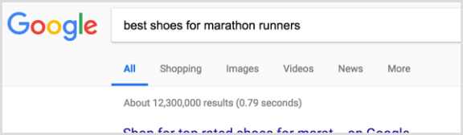

The next steps are pretty simple. **Read all of the top 10 ranked posts**. **Note the commonalities and gaps where your content can shine through** and add more value.

**Tip**: You can also use research methods like Brian Dean’s [Skyscraper Technique](https://backlinko.com/skyscraper-technique) to go even deeper down the rabbit hole.

### #4: Make Your Content Actionable

After you’ve done your research and read up on the competition, you’re ready to create content that provides real value to your audience.

Here’s some unsolicited blogging counsel: don’t simply offer a few bites of advice that people will struggle to put into action. Instead, **create content that’s packed with research-fueled advice, step-by-step guidance, deep attention to detail, and a path to execution**.

Your audience should be able to do exactly what you’re talking about if they follow the process described in your post. As an example, this [Jon Loomer article](https://www.jonloomer.com/2018/01/18/facebook-ads-test-and-learn/) walks readers step-by-step through how to use the Facebook Ads research tool.

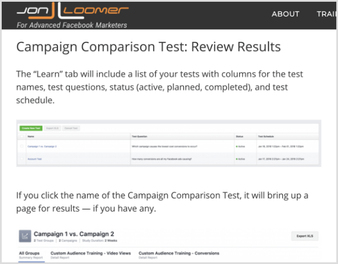

For the ecommerce running apparel example, you might snap some pics of your advice in action. Exactly what does your audience need to do to turn their running shoes into a hack for their next marathon? By the time they’re done reading your article, they should know how to put your advice into practice.

Making your content actionable helps it stand out from the crowd for two reasons. First, this type of content is a lot of work to create, so fewer people will take the time to do it. And second, it’s much more valuable to people. Hopefully, you’ll become their one-stop shop and they’ll keep coming back for more!

### #5: Create a Content Upgrade

Closely related to actionability is the use of content upgrades, which help people put your content to work. Your business might optimize everything to [convert traffic into email subscribers](https://www.socialmediaexaminer.com/how-to-generate-leads-from-blog/) who will continue to get your awesome, actionable content, while also giving you the opportunity to share more information about your products.

Content upgrades can be downloadable Excel templates, PDF checklists, or ebooks – really anything that helps your audience put your teaching into immediate practice. Make sure you **show readers how to use the content upgrade throughout your post**.

### #6: Craft a Single Call to Action

At the end of content that serves a business use, include a single, clear CTA. You’re not trying to get your audience to do three or four different things on a page. You want them to do one thing, so make that one action abundantly clear, as [HubSpot](https://blog.hubspot.com/marketing/email-marketing-habits-to-break) does here.

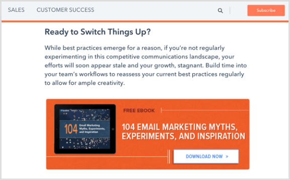

Whether it’s to sign up for your email list or a trial of your product, **make sure each piece of content has a clear next step for your audience to take**. Your CTA will depend on what the next stage should look like for your audience, such as downloading your content upgrade. The primary thing to take away here is to only have *one* CTA.

### #7: Design Compelling Visuals

High-caliber visuals immediately set your content apart and provide an opportunity to be useful to your audience. They can help **reinforce and illustrate key concepts in your content** and they’re also insanely shareable!

The great news is that you don’t have to be a professional designer to create quality visuals. Free tools like [Canva](https://www.canva.com/) for social media and blog graphics, or [Piktochart](https://piktochart.com/) for custom infographics make it easy.

Heck… even screenshots add value to your content! But the reality is that many blogs are still using bland stock photos that add zero value to the reader’s experience. This is a huge miss because quality visuals can **enhance your audience’s understanding** in big ways.

**Think of Every Post as Your Blog’s Home Page**

You can choose from many types of blog content such as list posts, how-tos, checklists, and more. But before you choose *what* you’re going to create, you need to define *why* it matters in the first place.

I’ll make a prediction that you can verify in less than 30 seconds: at least 80% of your website traffic starts on a page other than your home page. Essentially, I’m wagering the front door to your website isn’t actually your home page. If you have a steady blog, it’s probably your blog post content!

Not buying it? You can check for yourself in Google Analytics. **Navigate to the Behavior > All Pages report** discussed earlier. **Look at the Entrances column** to **see the percentage of users who began their session on your site with a particular page**. Here, only 8.47% of users started on the home page.

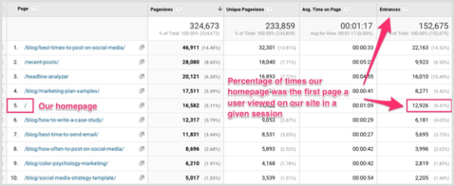

This means the home page functions as the front door only about 8% of the time. The other 92% of the time, a page other than the home page is a visitor’s first impression of the business. Take 30 seconds to run your own numbers; I predict they’re similar.

Think of every post as your home page. Would you ever be content with a subpar home page? Probably not. And my guess is that you don’t want to settle for subpar blog content, either.

**Conclusion**

Creating a content scorecard can help you more consistently create quality content for your blog. Start with three to five of your most powerful takeaways from digging into your own data. Then discipline yourself to never publish anything that doesn’t meet those standards.

**What do you think? What will you include on your content scorecard? What steps do you take to consistently publish quality blog content?** Please share your thoughts in the comments below.

Measure

Measure
