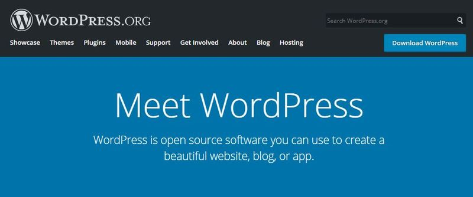
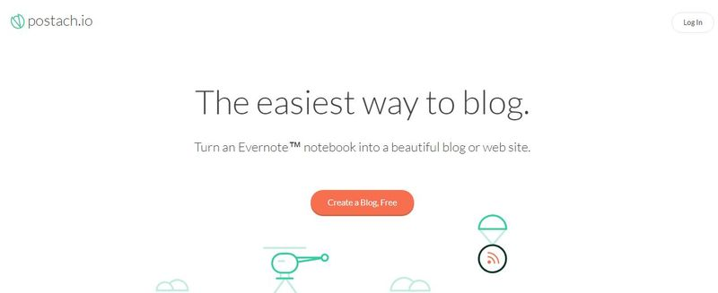
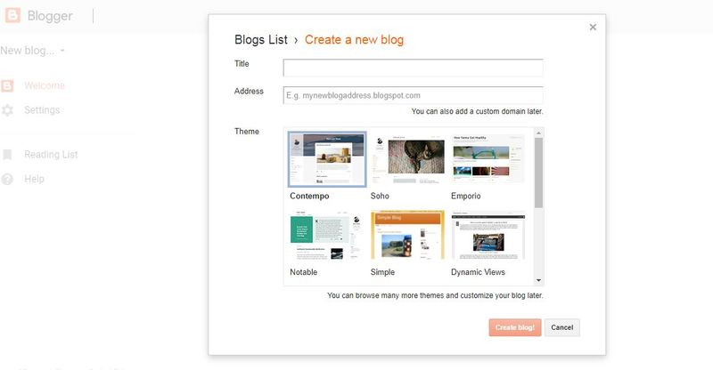
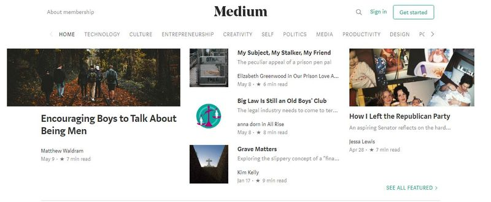
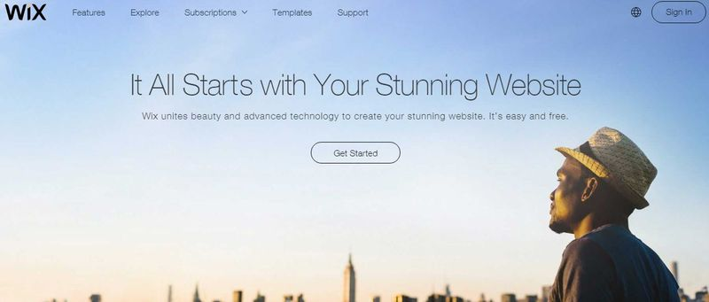

# Best Free Blog Software to Get You Started

The criteria for blogging software very much depends on the individual or business requirements. However, there are some universal factors at play too. You want a platform or software that’s easy to work with, flexible, and allows to create content in the way you want.

When you’re starting a blog, you need to think about the long-term plan. As your readership grows, you will want to keep improving the features that make your site stand out.

This means it’s critical for you to choose the right option that gives you room to grow.

Avoid the trap of picking the easiest platform in the short-term. Once you have an established audience and URL it can prove extremely difficult to switch later on.

Even if you’re starting out as a hobby, if it’s a subject you are passionate and knowledgeable about, then people are likely to want to read your content. So, it’s a smart move to leave open the opportunity to develop and monetize your blog:

So, with these factors in mind, let’s dive into the list of the best blog software to get you started.

It’s important to note is this is in no particular order because one platform might work for one person but not for others:

### WordPress

(Source: [Wordpress.org](https://wordpress.org/))

This is the world’s most popular blogging platform. There are two versions of WordPress:

- [WordPress.org](https://wordpress.org/): An open-source software that allows you to create a blog. It’s a self-hosted platform, which means you will need to find a WordPress hosting service provider.
- [WordPress.com](https://wordpress.com/): This is a hosting platform, which offers basic features for free.

Both combine to make it a very appealing option for many bloggers. WordPress itself has widened its focus to include websites and apps, as well as blogs.

Pros:

- Opportunity to grow: There are countless features that can be added to a WordPress site. You could include forums to encourage interaction with your readers or even online stores.
- Thousands of themes: “Themes" is blog-speak for designs and [WordPress.org](https://wordpress.org/) has thousands of them for you to choose from. This enables you to create your own, unique, and customized blog design. Many of these are free, but it could be worth checking out some of the premium options.
- Free plugins: Over the past decade, WordPress has built a bank of more than 45,000 free plugins. And many more at a low cost. As your site or blog grows, you can develop it even more.
- Search engine friendly: As an early adopter to search engine optimization (SEO), you can be assured this platform does everything it can to ensure your blog gets found on Google.

Cons:

- Can be a challenge for beginners: With so many tools and features, WordPress can be a little overwhelming to begin with.
- Security and hosting: You will need to arrange this yourself. If you’re a novice, this will take time and research.

Pricing:

- Using the [WordPress.org](https://wordpress.org/) software is free. However, you will still need to buy a domain name which typically costs around about $15 a year. Hosting starts from around $8 a month.

### Postach.io

(Source: Postach.io)

[Postach.io](https://postach.io/) is one of the easiest setup options out there, especially if you already use [Evernote](https://evernote.com/). You can use this platform to automatically turn your notes into a blog post.

Like WordPress, you can use one of its standard themes or create your own. This simple step is all it takes to turn your Evernote Notebook into an eloquent and well-designed blog.

Pros:

- Easy to use and set up: As you develop your blog, you will want to make sure you can easily upload your content. Evernote is designed specifically for the purpose of taking down your thoughts and notes as you move. For example, if you had a particularly memorable moment while travelling, you can write it down on Evernote, edit it later, and publish when you’re ready.
- Customizable themes: You can create your own, personalized desing for your blog. It will help form the brand and image that you want to project and connect with your readers.
- Free hosting: Hosting is all included in Postach.io. This will save you around $8 a month.
- Domain names: The free plan allows you to use the Postach.io domain as part of your URL. From just $5 a month, you can use your own. Creating a domain name typically costs around $15, or more for popular options.
- SEO friendly: The platform makes it easy for you to optimize your content for SEO.

Cons:

- Works best with Evernote: To say this is a disadvantage is a little harsh. However, if you do not use Evernote, then you will not reap the full benefits of Postach.io.
- Free domain name: With the free plan, you must include Postach.io in your domain name. For example; example.postach.io.

Pricing:

- The basic plan at Postach.io is free but there are also premium options starting from just $5 a month.

### Blogger

(Source: [Blogger.com](https://blogger.com/))

Founded in 1999, [Blogger](https://www.blogger.com/) is one of the early players in the blogging world. Since 2003, it has been owned by Google and enjoys all the benefits of its relationship with the technology giant.

Pros:

- Easy to use: The key selling point of Blogger is that it’s very easy to set up. For a non-techie, this is an excellent starting point.
- Google features: [Blogger.com](https://blogger.com/) users can enjoy all the analytical prowess from Google as part of the package. This includes the ability to measure stats and earnings from individual posts.
- Completely free: Unlike other platforms, Blogger has no paid-for plans. You can be assured you can access all the features for free.
- Multiple blogs: You can have upto 100 blogs per account, which gives you plenty of flexibility.

Cons:

- Basic themes: You do have the option of customizing your themes but the choice is limited.
- Limited features: As your blog grows, you may find yourself held back by the limited tools on offer.
- Few updates: Perhaps as a consequence of being a smaller cog in a big tech giant, Blogger does not recieve many updates. Again, as you develop your blog, this could be an inhibiting factor.

Pricing:

- Completely free. If you want to use your own domain name, then you will have to pay for the right to use it.

### Medium

(Source: [Medium.com](https://medium.com/))

[Medium](https://medium.com/) is a community of bloggers, writers, and journalists. Admittedly, it’s more like Huffington Post than a conventional blogging platform but it’s a great starting point if you’re looking to gain more experience.

Pros:

- Easy to join: You can join Medium using your Google or Facebook account.
- A community: You will be able to reach to a pre-existing community who share your interests. You can engage with them to learn and develop your own knowledge and skills.
- Focus on writing: Medium takes away all the stress and hassle of designing a site, allowing you to focus on writing.

Cons:

- No customizable design features: All Medium contributors use the same layout and design, making it difficult for your blog to carve out its own identity.
- Medium own your audience: If you build up a audience, and switch to another blog platform, it can make it difficult for your readers to follow.
- Limited monetization opportunity: Due to the restrictions of the Medium platform, it can prove tricky to monetize your blog. You cannot, for example, run your own ads.

Pricing:

- Completely free.

### Wix

(Source: [Wix.com](https://wix.com/))

Wix is a little more advanced than a standard blog platform, but it’s still free and enables your blog to carve out its own identity from the beginning. You can also use Wix to create your own website and attach a blog to it.

Pros:

- Dozens of templates: You can also use third-party apps to create your own theme or design.
- Drag and drop model: The site builder is easy to use and requires no coding. The drag and drop model has proven to be popular for many small businesses looking to build their first site.
- Quick and easy setup: As with most blog platforms, the setup is quick and easy to follow.

Cons:

- Limited free plans: They do not have all the features you would need as your blog grows. You would also have to put up with Wix logo and ads on your site.
- Inability to change your template: This could be a source of frustration if your template does not meet the needs or image of your blog.
- E-commerce features limited to paid plans: If you’re looking to monetize your blog, you’ll need to pay for it first.

Pricing:

- The basic plan is free, with multiple pricing tiers for premium features.

### Final Thoughts

When starting out, it can be difficult to imagine where your blog will be in two, five, or ten years from now. Yet, picking the right software from day one could be pivotal to the success of your blog.

It’s a good idea to look at the more established blogs within your niche to form a picture of where you could be in the future. Doing this will help you understand the features you will need as you build your audience.

The key is to look past the “easy" options, with fast setups and free accounts. Take the time to research the full features each platform has to offer and look at the paid plans. If you get a big enough following, then it will be a small investment to pay for potentially lucrative returns.

Keep an open mind, and choose the software that will allow your blog realize its full potential.

Measure

Measure
