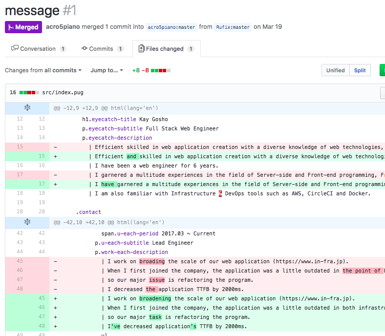

# 5 reasons why Git based resume is awesome

### Apr 27 *Updated on May 01, 2018*

I created and update my resume on GitHub. This is not a normal way but works well for me.

[edited]  
I use GitHub to save and share my Git repositories, so I assume GitHub as default git repository service in this article. If you are familiar with other version management system or git repo service, please read "Git / GitHub" to any other words, like "Git / Gitlab", "Mercurial / Bitbucket", etc.

Based on the twitter discussion.

> 
>
> The Practical Dev
>
> @thepracticaldev
>
> 1. Portability  
> 2. Pull Requests  
> 3. Easier to design  
> 4. Less management cost  
> 5. Stack free  
> { author: [@YDP140](https://twitter.com/YDP140) }  
> [dev.to/acro5piano/5-r…](https://t.co/Z6KqbSYbeG)
>
> 11:40 AM - 28 Apr 2018
>
> 42205

[/edited]

# Why I uploaded my resume to GitHub

I have an account of LinkedIn. LinkedIn was an unique service for making public individual resume, and communicating with others online. I like the idea, so I always make my resume public.

When I applied to a company, it is required to make an A4 resume, typically created with Microsoft word or something. I used Linux Laptop (powered by Arch Linux) at that time, so I did not have Microsoft office. I could use Google Document, but it did not allow me to use various shortcuts, and was hard to edit during offline. Thus I decided to create my resume with HTML, CSS, and Webpack.

It seems that creating my resume with that stack is even easier, interesting, and cheaper than getting Windows machine or installing MS Office to my Linux Laptop.

When I create something, I always run `git init` and control the versions with Git and upload to GitHub. This is for backup, because I sometimes fully uninstall Linux OS for some accident. So I upload my HTML-based resume to GitHub.  
I do not care if my personal information is open to the public.

I found that managing my resume with Git brings me a lot of benefit, so here I will introduce them.

# 1. Portability

I can show and edit my resume everywhere. From my MacBook, Linux Laptop, even someone's PC. My GitHub resume url is so short as to type directly in a web browser's url window.

<https://github.com/acro5piano/resume>

In fact, I have typed the url with someone's PC. I prefer this way to send the PDF to someone via Facebook Messenger or something.

# 2. Receiving Pull Request

I did not expect this feature at first, but really easy to brush up my resume.

[](https://res.cloudinary.com/practicaldev/image/fetch/s--K34aKmsI--/c_limit%2Cf_auto%2Cfl_progressive%2Cq_auto%2Cw_880/https://thepracticaldev.s3.amazonaws.com/i/la9ywsv438vchc1y1dlv.png)

When my developer friend checked my resume before applying, I sent him to the URL. He saw my repository and corrected my mistakes and created Pull Request. He refactored my resume! I check the difference and merged the PR. Really great experience.

# 3. Easier to design

I can customize my resume layout with my knowledge of CSS. It looked easier to know how to customize it with MS Word. I could not even implement flex-box like vertical layout.  
I can use Sketch to customize design, but Sketch is not for writing, though it is great tool for creating design prototype.

# 4. Less management cost

With Git, I can ensure this resume is definitely new one. When I created with MS Word, I had multiple versions, like

- resume-kaz-gosho.docx
- resume-kaz-gosho\_\_updated.docx
- resume-kaz-gosho\_\_2018-04-28.docx
- resume-kaz-gosho (1).docx

I could not trust which is the newest one.

We can even show difference between versions with `git log -p`.

# 5. Stack free

I can use any text editor to edit my resume. This is a really good point for developers, because developers tend to favorite a specific text editor. For example, I am not good at use the interface of MS Word, because it does not guarantee layout (and missing "mode" concept... unlike Vim).   
I can export `.docx` to `.pdf` with MS Word, but it requires at least three clicks, which is not comfortable for developers. If we use HTML and webpack-dev-server, we can convert HTML to PDF with one-liner, like:

```
chromium --headless --disable-gpu --print-to-pdf --window-size=1200,1900 http://localhost:3000/
```

Or use conversion tools such as `wkhtmltopdf`.

Of course, we can add that command to NPM script:

```
"build": "chromium --headless --disable-gpu --print-to-pdf --window-size=1200,1900 http://localhost:3000/"
```

Then run

```
yarn build
```

which is really short. Headless Chrome is really awesome. Furthermore, we do not have to run that command if we properly set up CI.

# Todo

I would like to go further with HTML-based resume. Currently my big todos are:

- CI. Hopefully, hook `git push` to `master` branch and generate PDF file and take screenshot, then save them to somewhere (maybe S3).
- I18n. Two languages `en` and `ja` are required.
- Web Page. Paradoxically, I do not have web page of my resume. Maybe I use React.js for rendering.

# Conclusion

I will continue to keep my resume on GitHub. If you are interested, please try it!

(...At your own risk, because CV has some sensitive data)

Measure

Measure
