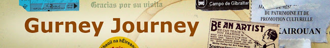
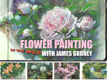
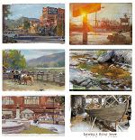
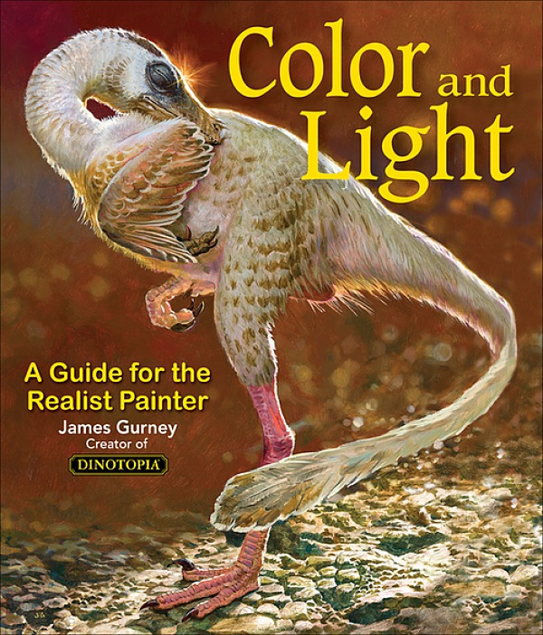
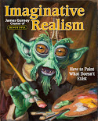
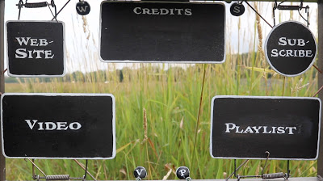

|  |  |  |  |  |  |
| --- | --- | --- | --- | --- | --- |
|  | |  |  | | --- | --- | |  |  | | mais [Próximo blog»](https://www.blogger.com/next-blog?navBar=true&blogID=2999230124118604245) | th.luiz@gmail.com [Painel](https://www.blogger.com/home) [Sair](https://gurneyjourney.blogspot.com/logout?d=https://www.blogger.com/logout-redirect.g?blogID%3D2999230124118604245%26postID%3D3662654233334619848) |

## James Gurney

This daily weblog by Dinotopia creator [James Gurney](http://www.jamesgurney.com/) is for illustrators, plein-air painters, sketchers, comic artists, animators, art students, and writers. You'll find practical studio tips, insights into the making of the [Dinotopia](http://www.dinotopia.com/) books, and first-hand reports from art schools and museums.

## Blog Index

- [Academic Painters](https://gurneyjourney.blogspot.com.br/search/label/Academic%20Painters)
  (394)
- [Animals](https://gurneyjourney.blogspot.com.br/search/label/Animals)
  (264)
- [Animation](https://gurneyjourney.blogspot.com.br/search/label/Animation)
  (112)
- [Architecture](https://gurneyjourney.blogspot.com.br/search/label/Architecture)
  (29)
- [Art By Committee](https://gurneyjourney.blogspot.com.br/search/label/Art%20By%20Committee)
  (43)
- [Art Podcasts](https://gurneyjourney.blogspot.com.br/search/label/Art%20Podcasts)
  (2)
- [Art Schools](https://gurneyjourney.blogspot.com.br/search/label/Art%20Schools)
  (94)
- [Audio](https://gurneyjourney.blogspot.com.br/search/label/Audio)
  (32)
- [Book reviews](https://gurneyjourney.blogspot.com.br/search/label/Book%20reviews)
  (55)
- [Casein Painting](https://gurneyjourney.blogspot.com.br/search/label/Casein%20Painting)
  (70)
- [Catskill Mountains](https://gurneyjourney.blogspot.com.br/search/label/Catskill%20Mountains)
  (11)
- [Clementoons](https://gurneyjourney.blogspot.com.br/search/label/Clementoons)
  (12)
- [Color](https://gurneyjourney.blogspot.com.br/search/label/Color)
  (212)
- [Color and Light Book](https://gurneyjourney.blogspot.com.br/search/label/Color%20and%20Light%20Book)
  (78)
- [Comics/Cartooning](https://gurneyjourney.blogspot.com.br/search/label/Comics%2FCartooning)
  (149)
- [Composition](https://gurneyjourney.blogspot.com.br/search/label/Composition)
  (94)
- [Computer Graphics](https://gurneyjourney.blogspot.com.br/search/label/Computer%20Graphics)
  (79)
- [Dinosaurs](https://gurneyjourney.blogspot.com.br/search/label/Dinosaurs)
  (102)
- [Dinotopia](https://gurneyjourney.blogspot.com.br/search/label/Dinotopia)
  (211)
- [Effects/Phenomena](https://gurneyjourney.blogspot.com.br/search/label/Effects%2FPhenomena)
  (32)
- [Elementary Schools](https://gurneyjourney.blogspot.com.br/search/label/Elementary%20Schools)
  (10)
- [Figure Drawing](https://gurneyjourney.blogspot.com.br/search/label/Figure%20Drawing)
  (60)
- [GJ Book Club](https://gurneyjourney.blogspot.com.br/search/label/GJ%20Book%20Club)
  (7)
- [Golden Age Illustration](https://gurneyjourney.blogspot.com.br/search/label/Golden%20Age%20Illustration)
  (261)
- [Gouache](https://gurneyjourney.blogspot.com.br/search/label/Gouache)
  (135)
- [Hudson River School](https://gurneyjourney.blogspot.com.br/search/label/Hudson%20River%20School)
  (44)
- [Illustrated Books](https://gurneyjourney.blogspot.com.br/search/label/Illustrated%20Books)
  (34)
- [Imaginative Realism](https://gurneyjourney.blogspot.com.br/search/label/Imaginative%20Realism)
  (48)
- [Journey to Chandara](https://gurneyjourney.blogspot.com.br/search/label/Journey%20to%20Chandara)
  (137)
- [Lettering](https://gurneyjourney.blogspot.com.br/search/label/Lettering)
  (31)
- [Lighting](https://gurneyjourney.blogspot.com.br/search/label/Lighting)
  (126)
- [Living Sketchbook](https://gurneyjourney.blogspot.com.br/search/label/Living%20Sketchbook)
  (11)
- [Miniatures](https://gurneyjourney.blogspot.com.br/search/label/Miniatures)
  (76)
- [Models Posing](https://gurneyjourney.blogspot.com.br/search/label/Models%20Posing)
  (55)
- [Movie Studios](https://gurneyjourney.blogspot.com.br/search/label/Movie%20Studios)
  (15)
- [Museum Visits](https://gurneyjourney.blogspot.com.br/search/label/Museum%20Visits)
  (179)
- [Paint Technique](https://gurneyjourney.blogspot.com.br/search/label/Paint%20Technique)
  (226)
- [Painting Gear](https://gurneyjourney.blogspot.com.br/search/label/Painting%20Gear)
  (76)
- [Pen and Ink](https://gurneyjourney.blogspot.com.br/search/label/Pen%20and%20Ink)
  (70)
- [Pencil Sketching](https://gurneyjourney.blogspot.com.br/search/label/Pencil%20Sketching)
  (265)
- [Perspective](https://gurneyjourney.blogspot.com.br/search/label/Perspective)
  (24)
- [Photography](https://gurneyjourney.blogspot.com.br/search/label/Photography)
  (45)
- [Plein Air Painting](https://gurneyjourney.blogspot.com.br/search/label/Plein%20Air%20Painting)
  (204)
- [Portraits](https://gurneyjourney.blogspot.com.br/search/label/Portraits)
  (310)
- [Preliminary Sketches](https://gurneyjourney.blogspot.com.br/search/label/Preliminary%20Sketches)
  (60)
- [Printmaking](https://gurneyjourney.blogspot.com.br/search/label/Printmaking)
  (5)
- [Puppets](https://gurneyjourney.blogspot.com.br/search/label/Puppets)
  (1)
- [Rabbit Trails](https://gurneyjourney.blogspot.com.br/search/label/Rabbit%20Trails)
  (119)
- [Ranger Rick](https://gurneyjourney.blogspot.com.br/search/label/Ranger%20Rick)
  (10)
- [road tour](https://gurneyjourney.blogspot.com.br/search/label/road%20tour)
  (63)
- [Sculpture](https://gurneyjourney.blogspot.com.br/search/label/Sculpture)
  (16)
- [Toys](https://gurneyjourney.blogspot.com.br/search/label/Toys)
  (12)
- [Video](https://gurneyjourney.blogspot.com.br/search/label/Video)
  (189)
- [Visual Perception](https://gurneyjourney.blogspot.com.br/search/label/Visual%20Perception)
  (108)
- [Watercolor Painting](https://gurneyjourney.blogspot.com.br/search/label/Watercolor%20Painting)
  (280)
- [Writing](https://gurneyjourney.blogspot.com.br/search/label/Writing)
  (64)

## Flower Painting in the Wild

  
"The best 'in the wild' video yet." —Biff

## Recent Posts

- [►](#)
  [2018](https://gurneyjourney.blogspot.com.br/2018/)
  (134)

- [▼](#)
  [2017](https://gurneyjourney.blogspot.com.br/2017/)
  (378)
  - [►](#)
    [December](https://gurneyjourney.blogspot.com.br/2017/12/)
    (33)
  - [►](#)
    [November](https://gurneyjourney.blogspot.com.br/2017/11/)
    (30)
  - [►](#)
    [October](https://gurneyjourney.blogspot.com.br/2017/10/)
    (31)
  - [►](#)
    [September](https://gurneyjourney.blogspot.com.br/2017/09/)
    (31)
  - [▼](#)
    [August](https://gurneyjourney.blogspot.com.br/2017/08/)
    (32)
    - [Interview with Bobby Chiu](https://gurneyjourney.blogspot.com.br/2017/08/interview-with-bobby-chiu.html)
    - [Houston, Texas](https://gurneyjourney.blogspot.com.br/2017/08/houston.html)
    - [Imaginative Illustration Exhibit will open in Conn...](https://gurneyjourney.blogspot.com.br/2017/08/imaginative-realism-exhibit-will-open.html)
    - [Speed-Painting People in Gouache](https://gurneyjourney.blogspot.com.br/2017/08/speed-painting-people-in-gouache.html)
    - [Live Interview Tomorrow](https://gurneyjourney.blogspot.com.br/2017/08/live-interview-tomorrow.html)
    - [Painting Live Sheep at the Fair](https://gurneyjourney.blogspot.com.br/2017/08/painting-live-sheep-at-fair.html)
    - [Friendship through Marionettes](https://gurneyjourney.blogspot.com.br/2017/08/friendship-through-marionettes.html)
    - [Prize Rooster](https://gurneyjourney.blogspot.com.br/2017/08/prize-rooster.html)
    - [Arkhipov's Washer-Women](https://gurneyjourney.blogspot.com.br/2017/08/arkhipovs-washer-women.html)
    - [Victoria's Andy](https://gurneyjourney.blogspot.com.br/2017/08/victorias-andy.html)
    - [Video Sample: Painting Peonies in a Garden](https://gurneyjourney.blogspot.com.br/2017/08/video-sample-painting-peonies-in-garden.html)
    - [Selective Underpainting](https://gurneyjourney.blogspot.com.br/2017/08/selective-underpainting.html)
    - [The Farmers' Museum](https://gurneyjourney.blogspot.com.br/2017/08/the-farmers-museum.html)
    - [Ruskin and Wild Roses](https://gurneyjourney.blogspot.com.br/2017/08/ruskin-and-wild-roses.html)
    - [Release of "Flower Painting in the Wild"](https://gurneyjourney.blogspot.com.br/2017/08/release-of-flower-painting-in-wild.html)
    - [Story Time from Space](https://gurneyjourney.blogspot.com.br/2017/08/story-time-from-space.html)
    - [Todd McFarlane Interview](https://gurneyjourney.blogspot.com.br/2017/08/todd-mcfarlane-interview.html)
    - [How to Make a YouTube End Screen Gizmo](https://gurneyjourney.blogspot.com.br/2017/08/how-to-make-youtube-end-screen-gizmo.html)
    - [Brushes for water media](https://gurneyjourney.blogspot.com.br/2017/08/brushes-for-water-media.html)
    - [Kramskoi's 'Christ in the Desert'](https://gurneyjourney.blogspot.com.br/2017/08/kramskois-christ-in-desert.html)
    - [Castle Kidnapped](https://gurneyjourney.blogspot.com.br/2017/08/castle-kidnapped.html)
    - [Flower Painting in the Wild Preview](https://gurneyjourney.blogspot.com.br/2017/08/flower-painting-in-wild-preview.html)
    - [De Wint's Colors](https://gurneyjourney.blogspot.com.br/2017/08/de-wints-colors.html)
    - [Priming Sketchbook Pages](https://gurneyjourney.blogspot.com.br/2017/08/priming-sketchbook-pages.html)
    - [Vintage Ads for the Famous Artists School](https://gurneyjourney.blogspot.com.br/2017/08/vintage-ads-for-famous-artists-course.html)
    - [Who Makes Better Art—Humans or Computers?](https://gurneyjourney.blogspot.com.br/2017/08/who-makes-better-arthumans-or-computers.html)
    - [New Challenge: "Paint a Storefront"](https://gurneyjourney.blogspot.com.br/2017/08/new-challenge-paint-storefront.html)
    - [Art and Discomfort](https://gurneyjourney.blogspot.com.br/2017/08/art-and-discomfort.html)
    - [Zig-Zags at the Zoo](https://gurneyjourney.blogspot.com.br/2017/08/zig-zags-at-zoo.html)
    - [Dead Vehicle Challenge Results](https://gurneyjourney.blogspot.com.br/2017/08/dead-vehicle-challenge-results.html)
    - [Using a Pencil to Check Measurements](https://gurneyjourney.blogspot.com.br/2017/08/using-pencil-to-check-measurements.html)
    - [Interview with the Barbican](https://gurneyjourney.blogspot.com.br/2017/08/interview-with-barbican.html)
  - [►](#)
    [July](https://gurneyjourney.blogspot.com.br/2017/07/)
    (31)
  - [►](#)
    [June](https://gurneyjourney.blogspot.com.br/2017/06/)
    (31)
  - [►](#)
    [May](https://gurneyjourney.blogspot.com.br/2017/05/)
    (31)
  - [►](#)
    [April](https://gurneyjourney.blogspot.com.br/2017/04/)
    (31)
  - [►](#)
    [March](https://gurneyjourney.blogspot.com.br/2017/03/)
    (33)
  - [►](#)
    [February](https://gurneyjourney.blogspot.com.br/2017/02/)
    (30)
  - [►](#)
    [January](https://gurneyjourney.blogspot.com.br/2017/01/)
    (34)

- [►](#)
  [2016](https://gurneyjourney.blogspot.com.br/2016/)
  (399)

- [►](#)
  [2015](https://gurneyjourney.blogspot.com.br/2015/)
  (421)

- [►](#)
  [2014](https://gurneyjourney.blogspot.com.br/2014/)
  (416)

- [►](#)
  [2013](https://gurneyjourney.blogspot.com.br/2013/)
  (458)

- [►](#)
  [2012](https://gurneyjourney.blogspot.com.br/2012/)
  (442)

- [►](#)
  [2011](https://gurneyjourney.blogspot.com.br/2011/)
  (448)

- [►](#)
  [2010](https://gurneyjourney.blogspot.com.br/2010/)
  (427)

- [►](#)
  [2009](https://gurneyjourney.blogspot.com.br/2009/)
  (413)

- [►](#)
  [2008](https://gurneyjourney.blogspot.com.br/2008/)
  (391)

- [►](#)
  [2007](https://gurneyjourney.blogspot.com.br/2007/)
  (170)

## Casein in the Wild

  
Painting on location in opaque water media

## Tip Jar

[anexo ausente]

Enjoy what you read? If you support this blog, you will feel good and the world will be a better place.

## Follow by Email

|  |  |
| --- | --- |
|  |  |

## Color and Light Book

  
Classic textbook on a universal topic

## Imaginative Realism

  
Signed by the author

## Other Official Sites

- [Dinotopia Message Board](http://ombdinotopia.proboards.com/)
- [Gumroad Videos](https://gumroad.com/gurneyjourney)
- [Instagram](https://www.instagram.com/jamesgurneyart/)
- [YouTube Channel](https://www.youtube.com/user/gurneyjourney)
- [J. G. Original Art](http://jamesgurneyoriginalart.blogspot.com/)
- [James Gurney website](http://jamesgurney.com/)
- [Official Dinotopia Website](http://www.dinotopia.com/)
- [Google Open Gallery](https://james-gurney.culturalspot.org/)

## Illustration

- [American Art Archives](http://www.americanartarchives.com/artist_bios.htm)
- [Howard Pyle Blog](http://howardpyle.blogspot.com/)
- [Illustration Art](http://www.illustrationart.blogspot.com/)
- [Leif Peng's Flickr Sets](http://www.flickr.com/photos/leifpeng/sets/)
- [Lines and Colors](http://linesandcolors.com/)
- [Muddy Colors](http://muddycolors.blogspot.com/)

## Painting and Painters

- [19th Century Art Worldwide](http://www.19thc-artworldwide.org/)
- [200 Russian Painters](http://en.gallerix.ru/album/200-Russian)
- [Art and Influence](http://artandinfluence.blogspot.com/)
- [Google Art Project](http://www.googleartproject.com/collections/)
- [Handprint (Watercolor)](http://www.handprint.com/HP/WCL/water.html)
- [Land Sketch](http://nathanfowkes-sketch.blogspot.com/)
- [Underpaintings](http://underpaintings.blogspot.com/)
- [Virtual Gouache Land](http://www.virtualgouacheland.blogspot.com/)
- [Web Gallery of Art](http://www.wga.hu/)

## Drawing & Cartooning

- [Character Design](http://characterdesign.blogspot.com/)
- [Character Design (Pinterest)](http://pinterest.com/characterdesigh/)
- [Making a Mark](http://makingamark.blogspot.com/)
- [The Golden Age](http://thegoldenagesite.blogspot.com/)
- [Urban Sketchers](http://www.urbansketchers.org/)

## Animation Art

- [Animation Backgrounds](http://animationbackgrounds.blogspot.com/)
- [Animation Physics](http://www.animationphysics.com/)
- [Animation Resources](https://www.flickr.com/photos/130946166@N04/albums)
- [Animation World Network](http://www.awn.com/)
- [Flooby Nooby](http://floobynooby.blogspot.com/)
- [John K's Lessons](http://johnkstuff.blogspot.com/2012/02/best-tools-for-cartoonists.html)
- [Matte Shot](http://nzpetesmatteshot.blogspot.com/)
- [Michael Sporn Animation](http://www.michaelspornanimation.com/splog/)

## CG Art

- [CG Meetup](http://www.cgmeetup.net/home/)
- [CG Society](http://cgsociety.org/)
- [Concept Art](http://www.conceptart.org/)
- [Dark Roasted Blend](http://www.darkroastedblend.com/)
- [FX Guide](http://www.fxguide.com/)
- [Imagine FX](http://www.imaginefx.com/)
- [Matte Painting](http://www.mattepainting.org/index.php?categoryid=1)
- [Nuthin' But Mech](http://nuthinbutmech.blogspot.com/)
- [The CG Bros.](https://www.youtube.com/user/TheCGBro)

## Contact

You can write me at:  
James Gurney  
PO Box 693  
Rhinebeck, NY 12572  
  
or by email:  
gurneyjourney (at) gmail.com  
Sorry, I can't give personal art advice or portfolio reviews. If you can, it's best to ask art questions in the blog comments.

## Permissions

All images and text are copyright 2015 James Gurney and/or their respective owners. Dinotopia is a registered trademark of James Gurney. For use of text or images in traditional print media or for any commercial licensing rights, please email me for permission.  
  
However, you can quote images or text without asking permission on your educational or non-commercial blog, website, or Facebook page as long as you give me credit and provide a link back. Students and teachers can also quote images or text for their non-commercial school activity. It's also OK to do an artistic copy of my paintings as a study exercise without asking permission.

## Tuesday, August 15, 2017

### [How to Make a YouTube End Screen Gizmo](https://gurneyjourney.blogspot.com.br/2017/08/how-to-make-youtube-end-screen-gizmo.html)

In the last 20 seconds of a YouTube video, you can offer the viewer the chance to click on other videos, playlists, websites, or the Subscribe button, using their "end screen" options.  
  

[How to Make a YouTube End Screen Gadget](https://www.youtube.com/watch?v=QDpuHKxKFvQ)

  
  
In this behind-the-scenes video I show how to make a reusable gizmo to make that end screen segment more interesting and to encourage viewers to click those links. ([Link to video on YouTube](https://youtu.be/QDpuHKxKFvQ)).  
  
  
  
The panels flip into position before being superimposed with the link options. The movement of the panels is powered by mousetrap springs. It's cheap and easy to build, and it's completely customizable to the style of your channel.  
  
**Materials:**  
[Mousetraps](https://www.amazon.com/gp/product/B01AMHSENA/ref=as_li_tl?ie=UTF8&camp=1789&creative=9325&creativeASIN=B01AMHSENA&linkCode=as2&tag=gurnjour-20&linkId=fb93d909c3b5a225cc9516dfeacb1993)[anexo ausente],  
[1 " X 3 " Pine boards](https://www.amazon.com/gp/product/B001BRD57Q/ref=as_li_tl?ie=UTF8&camp=1789&creative=9325&creativeASIN=B001BRD57Q&linkCode=as2&tag=gurnjour-20&linkId=8e884a3a5ac73526698d03a6d762cb48)[anexo ausente]  
[screw eyes](https://www.amazon.com/gp/product/B01DG3ZRGO/ref=as_li_tl?ie=UTF8&camp=1789&creative=9325&creativeASIN=B01DG3ZRGO&linkCode=as2&tag=gurnjour-20&linkId=b37a40a618153dc98590899da405ef08)[anexo ausente]  
[Magic Sculpt epoxy clay](https://www.amazon.com/gp/product/B003AL71FI/ref=as_li_tl?ie=UTF8&camp=1789&creative=9325&creativeASIN=B003AL71FI&linkCode=as2&tag=gurnjour-20&linkId=2cf450d8c6cc9e1dafd3a2f54709bfe1)[anexo ausente]  
[Gorilla glue](https://www.amazon.com/gp/product/B0000223UV/ref=as_li_tl?ie=UTF8&camp=1789&creative=9325&creativeASIN=B0000223UV&linkCode=as2&tag=gurnjour-20&linkId=eb498b7ea4ef8e78373ca01c40cc0f4d)[anexo ausente]  
  
My next Gumroad tutorial, "Flower Painting in the Wild," comes out this Friday, August 18.

Posted by
James Gurney

at
[Tuesday, August 15, 2017](https://gurneyjourney.blogspot.com.br/2017/08/how-to-make-youtube-end-screen-gizmo.html "permanent link")

[[anexo ausente]](https://www.blogger.com/email-post.g?blogID=2999230124118604245&postID=3662654233334619848 "Email Post")

[Email This](https://www.blogger.com/share-post.g?blogID=2999230124118604245&postID=3662654233334619848&target=email "Email This")[BlogThis!](https://www.blogger.com/share-post.g?blogID=2999230124118604245&postID=3662654233334619848&target=blog "BlogThis!")[Share to Twitter](https://www.blogger.com/share-post.g?blogID=2999230124118604245&postID=3662654233334619848&target=twitter "Share to Twitter")[Share to Facebook](https://www.blogger.com/share-post.g?blogID=2999230124118604245&postID=3662654233334619848&target=facebook "Share to Facebook")[Share to Pinterest](https://www.blogger.com/share-post.g?blogID=2999230124118604245&postID=3662654233334619848&target=pinterest "Share to Pinterest")

Labels:
[Toys](https://gurneyjourney.blogspot.com.br/search/label/Toys)

#### 4 comments:

 [A Colonel of Truth](https://www.blogger.com/profile/00968917380253732621) said...
:   Well, James, should you ever decide to stop (or for some reason must) painting you've a bright future as a mechanical engineer. Brilliant! Marines call that inventiveness - field expediency. Clever. Great work!
:   [August 15, 2017 at 9:42 AM](https://gurneyjourney.blogspot.com/2017/08/how-to-make-youtube-end-screen-gizmo.html?showComment=1502804579485#c3736094274784452198 "comment permalink")

 [Carol Scown-Raynal](https://www.blogger.com/profile/12644877800215462377) said...
:   Extremely clever.
:   [August 15, 2017 at 11:10 AM](https://gurneyjourney.blogspot.com/2017/08/how-to-make-youtube-end-screen-gizmo.html?showComment=1502809827837#c1680187957260903213 "comment permalink")

 [David J Teter](https://www.blogger.com/profile/16747334525619423349) said...
:   Love it James. It would be tempting to go digital on everything these days but there is a real joy in the handmade and that always will be true. Plus it looks like a lot of fun to build! I always enjoy your blend of high tech and low tech, Keep'em coming!
:   [August 16, 2017 at 1:26 AM](https://gurneyjourney.blogspot.com/2017/08/how-to-make-youtube-end-screen-gizmo.html?showComment=1502861162293#c6718939278664300692 "comment permalink")

 [Sesco](https://www.blogger.com/profile/01857017166141673658) said...
:   Please let us know if your efforts improve the objective, even though I believe in Art for its own sake.
:   [August 16, 2017 at 5:01 AM](https://gurneyjourney.blogspot.com/2017/08/how-to-make-youtube-end-screen-gizmo.html?showComment=1502874086097#c5077215255526460890 "comment permalink")

[Post a Comment](https://www.blogger.com/comment.g?blogID=2999230124118604245&postID=3662654233334619848)

#### Links to this post

[Create a Link](https://www.blogger.com/blog-this.g)

[Newer Post](https://gurneyjourney.blogspot.com.br/2017/08/todd-mcfarlane-interview.html "Newer Post")

[Older Post](https://gurneyjourney.blogspot.com.br/2017/08/brushes-for-water-media.html "Older Post")
[Home](https://gurneyjourney.blogspot.com.br/)

Subscribe to:
[Post Comments (Atom)](https://gurneyjourney.blogspot.com/feeds/3662654233334619848/comments/default)
