# How to Start A Profitable Lifestyle Blog From Scratch

Okay, you want to start a blog. But you KNOW there is tons of, well, crap out there that doesn’t really help you go from blank slate to a real, profitable, thriving blog. There are lots of posts on how to blog, strategies and tips on growing your following, and guides on blogging. But what about a guide, from start to finish, on how to start a profitable lifestyle blog from scratch? This post is designed to be a definitive guide on creating a money making lifestyle blog on your own, in as easily as 15 minutes. You can have a professional looking blog that brings in revenue. Just take me for example!

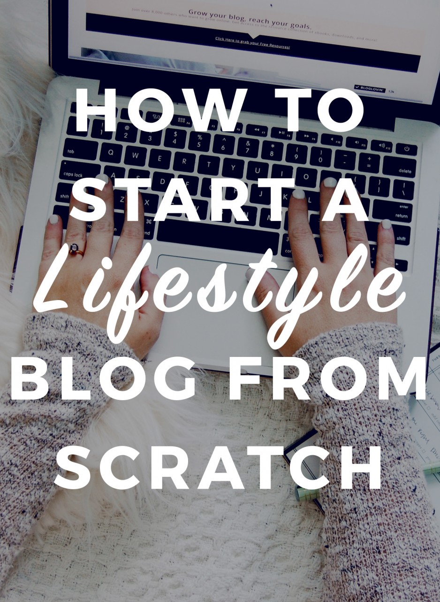

[Save](http://pinterest.com/pin/create/bookmarklet/?media=http://heleneinbetween.com/wp-content/uploads/2016/12/how-to-start-a-lifestyle-blog-from-scratch.jpg&url=https://heleneinbetween.com/2016/12/start-profitable-lifestyle-blog-scratch.html&is_video=false&description=)

A little bit about me, I started my blog back in 2011, after I fell 20 feet rock climbing. I started it as a way to connect with others online and share my story. Now, I work full time as a blogger, making triple than I ever did working for someone else (and in my corporate job). I have flexible hours and I was able to move myself (and my husband) to Germany so we could travel and I could keep the blog! So, it’s safe to say blogging has changed my life. That’s why I want to share with you today on how to start a profitable blog.

# How to Start A Profitable Lifestyle Blog From Scratch

First, you need a website. I have tried them all: Blogger, Squarespace, and WordPress (and a few in between) and I feel that **WordPress is the best bet for a beautiful, seamless, and easy to use blog2**. It’s very easy to change the design, focus, or add and remove tools that you need. [You can read my comparison of all three here](http://heleneinbetween.com/2016/08/best-platform-blogger-wordpress-squarespace-comparison.html). Since switching to WordPress, I just feel like processes are much much easier. I also love my design and you can’t beat the plugins ([here are all the tools I use for my blog](http://heleneinbetween.com/2016/08/the-best-blogging-tools-programs-plugins.html).)

## So, what is a “lifestyle” blog?

A lifestyle blog is one that focuses on a myriad of subjects. You don’t necessarily stick to one niche, you blog about multiple subjects. Lots of people have said this doesn’t work as a profitable blog but I can tell you they are just plain wrong. As long as you are creating valuable content and you h1ave focus (meaning you pick a few subjects to delve into that can range from your life to travel to blogging to health to everything in between) you can succeed.

It can be defined as, “A lifestyle blogger creates content inspired and curated from their personal interests and daily activities.” – [Media Kix](http://mediakix.com/2015/06/what-is-a-lifestyle-blogger/#gs.esQgHbU). It’s a website primarily focusing on the blogger’s life and is the extension of the writer, herself (or himself of course!).

There are a lot of ways to go about this, but the general idea for a lifestyle blog is one that follows you as a person. Therefore, you are the brand. You control the content and you create the rules. Pretty awesome, right?

## How do you start a lifestyle blog from scratch?

**[Click here to start a blog on WordPress](https://www.siteground.com/go/heleneinbetween), then follow the step-by-step instructions below to learn how.**

If you’re like me, you want to start a blog cheaply, but you also want customer support. [SiteGround](https://www.siteground.com/go/heleneinbetween) is the answer, no question. You can chat with them day and night if you ever have any issues or need support. I am blown away by the service and support I receive. Oh, and plans start at just $3.95 a month, which is the cheapest out there!

While I know $3.95 is an expense, this is guaranteeing that you own your content, and you’re able to easily make this back. Once you sign up, you will also need to buy a domain name (SiteGround will walk you through this step by step!) I believe you do need to spend just a small amount in order to make money. And that’s what this guide is here for! Through blogging I am able to travel around the world and do things I never thought possible. Blogging has opened so many doors for me, and I wish I would have known about these secrets first, so that I could have started a profitable blog from the start.

### Free eCourse: Build a Successful Blog

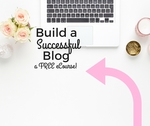

This 6 day video course will help you start a profitable blog, the right way!

First Name

Email Address

We use this field to detect spam bots. If you fill this in, you will be marked as a spammer.

[Powered by ConvertKit](http://mbsy.co/convertkit/299449)

You can start a blog on free platforms like Blogger but here’s the deal: you don’t own your content. And worse still, if something goes awry with your blog, there is nothing that can help you. A writer recently lost *decades* of work when his site crashed. The problem with Blogger is that you don’t have control over your site. So while you may think you want the cheaper option, I guarantee using WordPress will save you time and hassle.

Yes, there are other web hosting companies out there. But you want one that will be the fastest and have the most support. Here are the facts about [SiteGround](https://www.siteground.com/go/heleneinbetween):

- Loads faster than all other web hosts. This is EXTREMELY important. Let’s say someone new comes to your site- but it doesn’t load. They click away immediately!
- Hack protection. You also have to play it safe with your site. SiteGround has built in security to make sure no one messes with your site. SiteGround were the pioneers in applying effective account isolation mechanisms to the shared hosting environment.
- Website caching is automatic. When your site starts getting some LOTS of traffic, caching is a must (basically refreshing the page to show what’s new). No host can handle a spike without it. They do the caching for you. Meaning, you don’t even have to worry or think about it.
- Free site transfer. Are you on another site like Blogger or Squarespace (like I was?!) good news. They transfer your site for you. And they take the headache out of it. Y’all, people pay upwards of $500 for site transfers. For real.
- They’ve been around the block for over 10 years. They are here to stay.
- Backups. They back up your site on the regular to make sure that all your content is safe.
- But my favorite feature is the support. I can chat with knowledgeable support and fix your problem in 5 minutes or less. I can’t tell you the number of sleepless hours this saved me (and believe me, I spent many up working on Blogger issues.)
- Here’s the biggest thing… it’s so cool I almost don’t want to tell you…but I will! If you have an issue with your WordPress site, not even SiteGround, they will help you. BOOM.
- There are REAL PEOPLE answering your questions round the clock.

## What if I want to move my blog from blogger (or any other platform other than WordPress)?

You should definitely do it. I’ve tried them all and WordPress does everything I need and grows with me. Moving your blog can be SUPER technical. I recommend using a company to help you ( I wish I did in the beginning and didn’t waste sleepless nights wondering why my blog stopped working.) I recommend WP Help. This is the same company I use to make sure my blog runs smoothly. WP Help is offering the transfer for only $300 (this sincerly usually costs $500 from most)… BUT [they are giving Helene in Between readers 25% off!! So it’s only $225. Use code “HELENE-WP”](http://bit.ly/2wphelp). PLUS they are including a free month of  Premium Care Plan (usually $99/mo) which is the same plan I use.

Now that you know the ins and outs of hosting, you are ready to go and start a profitable blog.

[**First, click here to get this crazy good deal on hosting (before this price goes away!)**](https://www.siteground.com/go/heleneinbetween).

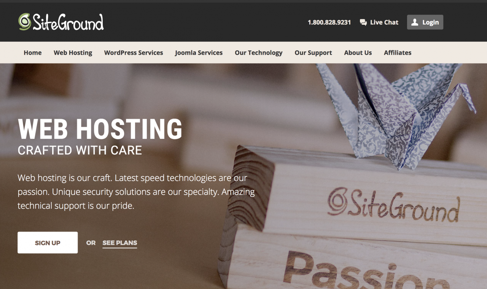

[Save](http://pinterest.com/pin/create/bookmarklet/?media=http://heleneinbetween.com/wp-content/uploads/2016/10/web-hosting-for-lifestyle-blog.png&url=https://heleneinbetween.com/2016/12/start-profitable-lifestyle-blog-scratch.html&is_video=false&description=Web%20hosting%20for%20lifestyle%20blog)

Okay, now that we’ve talked about the pros and cons, let’s start the blog. Here are the step by step instructions:

## Step 1: Register Your Domain

The first step is to pick your domain name. Meaning, what do you want your www.yourblogurl.com to be? This can be difficult, but I recommend picking something totally aligned to you. Usually, it’s a good idea to use your own name or something that relates back to what you might be writing about.

Some tips for picking your domain name should be short or simple enough that people can remember it. After all, this is what people will type in their browser, so keep it easy!

If you don’t want to use your name, make it relate back to what topics you’ll focus on or what you are passionate about.

Okay, now that you have a domain name, let’s get to business!

## Step 2: Choose Your Hosting Plan

[Click here to grab your hosting and domain name for just $3.95 with SiteGround](https://www.siteground.com/go/heleneinbetween). Click “choose a plan” then select a plan that works for you. I’d start with “Startup” since you can ALWAYS change this.

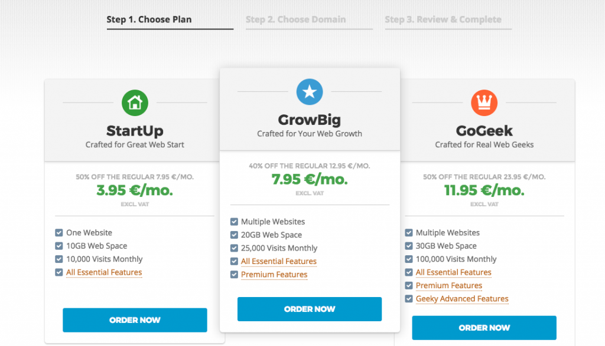

[Save](http://pinterest.com/pin/create/bookmarklet/?media=http://heleneinbetween.com/wp-content/uploads/2016/12/Screen-Shot-2016-12-26-at-3.10.52-PM-1024x587.png&url=https://heleneinbetween.com/2016/12/start-profitable-lifestyle-blog-scratch.html&is_video=false&description=)

Once you choose a plan, you’ll enter in your domain name, or choose your old one. This is where you’ll enter your blog’s name. For example, if your blog’s name is: Travel In Europe, you’d enter that as the address like the example below, no spaces:

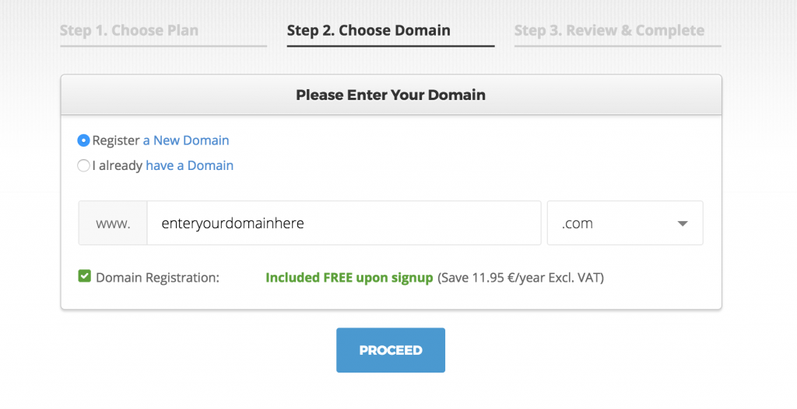

[Save](http://pinterest.com/pin/create/bookmarklet/?media=http://heleneinbetween.com/wp-content/uploads/2016/12/Screen-Shot-2016-12-26-at-3.13.23-PM-1024x527.png&url=https://heleneinbetween.com/2016/12/start-profitable-lifestyle-blog-scratch.html&is_video=false&description=)

It will also to check to make sure that domain is available. If not, no worries! Just come up with a different variation, SiteGround will also give you some ideas of what to use. Once you choose a domain, you’ll create an account and enter in your contact information and payment. I recommend using the “.com” since it’s just easier for people to remember.

At any point, if you get confused you can always click “Live Chat” and talk to someone immediately! Or, you can also call the phone number listed at the top right.

On the bottom, you’ll see your total payment. If you’d like to just pay month to month, you can change that under “hosting services”:

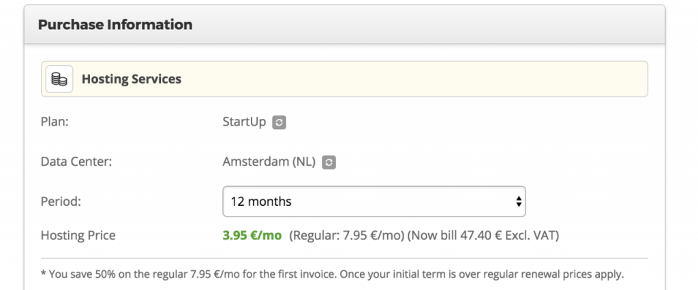

[Save](http://pinterest.com/pin/create/bookmarklet/?media=http://heleneinbetween.com/wp-content/uploads/2016/12/Screen-Shot-2016-12-26-at-3.26.42-PM-1024x427.png&url=https://heleneinbetween.com/2016/12/start-profitable-lifestyle-blog-scratch.html&is_video=false&description=)

Once you complete this step, you’ll get a confirmation in your inbox that you’ve set up your blog- virtual high five!

## Step 3: Install WordPress

Now that you have your domain and hosting, it’s time to install WordPress. This can sound intimidating, but I promise, it’s not! SiteGround also has a Wizard that helps you along the process. You have two options: you can do it yourself, or you can let SiteGround do it for you. I’m going to explain both.

### Have SiteGround set it up for you:

Go ahead and go to your SiteGround Customer Area, when you do, you’ll get a pop-up asking if you’d like to have WordPress preinstalled on your account. Click that option and click “proceed.”

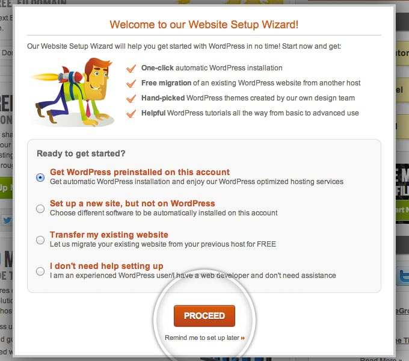

[Save](http://pinterest.com/pin/create/bookmarklet/?media=http://heleneinbetween.com/wp-content/uploads/2016/12/wpw1.jpeg&url=https://heleneinbetween.com/2016/12/start-profitable-lifestyle-blog-scratch.html&is_video=false&description=)

Next, you’ll enter your login details for WordPress. This is your admin email, username, and password.

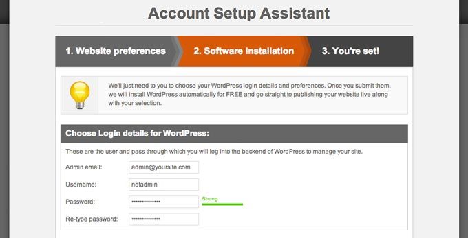

[Save](http://pinterest.com/pin/create/bookmarklet/?media=http://heleneinbetween.com/wp-content/uploads/2016/12/wpw2.jpeg&url=https://heleneinbetween.com/2016/12/start-profitable-lifestyle-blog-scratch.html&is_video=false&description=)

Choose a WordPress theme (I’ll give you options for design and more below!) So just pick one and get to set up.

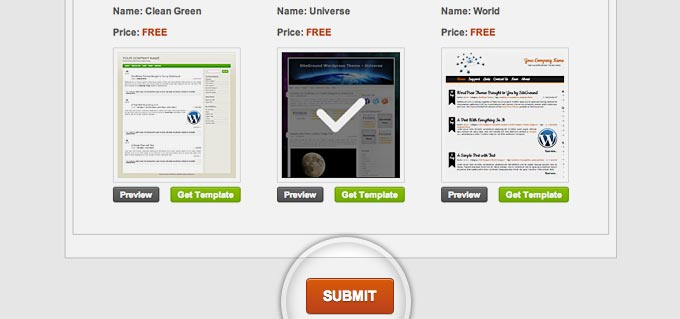

[Save](http://pinterest.com/pin/create/bookmarklet/?media=http://heleneinbetween.com/wp-content/uploads/2016/12/wpw3.jpeg&url=https://heleneinbetween.com/2016/12/start-profitable-lifestyle-blog-scratch.html&is_video=false&description=)

Lastly, you will see a quick summary of your WordPress installation, including from where to access your admin area, your username and your password.

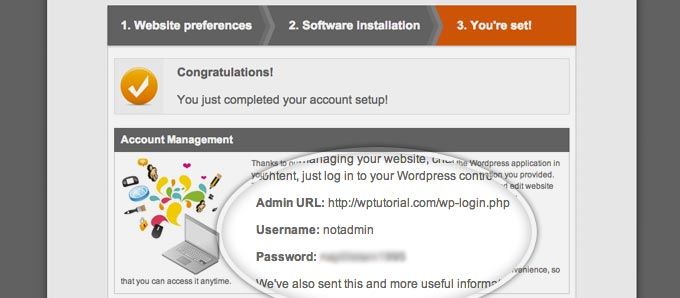

[Save](http://pinterest.com/pin/create/bookmarklet/?media=http://heleneinbetween.com/wp-content/uploads/2016/12/wpw4.jpeg&url=https://heleneinbetween.com/2016/12/start-profitable-lifestyle-blog-scratch.html&is_video=false&description=)

You’ll get a confirmation email that your WordPress is installed and ready to go:

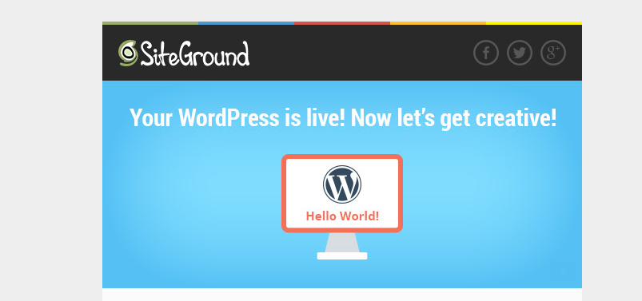

[Save](http://pinterest.com/pin/create/bookmarklet/?media=http://heleneinbetween.com/wp-content/uploads/2016/12/Screen-Shot-2016-12-26-at-4.08.17-PM.png&url=https://heleneinbetween.com/2016/12/start-profitable-lifestyle-blog-scratch.html&is_video=false&description=)

### Set Up WordPress on Your Own:

Like I mentioned, you can also set this up on your own! So to do so, log into SiteGround and click on “My Accounts” then click the red button on the top left that says “Go to cPanel”, it looks like this:

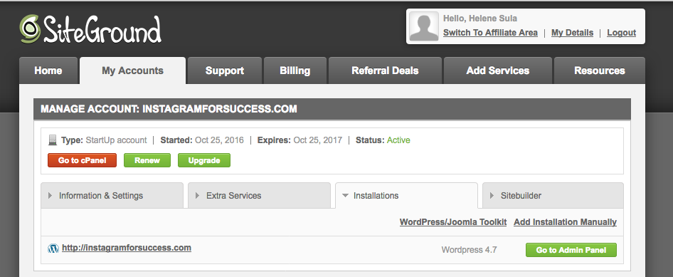

[Save](http://pinterest.com/pin/create/bookmarklet/?media=http://heleneinbetween.com/wp-content/uploads/2016/12/Screen-Shot-2016-12-26-at-4.12.03-PM.png&url=https://heleneinbetween.com/2016/12/start-profitable-lifestyle-blog-scratch.html&is_video=false&description=)

Now, click on “WordPress Installer” as I circled in pink below:

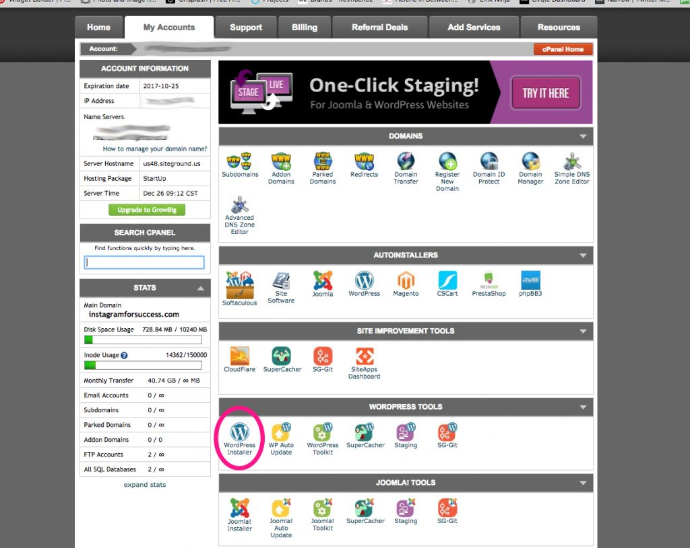

[Save](http://pinterest.com/pin/create/bookmarklet/?media=http://heleneinbetween.com/wp-content/uploads/2016/12/start-a-wordpress-blog-from-scratch-1024x815.jpg&url=https://heleneinbetween.com/2016/12/start-profitable-lifestyle-blog-scratch.html&is_video=false&description=)

Now click on the left button near the top, that says “Install”

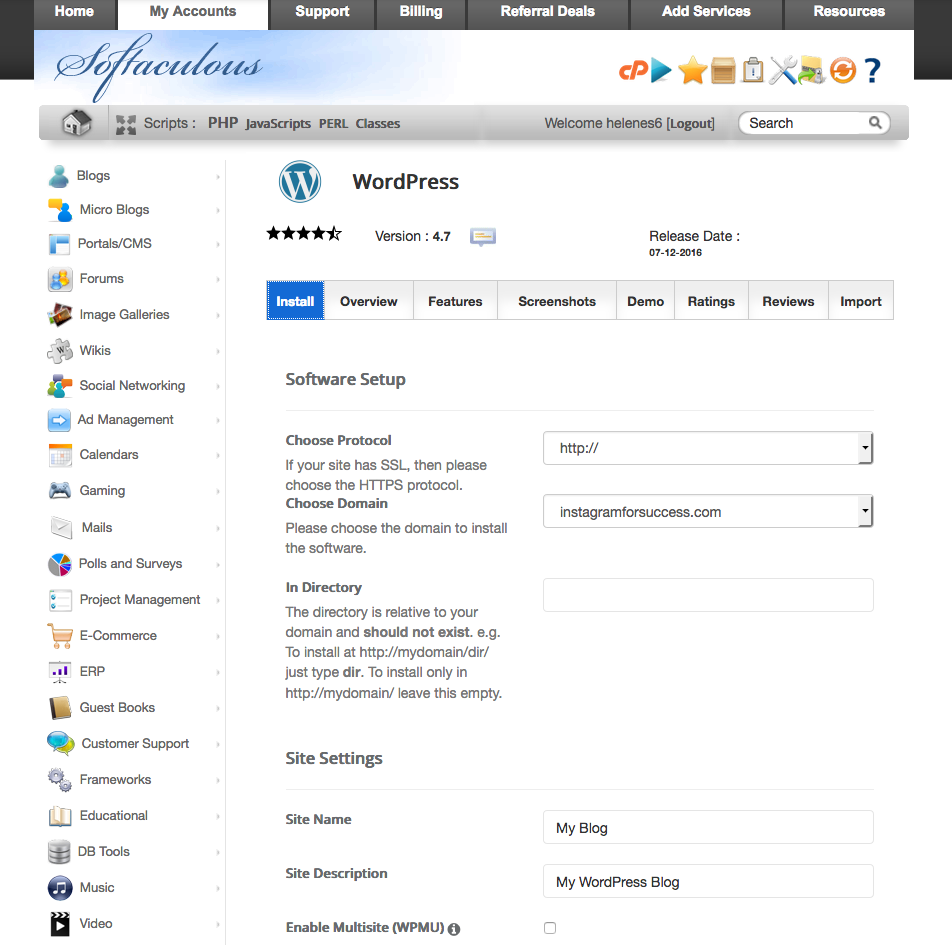

[Save](http://pinterest.com/pin/create/bookmarklet/?media=http://heleneinbetween.com/wp-content/uploads/2016/12/Screen-Shot-2016-12-26-at-4.17.16-PM.png&url=https://heleneinbetween.com/2016/12/start-profitable-lifestyle-blog-scratch.html&is_video=false&description=)

Fill out all the blank fields with your information. You can leave the protocol as “http://”, choose your domain from the drop down, you can leave the directory blank. Write your Site Name, your Site Description is like your tag line. For example – a travel and lifestyle blog. Choose a username and password and the email you used to sign up with. Choose you site language and a theme. You can choose a theme here, or you can upload one later. I use the [Genesis Framework](http://heleneinbetween.com/genesis) and  then like themes from [Restored 316](http://heleneinbetween.com/restored316). That’s what I currently use on my blog.

Once you’ve add all your info, click “Install”.

Now, you are ready to go! Use that username and password you created to login to your WordPress blog. Go to **http://www.YOURNEWDOMAIN.com/wp-admin** and enter in your login details.

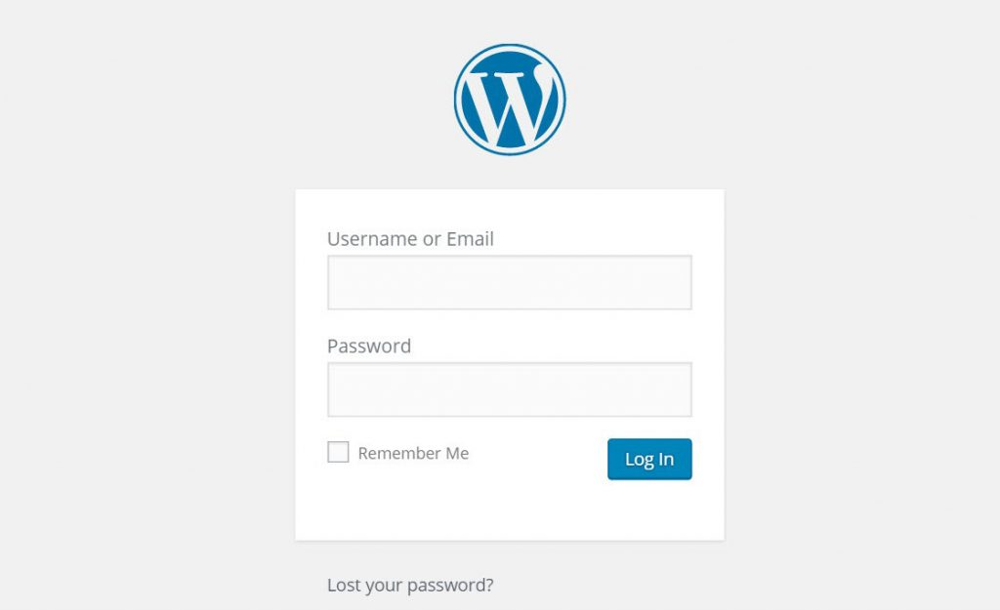

[Save](http://pinterest.com/pin/create/bookmarklet/?media=http://heleneinbetween.com/wp-content/uploads/2016/12/wordpress-login-screen-1-1024x625.jpeg&url=https://heleneinbetween.com/2016/12/start-profitable-lifestyle-blog-scratch.html&is_video=false&description=)

Log in, you are READY to post!! Whooo hoo!!!

## Step 4: Publish a Post

Now that you have a blog, it’s time to post. You might want to add a few things first. The left hand side of WordPress is where you can add pages and change your blog’s appearance. You might want to add some pages first. To do so, go to “Pages”, click on the top to “Add New” and name your page, and add in some relevant information.

To add a new post, again go to the left side and click on “Posts” > “Add New.” Here, you cna type, add images, video, and more. On the top right you’ll see “Visual” or “Text.” You’ll most likely be in Visual most of the time. But, if you’d like to add in HTML code (say, a blog button or any script) you will click on HTML to add in that code ([here’s a post on using HTML](http://www.heleneinbetween.com/2014/09/html-tips-every-blogger-needs-to-know.html)).

As for the design, I suggest [**Genesis Framework**](http://shareasale.com/r.cfm?b=241369&u=854542&m=28169&urllink=&afftrack=)**.** This is the most popular option and it’s what I use on my blog. There are also free themes through WordPress you can use. On the left hand side of your blog, go to “Appearance” then click on “Themes” then activate which one you want to test.

I personally like **[Restored 316](http://heleneinbetween.com/restored316)** and it’s what I use for my blog. This includes the fonts, layout, colors, etc. It’s so easy to change and mold to make it my own, but their themes are so beautiful! So, you will need what’s called a “parent theme” – Genesis, then a “child theme” – either from [Restored 316](http://heleneinbetween.com/restored316) or you can find others you like. I also like the options in [Creative Market](https://creativemarket.com/themes/wordpress?u=helene.sula) (they also have some very cheap options!)

## Step 5: Blogging for Profit

Now that we’ve done all of the above, how can you start making money blogging? Of course, you need to have the foundation. Meaning, you need a blog that you care about, that you continue to work on and write great posts. I like to call this “foundational content”. [Learn to create foundational content](http://heleneinbetween.com/2016/02/how-and-why-to-create-foundational.html) (this post explains that in depth) that helps to grow your traffic and audience.

Make sure you’re using social media correctly and to your advantage. I suggest focusing on a few different areas of social media you enjoy. Here are [my top tips on growing your social media](http://heleneinbetween.com/2016/08/8-tips-for-growing-your-social-media.html). I also HIGHLY suggest you grow your Instagram. To me, this is the single best way to make your blog profitable.

[Create a community](http://heleneinbetween.com/2016/04/how-to-find-your-blog-community.html) that cares about your blog. This is so essential, these are the people that will keep coming back to your blog, will be part of your story and will buy what you sell or promote! Do not forget about them.

If you’re ready to monetize, then I believe there are 6 ways to create a profitable blog, this post, [**How to make money as a blogger**](http://heleneinbetween.com/2016/03/how-to-make-money-as-blogger.html) explains them in depth and shows how to do each way!

## To review:

1. Decide on a blog and a name
2. Set up hosting and domain with **[SiteGround](https://www.siteground.com/go/heleneinbetween)**
3. If you need help moving your site, help with design (or stuck with anything WordPress Related) I suggest hiring **[WP Help](http://heleneinbetween.com/wphelp)**
4. Start blogging!
5. Create a profitable blog by consistently posting awesome content and growing your audience.

This post took me forever to write (no really, I started it a year ago!) if you think this could help you or someone you know, I’d love it if you’d pin it:

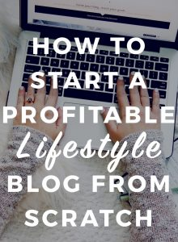

[Save](http://pinterest.com/pin/create/bookmarklet/?media=http://heleneinbetween.com/wp-content/uploads/2016/12/how-to-start-a-profitable-lifestyle-blog-from-scratch-220x300.jpg&url=https://heleneinbetween.com/2016/12/start-profitable-lifestyle-blog-scratch.html&is_video=false&description=)

Ready to take your blog to the next level? Grab my FREE course on building a successful blog! This is a free 5 day course that will help you get super clear and actionable on your goals and create a blog you love. (Taken by over 7,000!)

### Free eCourse: Build a Successful Blog

This 6 day video course will help you start a profitable blog, the right way!

First Name

Email Address

We use this field to detect spam bots. If you fill this in, you will be marked as a spammer.

[Powered by ConvertKit](http://mbsy.co/convertkit/299449)
