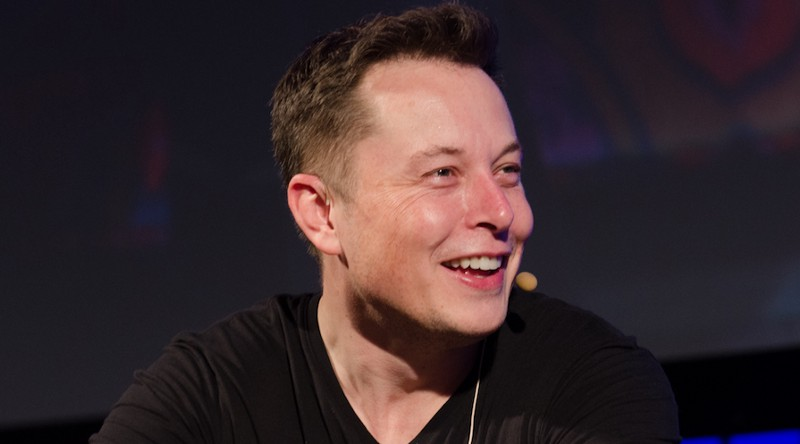

# How To Tell If Someone Is Truly Smart Or Just Average

Photo credit: [Heisenberg Media](https://www.flickr.com/people/88975472@N03 "flickruser:88975472@N03")

Have you ever noticed how some of the world’s most successful entrepreneurs and leaders see reality in a fundamentally different way? When they talk, it’s almost as if they’re speaking a different language.

Just look at [this interview](https://www.ted.com/talks/elon_musk_the_future_we_re_building_and_boring) where Elon Musk describes how he understands cause and effect:

> “I look at the future from the standpoint of probabilities. It’s like a branching stream of probabilities, and there are actions that we can take that affect those probabilities or that accelerate one thing or slow down another thing. I may introduce something new to the probability stream.”

Unusual, right? [One writer who interviewed Musk](https://waitbutwhy.com/2015/11/the-cook-and-the-chef-musks-secret-sauce.html) describes his mental process like this:

> “Musk sees people as computers, and he sees his brain software as the most important product he owns — and since there aren’t companies out there designing brain software, he designed his own, beta tests it every day, and makes constant updates.”

Musk’s top priority is *designing the software in his brain*. Have you ever heard anyone else describe their life that way?

Self-made billionaire Ray Dalio is no less “weird.” In his book, *Principles,* he describes how he sees reality: “Nature is a machine. The family is a machine. The life cycle is like a machine.” Dalio’s company, the largest hedge fund in the world, records every conversation (meeting or phone call) inside the company and has built several custom apps that allow any employee to rate any other employee in real time. The data is then added to profiles that each employee can see and is subsequently fed into an artificial intelligence system that helps employees make better decisions.

Dalio also [describes his day](https://www.farnamstreetblog.com/2017/10/ray-dalio/) in much different terms than you would expect from a CEO:

> “I’m very much stepping back. I’m much more likely to go to what I describe as a higher level. There’s the blizzard that everyone is normally in, and that’s where they’re caught with all of these things coming at them. And I prefer to go above the blizzard and just organize.”

Charlie Munger uses a “cognitive bias checklist” before making investment decisions to ensure he properly [applies the correct mental models](https://medium.com/the-mission/how-one-life-hack-from-a-self-made-billionaire-leads-to-exceptional-success-a0b21fc34048). Warren Buffett uses [decision trees](https://medium.com/the-mission/8-things-that-self-made-billionaires-do-differently-26399196feb3). Jeff Bezos thinks of Amazon as being at Day One even though it’s been around more than 20 years.

What’s going on here? Are these just the idiosyncrasies of geniuses, or do these entrepreneurs employ a way of using their brain that we too could learn from in order to become smarter, more successful, and more impactful ourselves?

### **How I Learned to Think Like the World’s Best and Brightest**

Over the years, as I’ve [studied all of the above entrepreneurs](https://medium.com/the-mission/8-things-that-self-made-billionaires-do-differently-26399196feb3), I’ve also aggressively applied their teachings. Even if I didn’t understand what they were saying at first, I took their advice on faith.

I’ve applied Ray Dalio’s root-cause analysis approach to our company. Now, throughout the week, everyone on our team logs any problems they’re facing. Then, we have a weekly phone call to discuss our biggest, recurring problem and its possible root cause.

I’ve applied [Charlie Munger’s approach to mental models](https://medium.com/the-mission/how-one-life-hack-from-a-self-made-billionaire-leads-to-exceptional-success-a0b21fc34048) and collected thousands of pages of notes in order to create in-depth briefs on each model.

I’ve applied [Musk’s probabilistic thinking](https://medium.com/the-mission/8-things-that-self-made-billionaires-do-differently-26399196feb3) to major decisions by listing out all of the potential decisions I could make and then assigning a cost, potential value, and probability to each one.

I’ve also created an [experimentation engine like Bezos and Zuckerberg](https://medium.com/the-mission/forget-about-the-10-000-hour-rule-7b7a39343523), and we now perform more than 1,000 experiments each year at our company. Finally, I now follow the [5-hour rule](https://medium.com/the-mission/the-5-hour-rule-if-youre-not-spending-5-hours-per-week-learning-you-re-being-irresponsible-791c3f18f5e6) and spend at least two hours a day on deliberate learning.

After five years of emulating the leaders I most admire, I realized something surprising was happening to my thought process. I wasn’t just learning new strategies or hacks. I was learning a deeper and fundamentally different way of understanding reality — like I’ve accessed a hidden, secret level in the game of life. It’s thrilling to uncover deeper layers of understanding that I didn’t even know existed.

When I look back on my former self, I feel like I’m looking at a different person altogether. As previously “unsolvable” problems from my past come up again, I find I can solve many of them now. It is a great feeling to see previously insurmountable problems — both personal and professional — and realize I now have the tools to surmount them.

I’ll give you an example. In my twenties, I invested $100,000 into a business idea that never took off. Now that I understand cognitive biases — thanks to Charlie Munger — I see how the pernicious [sunk cost fallacy](https://www.inc.com/michael-simmons/how-warren-buffett-and-richard-branson-overcame-the-most-costly-cognitive-bias-i.html) wreaked havoc upon my decision-making. Today when I consider new business ideas, instead of just imagining how great they’re going to be, I spend just as much time envisioning what could go wrong — another Munger hack. I no longer have to remind myself to think this way anymore. I’ve internalized these concepts and now my mind actually *works differently.*

I once heard a coach talk about changing a client’s way of seeing the world in a way that would blow their mind. When he looked into his client’ eyes and could see him or her really getting it, he’d say, “Now, you’re in my reality!” That’s how I felt. Reality somehow feels different on an aesthetic level — as if I’m cutting through the levels of illusion and noise we normally see and getting a more direct view. The best example I can think of is that it’s like wearing augmented reality glasses that constantly feed you relevant wisdom about the situation you’re in.

Ultimately, what I’ve learned is that billionaires don’t have odd ways of talking. They, instead, are visionaries who see the world in a deeper way — one that is both incredibly effective and also learnable.

### **The Difference Between Average and Brilliant: Effective Mental Models**

> “Mental models are to your brain as apps are to your smartphone.” -Jayme Hoffman

According to [Model Theory](http://mentalmodels.princeton.edu/about/what-are-mental-models/), we all always use mental models in our thinking. “Mental models are psychological representations of real, hypothetical, or imaginary situations,” according to the [formal definition](http://mentalmodels.princeton.edu/about/what-are-mental-models/). Less formally, a mental model is a simplified, scaled-down version of some aspect of the world: a schematic of a particular piece of reality. A model can be represented as a blueprint, a symbol, an idea, a formula, and in many other ways. We all unconsciously create models of how the world works, how the economy works, how politics works, how other people work, how we work, how our brains work, how our day is supposed to go, and so on.

The more effective the model, the more effectively we are able to act, predict, innovate, explain, explore, and communicate. The worse the model, the more we fall prey to costly mistakes. **The difference between great thinkers and ordinary thinkers is that, for ordinary thinkers, the process of using models is unconscious and reactive. For great thinkers, it is conscious and proactive.**

All of the extraordinary people mentioned above [collect the most effective models across all disciplines](https://medium.com/the-mission/how-one-life-hack-from-a-self-made-billionaire-leads-to-exceptional-success-a0b21fc34048), stress-test them, and creatively apply them to their daily lives. Mental models are so valuable that billionaire Ray Dalio’s [only book is full of his best mental models](https://www.amazon.com/Principles-Life-Work-Ray-Dalio/dp/1501124021/ref=tmm_hrd_swatch_0?_encoding=UTF8&qid=1509627698&sr=8-1). Charlie Mungers’ [only book is packed full of his top mental models](https://www.amazon.com/Poor-Charlies-Almanack-Charles-Expanded/dp/1578645018/ref=sr_1_1?s=books&ie=UTF8&qid=1509627977&sr=1-1&keywords=charlie+munger) too. One of the most common pieces of advice that Elon Musk gives is to think from first principles. Mental models and first principles are similar in that they each model deeper levels of reality.

While most people think about knowledge just horizontally (ie — across fields), these great thinkers also think about knowledge vertically in terms of depth. Musk explains deep knowledge in a [Reddit AMA](http://www.reddit.com/r/IAmA/comments/2rgsan/i_am_elon_musk_ceocto_of_a_rocket_company_ama/), “It is important to view knowledge as sort of a semantic tree — make sure you understand the fundamental principles (Musk calls these ‘first principles’), i.e. the trunk and big branches, before you get into the leaves/details or there is nothing for them to hang onto.” In another interview, Musk gives an example, “I tend to approach things from a physics framework. Physics teaches you to reason from first principles rather than by analogy.”

Physicist David Deutsch [explains it even further](https://www.youtube.com/watch?v=gT7DFCF1Fn8), “It’s in the nature of foundations, that the foundations in one field are also the foundations of other fields…The way that we reach many truths is by understanding things more deeply and therefore more broadly. That’s the nature of the concept of a foundation… just as in architecture, all buildings all literally stand on the same foundation; namely the earth. All buildings stand on the same theoretical base.” By understanding verticality and depth, you can see how learning mental models connects things that were previously separate and disconnected. Just as every leaf on a tree is connected by twigs, which are connected by branches, which are connected by a tree trunk, [so too are ideas connected by deeper and deeper ideas](https://medium.com/@michaeldsimmons/how-elon-musk-learns-faster-and-better-than-everyone-else-a010a4f586ef).

One of the most effective and universal mental models is the 80/20 Rule: the idea that 20 percent of inputs can lead to 80 percent of outputs. This same 80/20 idea can be applied to our personal lives (productivity, diet, relationships, exercise, learning, etc.) and our professional lives (hiring, firing, management, sales, marketing, etc). As such, you can see how the 80/20 Rule connects many disparate fields. This is what all mental models do.

To apply the 80/20 Rule, at the beginning of the day we can ask ourselves, “Of all the things on my to-do list, what are the 20 percent that will create 80 percent of the results?” When we’re searching for what to read next, we can ask ourselves, “Of all the millions of books I could buy, which ones could really change my life?” When considering who to spend time with, we can ask ourselves, “Which handful of people in my life give me the most happiness, the most meaning, and the greatest connection?” In short, consistently using the 80/20 Rule can help us get leverage by focusing on the few things that really matter and ignoring the majority that don’t.

*My team and I have spent dozens of hours assembling the largest list of the most useful mental models in the world (that we’re aware of). We’ve done this by curating and combining the most useful models of other mental model collectors.* ***To access this spreadsheet for free,*** [***visit the download page***](http://bit.ly/2lGy3S6_Medium_Article_12)***.***

### **Mental Models Are the New Alphabet**

> “You can’t do much carpentry with your bare hands and you can’t do much thinking with your bare brain.” — Bo Dahlbom, philosopher and computer scientist

Evolution is so slow that a child born today is — biologically — indistinguishable from a child born 30,000 years ago. Yet, here I am typing on a MacBook, while my ancestors spent most of their time collecting berries, throwing spears, and chipping rocks. So what’s the difference between someone born 30,000 years ago and me?

Tools.

Between then and now, there has been an unprecedented explosion and evolution of tools that have collectively created modern society.

We all intuitively understand this. We all know that if we didn’t have basic tools like fire or the plow, or more complex ones like a Macbook or car, our lives would be completely different. Watch any post-apocalyptic TV or movie series and you can see how the world quickly falls apart when tools fail.

**But there’s a major blindspot people have when it comes to understanding tools.** Many people fail to appreciate non-physical tools — tools that they cannot touch, hear, or see. But mental tools are just as powerful and complex as physical tools. For example, consider the alphabet: the Western alphabet is a mental tool that wasn’t invented until around 1100 BC (pictorial writing systems like hieroglyphics were invented much earlier). Now we take it for granted, but at the time, it was a cutting-edge tool. Though it was adopted slowly at first — only 30 percent of the population could read and write before the printing press was invented in 1440 — once it began to spread, literate individuals had a huge leg up. In fact, literacy is now so important that it’s a national priority for all governments. That is the power of an effective mental tool.

It’s by understanding the significance of the alphabet that we can understand the significance of mental models too…

- Mental models are also fundamental and critical mental tools.
- [Mental models represent large chunks](https://medium.com/the-mission/successful-people-are-not-necessarily-smarter-they-just-do-more-of-this-644a0cca6db8) of reality that can be combined together to create even more complex and useful “supermodels.” This is similar to how letters can be combined into words, which can be combined into sentences.
- Mental models should be taught early in one’s life, because nearly everything else builds on them.
- Mental models trigger higher-order thinking. This is similar to how becoming literate triggers a whole slew of higher-order thinking capabilities known as the [Alphabet Effect](https://en.wikipedia.org/wiki/Alphabet_effect).

As society evolves, it’s becoming more and more complex. There are more people, more tools, and more knowledge, all globally connected in complicated ways. **Therefore, people who are able to model how this more complex reality works will be far more successful at navigating it.** Or, as Ray Dalio says in his book, “Truth — or, more precisely, an accurate understanding of reality — is the essential foundation for any good outcome.”

People who are able to model how a complex business works in their minds are more likely to be successful business leaders, because they must understand the complex subtleties of finance (balance sheet, cash flow, and income statements), HR (recruiting and managing A+ players), product development, marketing/sales, and how they all interact with their mental models of their various stakeholders (community, customers, suppliers, employees, investors). Before an architect can build a house, he or she must first design a model of that house. That architect must have an understanding of how the electrical, plumbing, design, materials, pricing, and so on come together to create a safe, beautiful building at the right price that the market will purchase. Someone who architects are skyscraper must have a much more complex latticework of mental models than someone who models a two-bedroom house.

Furthermore, as people progress in their careers, they must evolve the amount, diversity, and quality of their mental models if they want to have higher and higher levels of success and impact:

### **Why We Should All Become Mental Model Collectors**

> “You may have noticed students who just try to remember and pound back what is remembered. Well, they fail in school and in life. You’ve got to hang experience on a latticework of models in your head.” — Charlie Munger (self-made billionaire entrepreneur and investor)

So how do you build complex, accurate mental models? Let’s me explain with a simple example: dogs. Let’s hypothetically imagine for a moment that we have no idea what a dog is. We’ve never seen or heard of one before.

Then, one day, we see a dog that looks like the image below on the left, and someone tells us that this is a dog. “Ah, I get it,” we say. “Now I know what a dog is.”

*Credit:* [*AAA Lab At Stanford University*](https://aaalab.stanford.edu/research/inventive-learning/contrasting-cases/index.html)

But if we’ve only seen *one* dog, technically we don’t really know what a dog is. With just this single case example, our definition of a dog would be: a large black and brown animal with pointy ears that sits down, and sticks out its tongue. Bring out a Pomeranian dog and with only this mental model in mind, you are likely to ask ‘What is that?’

The numerous dog models on the right (the contrasting cases example) show us that dogs can come in all different colors, sizes, and shapes. At the same time, we can see the underlying element of “dogness” that they all share. This emergent element of “dogness” is a deeper mental model, and humans created the word “dog” to symbolize this mental model. Using that mental model, you can identify an animal as a dog even if you’ve never seen a particular breed of dog before.

What can we take away from this example that is relevant to our own life?

Many of the world’s problems result from people overgeneralizing from simplistic models just like our hypothetical one-size-fits-all “dog”. Here are three prime examples:

- Black/white thinking (you’re either a good person or a bad person with no gray area in between)
- Us/Them thinking (people outside your personal religion, nationality, or belief system are the enemy).
- All manner of stereotypes — race, gender, politics, ethnicity, etc.

Over-applying models is no different than a carpenter trying to build a house with one single hammer. All models, no matter how brilliant, are imperfect. The beauty of using multiple and diverse models is that many of the imperfections cancel each other out, allowing you to create a new “emergent” model that transcends all of the other models.

Great thinkers improve their thinking by taking in a larger quantity of information and developing a greater diversity of models. For example, a novice chess player might only know the name of each piece and how it moves across the board. [But a grandmaster has memorized no less than 50,000 chunks (mental models)](https://medium.com/the-mission/successful-people-are-not-necessarily-smarter-they-just-do-more-of-this-644a0cca6db8) of increasing complexity including openings, closings, patterns throughout the game, and how one single move can lead to a particular result 10 moves or more down the line.

[Many, diverse models also lead to heightened creativity](https://www.brainpickings.org/2011/08/01/networked-knowledge-combinatorial-creativity/). Nothing is truly original. Everything is derived by combining existing building blocks. Babies are created when a man and a woman have sex. New tools are created when pre-existing tools have “tool sex.” New ideas are created through “idea sex.” In the same way, we can build more complex mental models by combining simple mental models. For example, by understanding cause-and-effect mental models better, we can more effectively prioritize what’s important for us to do now to cause something we want in the future. The larger our base of mental models, the more creative combinations we can form. The more unique our mental models are compared to other people, the more we can think in ways that they can’t even fathom.

Through [constant and diverse learning](https://medium.com/@michaeldsimmons/bill-gates-warren-buffett-and-oprah-all-use-the-5-hour-rule-308f528b6363), we can organically build better and more varied models of reality. And those models will help us navigate the world far more effectively and creatively. Just as a blueprint is necessary for constructing a stable building, mental models of how the world works help us construct a better — and more stable — life.

### **How To Get Started With Mental Models**

> “Education is not the learning of facts, but training the mind to think.” -Albert Einstein

Are you convinced of the power of Mental Models? I’ve learned from personal experience that it literally takes years to develop true mastery of these. Therefore, I created two resources for you:

#### **Resource #1: Free Mental Model Course (For Newbies)**

If you’re just learning about mental models for the first time, my free email course will help you get started. My team and I have spent dozens of hours creating it. It includes Ray Dalio’s and Charlie Munger’s top mental models, a guide on how to create a checklist based on the best practices from medicine and aviation so that you use your mental models throughout the day, and a guide that more deeply explains what a mental model is and how to get value from one.

[**Sign up for the free mini-course here >>**](http://bit.ly/2lH7axo_Medium_Article_12)

#### **Resource #2: Mental Model Of The Month Club (For Those Who Want Mastery)**

If you’re already are convinced of the power of mental models and want to deliberately set about mastering them, then this resource is for you. It’s the program I wish I’d had when I was just getting started with mental models.

Here’s how it works:

- Every month, you’ll master one new mental model.
- We’ll focus on the most powerful and universal models first.
- We’ll provide you with a condensed and simple Mastery Manual (think: Cliff’s Notes) to help you deeply understand the model and integrate it into your life.

Each master manual includes:

- A 101 Overview of the mental model (why it’s important, how it works, its vocabulary, etc.)
- An Advanced Overview that includes a more nuanced explanation.
- Examples of hacks you can use immediately to apply that mental model to every area of your life and career. These hacks are based on my personal experience and are crowdsourced as well.
- Exercises & templates that you can use on a daily basis to integrate the lessons in the manual and achieve maximum results in your life.
- A Facebook community where you can meet other mental model collectors and learn from one another.

Measure

Measure
