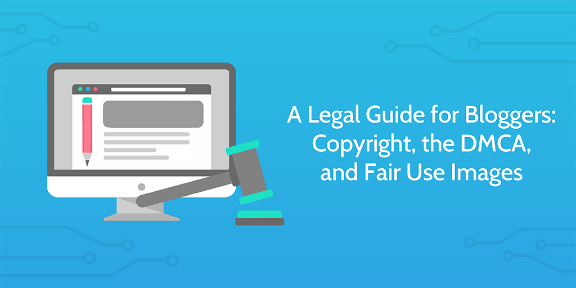
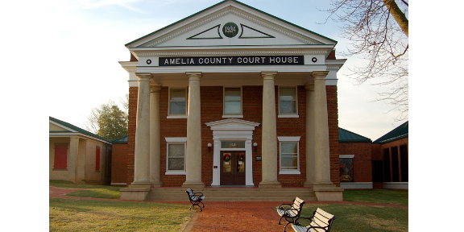
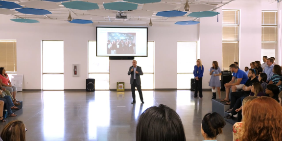
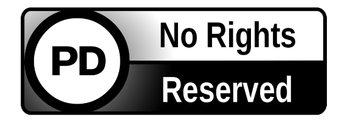
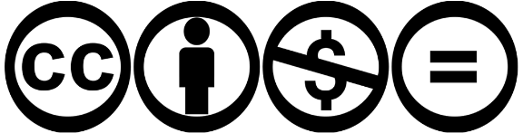
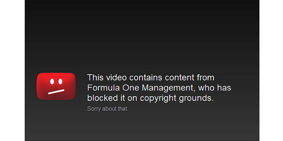
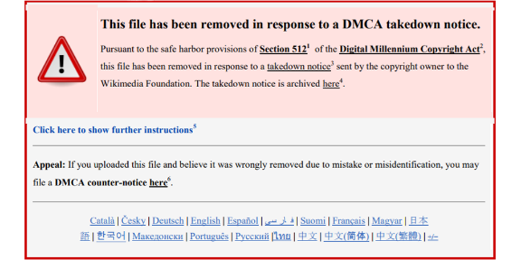
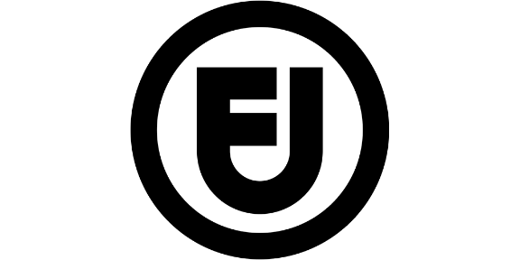
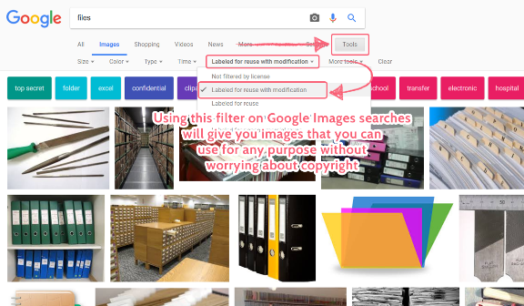
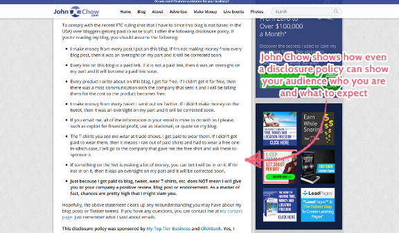

# A Legal Guide for Bloggers: Copyright, the DMCA, and Fair Use Images

Can you afford to pay [$8000+ for using an image](https://www.contentfac.com/copyright-infringement-penalties-are-scary/) in one of your blog posts?

If not (or if you’d rather use images for free) then you need to know the laws surrounding blogging.

It’s easy to fall prey to copyright and disclosure issues if you haven’t read a legal guide for bloggers, and so that’s exactly what I’ve created here.

Whether you’re a veteran blogger looking to secure yourself against surprise lawsuits or a fresh face who doesn’t want to be run out of pocket when [building a blog](http://www.ducttapemarketing.com/blog/build-a-blog/), keep reading to find out:

- What copyright is and how it affects your writing
- How to secure your work legally
- What you can and can’t use
- How to find fair use images that are free to use

So, if you happen to like not being sued for honest (and avoidable) mistakes, keep reading.  
  
To make it clear, I’ll state right now that **I’m not a legal adviser, attorney, lawyer, or any kind of law professional**, and this work shouldn’t be taken as official legal advice.

However, I know enough to get you started with the basic laws for creating content, and how difficult it is to find that out for yourself by researching. That’s why this legal guide for bloggers has all the basics you need to know in one place.

So, if you happen to like not being sued for honest (and avoidable) mistakes, keep reading.

### What is copyright?

“Copyright” is a right given to the creator of an original work upon its creation. This means that only they (and people they allow) can:

- Reproduce the work
- Create derivitive works (those based on the original, such as a sequel to a book)
- Distribute copies of the work (eg, selling it online)
- Perform or display the work publicly
- Alter the terms of and/or parties involved with the copyright

Basically, it protects any original work you create from being stolen, copied, or given out by someone else. The main thing to remember here is that it doesn’t cover ideas or facts, although the implementation of these could still be copyrighted.

For example, new outlets can all report the same event since the fact it’s happened is not copyrighted. However, if one station copied and published another’s report for that event, that’s a copyright infringement.

Copyright doesn’t last forever, and for works produced in the US after 1977 lasts until 70 years after the creator’s death. When it expires the work becomes available as part of the public domain. This means that anyone is allowed to access and use the work in any way they wish.

A copyright owner can also choose to give up their copyright by assigning the piece to the public domain early, and can partially lift restrictions through practices such as a Creative Commons license (more on that shortly).

So, copyright:

- Belongs to the owner of an original work (with [some exceptions](https://www.teachingcopyright.org/handout/public-domain-faq.html))
- Stops others taking, copying, and distributing the work without permission
- Currently expires 70 years after the creator’s death
- Can be waived or given up entirely at the creator’s will
- Infringements can send you to prison or result in a fine of [up to $150,000 per work](https://www.lib.purdue.edu/uco/CopyrightBasics/penalties.html)

### Exceptions to copyright

There [three main exceptions](https://www.lib.purdue.edu/uco/CopyrightBasics/exceptions.html) to copyright which allow an original work to be used without the copyright owner’s permission. This isn’t about using facts either – these exceptions allow you to use work that *has* a valid copyright on it in certain circumstances.

- Fair use
- Face-to-face instruction
- Virtual instruction

Both face-to-face and virtual instruction are only applicable in educational circumstances, and allow both location-based and online tuition respectively to show copyrighted materials in the aid of their teaching. There are [caveats](https://www.lib.purdue.edu/uco/ForInstructors/face_to_face.html) for [both](https://www.lib.purdue.edu/uco/ForInstructors/virtual.html), but that’s the general gist of it.

[Fair use](http://fairuse.stanford.edu/overview/fair-use/what-is-fair-use/), meanwhile, is a complex topic that we’ll get into the details of a little later. For now, think of it as a defense against copyright holders taking down transformative work, such as reviews, news reports, criticism, and parodies.

### What it means for bloggers

While you don’t have to know a lot about copyright law in order to blog without breaking the law, it’s important to have a rough idea of what you can and can’t do.

It provides a legal defense against the theft of your original work, but also stops you from copying others verbatim and using any and every image you like. Yes, that means you can’t just search Google Images for the snaps to accompany your latest blog post.

I’ll cover some tips and tricks for how to work with the specifics of copyright (including how to find images you’re allowed to use) towards the end of this post, but for now, you need to know a little more about one of the biggest exceptions to standard copyright.

## The public domain

### What is the public domain?

Works in the public domain are essentially considered to have no limitations on their use, reuse, alteration, and so on. They are completely free to access and do not require any attribution to use, share, or create derivative works of.

Work can enter the public domain through a number of avenues, although they will mainly do so either by the expiry of their copyright or at the request of their creator. For example, if you write an original book or create an original image, you can decide to allow everyone free access to it instantly by assigning it to the public domain.

### What it means for bloggers

The main use of the public domain for bloggers is as a source of information, music, images, and more, without having to worry about any potential copyrght issues.

For example, rather than having to worry about finding images for your blog posts which all fall under a particular Creative Commons license (more on those shortly), you can just [go to a public domain directory](https://en.wikipedia.org/wiki/Wikipedia:Public_domain_image_resources) and use any image freely.

## Creative Commons

### What is Creative Commons?

Creative Commons is both a non-profit organization founded by [Lawrence Lessig](https://twitter.com/lessig) in 2001 and the name of their titular copyright licenses. Both the organization and licenses were spawned from the idea that you could protect the rights of creators while allowing greater distribution of work to encourage creativity.

A Creative Commons (CC) license doesn’t override copyright, but instead attaches onto the license to free up some of the rights of the work to be used. All CC licenses are a combination of these four elements:

- Attribution – use of the work is permitted only if the original creator is given credit for it
- Share-alike – use of the work is permitted only if the derivative works and/or copies are published with the same copyright license as the original (or at least one that isn’t more restrictive)
- Non-commercial – use of the work is permitted for non-commerical purposes only
- No derivative works – the work can be copied, displayed, distributed, performed, etc, but no derivative works can be made (eg, copying the *Mona Lisa*, but [painting a moustache](http://www.toutfait.com/unmaking_the_museum/LHOOQ.html) on her)

If all of these elements are applied to a CC license it becomes only slightly less restrictive than traditional copyright. All four together would allow you to only copy and share the work exactly as it is, for non-commercial purposes, and attributing the original creator.

The most open of CC licenses would only include attribution, meaning that a piece could be used in any way so long as the original author is credited with the original work.

The [CC website](https://creativecommons.org/) also makes it much easier to free up these rights by letting you choose how to share your work with a multiple choice form – the fully legal (and jargon-filled) license is then generated for you.

For example, from their [license creation page](https://creativecommons.org/choose/), [this CC agreement](https://creativecommons.org/licenses/by-nc/4.0/legalcode) to allow others to copy, share, and adapt your work (but not monetize it) and only took three clicks to make and retrieve.

### What it means for bloggers

Creative Commons is a godsend for bloggers, marketers, and almost every content creator alike, since it provides an easy way to share your work with customised permissions. It allows authors to take credit for their work while encouraging the spread of ideas and creativity through easier access.

For example, if an image is under a Creative Commons license for “reuse with attribution”, you can use it in any way you wish as long as you say who created it and link back to them.

If you create a piece of music or write a book, you could also license it with Creative Commons to get a little free publicity. After all, you can still control how it is used, but allowing its use in general will get you greater coverage as people take advantage of that.

## The DMCA

### What is the DMCA?

The [Digital Millenium Copyight Act](https://www.copyright.gov/legislation/dmca.pdf) (DMCA) was brought into US law in 1998 and served three main purposes. First, it updated US copyright law to meet international standards. Second, it cleaned up some oversights such as [boat designs](https://www.law.cornell.edu/uscode/text/17/1301) and [copies of work and/or programs](https://www.law.cornell.edu/uscode/text/17/117) made for purposes like maintenance backups.

Finally, and most importantly for us, it provided a safe harbor for online service providers (OSPs, which includes ISPs) from being liable for copyright infringement for works uploaded to them.

This means that, for example, if someone uploads an entire album of copyrighted music to their website for distribution without permission, the copyright holder can send a DMCA takedown notice to the service provider. The provider will then be able to either remove the content directly or request that the user does so, all while avoiding repurcussions of the infringement themselves.

To stop copyright holders from abusing the system, however, OSPs must provide an avenue for you to refute claims which you don’t believe are valid. For example, if you created a parody of a song which constituted fair use of the original and still received a DMCA notice, your OSP needs to provide an avenue for you to counter the claim.

The person or company who filed the DMCA against you then has a maximum of 14 business days to respond to the counterclaim with further action (usually a request for an injunction or a lawsuit), and if none is taken your material will be restored.

### What it means for bloggers

While the DMCA isn’t usually a problem for bloggers, it can become an issue if you’re planning on covering topics in the entertainment sector, such as music, movies, and video games. Blogs on these topics more often focus on the copyrighted work of others, and so can be more open to what some would consider copyright infringement.

In an ideal world, the DMCA system would be used to take down pirate sites and true copyright breaches. However, it’s incredibly easy for the DMCA system to be abused in its current state, and there are few realistic penalties for doing so.

In terms of you receiving a DMCA notice when you haven’t done anything wrong, this is largely a problem because of how easy the claims are to file. There are innumerable examples of DMCA takedowns being issued and successfully having content removed despite being incorrect.

One case in 2017 showed how just one person could [remove more than 100 videos](https://sirtaptap.com/2017/07/timeline-alex-mauer-dmca-debacle-starr-mazer-river-city/) from YouTube and [several products from the Steam marketplace](https://www.techdirt.com/articles/20170719/11214037822/alex-mauer-gets-another-game-taken-down-steam-via-dmca-as-she-sends-imagos-lawyer-death-threats.shtml) through DMCA takedowns for works that they did not even own the copyright for. Most (if not all) of the items hit with takedowns were also not breaking the wishes or copyright of the actual holder.

Factor in the legal costs for defending yourself, upholding a copyright claim, or seeking compensation for a false claim, and most DMCA notices end up in one of two situations. Either the content is taken down and nothing else is done about it, or the counterclaim goes through and after around two weeks of being unavailable everything goes back to normal.

In short, while it’s certainly good to know what a DMCA takedown is and how to combat it, your best defense is to avoid running the risk with copyrighted material in the first place.

Having said that, if you’re going to be using a specific platform to host your blog or media, it’s well worth looking into both how to file a DMCA takedown and how to file a counterclaim. Both of these can differ largely based on the OSP responsible for hosting the content, but will generally require you to:

- Identify the copyrighted work
- Identify the infringing (targeted) work
- Include your contact information
- Insert good faith statements
- Have legal statements such as agreeing to penalty of perjury in the event of submitting a false claim or counterclaim

I’m far from a legal expert (or even initiate), and so it’s highly advisable to do some research based on various popular platforms like Facebook and Youtube, and to consult a qualified lawyer before submitting a claim. For example, I found the list of information above by combining [this article](https://sarafhawkins.com/how-to-file-dmca-takedown/) by [Sarah Hawkins](https://twitter.com/sarafhawkins), [GitHub](https://www.process.st/bitbucket-vs-github-version-control-software/)‘s guide to [submitting a DMCA counter notice](https://help.github.com/articles/guide-to-submitting-a-dmca-counter-notice/), and an [article on the same topic](http://www.dmlp.org/legal-guide/responding-dmca-takedown-notice-targeting-your-content) from [Digital Media Law Project](https://twitter.com/dmlpberkman).

## Fair Use

### What is fair use?

Fair use is a doctrine which helps to serve public interest while maintaining the rights of copyright holders. This allows the use of copyrighted material without the permission of the copyright holder, depending on four core elements.

The following four aspects must all be considered when judging whether the use of copyrighted content classes as fair use (taken from [this article](http://fairuse.stanford.edu/overview/fair-use/four-factors/) by [Rich Stim](https://twitter.com/dearrichblog)):

- The purpose and character of the work
- The nature of the copyrighted work
- The amount and size of the portion taken
- The effect of the use on the original’s market

Without going into too much detail, each of these categories weighs on the likelihood that the use of copyrighted material will be considered fair.

The “purpose and character” of work generally refers to whether the piece using copyrighted material can be considered transformative or not. This means that, rather than just copying the work, something new has been added to make it more of its own product.

While most agree that “transformative” work includes things like reviews, criticism, parody, commentary, news reporting, research, and education, there is no set measure for how “fair” an individual use is considered. Each case has to be judged separately, and so there are only rough guidelines to reference when creating your own work.

In terms of the nature of the copyrighted work, you’re more likely to have a fair use defense if the original work was factual rather than fictional, and published rather than unpublished.

The amount and size of the portion taken relates to both how much of the copyrighted work you use and whether the piece taken could be considered the “heart” of the original. The more you use of a copyrighted work (and the more central the piece you use was), the less your own work can be considered fair use.

Finally, if your new work takes away from the income of the original copyright owners, you’re unlikely to be able to use the “fair use” defense. Even here, however, there are exceptions – a review or parody can cause the original copyright owner to earn less, but that’s fine so long as they don’t fill the same market desire as the original.

For example, “Weird Al” Yankovic has made a living out of parodying popular songs, and while he gets the permission of the original song’s copyright owner before making anything (which is a good surefire way to be in the clear), the fair use defense could certainly be made for his work.

### What it means for bloggers

In terms of blogging, this allows you to use materials you otherwise wouldn’t, so long as you stick to the guidelines stated above.

For example, without fair use a copyright owner could have any negative coverage of their product taken down, since parodies and reviews would be vulnerable.

However, it’s important to note that fair use is *not* a reliable defense, since each case has to be assessed individually according to the four elements of fair use.

Basically, as long as your work adds something new to the original (it’s “transformative”), doesn’t use the entire original or the heart of it, and doesn’t affect the profits of the original, you’re pretty secure. Just to be sure though, it’s still best to ask and get permission from the original copyright holder where possible.

## The legal guide for bloggers: Tactics

Now that we’ve got the basics covered it’s time to move on to some tactics you can use to help make sure that your blogging is in within the law.

Here, you’ll learn:

- How to find public domain and fair use images
- How to provide adequate disclosure (and why you need to)
- Why you should consider putting your work under CC

### How to find public domain and fair use images

Images are by far and away one of the most difficult legal areas for bloggers. The temptation to just boot up Google Images and take the first result is immense. However, doing so both disrespects the work of the photographer or image creator and puts you at risk of legal repercussions at any given time.

Thankfully, there are a few ways to easily search for public domain and fair use images which will leave you legally covered. After all, no-one likes a surprise lawsuit over something that might not have even benefited you much in the first place.

First up, you can search Google Images for results that are filed under Creative Commons licenses which allow their reuse and/or modification for either commercial or noncommercial purposes.

By using the following sites you can also make sure that you’re only going to retrieve images which you can use (all images on here are either public domain or Creative Commons license):

- [Pexels](https://www.pexels.com/photo-license/)
- [Pixabay](https://pixabay.com/)
- [Wikimedia](https://commons.wikimedia.org/wiki/Main_Page)
- [Creative Commons](https://search.creativecommons.org/) (this is actually a search engine for multiple other free image locations including Flickr, Wikimedia, and Google Images)

If you don’t mind paying for images, there’s always the option of buying snaps from these sites:

Finally, for a list of public domain image collections, [check out this Wikipedia page](https://commons.wikimedia.org/wiki/Commons:Free_media_resources/Photography).

Other than that, your main options for getting images that are fully legal to use are creating your own or getting permission from the copyright holder.

### How to provide adequate disclosure

Another important aspect of blogging is being transparent with your audience – you should try to provide full disclosure when something you’re doing could skew your writing or opinion.

This usually relates to paid content, products provided for free, and affiliate links, and is a measure to show your readers any biases you may have.

For example, if you get a product for free and review it, there’s a chance that your opinion will be skewed towards giving positive coverage or downplaying flaws, which will give your audience a false impression when deciding whether to buy it or not.

The easiest way to provide full disclosure is to have a dedicated statement covering your affiliates, monetization, and links to brands and companies (eg, sponsorship). Check out [John Chow](http://www.johnchow.com/about/my-disclosure-policy/) and [Chris Brogan](http://chrisbrogan.com/about-2/)‘s disclosure statements for examples of where and how to do this.

When producing content that could be directly affected by such ties (eg, a review of a product you were given for free or are being paid to look at) you should also include a statement in the post itself to show this. Although you can put this statement anywhere, it’s good practice to make it highly visible at the top/beginning of your content to make sure that your audience knows what they’re walking into.

For more information, check out the FTC (Federal Trade Commission)’s [guidelines on the topic](https://www.ftc.gov/tips-advice/business-center/guidance/ftcs-endorsement-guides-what-people-are-asking#about) and the [letter they sent to bloggers](https://www.ftc.gov/system/files/documents/advisory_opinions/letter-commercial-alert-concluding-respect-type-amplified-word-mouth-marketing-staff-will-determine/061211staffopiniontocommercialalert.pdf) back in 2006.

### Why you should consider CC for your work

I’ve already mentioned how Creative Commons licenses can help you by giving your work extra visibility. This is easy to write off, but the opportunities that come with that can quickly add up to significantly boosting your audience and business.

For example, let’s say that you make music and are relatively small-time. You might have a core audience, but you can’t afford any promotion or have the time for dedicated marketing tactics such as content creation, SEO, and so on.

By assigning your work under the Creative Commons banner (whether you only allow sharing or any kind of use with attribution), you leave your work open for use by other smaller influencers who can’t afford (or don’t have the audience to get permission) to use gated or copyrighted work.

Video creators may use your work and expose you to their audience, reviewers can cover the tracks and do the same, and even at its most basic form other users can copy and distribute your work for you through their social circles.

This can open the door to paid work (such as commissioned music), interviews, and generally give a great boost for you to later earn more than if you gated your content in the first place.

In other words, CC can lower the barrier to entry for your content, allowing you to see greater revenue for the work that you do close off.

Don’t believe me? Well, that’s exactly what happened to [Adam Singer on The Future Buzz](http://thefuturebuzz.com/2009/01/14/creative-commons-license-ultimate-music-promotion-tool/).

The same can be said of images, written pieces, and almost any other written work – free promotion (at least in this context) is always good.

## Reminder: I’m not a legal professional

While I’d love to say that everything in this legal guide for bloggers is ironclad, I’m neither experienced in law or copyright in general and so none of this should be taken as gospel or legal advice in general.

However, I can assert with confidence that this post serves at least as a good set of guidelines to follow, both due to the amount of time I’ve spent looking into this (it’s a personal interest of mine) and the sheer number of reliable sources (from ProBlogger to the FTC itself) I’ve found that agree on the topics above.

I’d love to hear what you think about the topic in the comments below though! Have you run afoul of online copyright? Do you think I’ve missed (or am wrong) about any of the core topics? Please let me know.

Measure

Measure
