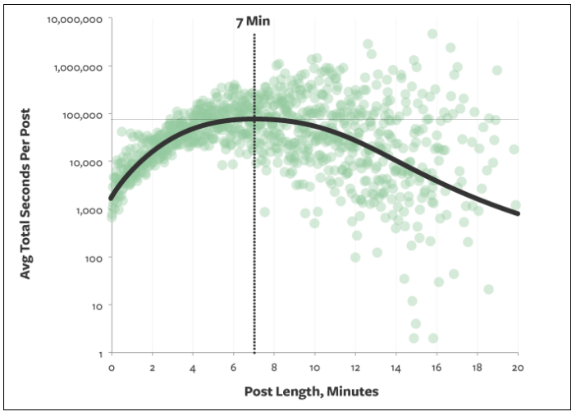
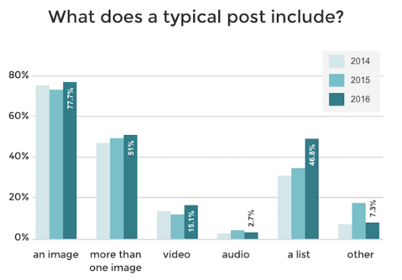
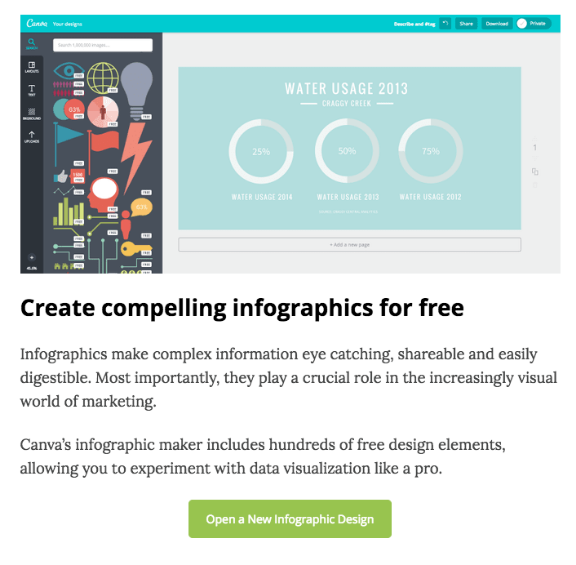
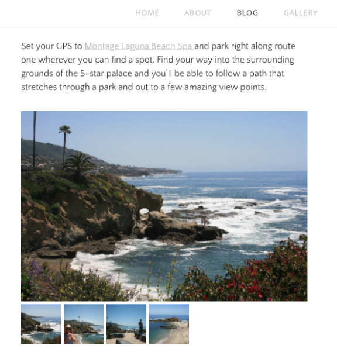
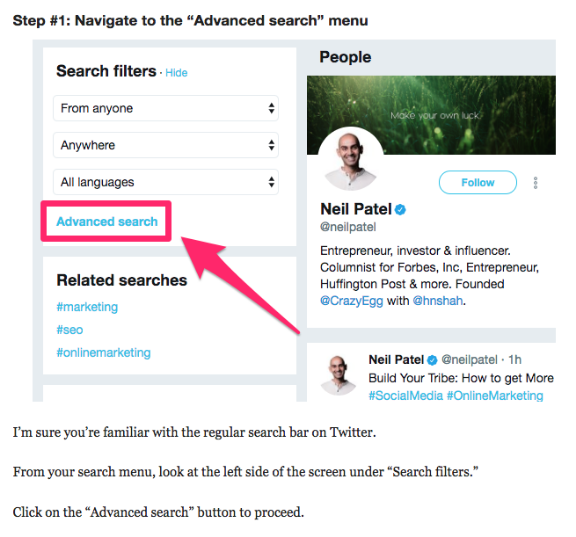
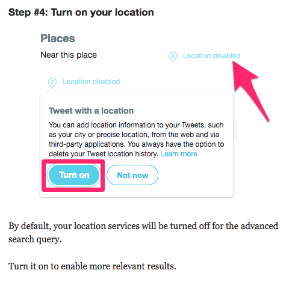
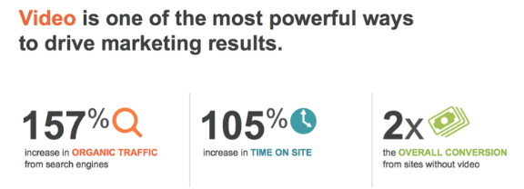
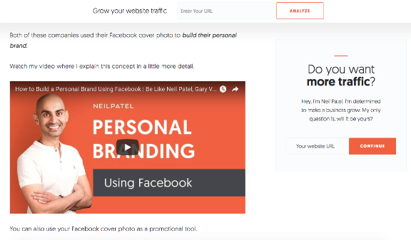

# How to Use Visual Elements to Enhance Your Blog Post’s Engagement

by Neil Patel on April 6, 2018

A picture is worth a thousand words.

This is an ageless English adage I’m sure you’ve heard countless times throughout your life. It’s a simple concept. In short, it means that it’s easier to show someone something than to tell them about it.

But are you applying this strategy to your blog posts? Blogging is a science.

There are lots of tips and tricks you can learn to engage with your audience, such as [mastering the art of storytelling](https://www.quicksprout.com/2017/12/22/how-to-increase-sales-by-mastering-the-art-of-storytelling/). However, words alone won’t drive engagement.

You’ll need to learn how to incorporate visual elements into your blog posts as well. If you’ve been reading my blogs for a while, you know I practice what I preach.

I love using visuals to help improve my content. To those of you who are not used to this, it can sound intimidating.

Where do you start? How many visuals should I include? What visuals are acceptable?

These are all valid questions that I can answer for you. Use this guide as a reference for adding visual content to your blog posts. Here’s what you need to know.

### **Understand how people read your blog**

You can be the best writer in the world, but the reality is people aren’t going to read your content word for word. It’s a fact you need to accept right now.

According to a recent study, people read only [20% of your content](https://econsultancy.com/blog/66920-why-visitors-only-read-20-of-your-web-page) on a page.

Let that sink in for a moment. [Research shows](https://blog.bufferapp.com/the-ideal-length-of-everything-online-according-to-science) that the optimal blog post will take someone about seven minutes to read:

Typically, seven minutes translates to about 1,600 words, assuming that each word is read (which we already know isn’t the case).

If your blog post is 1,600 words and only 20% of it gets read, that means visitors are digesting only about 320 words of your content.

What does this information tell you? Simply put, people are scanning your posts.

That means your writing style needs to be adjusted accordingly if you want to increase engagement. Get rid of lengthy paragraphs and large blocks of text. That’s difficult for people to scan.

Instead, use short sentences and stick to paragraphs a few lines long at the most.

*Add visuals to break up the content.*

Visual elements jump off the page. If someone is scanning through your blog post, they’ll likely stop at the images. They’ll skim the first few lines before and after the picture to digest your points of emphasis.

Be consistent, and establish a pattern with your visuals.

For example, let’s say you wrote a blog post 3,000 words long. You’ve got an image every 300 words or so for the first 1,000 words of the post.

But then you don’t include any more images until the final few paragraphs. That’s a mistake because, as you now know, people scan.

They’ll stop at your images. If they get into a rhythm of scrolling until they see a picture, they’ll scroll through the majority of your content without stopping if you have such a large gap between visual elements.

Take a look at the elements included in a [typical blog post:](http://www.marketingprofs.com/charts/2016/31137/blogging-benchmarks-writing-time-post-length-and-media-use)

As you can see, the majority of posts include an image. But that percentage drops significantly for blog posts with more than one image.

You can separate yourself from the crowd by adding lots of visuals to your posts. As you continue reading through this guide, I’ll explain which types of visual content create the most engagement.

### **Create infographics**

As you can see from the images I’ve used so far in this blog post, graphs are a great way to emphasize a point. There are a few reasons for this.

For starters, they help validate the message you’re trying to convey. Graphs also help make your blog posts more legitimate.

This shows your audience you’re not making up facts. You’ve done the research and used data from high-quality sources.

Another reason why you should use graphs is because they help people retain information.

[Studies suggest](http://www.brainrules.net/vision) people remember only 10% of information they heard three days before. But if there is an image associated with that information, three days later, people are able to retain 65% of the information.

You want people to remember what you’re telling them. This will definitely boost your engagement.

Instead of just using graphs and statistical data from sources on the web, you can create original infographics for your blog posts.

Try using free online resources, such as [Canva](https://www.canva.com/create/infographics/), to design your infographics.

The platform is very simple and easy to use. You don’t need to have any design skills for that.

Infographics are great if your blog posts are focusing on some kind of research you conducted. The best part about producing original infographics is they can drive more traffic to your website.

Remember I talked about sourcing quality information from the Internet? Well, you’re not the only person doing it.

Other bloggers also want to add high-quality resources and visual elements to back up their statements. When they are researching a particular topic, they might find your infographics.

They’ll cite your website as the source whenever they use your infographics in their content.

Those reference links will drive more traffic to your website. Plus, having more inbound links also helps [improve your SEO ranking](https://www.quicksprout.com/2018/03/14/how-to-optimize-your-mobile-website-for-google-searches/).

### **Use original photos**

You want your content to be as unique as possible. Obviously, this isn’t something that’s always 100% possible in today’s digital era. Chances are, someone else has blogged about a similar topic.

If you’re using a chart or infographic you didn’t create, other bloggers have used it too. That’s OK.

However, if you want to be creative, you can add original photographs to your content as well. This will help separate your post from those of your competition.

Original content is like a breath of fresh air. Readers will feel the same way. If you’re into photography, you can pair that skill with your blogging platform.

Here’s a great example from the [Sets in the West](http://www.setsinthewestblog.com/blog/june-20th-2017) blog:

These blog posts are written for people who want to explore California. The author talks about her personal experiences in different areas and adds original photos.

Sure, you could just browse through Google images of professional photos of different places. But they won’t have that air of authenticity as the pictures you take yourself will.

This also relates to validation: your audience will know you have actually had a firsthand experience with the topic you are writing about.

As your infographics, these original photos can end up driving more traffic to your website. If other people use them, you’ll get a credit as the reference link.

But what if you don’t have a fancy camera and don’t have any photography experience?

No problem. You can still learn [how to take and edit photos without hiring a professional](https://www.quicksprout.com/2017/12/29/how-to-take-and-edit-photos-without-hiring-a-professional/).

I’m sure your smartphone has a decent camera. You’ll just need to learn some basic photography skills, and you’re good to go.

Get out there, and start snapping some photos. This will help you get more engagement on your blog.

### **Annonate screenshots**

Another way to help improve engagement on your blog posts is by showing people how to do something. Think about how people are searching for topics on the Internet.

If your posts include “how-to” guides or things of that nature, you’ll definitely want to include visual elements to illustrate your points or steps you are describing.

It’s not easy to explain how to do something. But taking screenshots on your computer and marking them up with arrows, boxes, circles, and/or text can enhance your readers’ learning.

For example, take a look at this recent blog post I wrote about [generating leads on Twitter:](https://www.quicksprout.com/2017/10/30/everything-you-need-to-know-about-generating-leads-on-twitter/)

In this section of the post, I’m explaining how people can use the Twitter advanced search query as a tool to generate leads.

Rather than saying, “Click on the advanced search button,” I show my audience where the button is located along with some text explaining where to find the button on the page.

Here’s another example from that same blog post:

I’m using the same approach in this step. Instead of just saying, “Turn on your location,” I annotate the screenshot so it’s obvious what needs to be done.

I’m sure your computer has some screenshot editing software, but I like to use [Skitch](https://evernote.com/products/skitch) to annotate my content.

It’s free to download and use, so give it a try if you’re looking for something new.

### **Add videos**

For the most part, I’ve been talking about different types of pictures as visual elements to enhance your blogs. But that’s not the only type of visuals that can be used.

You can add videos to your blog posts as well.

Take a look at your analytics to see how long website visitors are staying on a page before leaving. If you want to improve that time, videos can be the solution.

In fact, research shows that videos can increase the [time spent on your page](https://blogs.oracle.com/marketingcloud/video-interactivity-and-personalization-for-effective-engagement) by more than 100%.

The great thing about adding videos to your blog is that it’s really easy to do. You won’t necessarily have to create new video content for this.

Instead, repurpose some of your old videos.

Here’s what I mean. If you have a YouTube channel, I’m sure you have lots of informative video content on this platform.

Anytime you discuss something in a blog post that’s relevant to one of your videos, embed the YouTube video within the blog.

That’s it. This doesn’t require much effort on your part.

Plus, videos help break up your content the same way images do. Here’s an example from a blog post I wrote about [Facebook cover photos:](https://neilpatel.com/blog/facebook-cover-photos/)

As you can see, I embedded a relevant link from my YouTube channel within the blog post.

Here’s another quick tip about how to use videos in your blog.

[Add captions](https://www.3playmedia.com/2016/06/14/7-ways-video-transcripts-captions-improve-seo/). Captions increase views by 40%. Furthermore, if a video has captions, people are much more likely (an 80% increase) watch it in its entirety.

### **Conclusion**

If you want to increase engagement on your blog posts, start by adding more visual elements to the page.

It’s important for you to understand how your audience is consuming your content. They aren’t reading each word on the page. Instead, they’re skimming through it.

Visuals give your readers a chance to stop and digest your points.

Mix it up. There are plenty of different types of visuals you can use in the same post to drive engagement.

Add graphs, charts, and custom infographics. Take original photographs. Annotate screenshots. Include relevant videos.

These changes will help bring your blog to the next level.

*What types of visual elements are you using to increase engagement on your blog posts?*

Measure

Measure
