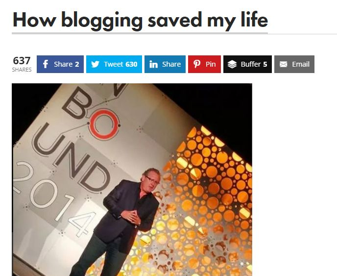
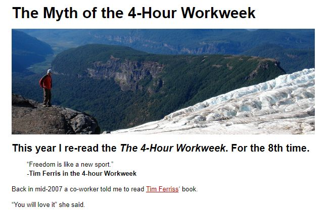
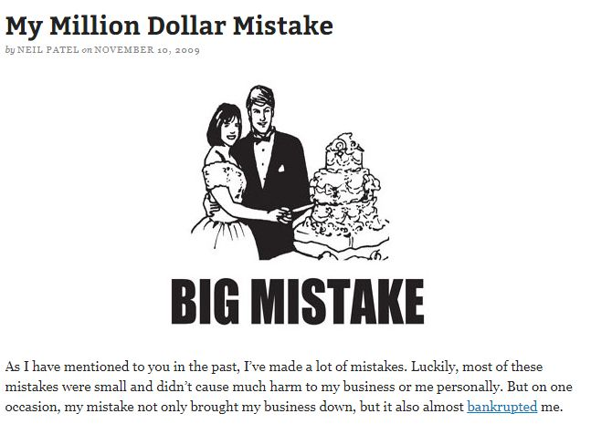
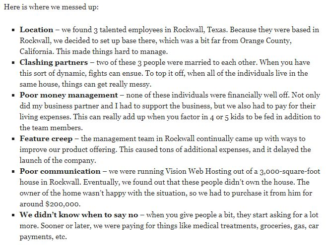
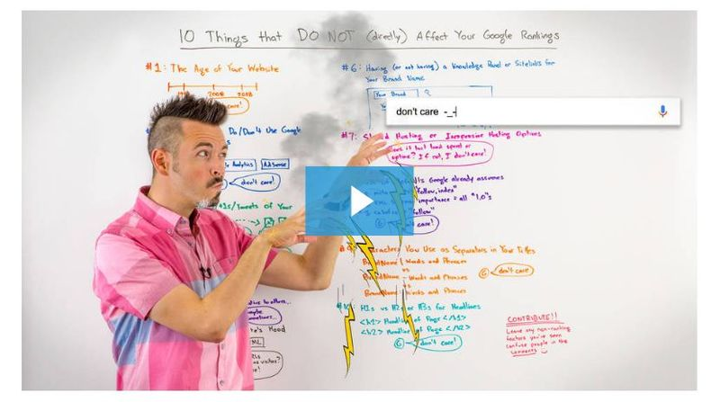

# The 5 Best-Written Blog Post Examples Ever

The blogging boom shows no sign of abating. Ever since the very first blog was created [in 1994](http://nymag.com/news/media/15971/), the landscape has shifted and evolved dramatically. The rise of services like Postach.io, Medium, and Tumblr makes it tricky to work out exactly how many blogs there are.

The best estimate is that there are at least [440 million blogs](http://mediakix.com/2017/09/how-many-blogs-are-there-in-the-world/#gs.rPt4QKI) around the world, but the real figure is likely to be far higher.

What we do know is that around [5 million blog posts](http://www.worldometers.info/blogs/) are published per day. That’s nearly 58 posts a second.

Therefore, blogging presents both an opportunity and a challenge. A quick search on Google will reveal stories of how people make millions of dollars from blogs. The reality is that to achieve those lofty heights you will need talent, along with a healthy dose of luck.

The competition is fierce, and you need to consider different factors to make your blog stand out, including:

- Design: Is the design of your blog attractive to your readers? Does it complement the blog or does it distract from the content? It needs to be up to date and fresh. There are many blogs whose design and layout haven’t been updated for a decade and, well, you can tell.
- Title: Your title should be relevant, memorable, and catchy. Simplicity is key here too, and consider your “brand." What type of audience do you want to attract?
- Content: This is what your readers are coming for - your thoughts, ideas, and news in your posts. Once you have the first two factors ready to go, your focus should be on your content.

Creating high quality, relevant, and engaging content is one of the most important things you need to do with your blog. It will separate you from your competitors and build your reputation within the niche or industry. One of the best ways to learn is to take a look at what other successful bloggers do.

So, we’ve put together an epic list of the best blog posts of all time:

### 1. How Blogging Saved My Life - Mark Schaefer

(Source: [Businessgrow.com](http://businessgrow.com/))

Personal, witty, engaging - Mark Schaefer’s blog post ticks each of the boxes. Even the title grabs your attention.

If [How Blogging Saved My Life](https://www.businessesgrow.com/2014/11/11/speech-will-never-hear/) seems a little dramatic for a title, then you should read the post. The main body of it is a transcript of a speech Mark delivered at a conference. It describes the dark times he endured, going into detail about the various life-changing events.

Divorce, injury, losing friends to illness, and suicide. Throw in starting a new business into the mix, and you get the idea.

Yet Mark still manages to infuse the speech and post with wit and humor. The overall gist is relentlessly optimistic and reassuring. Not everyone will go through the challenges he had to face, but we all go through our own.

This post connects with the readers and finishes off on an encouraging note:

“When you are in the middle of it — as the horrible pain is happening — you can’t possibly know what is ahead. You’re just trying to get through each day.

“But just keep in mind that down the road you will realize that this darkness and pain will become a gift. You can emerge as a new person, you can become something new, something stronger, because you are being awarded a powerful new cape of superpowers of your own."

### 2. The Myth of the 4-Hour Workweek - SpartanTraveler

(Source: [Spartantraveler.com](http://spartantraveler.com/))

The 4 Hour Workweek by Tim Ferriss is so widely read that it could almost be considered as an entrepreneur’s bible. And there are many blog posts that aim to bust the myth that it’s not about working 4 hours a week. SpartanTraveler does it right though.

The writer, Clayton, keeps the format simple and shares his personal take on the lessons he drew from reading the book. The Myth of the 4-Hour Workweek tackles some of the key points the book makes and how it should be applied in real-life.

Though it’s quite long, over 3,500 words, Clayton writes in short, crisp sentences. It’s highly actionable, with most paragraphs drilling home a point or two. The overall argument of the post is that you should use the book to make your business/businesses more productive.

In essence, don’t become lazy.

At the end, Clayton writes out the key lessons again with bullet points - just in case you missed them the first time.

### 3. I Quit Carbs and Sugar and Here is What I learned - Tropical MBA

(Source: [Tropicalmba.com](http://tropicalmba.com/))

Dieting is one of the most popular blogging niches. In a world where everyone seems to be obsessed with what they eat, it’s refreshing to read a straightforward post on the topic.

Dan Andrews took the opportunity to share his experience of [quitting carbs and sugar](http://www.tropicalmba.com/what-i-learned-by-quitting-carbs/). He takes a straight-talking approach; “Quitting carbs isn’t some hack. It’s a freakin’ slog. Pizza is one of humanity’s greatest creations, and staying away from it, and a world of other delicious stuff is almost impossible (almost nobody does it…)"

Using this kind of language and admitting to his temptations enables him to connect with the reader. Most of us will find it hard to resist the lure of our favorite food, whether it’s pizzas, burgers, or cakes. Dan also uses a numbered list to line out the different lessons he learned.

It’s well-written too, and the tone is laced with humor. Once again, the points raised in this post are actionable and attainable for readers.

### 4. My Million Dollar Mistake

(Source: [Quicksprout.com](http://quicksprout.com/))

This list wouldn’t be complete without the inclusion of [Neil Patel](https://neilpatel.com/), the godfather of blogging. His posts have a well-earned reputation for being engaging and informative. “[My Million Dollar Mistake](https://www.quicksprout.com/2009/11/10/my-million-dollar-mistake/)" is a great example of Neil’s talent for writing.

The post focuses on the story of one of his business failures which cost him, you guessed it, a million dollars. Neil then deconstructs the events that occurred around it and points out the mistakes the business made. He does this by using bullet points so the reader can clearly understand the message:

(Source: [Quicksprout.com](http://quicksprout.com/))

Neil also refrains from using emotional language, resulting in a coherent, relevant post with readers being able to take away key lessons.

There’s also a running theme here: time and money. The startup eventually ran out of both key resources. Despite this, the conclusion at the end is a positive one:

“Although I hope you won’t make big mistakes like I have made, chances are you will. But what separates the true entrepreneurs from the phony ones is that true entrepreneurs don’t give up."

### 5. 10 Things That DO NOT (Directly) Affect Your Google Rankings - Whiteboard Friday at Moz

(Source: [Moz.com](https://moz.com/))

Rand Fishkin’s Whiteboard Friday is full of so many excellent posts that it’s hard to pick one. In the end, we followed Moz’s own rankings and picked its best post from 2017. What sets these posts apart from its competitors is the [highly engaging video](https://moz.com/blog/10-things-do-not-affect-rankings) in which Rand presents each week. Moz also publishes a transcript, complete with images.

This style of post, which flips the common “How to" format for a list of “Don’ts," makes the content more memorable and challenges common misconceptions, making it stimulating for readers.

SEO can be daunting for many of us, and there are plenty of misunderstandings on the topic. As Rand says in his video:

“So it turns out lots of people have this idea that anything and everything that you do with your website or on the web could have an impact. Well, some things have an indirect impact and maybe even a few of these do. I'll talk through those. But tons and tons of things that you do don't directly affect your Google rankings. So I'll try and walk through some of these that I've heard or seen questions about, especially in the recent past."

By saying “lots of people," Rand makes the reader feel they’re not alone in struggling with SEO. The personalized tone is also evident with references to questions he’s seen and the word “you."

The post structure is easy to follow, with each section separated with headers and short paragraphs. There’s also a downloadable image of the whiteboard which we can see behind Rand.

Individuals each have their own preferences in how to digest information. By providing so many different formats in one post, Moz is catering to a wide section of its audience, if not all.

### Conclusion

There are many other excellent blog posts out there, but these five are among the very best. Why? Each has these factors in common:

- Expertise: All five of the posts have been written by highly knowledgeable individuals who are leaders in their field.
- Passion: The writers are evidently passionate about what they do, and this carries through to the readers.
- Simplicity: The posts aren’t trying to do too much. They’re all focused on the topic at hand and delivering useful, informative content.
- Personal: Describing your personal experiences enables your readers to relate to the points you make in your post. It’s more convincing if the reader knows you have personally experienced the situations you write about.
- Structure: This matters. Things like short paragraphs, bullet points, and headings all affect the readability of your posts. Do it right, and your readers can get all the key points by skimming through your content.

Being knowledgeable and passionate about your topics is crucial. Blogging is not always easy, and it’s the passion that will get you through the challenging times. The knowledge will help you to create epic posts that your audience will want to read and keep them coming back for more.

For each post, it’s important to maintain a focus. Trying to write too much and simply doing a “brain dump" can be tempting but it will result in hard-to-follow content. Remember to structure your posts clearly with sub-headings and short paragraphs. No one wants to read a wall of text.

By following these key lessons, you will be able to create engaging, relevant content that entertains and informs your readers.
