# [Blogging Wizard](https://bloggingwizard.com/)

- [About](https://bloggingwizard.com/about/)
- [Blog](https://bloggingwizard.com/)
- [Start A Blog](https://bloggingwizard.com/how-to-start-a-blog/)
- [Tools](https://bloggingwizard.com/blogging-tools-pdf)
- [• • •](https://bloggingwizard.com/pinterest-traffic/#)

## How To Drive 3x More Traffic To Your Blog With Pinterest

by [Elna Cain](https://bloggingwizard.com/author/elnac/) — Get updates of new posts here

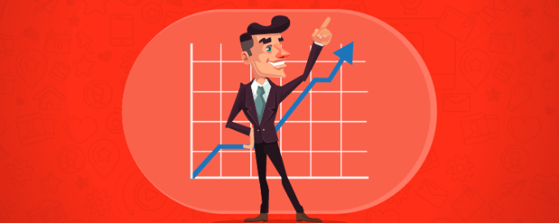

How many of you think Pinterest is only a place for women to share their latest recipe or DIY project?

If the top [30 Pinners](http://techland.time.com/2013/09/04/30-pinners-to-follow-2013/slide/all/) are food, fashion, design, and wedding bloggers, it’s safe to say it’s a scrapbooking paradise for women.

So, it’s easy to push this visual search engine under the rug because you think this platform isn’t for you.

But, if some of the biggest brands – [Wal-Mart](https://www.pinterest.com/walmart/), [Apple](https://www.pinterest.com/AAPL/), and [Lowe’s](https://www.pinterest.com/lowes/) – are staking Pinterest ground for their marketing efforts, it seems there’s enough room for the bloggers, start-ups, and entrepreneurs to give pins, repins and group boards a try.

There’s power behind using Pinterest to drive traffic to your blog. Just take a look at these astounding facts:

- •A pin is [100 times](https://blog.kissmetrics.com/ultimate-pinterest-marketing-guide/) more spreadable than your average tweet
- •Each pin can drive up to [2 page visits and 6 pageviews](http://searchenginewatch.com/sew/news/2308290/1-pinterest-pin-2-site-visits-6-pageviews-78-cents)
- •Ecommerce sites benefit from pinning as each pin can generate [78 cents](http://searchenginewatch.com/sew/news/2308290/1-pinterest-pin-2-site-visits-6-pageviews-78-cents)
- •The [life of a pin](http://blog.tailwindapp.com/cross-promotion-pinterest-following/) is one week! Compare that to [24 minutes](http://blog.wisemetrics.com/tweet-isbillion-time-shorter-than-carbon14/) for Twitter and [90 minutes](http://blog.wisemetrics.com/tweet-isbillion-time-shorter-than-carbon14/) for Facebook.

And don’t think because you’re in the blogging, tech or marketing industry you can’t make an impact on Pinterest. Look at Pauline Cabrera of [Twelveskip](http://www.twelveskip.com/) or Sue Anne Dunlevie of [Successful Blogging](http://www.successfulblogging.com/). Pinterest is their number one referral source for social traffic.

So, how can you create more traction from Pinterest? Here are five tactics you can use to elevate your pinning strategy and bring on the traffic.

## 1. Sign up for a business account

To really see an impact in your pinning efforts, go ahead and sign up for a free [Pinterest for business account](https://business.pinterest.com/en) or convert your existing account.

When you sign up, you’ll have access to [Pinterest analytics](https://blog.kissmetrics.com/pinterest-analytics/) – important information about your pins’ behavior – once you [verify](https://help.pinterest.com/en/articles/confirm-your-website) your website with Pinterest.

You can also apply for [Rich Pins](https://business.pinterest.com/en/rich-pins), which are pins with more information than your standard pin. There are five different types – movie, article, product, app, recipe, and place – each with their own pin upgrades such as real-time pricing and a direct link to your site.

Article pins are valuable for bloggers since you can promote your latest blog post with your logo, bigger headline and a link back to your site. And it’s easy to set up with WordPress plugins like [Yoast SEO](https://wordpress.org/plugins/wordpress-seo/), since Pinterest uses the Facebook Open Graph metadata.

Ensure Open Graph is enabled on your blog and then [validate](https://developers.pinterest.com/docs/rich-pins/validator/) your site with Pinterest.

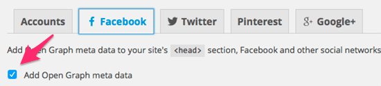

Pinterest reviews your site and will contact you to let you know if you’ve been approved.

Additional features that can help you with your pinning strategy are:

- •Pinterest Guides – Pinterest offers [guides](https://business.pinterest.com/en/pinterest-guides) to help you get started with pinning, analytics and optimizing your boards.
- •Marketing Blog – learn specific [marketing tips](https://business.pinterest.com/en/blog/4-tips-driving-online-sales) for this platform and stay up-to-date with the latest Pinterest news.
- •Video Library – catch mini tutorial [videos](https://business.pinterest.com/en/) about creating click-worthy Pins or how to optimize your campaign, plus much more.
- •Tools – in addition to Rich Pins, you have an arsenal of pin [tools](https://business.pinterest.com/en/tools) to help reach more people. From Promoted Pins to the Pin It button, you can make it easy for visitors to find you and pin your content.

## 2. Focus on your copy description

Each pin has a description below it telling the reader what your pin is about. Typically, for bloggers, your blog title and a little description of your post should be enough.

But, to really maximize your pin’s potential, you have to do more than that. According to Pinterest’s data of over 10,000 pins, they discovered what makes a great pin.

For high engagement your pin needs to be:

- •Helpful – make it easy for pinners to find your pin with a spot-on description. According to Pinterest, helpful pins receive 30% more engagement.
- •Detailed – in a sentence or two explain what your pin is about. Give enough information to entice a pinner to click through to your blog.
- •Interesting – draw on the emotions of the pinner by using sensory-related words and positive sentiments.
- •Actionable – include a call-to-action in your description. Using phrases like, “check out…” or “click to find out more” can generate an [80% increase](http://brandongaille.com/17-pinterest-marketing-tips-for-restaurants/) in engagement.

*(Note: Pinterest’s article on what makes a great pin is no-longer available.)*

What it ends up looking like, is this:

~~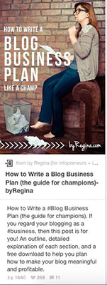~~

And for an added pop and to make your pin more descriptive, add text to your image.

Finally, to really promote and market your content, remember to incorporate [SEO-friendly keywords](https://bloggingwizard.com/keyword-research-tools/) in your description and be as concise as possible. It’s been shown that pins with descriptions of 200 characters are the most repinnable. It also doesn’t hurt to add relevant hashtags to your pin’s descriptions.

## 3. Pin at the right time

This is all a numbers game. Hundreds of pins are shown on Pinterest every hour of every day.

How can you get your pins to shine the brightest? What you want in your Pinterest marketing strategy is to have the most repins. You want as many people as possible to repin your material so that it’s shown more frequently to new users.

The most successful strategy is to find the best time and day to pin. Naturally, you’d want to pin when your target audience is on Pinterest.

From analyzing the [data](http://blog.hubspot.com/marketing/best-times-post-pin-tweet-social-media-infographic), it looks like the best time to start pinning is on Saturday morning. The peak time – for fashion and retail – is Friday after 3 pm.

And the worst time to pin is during normal working hours – which makes sense.

But, if you want to target your audience you may want to go a step further and look at where your audience comes from and how they spend their time on Pinterest.

You can quickly find out your audience’s demographics from Pinterest analytics.

This can help you paint a better picture on what time to pin to reach your target audience.

To see how often pinners are actually engaging on Pinterest, according to a recent study by [PewReserachCenter](http://www.pewinternet.org/2015/01/09/frequency-of-social-media-use-2/), up to 17% of users visit the site daily. Close to 9% of users visit Pinterest several times a day.

Almost 52% of people visit the site less than once a week. So, to reach most of your audience, you need to be pinning consistently, but don’t overdo it.

It’s an awful pinning policy to over-pin your material. The best strategy is to pin content you know your audience will like and find useful. Try to abide by [Pareto’s 80/20 rule](http://www.entrepreneurs-journey.com/397/80-20-rule-pareto-principle/) – share 80% of others’ material and only 20% of your own material.

## 4. Create pin-worthy images

What makes Pinterest so alluring and addicting is the images bloggers pin. It isn’t enough to just use any image. The best images are optimized for maximum engagement.

So, what makes a pinntastic photo? Let’s look at three core areas to focus when creating a pinnable image.

### 1. It has to be the right size

You know Pinterest favors vertical images. Since up to [80%](http://venturebeat.com/2015/03/31/80-percent-of-pinterests-traffic-comes-from-mobile-devices/) of pinners view the Pinterest feeds on mobile devices, it just makes sense to use images that are more tall than wide.

So, what is the perfect size for a pin? Generally you want an aspect ratio of [2:3 or 4:5](http://www.digitaltrends.com/social-media/this-is-the-recipe-for-the-perfect-pinterest-photo/). For example, if you have an image with a width of 650, your minimum height should be 975. For the best pin, though longer is better, overall.

Pins that are long are more favorable on Pinterest since they take up more room on the feed, making it hard to pass.

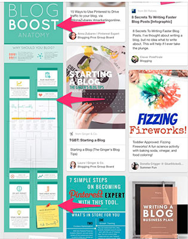

### 2. The image is stunning

The image you use for your blog post has to be amazing. Many studies have been done on [what makes a great pin](http://www.digitaltrends.com/social-media/this-is-the-recipe-for-the-perfect-pinterest-photo/) and a startup called [Curalate](http://www.curalate.com/) found several attributes that are common with the best pins out there.

In fact, [Paula Dean’s pin](http://www.pauladeen.com/zesty-cucumber-salad) for her cucumber, onion and tomato salad is considered the [epitome](http://www.wired.com/2013/06/this-is-the-perfect-pinterest-picture/) of the perfect Pinterest image.

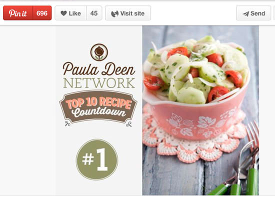

So, what’s so perfect about it?

- •There are no faces – images without a human face receive [23% more repins](http://www.wired.com/2013/06/this-is-the-perfect-pinterest-picture/). Pinners enjoy looking at things more than they do at faces.
- •Vibrant colors – Paula’s pin works so well because there are multiple vibrant colors in her image – limes, pinks, reds – the attract pinners to share.
- •Contextual background – simple and plain white background images only [receive a quarter](http://www.digitaltrends.com/social-media/this-is-the-recipe-for-the-perfect-pinterest-photo/) of repins. If you want more pins, choose a background that adds to your overall image. In Paula’s picture, her salad bowl is sitting on top of a wooden picnic table, which makes sense to pinners looking at the image.
- •Includes red tones – Images with predominantly reds, oranges or pinks get up to [twice as many repins](http://njsldirect.org/how-to-take-better-photos-for-pinterest/) than images with more blue tones in them.
- •Lightness – images with more lightness to them perform [20 times better](http://njsldirect.org/how-to-take-better-photos-for-pinterest/) than darker images.

Pinterest also has their own guide to creating better pins. They suggest the following:

- •Keep branding and logo to a minimal – Pinterest suggests being tasteful with your branding. You want to add credibility to your pin, not take away from what you are pinning. So, make your brand logo – if it’s included in your image – big enough to see in a grid view on your mobile phone.
- •Use high-quality images – great pins use professional looking, high-resolution photos and graphics.
- •Keep it simple, Simon – keep your images focused on an apparent theme. Avoid having an assortment of random objects or products.

*(Note: link to Pinterest’s guide is no-longer available).*

### 3. Include text in your image

If you want your pin to draw attention and generate traffic back to your blog, it’s a great idea to start adding text to your image.

It not only looks more professional – [if done right](https://bloggingwizard.com/add-text-blog-images-pro/) – it helps the pinner know exactly what your pin is about, quickly and at a glance.

Just take a look at how this Pinterest feed is more dynamic and enticing:

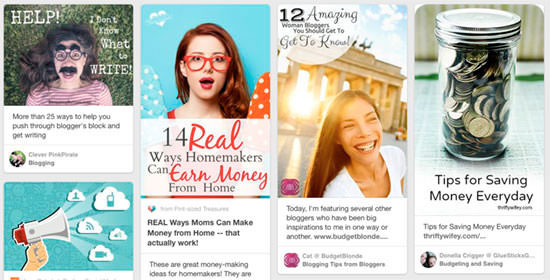

And, now let’s look at how this feed has no text in their pins and how easily you can skim past them without really seeing these pins.

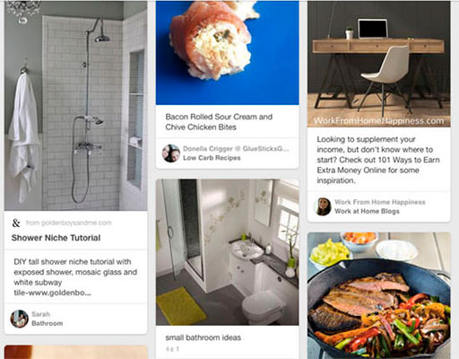

It’s easy nowadays to include text in your images. There are [free image editing tools](https://bloggingwizard.com/image-editing-tools-for-bloggers/) like [PicMonkey](http://www.picmonkey.com/) and [Canva](https://www.canva.com/) that make it easy for anyone to add text in their images.

You can also purchase [Adobe Photoshop](http://www.adobe.com/products/photoshop.html) if you want more choices and tools to make your images pop. They have an affordable monthly plan and [video tutorials](https://helpx.adobe.com/photoshop/tutorials.html) to help you too.

And, if you don’t know where to find free fonts, a good place to start is [Google Fonts](https://www.google.com/fonts). You can’t go wrong there! For more help, The Branded Solopreneur has a fantastic blog post on the [beginner’s guide to using fonts effectively](http://thebrandedsolopreneur.com/fonts-done-right/) to help you achieve an amazing pin.

## 5. Join a Pinterest group board

[Pinterest group boards](http://madlemmings.com/2014/04/28/pinterest-group-boards/) are perfect for generating more traction to your blog. A group board – if popular – is a community board where other pinners can pin. They are extremely popular and can give you more exposure.

By joining a community board, you can [quickly grow your follower base](https://bloggingwizard.com/how-to-get-more-pinterest-followers/). If you regularly pin to a group board, other people who follow the board will see your pins and might be interested in your Pinterest board. If they like what they see, they will follow you.

In your Pinterest homepage, your group boards look like this:

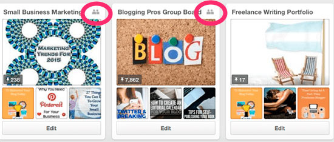

There’s a people icon on the right-hand side of your board. This tells you it’s a group board.

So, how do you find group boards? The easiest way is to search on [PinGroupie](http://pingroupie.com/?cat=&order=collaborators&sort=desc&tq=&dq=blogging). Just search for a keyword – blogging for example – and see what’s out there.

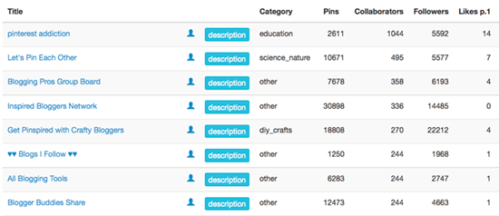

There are several ways to join a group board:

- •Get to know the creator of the group board – start pinning their content and open a dialogue with the creator. Pinterest isn’t only for pinning, you can develop a strong network by commenting on pins.

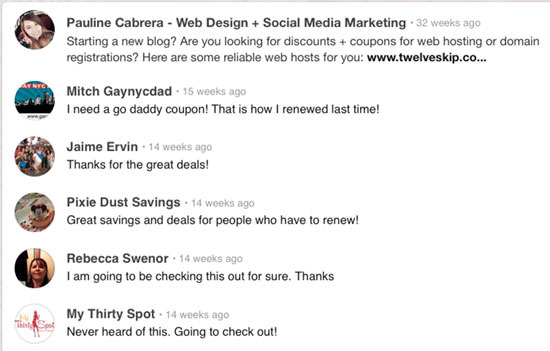

You can also visit the creator’s blog and leave comments there. These gestures will help the creator know who you are and trust you when you eventually contact them to join their Pinterest board.

- •Check for invite instructions – some group boards have instructions in their description. It may be as simple as emailing the group’s creator, or you may have to leave a response on one of their pins. Just remember to be courteous and explain why you want to join.
- •Get invited by a group member – as a group member, you can invite others – as long it’s allowed in that particular group.

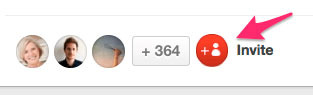

If you want to create a group board, there are two ways to go about it.

1. 1Create a new board as normal, but instead of skipping over, “collaborators,” now you can add other pinners by their name or email address.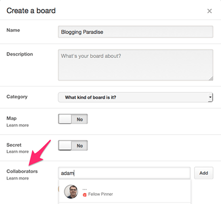
2. 2Create group boards from an existing board. You can invite other pinners or bloggers to your existing board.

## 6. Increase your Pinterest traction with the Social Warfare Pro plugin

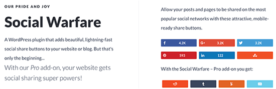

If you’re running WordPress you likely know of – and use – many helpful plugins to make your blogging life easier.

Easy is good of course, but when it comes down to it, aren’t we really after one main thing: more traffic?

By using the [Social Warfare Pro](https://bloggingwizard.com/go/social-warfare/ "social-warfare") plugin and a few of its unique Pinterest-specific features, you can grow your presence on Pinterest and in turn, increase your reach and traffic considerably.

Social Warfare at its core is a social sharing plugin, so if you’re running another social sharing plugin like Sumo or Shareaholic, you’ll first want to deactivate it from inside your WordPress backend.

Once you download, install and activate the Social Warfare Pro plugin, head over to the *Display* tab and be sure to include the Pinterest button in your active set. I like to include Facebook, Pinterest, and Twitter, but if you’re in a B2B niche, you might want to include LinkedIn as well. Keep it lean, though, as the last thing you want to do is overwhelm visitors with too many choices.

Next, when it comes to positioning, many people find placing the social share buttons at the [bottom of each post](https://www.simplepinmedia.com/using-social-warfare-increase-pinterest-shares/), along with a floating bar along the side, works well to promote social sharing without being too intrusive.

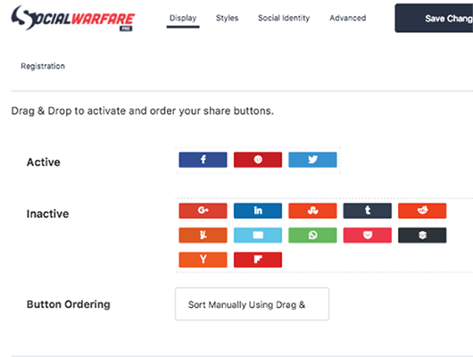

Have you ever been to a blog, clicked the Pinterest Save button that appears when you hover over an image and been presented with a popup listing every image on the page?

Remember what we said about giving the visitor too many choices?

To really start gaining some traction on Pinterest, be sure to turn on Social Warfare’s *Pinit Button* feature. When a visitor hovers over an image in your blog post, a red *Save* button will appear and when clicked, takes the visitor to straight to Pinterest to share only that image.

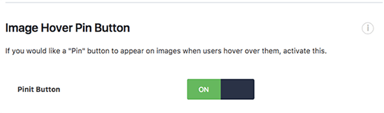

Now to the part where Social Warfare really shines. When you’re creating a post or page in the WordPress post editor backend – or editing an existing one – you can set post-specific options under the *Social Warfare Custom Options* section.

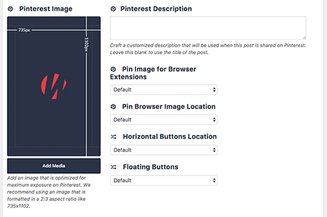

This is where you upload your carefully crafted Pinterest image and create your optimized Pinterest description. Whenever someone clicks on the social sharing button, they are taken directly to Pinterest with the image and description already in place – ready to pin.

Lastly, under the *Social Warfare* > *Advanced* tab, you can set a number of global Pinterest options such as telling Social Warfare to use your feature image as a fallback when you don’t add a Pinterest-specific image to a particular post. You can select the option to have your Pinterest-specific post image automatically inserted into your post, or remain hidden and come up when a visitor is using the Pinterest browser extension.

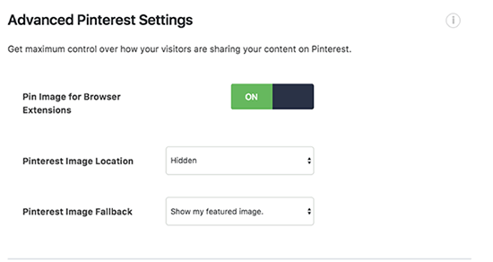

By putting in the extra effort to create a Pin image and description for each post, you can influence what gets shared on Pinterest by your visitors – allowing you to target only the most optimized imagery and keywords.

[Social Warfare](https://bloggingwizard.com/go/social-warfare/ "social-warfare") does come in a free version, but most of the important Pinterest features are only available in the Pro version. Pro pricing ranges from $29/year for a single site, to $250/year for use on up to 10 websites.

## Wrapping it up

Pinterest was the [fastest growing](https://www.globalwebindex.net/blog/pinterest-was-the-fastest-growing-social-network-in-2014) social network in 2014 and growth is still going strong. It’s safe to say it isn’t going anywhere anytime soon.

For bloggers, it can be a great playground to test your image-making skills and marketing skills. To really see results from Pinterest – clicks back to your site – try using these steps:

- •Sign up for a business account
- •Pay attention to your description copy
- •Learn the right time and day to pin
- •Create sensational pin images
- •Collaborate on a group board

**Related reading:**

- •[The Only Tools You Need To Dominate On Pinterest (And Drive Thousands Of Visitors)](https://bloggingwizard.com/pinterest-tools/).
- •[8 Social Media Management Tools To Save You Time](https://bloggingwizard.com/best-social-media-management-tools/)

[initialinitialinitial*s*initial Tweet](https://twitter.com/share?original_referer=/&text=How+To+Drive+3x+More+Traffic+To+Your+Blog+With+Pinterest&url=https://bloggingwizard.com/pinterest-traffic/&via=bloggingwizard)

[initialinitialinitial*j*initial Share](https://www.facebook.com/share.php?u=https%3A%2F%2Fbloggingwizard.com%2Fpinterest-traffic%2F)

initialinitialinitial*b*initial Pin

[initialinitialinitial*C*initial Flip](https://share.flipboard.com/bookmarklet/popout?v=2&title=Tools%20-%20Flipboard&url=https%3A%2F%2Fbloggingwizard.com%2Fpinterest-traffic%2F)

oinitialinitialShares 1,4K

### Elna Cain

Elna Cain is a [freelance writer](http://innovativeink.ca/) who offers ghostwriting, copywriting and blogging services. She works closely with B2C and B2B businesses providing digital marketing content that gains social media attention and increases their search engine visibility. Check out her new free email course for bloggers and writers, [Get Paid to Write Online](http://elnacain.com/get-paid-write-online/).

### Want to grow your blog 425% faster?

Newsletter subscribers get FREE access to 15+ guides, templates & checklists to accelerate your blog's growth.

[Yes, I'm In!](https://bloggingwizard.com/pinterest-traffic/#afterpost-optin-inline)

Includes Email Updates. Unsubscribe Anytime.

### [17 Easy Ways To Boost Your Pinterest Following](https://bloggingwizard.com/how-to-get-more-pinterest-followers/)

- [Previous PostPrevious](https://bloggingwizard.com/pinterest-traffic/#previous-post)
- [Popular PostPopular](https://bloggingwizard.com/pinterest-traffic/#related-post)
- [NextNext Post](https://bloggingwizard.com/pinterest-traffic/#next-post)

Copyright © 2018 Blogging Wizard · [Hosted by WPX Hosting](https://bloggingwizard.com/go/wpx-hosting/ "wpx-hosting") · Powered by [Growtheme](https://bloggingwizard.com/go/growtheme/ "growtheme")

- [Disclosure](https://bloggingwizard.com/disclosure/)
- [Privacy](https://bloggingwizard.com/privacy-and-cookies/)
- [Terms](https://bloggingwizard.com/terms-service/)
- [Cookies](https://bloggingwizard.com/cookie-policy/)
- [• • •](https://bloggingwizard.com/pinterest-traffic/#)

initial1,4Kinitial Shares

[initialinitialinitial*s*initial Tweet](https://twitter.com/share?original_referer=/&text=How+To+Drive+3x+More+Traffic+To+Your+Blog+With+Pinterest&url=https://bloggingwizard.com/pinterest-traffic/&via=bloggingwizard)

[initialinitialinitial*j*initial Share](https://www.facebook.com/share.php?u=https%3A%2F%2Fbloggingwizard.com%2Fpinterest-traffic%2F)

initialinitialinitial*b*initial Pin

[initialinitialinitial*C*initial Flip](https://share.flipboard.com/bookmarklet/popout?v=2&title=Tools%20-%20Flipboard&url=https%3A%2F%2Fbloggingwizard.com%2Fpinterest-traffic%2F)
