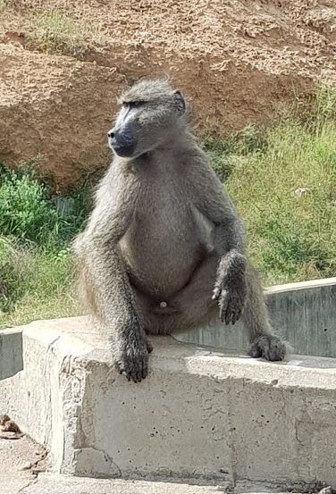
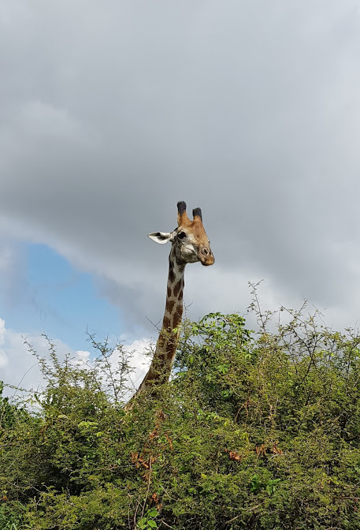
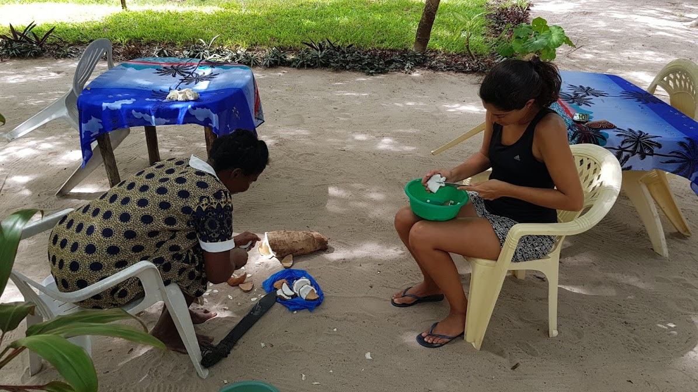
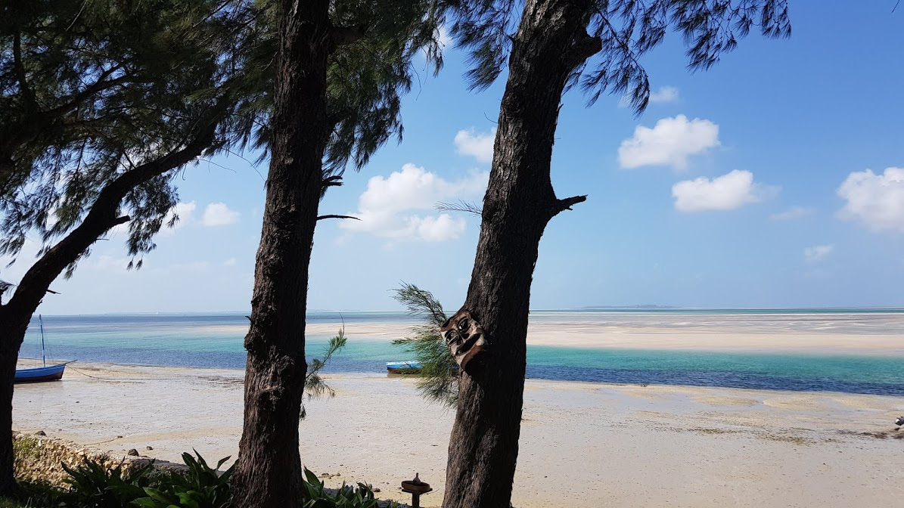

Quanto custa um mês no lugar mais incrível que eu já fui

Pessoas queridas,

Espero que estejam bem por aí!

Antes de entrarmos no tema do dia, deixo dois convites. Primeiro, publiquei o texto [O que aprendi sobre dinheiro jogando videogame](https://amuri.us5.list-manage.com/track/click?u=c0a4fab988b56d015d0db942a&id=49e1090d90&e=6c31fab645), em meu espacinho recém-inaugurado no Valor Investe, dentro do jornal Valor Econômico. É um desafio escrever um texto menor que consiga entregar algo útil, sem depender tanto de grandes explicações, muitos links, imagens, etc. Fiquei feliz com o resultado! Se puderem, me contem o que estão achando. 

Além disso, sigo me preparando para abrir algumas vagas para o Finanças Para Autônomos e para o Dinheiro Sem Medo. Devo fazê-lo em agosto! Caso queira conhecer os dois cursos, venha [por aqui](https://amuri.us5.list-manage.com/track/click?u=c0a4fab988b56d015d0db942a&id=b5e4249c38&e=6c31fab645). E se quiser ser avisado, em primeira mão, é só deixar seu contato [neste link](https://amuri.us5.list-manage.com/track/click?u=c0a4fab988b56d015d0db942a&id=bd58c0dfd9&e=6c31fab645). Estou tentando planejar essa "nova turma" de modo que eu perturbe pouco os que acompanham meu trabalho. Menos emails "de propaganda", menos barulho nas redes sociais. Por isso criei essa [paginazinha](https://amuri.us5.list-manage.com/track/click?u=c0a4fab988b56d015d0db942a&id=3b56a527ee&e=6c31fab645) "me avisa". Ah, mais uma coisa: quase 2000 pessoas estão recebendo um email meu pela primeira vez por conta do Pequeno Manual de Finanças Para Psicólogos! Não imaginei que tanta gente se interessaria pelo livrinho. Sejam bem-vindos! :)

Sem mais delongas, vamos ao texto de hoje.

Quanto custa um mês no lugar mais incrível que eu já fui

Depois de abrir [meus planos para 2019](https://amuri.us5.list-manage.com/track/click?u=c0a4fab988b56d015d0db942a&id=163a1fd7cb&e=6c31fab645), algumas pessoas comentaram que seria interessante se eu comentasse um pouco sobre o aspecto financeiro dessa história toda. Escrevi uma espécie de [raio-x financeiro](https://amuri.us5.list-manage.com/track/click?u=c0a4fab988b56d015d0db942a&id=b3d5f30c8c&e=6c31fab645) e, aparentemente, vocês acharam bastante útil (ou divertido), seja como exercício de planejamento financeiro, seja como referência para pegar a mochila e sair por aí.

Há algumas semanas contei para vocês como havia sido [meu mês financeiro em Maputo](https://amuri.us5.list-manage.com/track/click?u=c0a4fab988b56d015d0db942a&id=650e26fe04&e=6c31fab645), capital de Moçambique, e agora conto um pouquinho da minha jornada no litoral africano. Alguns comentários importantes:

#1 - Os números refletem única e exclusivamente a nossa experiência (minha e da Gabriela, minha companheira). De maneira nenhuma ela serve de base para que entendamos como é a vida da maior parte da população. Esse comentário é especialmente importante quando estamos tratando de países em desenvolvimento, que ainda enfrentam problemas graves de infraestrutura (como é o caso de Moçambique, pano de fundo desse texto) e também será chave para os períodos em que estivermos em cidades cujo custo de vida é bastante alto (Londres ou Nova Iorque, por exemplo). Não enfrentaremos os desafios que um morador de Maputo enfrenta, nem tampouco gastaremos 150 dólares para jantar em Manhattan.

#2 - Os valores citados neste texto compreendem nossos gastos somados. Caso você pretenda viajar sozinho, lembre-se que não basta dividir os números apresentados por aqui por 2. A conta não vai bater por uma série de motivos (um quarto de solteiro não custa metade de um quarto para casal, por exemplo).

#3 - Entenda que essa série de textos (os que passaram, este e os que virão) estão sendo escritos de modo que funcionem como exercícios de planejamento financeiro. É uma maneira de exemplificar conceitos que eu apresento em [meus livros](https://amuri.us5.list-manage.com/track/click?u=c0a4fab988b56d015d0db942a&id=2524b50fde&e=6c31fab645). Eu espero que eles sejam úteis, mesmo que você não esteja planejando uma viagem ou algo assim.

#4 - Estão sendo contemplados por aqui todos os nossos gastos pessoais. Acomodação, shampoo, cerveja, prato de arroz com feijão, ônibus para lá e para cá, tudo isso entra na conta. Por motivos óbvios, não estou colocando na conta os gastos relacionados com minha vida profissional.

#5 - Os textos sempre farão referência a períodos de 30 dias. Neste texto, no caso, comento o mês de abril de 2019, do 01 ao 30.

Um mês no paraíso

Ainda estou experimentando a melhor forma de apresentar essas informações. Por enquanto, me parece que faz bastante sentido trabalhar com grandes blocos – geralmente [o microgerenciamento é uma ideia ruim](https://amuri.us5.list-manage.com/track/click?u=c0a4fab988b56d015d0db942a&id=93f7ab5394&e=6c31fab645). Fiquem à vontade, caso queiram enviar sugestões a respeito da melhor maneira de organizar as informações por aqui.

Acomodação – 505 dólares

O litoral de Moçambique é grande e nós optamos por conhecer “bem” um pedacinho, ao invés de fazer uma grande volta por toda sua extensão. Foi uma decisão feliz, em muitos sentidos, já que viajar rápido é caríssimo. Comentarei sobre isso mais a frente.

Vilankulo, cidade litorânea onde passamos basicamente o mês todo, é uma cidade com certo apelo turístico, por conta da proximidade com o Arquipélago de Bazaruto. Existem muitos resorts extremamente luxuosos (a vila é destino de férias de muitos sul-africanos e europeus). A diária nesses lugares varia de 200 a 1600 dólares (!!!) – existem, obviamente, alternativas mais baratas, mas são exceções. O foco é o turismo de luxo mesmo.

Não é bem nosso perfil. Por conta de uma combinação de sorte e generosidade, acabamos por passar 27 dias na casa de uma amiga querida, que atualmente mora em Maputo. Pagamos aproximadamente 16 dólares por dia. 27 dias, 16 dólares por dia, 432 dólares no total. Algo nada comum para a região.

|  |
| --- |
| f17e8647fe2f884b7d363290b16878e0.jpg |
| Casinha em Vilankulo, no litoral de Moçambique |

|  |
| --- |
| c94ee89b55385c7833b642c5dec3df28.jpg |
| 100 metros da porta, quase no quintal |

Dormimos um dia no Kruger, parque nacional na Africa do Sul, e a diária em safari tent nos custou 47 dólares. E passamos os últimos dois dias do mês em Maputo (13 dólares por dia), nos despedindo dos amigos e dando tchau para a cidade.

Fechando a conta:

27 dias na casinha, em Vilankulo: 432 dólares

1 dia no Kruger: 47 dólares

2 dias em Maputo: 26 dólares

— Acomodação do mês: 505 dólares.

(quase) Todo o resto – 880 dólares

“Meu deus do céu, que consultor financeiro é esse que não sabe o quanto gastou com cada categoriazinha? Não vai ter um esqueminha dizendo que vocês gastaram tanto com comida, tanto com lazer, tanto com tal coisa…?”

Não vai. Durante os últimos 8 anos, eu passei boa parte do meu tempo criando, lapidando, aplicando e propagandeando [maneiras mais saudáveis de se criar um planejamento financeiro](https://amuri.us5.list-manage.com/track/click?u=c0a4fab988b56d015d0db942a&id=095c545655&e=6c31fab645), algo que contraponha essa coisa custosa e quase insuportável de ficar anotando e categorizando gastos, então não faria nenhum sentido eu me dedicar a algo parecido.

Trabalharemos com um valor que engloba a nossa vida por aqui. Contempla a comida, o café, o transporte, o lazer, as coisinhas de casa, enfim, tudo o que não é nossa acomodação. Foi um mês mais caro que o [anterior](https://amuri.us5.list-manage.com/track/click?u=c0a4fab988b56d015d0db942a&id=6cefa4985a&e=6c31fab645), vivido em Maputo.

No total, para além dos gastos com acomodação, gastamos 880 dólares.

Em se tratando de alimentação, a vida na vila, no geral, é barata. São poucas as rotas possíveis:

Opção 1: almoçar nos restaurante simples, frequentados basicamente pela população local, onde você pode comer um peixe pequeno, fresco (realmente fresco, pescado há poucas horas), com batatas e salada por 120 meticais (aproximadamente 8 reais).

Opção 2: cozinhar em casa – é a opção mais barata, e provavelmente a mais saudável, porém a vila carece de opções. É bem difícil encontrar algo além do básico: alface, tomate, cebola, abacate. Com sorte, encontrávamos cenoura e batata, e em um dia mais inspirado encontramos berinjela. Peixe e camarão tem todo dia, em qualquer esquina, e é baratíssimo. Carne de frango e coração de galinha é barato também, com 250 meticais (15 reais) compra-se um quilo.

Opção 3: frequentar os restaurantes dos resorts. São bastante ocidentalizados, encontra-se de tudo: dos camarões imensos, famosos no país, até um steak de carne com dois dedos de altura, passando por risotos, massas, pizzas. Uma refeição, com vinho, gira em torno de 2000 meticais para o casal. Aproximadamente 120 reais. Se quiser algo mais refinadinho, tem também.

Pelo bem da saúde e do bolso, fizemos a maior parte das nossas refeições em casa. Vez ou outra, quando a preguiça batia, recorríamos a opção 1. Foi bem divertido, na verdade, são restaurantes que os turistas não frequentam, então era praticamente certo que passássemos umas boas horas por lá, batendo papo com os locais e dando risada.

A Gabi se empolgou e tentou aprender a cozinhar alguns pratos moçambicanos com a Adélia, que trabalha na casa em que nos hospedamos.

Conhecemos uma turma bem querida por lá, então as refeições em restaurantes foram bem mais frequentes do que de costume. É bem interessante de ver. Nós geralmente cruzamos com pessoas que estão de férias e que, por consequência, estão dispostas a gastar um pouco mais. Não foi um grande problema, acabamos encontrando um meio termo viável, mas foi legal notar como nos tornamos mais permissivos quando as refeições deixam de ser algo mais funcional e se tornam um pequeno evento social.

|  |
| --- |
| 0205ea49d63a3aab58af17b9d8e13cb7.jpg |
| Não tirei nenhuma foto publicável das nossas refeições, mas gosto dessa, onde aparecem todos :) |

Fizemos poucos passeios pagos, porque a praia que ficava a 100 metros da nossa casa era maravilhosa. Isso também é algo interessante de se perceber: existem alguns gastos (ou melhor, alguns fatores) que fazem com que o custo de vida caia. Ficar em uma casa que tem uma boa cozinha, por exemplo, facilita a logística da comida e torna viável gastar menos nos restaurantes (se essa for a proposta).

Eu geralmente guardava um dos períodos do dia (manhã, tarde ou noite) para trabalhar, e tocava o resto da vida nos outros (cozinhar, fazer algum exercício, ler). De passeio caro, foram só dois. Uma viagem de um dia para Bazaruto (a foto que encabeça este post é de lá, e custou 80 dólares por pessoa), e outra viagem, também de um dia, para as “red dunes”, para assistir o por do sol (essa foi bem mais barata, coisa de 10 dólares por pessoa). Em alguns dias, trabalhei de casa, em outros trabalhei de um dos três ou quatro cafés que existem na cidade.

Andamos como se não houvesse amanhã. Quilômetros e quilômetros, quase todos os dias. Nos momentos em que a preguiça bateu, pegamos uma txopela (é um triciclo motorizado, estilo tuk-tuk) que fica nas esquinas e leva a turma de um canto para outro. Uma viagem curta (3 ou 4 quilômetros) custa algo em torno de 200 meticais (12 reais). Dentro da categoria transporte precisamos incluir o trecho de ida, Tofo-Vilankulo (300 meticais, 18 reais), e o trecho de volta, Vilankulo-Maputo (1000 meticais, 60 reais). Esse último, aliás, ficará para sempre na minha memória. Em primeiro lugar porque ficou tocando Rick e Renner na televisãozinha do motorista, durante quase 2 horas. Uma deusa, uma louca, uma feiticeira, ela é demais. E em segundo lugar porque era um ônibus chinês da década de 70, os assentos provavelmente foram projetados para pessoas com 1,60 de altura – este que vos escreve mede 1,94.

O Kruger, que visitamos no fim do mês, foi um espetáculo à parte e nos custou 140 dólares (entre entrada, gasolina, comida).

Consolidando

Com as caixinhas explicadas, fica fácil chegarmos em um total.

— Acomodação: 505 dólares

— Todo o resto: 880 dólares

— Total: 1385 dólares

É um valor maior do que havíamos planejado inicialmente (veja [aqui](https://amuri.us5.list-manage.com/track/click?u=c0a4fab988b56d015d0db942a&id=8a0aaadcd3&e=6c31fab645)). Não contamos com a quantidade de jantares mais caros, nem com a impossibilidade de conhecermos Bazaruto sem recorrer a um passeio mais turistão (160 dólares). De todo modo, vida segue, as ilhas valeram cada centavo (as garrafas de vinho também). Esse ponto é bem importante e costuma ser assunto dos plantões do curso [Dinheiro Sem Medo](https://amuri.us5.list-manage.com/track/click?u=c0a4fab988b56d015d0db942a&id=3dc6127aea&e=6c31fab645): não há problema em refazer o planejamento. Não se obrigue a acertar os valores todos, a ideia não é criar algo engessado, que não é capaz de servir de apoio para a vida real. A previsão foi ruim? Refine, refaça, teste de novo.

Para seguirmos

Produzi bastante coisa tendo Moçambique como pano de fundo. Vou listar os textos por aqui, em ordem, para o caso você ter perdido algum:

[O raio-x financeiro de uma viagem pelo mundo](https://amuri.us5.list-manage.com/track/click?u=c0a4fab988b56d015d0db942a&id=aaad6e2a02&e=6c31fab645)

[Quanto custa um mês em Maputo?](https://amuri.us5.list-manage.com/track/click?u=c0a4fab988b56d015d0db942a&id=ca639423cf&e=6c31fab645)

[Dois centavos sobre o dinheiro em Moçambique – O sistema MPESA](https://amuri.us5.list-manage.com/track/click?u=c0a4fab988b56d015d0db942a&id=6dbcb84c61&e=6c31fab645)

[Dois centavos sobre o dinheiro em Moçambique – Confiança e xitique](https://amuri.us5.list-manage.com/track/click?u=c0a4fab988b56d015d0db942a&id=1ec93123f6&e=6c31fab645)

Voamos de Moçambique para Portugal no dia 16 de maio, e neste momento estamos em Dublin, visitando amigos queridos. Temos mais algumas paradas antes de assentar a vida no próximo destino.

|  |
| --- |
| cd4709d2232b5311d71804ea5e99c044.jpg |
| Sou amador nesse lance de selfie de elevador, não sabia para onde olhar |

Por hoje é só, queridos.

Um abraço e seguimos.

From <<https://mail.google.com/mail/u/1/#inbox/FMfcgxwCgpdSPVwdgMmfcKFmPZqDJMQV>>

Created with Microsoft OneNote 2013.
