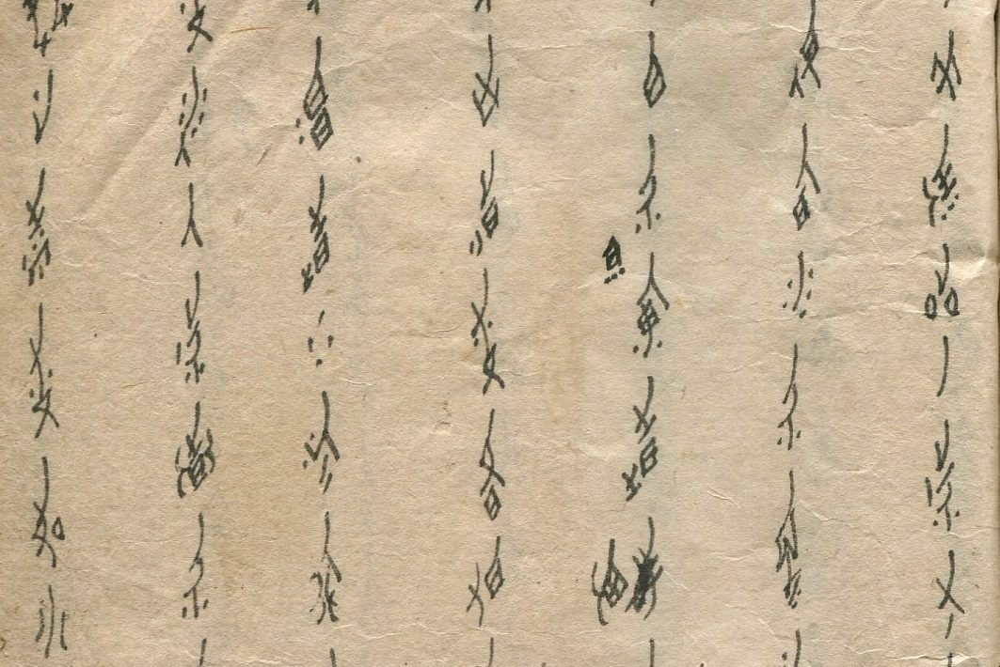
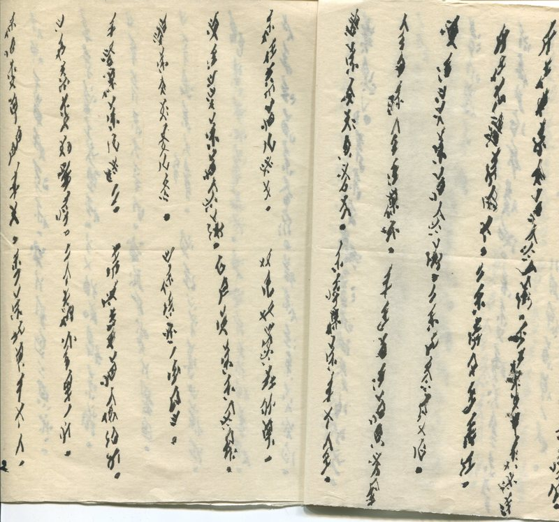
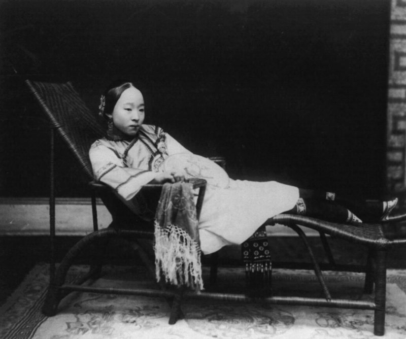
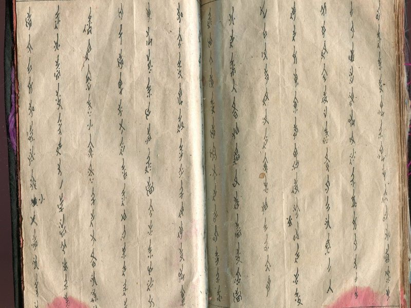
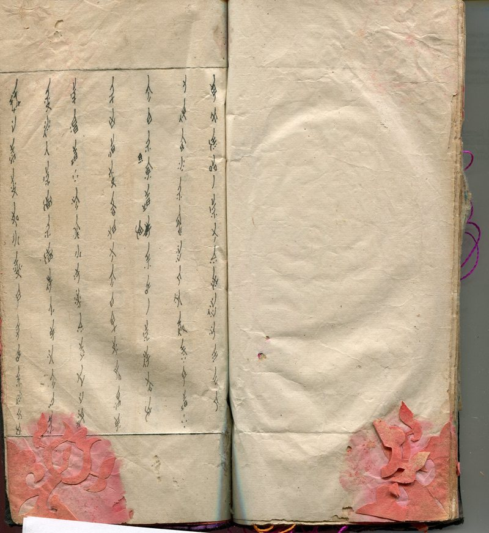
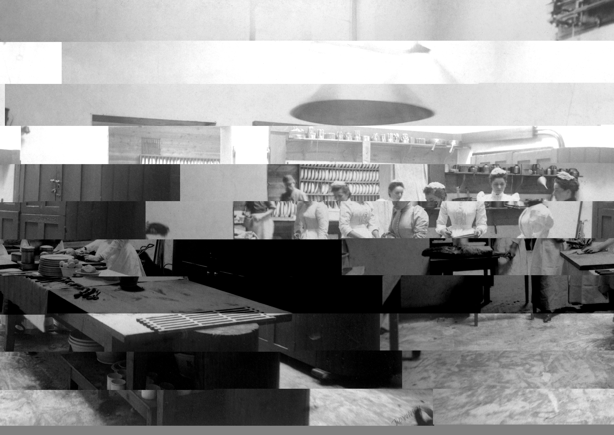

Advertisement

Pocket Worthy

·

Stories to fuel your mind.

# Remembering Nüshu, the 19th-Century Chinese Script Only Women Could Write

## This gender-specific practice continues to fade with time.

[Atlas Obscura](https://www.atlasobscura.com/?utm_source=pocket)                                                                            |                            Lauren Young

•

•

•

•

Nüshu, a script written only by women in a small region of Jiangyong County in China, has mysterious origins that continue to stump historians. Photo by Cathy Silber.

In 1988, Yi Nianhua, a woman in her 80s, spent many evenings scribbling elegant characters at a table in her kitchen in a small rice-farming village in Shangjiangxu, China. With only a blunt writing brush, the elongated script came out fat and blotchy on the newsprint she used for paper. But [Cathy Silber](https://www.skidmore.edu/directions/index.php), a professor at Skidmore College in New York, worked alongside Yi in her kitchen, diligently deciphering and studying the written language.

“Out of the thousands of scripts that are gender-specific to men, here we have one that we know is gender-specific to women,” says Silber, who has been researching Nüshu since 1985. Yi was one of the last remaining writers of Nüshu, a fading script that only women knew how to write and read.

Stemming from the southwestern Hunan Province county of Jiangyong, a small group of women in the 19th and 20th centuries practiced this special script that no man could read or write. The writing system allowed these women to keep autobiographies, write poetry and stories, and communicate with “sworn sisters,” bonds between women who were not biologically related. The tradition of Nüshu is slowly vanishing, but at one time gave the women of Shanjiangxu freedom to express themselves.

A sample of Yi Nianhua’s Nüshu writing. The fat lines made the characters almost illegible for Silber. Photo by Cathy Silber.

In the middle of the 20th century, it wasn’t uncommon for Chinese women of higher socioeconomic classes to write songs, ballads, complaints, or stories, as Wilt Idema details in the book *[Heroines of Jiangyong: Chinese Narrative Ballads in Women’s Script](https://books.google.com/books/about/Heroines_of_Jiangyong.html?id=Y3ILAQAAMAAJ)*. However, it was extremely rare to find such intimate texts from peasant women. As of 2012, there were approximately 500 known texts written in Nüshu, ranging from four-line poems to long autobiographical narratives. Today, the texts that have survived give researchers such as Silber the opportunity to peer into the daily lives of Chinese women throughout this period of history.

When Nüshu was first discovered by people outside of Jiangyong in the 1980s, the media sensationalized the script as an invented, secret language that women could use to spite men and a patriarchal society. This is what initially drew Silber to study Nüshu. But what she found was that men were well aware that women had been writing in the script. It wasn’t an entirely new, made-up language but actually a writing system for the local dialect, and if men heard Nüshu read aloud they most likely would have been able to understand. Men mostly just didn’t care to learn how to write in women’s script.

“Men were not exactly clamoring to be let in on this ‘secret,’ just as they were not storming the lofts demanding to learn embroidery,” Silber says. “Even though it wasn’t a secret, it was for all practical purposes used exclusively by women.”

A village in Jiangyong County, where Nüshu is primarily found. Photo from New China TV/CC BY 2.0.

During the 19th century, many of the communities throughout China were structured around a highly patriarchal system. Women had to follow the “three obediences”—obey one’s father, husband, and son. The practice of foot binding—preventing young girls from walking to show their high social standing—was still widespread throughout Jiangyong County, and unmarried girls were tucked away in house lofts doing needlework, weaving, and household chores.

“Jiangyong County girls were referred to as ‘upstairs girls,’” writes Fei-wen Liu in the book [Gendered Words](https://global.oup.com/academic/product/gendered-words-9780190210403?cc=us&lang=en&). Historically, writing in China had been a privilege of men, Liu explains, while women were largely denied access to literacy. Even when women could write and receive education, it was largely limited to urban elites. Yi Nianhua, born in 1906, came from an educated family and was one of the few girls who was allowed to attend classes with boys, says Silber.

A 19th-century wealthy Chinese woman with bound feet. Photo from the Library of Congress/LC-USZ62-80206.

The exact origins of Nüshu are hazy. Scholars have debated various plausible hypotheses for why the script was created. Some have suggested that it derived from writing systems among southwestern local minorities, or even inscriptions found on oracle bones. A local legend says that it was first written by an imperial concubine in the late 11th century, who used Nüshu to communicate the sorrows of her life to people back home—a subject Silber has written about for the magazine Ms. The most popular explanation is that Nüshu was created in retaliation of women’s exclusion from education.

“I wouldn’t say that, ‘oh, women were oppressed and deprived of access, and therefore they [created Nüshu],’” says Silber. “But, I would say that the emergence of this kind of phenomenon is consistent with a very sex-segregated society.”

No concrete historical evidence exists to prove any of these theories.

This sample of text from a traditional Sanzhaoshu, or “third day missive,” shows the intricate, slim characters. Photo by Cathy Silber.

The first definite record of Nüshu dates to 1931, but Silber and most academics reason women likely began writing it in the early years of the 19th century. The script is syllabic, each sign standing for a distinct unit of sound in the local dialect. More than 1,000 signs have been counted thus far, according to Idema.

“It’s more efficient than Chinese because it’s phonetic,” says Silber. “A single symbol would represent every syllable with the same sound. So you get more bang for your buck with each character.”

Additionally, Nüshu’s elegant, elongated lines contrast the stocky, squat blocks of Chinese characters. The visual beauty of Nüshu is distinguished by fine wisps and thin strokes, flanked by diamond shapes and precise dots. Some people even called it ‘mosquito writing’ because the characters looked like they were drawn by the legs of an insect, says Silber.

Traditionally, women would use a sharpened bamboo stylus dipped in ink, and write verse on paper, cloth, and fans. However, Yi and the last surviving writers were forced to use what they had, even writing the beautiful characters down with a ballpoint pen on the edges of newspapers.

Nüshu was used in a variety of ways, often reflecting the different phases of women’s lives. Young girls would write letters to each other, as well as prayers, plights, and pleas to goddesses that they would leave at temples. One of the most common texts found in Nüshu were the “third day missives,” or sanzhaoshu—a cloth-bound book written and delivered to brides the third day after their weddings. The books contained messages of congratulations—and condolences—from the bride’s mother, female relatives, sisters, and peers. Women also wrote lengthy autobiographies. Unlike diaries, these texts were narrative verse, telling the life story of the woman, says Silber.

The first page of a third day missive book. Women commonly stored paper cuts and embroidery thread and patterns between the pages. Photo by Cathy Silber.

In addition to the written language, women also recited Nüge or “women’s songs,” tunes that had a particularly “haunting minor melody,” says Silber. The Nüshu tradition has even inspired the composer Tan Dun’s  concert called [The Secret Songs of Women](http://tandun.com/explore/nu-shu-the-secret-songs-of-women-2/), allowing the text to be sung again. The song below, translated by Silber, was sung by Tang Baozhen, one of Yi’s sworn sisters.

> On red paper, I write a letter.
>
> I’ll have my say.
>
> Today you who know my heart haven’t gotten out of bed,
>
> Though the sun shines in the room, over the mountains.
>
> I told you to avoid it and you didn’t,
>
> Now you’re ill and it’s too late.
>
> A cold or a headache is easy to cure,
>
> But you did it too soon after childbirth and died....
>
> We spoke true words,
>
> And if you’d kept them, you’d still be worth something.
>
> We went to the street, bought red paper,
>
> We bought red paper and made a contract.
>
> We made a contract, and said those words,
>
> Just like buying a field of rice seedlings.

The practice of Nüshu was passed down from mother to daughter, but the writing has dwindled drastically with time. Following the 1949 Chinese Revolution, a new marriage law and socioeconomic reforms changed the state of society for women, which may have decreased the need for writing in a female-specific script, notes Liu. And later, during the Cultural Revolution beginning in the late 1960s, many texts were burned or destroyed.\* Some women also had their writing buried with them when they died, leaving few surviving original scripts from the period.

Yi died in 1991 at the age of 85. The last identified woman to possess genuine knowledge of Nüshu died in 2004, [according to](http://www.chinadaily.com.cn/english/doc/2004-10/20/content_383962.htm) China Daily.

Since the outside world learned about Nüshu in the 1980s, there have been a few attempts to bring the written system back. Locals have held classes, and texts were preserved in a museum in Jiangyong County. Academics at Tsinghua University in Beijing taught Nüshu at one point (to both men and women) to preserve it. However, the women’s writing may soon be an extinct system.

Silber plans to return to Jiangyong County this summer. She is continuing her research for [an upcoming book](https://cathysilber.wordpress.com/writing-from-the-useless-branch-chapter-1-introduction/) she’s writing about Nüshu and the women in the region.

“To me the most interesting thing of all is how these texts shaped women’s understandings of themselves,” says Silber. “This writing system teaches us quite a lot about the relationship between literacy and different powered groups in society.”

\*CORRECTION: This piece has been updated since it was first published to clarify the timeline of when new marriage laws came to China, as well as when texts were commonly burned during the country’s Cultural Revolution.

•

•

•

•

Advertisement

More from Atlas Obscura

- [The Valley of the Cheese of the Dead](https://getpocket.com/redirect?url=https://www.atlasobscura.com/articles/most-unusual-cheese-switzerland&h=9a6bfa88d0240c07bc1cad4e899e046b37f32e47f56ac44f9ce4a8bec729adfd&nt=0)

  534 Saves
- [What Makes Kids Great Fossil Hunters](https://getpocket.com/redirect?url=https://www.atlasobscura.com/articles/why-kids-find-fossils&h=80a51eaf79cb1a840aa3602400b958c25522c3a5384081dcf14549d629f3f7bb&nt=0)

  104 Saves
- [Fantastic Space Rocks and How to Find Them](https://getpocket.com/redirect?url=https://www.atlasobscura.com/articles/how-to-find-a-meteorite&h=3c3d824a052e2b258c0d92deca2e23ec3b4302f6f5be917f3c48e6a8ffb0fa14&nt=0)

  181 Saves

Advertisement

This article was originally published on February 16, 2017, by Atlas Obscura, and is republished here with permission.

Enjoy this story? Add wonder to your inbox.

[Get Atlas Obscura’s newsletter](https://www.atlasobscura.com/newsletters?utm_source=pocket&utm_medium=synd)

Advertisement

# Get fascinating stories delivered to you daily.

# Pocket curates the best of the web.

Please upgrade to a [supported browser](https://support.google.com/recaptcha/?hl=en#6223828) to get a reCAPTCHA challenge.

[Why is this happening to me?](https://support.google.com/recaptcha#6262736)

This site is protected by reCAPTCHA and the Google [Privacy Policy](https://policies.google.com/privacy) and [Terms of Service](https://policies.google.com/terms) apply.

### More Stories from Pocket

- 

  [It’s Time These Ancient Women Scientists Get Their Due](https://getpocket.com/explore/item/it-s-time-these-ancient-women-scientists-get-their-due)
- 

  [How the Inkas Governed, Thrived and Fell Without Alphabetic Writing](https://getpocket.com/explore/item/how-the-inkas-governed-thrived-and-fell-without-alphabetic-writing)
- 

  [Eliza Leslie: The Most Influential Cookbook Writer of the 19th Century](https://getpocket.com/explore/item/eliza-leslie-the-most-influential-cookbook-writer-of-the-19th-century)

Discover more great stories—get                         [Pocket](https://getpocket.com/?utm_source=syndarticles&utm_medium=web).
