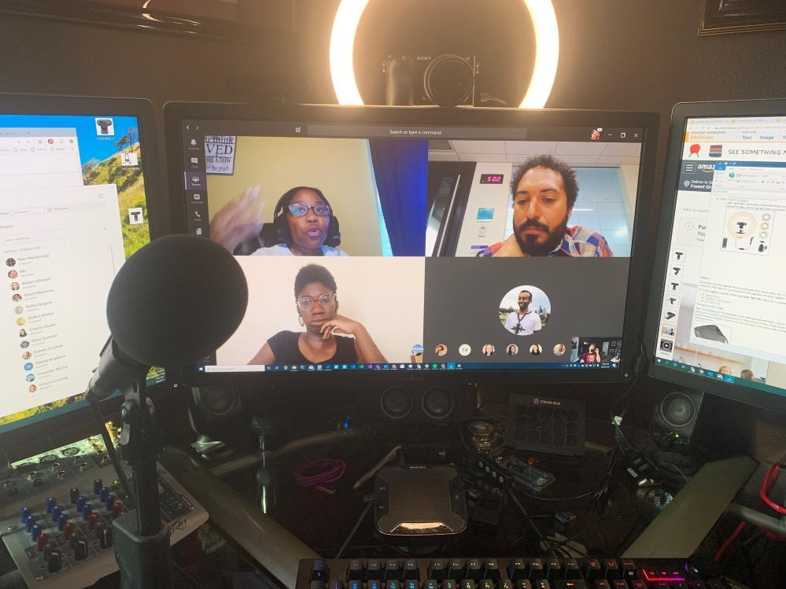
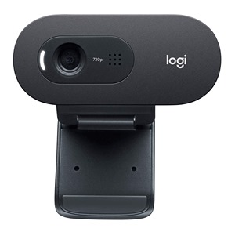
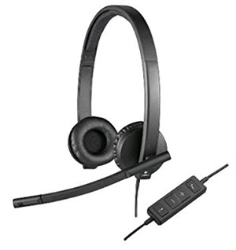
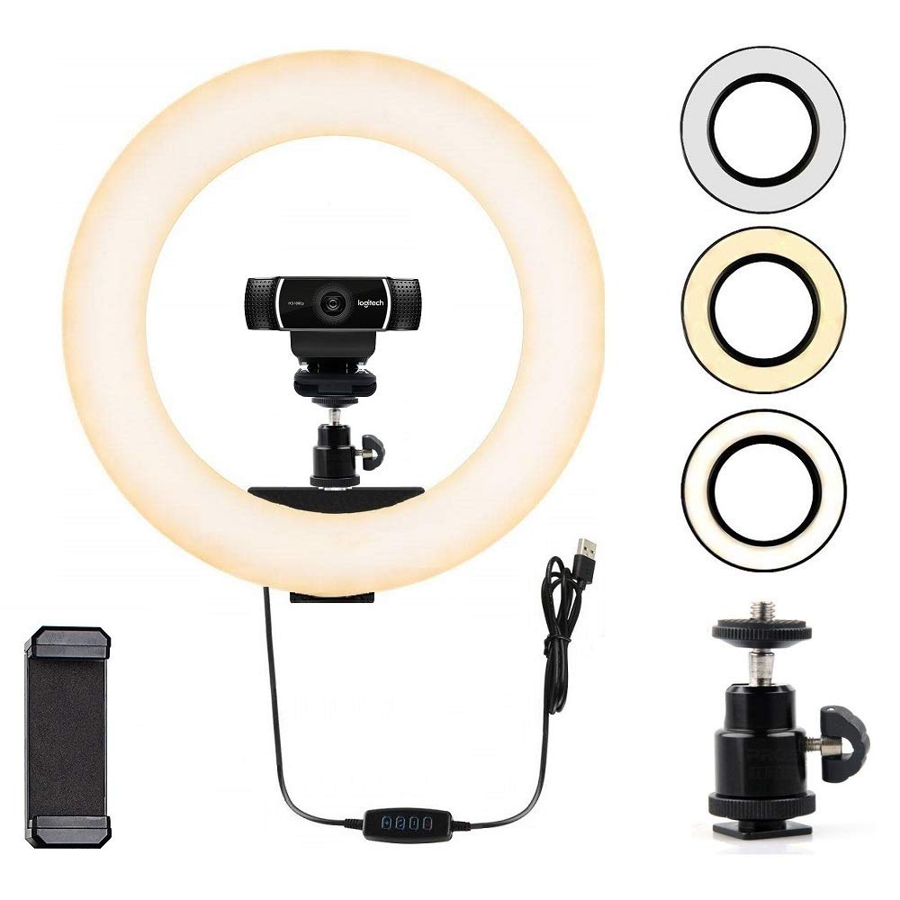
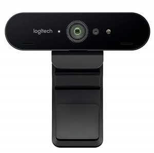
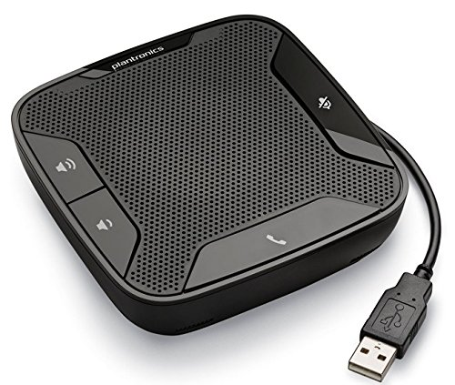
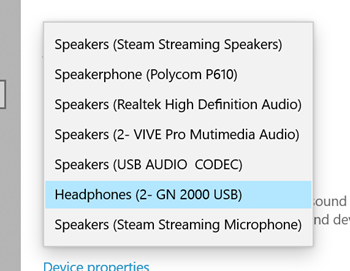
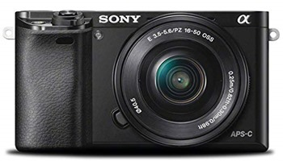
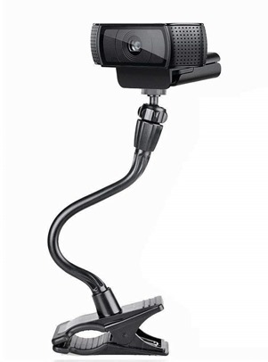
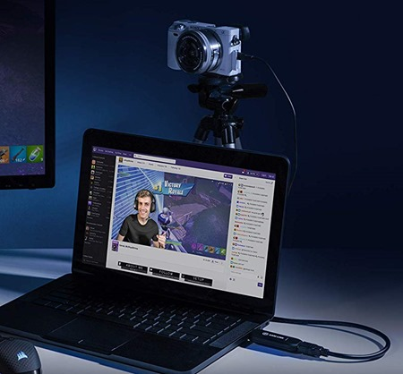

# Good, Better, Best - creating the ultimate remote worker webcam setup on a budget

I've been a [remote worker](https://www.hanselman.com/blog/archives.aspx#Remote+Work) and an occasional YouTuber for well over a decade. I'm always looking for a better setup because the goal is clear - how can I interact with you and my co-workers in a way that has high-enough fidelity that I don't need to drive to Seattle every week!

I believe if my camera is clear and my audio is clear than I can really have a remote relationship with my team that is effective and true.

Everyone has a webcam these days and can just get on a video call and have a chat - but is it of sufficient quality that you feel like you're really having a good conversation with folks and truly connecting!

Here's a shot of my setup during a meeting I'm in here at Microsoft:

Here's my thoughts on Good, Better, add Best set-ups for remotes and YouTubers without spending thousands.

### Good

- The [Logitech C270 **Webcam**](https://amzn.to/31AmbRL)can be gotten for as little as $20 or less! It's wholly adequate *with enough light.* 
  - It only does 720p and it's USB2 so I can't enthusiastically recommend it but it's OK again, if you throw light at it. In the dark is just a webcam.  
    
- The [Logitech USB **Headset** H570](https://amzn.to/31vB5Zu) is decent, as is the [lovely Jabra UC Voice corded headset](https://amzn.to/31wyQ7U). I prefer the Jabra because it only covers one ear and doesn't give me the "two covered ears" claustrophobic feeling.
  - To be clear - audio quality matters. Any crappy headset (or quality one as above) will ALWAYS be better than your webcam's default or your laptop's default. Always. Mics need to be closer to your mouth to sound good.  
    
- Small [webcam Ringlight](https://amzn.to/2GZ5k3b).
  - Light light light. Webcams, especially cheap ones NEED LIGHT. It feels weird and I get it but the quality is SO MUCH BETTER with some decent fill light. Get a ring light that's powered by USB and use it on calls. Yes, it looks ridiculous but it WORKS.  
    

### Better

How can we improve on the **GOOD** setup. Clearer videos and better sound/sound feel.

Some folks feel the Logitech Brio is overhyped and I think that's fair. It's a "4k" camera that's not as impressive as it should be. That said, it's a solid camera and arguably the best Logitech has to offer.

If I could suggest a middle of the road **solid "BETTER"** setup for a remote worker, I'd recommend these

The lights are the magic.

Now, moving beyond USB headsets, I love adding speakerphones - not for the mic, literally for the speaker. I love the [**Plantronics Portable USB Speakerphone**](https://amzn.to/2YYHSJk). Requires no drivers, it just shows up as a mic and speaker automatically. I have it front and center in front of my monitor and I use it every day. It makes me feel like my Home Office is a real Office somehow.

If conversations are private I'll use the headset above for the audio but when I want the sound to "come from the monitor" I'll SPLIT the audio. This is a pro tip. You can set up the Mic input as the headset mic and the Speaker output as a Speakerphone (or your main speakers). I like using the Speakerphone for voice and keeping the computer's output as the main speakers. Having this separate of voice and computer sounds is a small trick I play on myself but it helps to create a sense of location where the remote video person comes out of separate speakers.

### Best

Let's spend a little bit of money, but not so much that we break the bank.

I'm going to **make my own webcam**. Rather than a plastic of the shelf single webcam, let's take an actual mirrorless camera - the kind you'd take to a photography class - and make it a HIGH QUALITY webcam.

We need a great camera and it needs to support HDMI out. The camera also needs to be able to stay on all day long, not overheat, and it needs to run on AC power (not on battery).

Here's a [list of cameras that have clean HDMI](https://www.elgato.com/en/gaming/cam-link/camera-check) out and can stay on all day. You might have one of these cameras in your closet! I like the Sony A6000 and here's its characteristics.

- [Sony A6000](https://amzn.to/31tnWA0) - I found this on Craigslist for $300.
  - **Max resolution:** 1080p and a buttery smooth 60fps
  - **Clean HDMI:** Yes
  - **Unlimited runtime:** Yes
  - **Connection type:** Micro HDMI
  - **Power:** Dummy Battery
  - **Verified by:** Elgato
  - **Notes:** Requires dummy battery for power (sold separately) Retains full autofocus with clean HDMI output  
    
- I need a "[dummy battery](https://amzn.to/33r6L3W)" for this camera. Turns out this is a whole class of thing you can buy. Who knew?
- This camera has micro-HDMI so I need a [micro-HDMI to HDMI cable](https://amzn.to/2Ks7eLH).
- Now this is just a loose camera, so how I will mount it on my monitor?
  - I like [mounting it INSIDE the Ring Light](https://amzn.to/2YHUn0Q). If you don't want the light you can just get this clamp mount.
  - Or you can do what I did - get the CLAMP then the LIGHT and then put the CAMERA in that like a sandwic  
    
- This camera and cameras like it output HDMI and I need that HDMI to be inputted into my computer and I want the HDMI output of the camera to look like it's a regular Webcam. The magical device that does this for us is the [Elgato CamLink 4k](https://amzn.to/2MQZ1Cr). It's literally a little stick with HDMI input on one end and a USB3 on the other side. It took 5 minutes to install.
  - This device also has the added benefit of being a generic "capture card" if you want to record or broadcast your gaming consoles OR other computers!  
      
    

Here's a [YouTube video I made that shows you these cameras, before and after - Good, Better, and BEST](https://www.youtube.com/watch?v=xrnF6hdLrIE)!

What do you think? Thanks to [John Miller](https://twitter.com/jmillerdev) and [Jeff Fritz](https://jeffreyfritz.com/) for their help and guidance!

\* I use Amazon referral links and donate the little money to my kids' school. You support charter schools when you use these links.

---

**Sponsor:** [OzCode](https://hnsl.mn/2MTZbJc) is a magical debugging extension for C#/.NET devs working in Visual Studio. Get to the root cause of your bugs faster with heads-up display, advanced search inside objects, LINQ query debugging, side-by-side object comparisons & more. [Try for free](https://hnsl.mn/2MTZbJc)!

#### About Scott

Scott Hanselman is a former professor, former Chief Architect in finance, now speaker, consultant, father, diabetic, and Microsoft employee. He is a failed stand-up comic, a cornrower, and a book author.

[About](http://hanselman.com/about)   [Newsletter](http://www.hanselman.com/newsletter)
